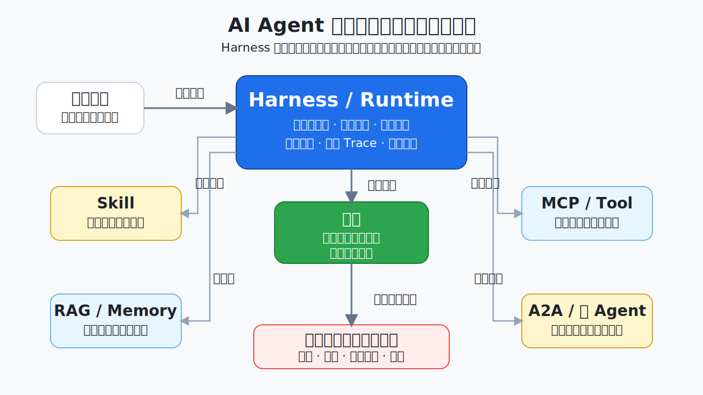
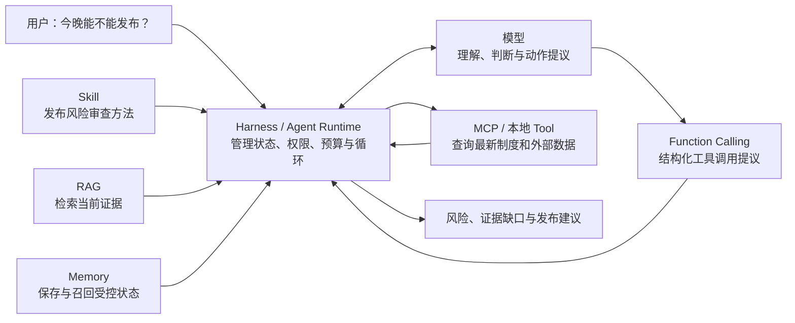
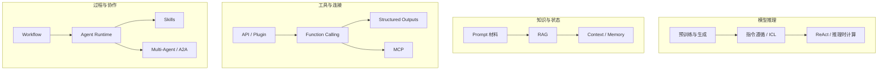
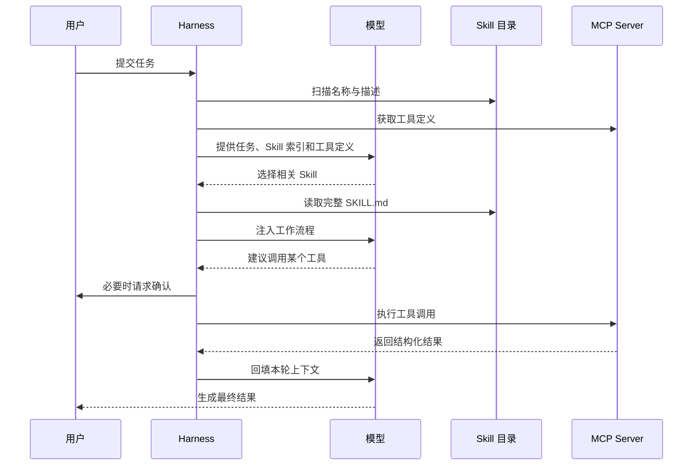
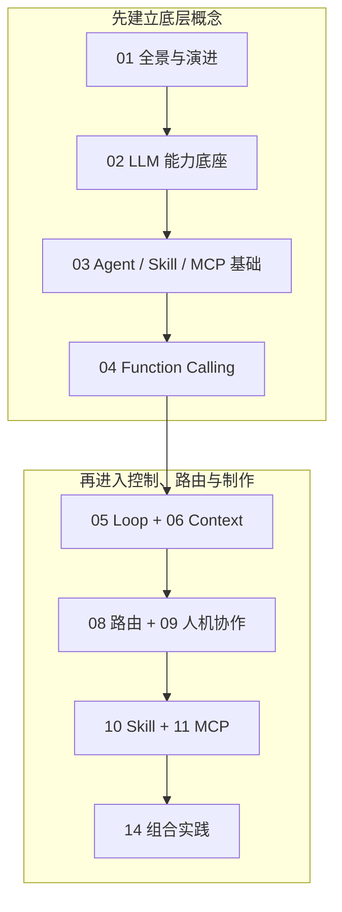

# 从零理解 AI Agent：模型、Function Calling、Skills、MCP、A2A 与生产 Runtime

> 一套给团队内部学习和评审使用的 Agent 知识文档：从 LLM 能力底座、模型请求、Harness 和 Function Calling 出发，逐步理解 Agent Loop、Workflow、Planning、Context Engineering、RAG、Memory、Skills、MCP、Multi-Agent、A2A、能力路由、人机协作与生产 Runtime，最后进入跨 Harness、评测、安全和用途治理。

核心关系：

> **模型负责理解和提出下一步，Harness 负责上下文、状态、权限与执行循环；Function Calling 表达动作提议，Skill 提供做事方法，MCP 连接外部能力，A2A 连接独立 Agent。**

本系列不从框架 API 和配置字段切入，而是先解释职责地图和演进脉络：模型为什么能提出 Tool Call，为什么也会流畅地犯错，一次模型请求、能力选择与任务执行中的数据怎样流动。随后再进入 Skill、MCP Server、多 Agent、人机协作、生产 Runtime、跨平台、质量、安全与用途治理。



---

## 先看一个真实问题

以一个发布判断请求为例：

> “帮我判断今晚这个版本能不能发布。”

通用模型可以写出检查项，但默认不知道团队审查流程，读不到最新发布制度，也不能自己证明某次查询或部署已经执行。要把“看起来会分析”变成“能被团队信任的判断”，中间需要一套受控系统：



| 角色 | 在这个例子里做什么 | 类比 |
| --- | --- | --- |
| **模型** | 理解材料、比较证据、提出工具调用或形成结果 | 会分析和写作的新同事 |
| **Harness** | 发现可用 Skill 和工具，组装上下文，询问权限，执行 Agent 循环 | 工作台与调度员 |
| **Function Calling** | 用工具名、参数和平台规定的调用绑定表达“要查询哪项制度” | 规范填写的办事申请单 |
| **RAG** | 从制度库等外部知识源检索当前问题所需证据 | 按问题调取的资料 |
| **Memory** | 保存并按权限召回任务、会话或长期状态 | 有保留期限的工作记录 |
| **Skill** | 告诉 Agent 怎样收集证据、怎样评分、何时阻断、报告写成什么样 | 标准作业程序 |
| **MCP** | 以统一协议提供最新制度、工单、数据库或可执行动作 | 标准插座与设备接口 |
| **A2A** | 必要时把完整专项任务委派给另一个独立 Agent | 跨部门任务委托 |

这些概念不是竞争关系。模型提出 Tool Call 不等于动作已执行，Skill 没有天然外部权限，MCP 不会替 Agent 决定工作方法，A2A 也不适合包装一个简单函数；真正组织它们的是 Harness。若责任边界混在一起，后续架构讨论会失去可验证基础。

## AI Agent 是怎样一步步演进的

AI Agent 不是沿着一条产品升级线出现的。它围绕四个问题并行演进：

1. **模型推理**：预训练、指令微调、上下文学习和推理时计算怎样让模型从生成文本发展到根据观察提出下一步动作？
2. **知识与状态**：怎样取得当前证据、管理上下文，并保存跨步骤状态？
3. **工具与连接**：怎样表达结构化动作，又怎样接入真实文件、API 和业务系统？
4. **过程与协作**：怎样控制多步任务、复用方法，并在多个 Agent 之间委派？



这四条路线互相交叉，但不能写成“Function Calling 进化成 MCP，MCP 又进化成 Skills”。Function Calling 是模型与 Harness 之间的动作接口，MCP 是 Harness 与能力 Server 之间的连接协议，Skill 是过程知识载体，A2A 是 Agent 系统之间的协作协议。

从 Transformer、上下文学习、指令微调、RAG、MRKL、ReAct、Toolformer、Plugins、Function Calling 一直到 MCP、Agent Skills 和 A2A 的可核对时间线，见[01. AI Agent 全景与演进史](docs/01-AI-Agent全景与演进史.md)。模型怎样生成、训练与后训练怎样分工、推理模型和多模态又改变了什么，见[02. LLM 能力底座](docs/02-LLM能力底座与模型选型.md)。

## Agent 到底怎样使用它们

模型通常不会自己扫描硬盘，也不会直接连接 MCP Server。实际工作由 Harness 分阶段完成：



这里有三个容易混淆的关键点：

- **Function Calling 是提议与回填接口**：模型返回工具名和参数，Harness 负责校验、授权与调度，具体执行方产生结果。
- **Skill 是分层加载的上下文**：通常先看到名称和描述，触发后才读取正文，详细资料继续按需读取。
- **MCP 是受控的数据流**：Server 先声明工具，模型只能建议调用；Harness 和 Server 仍要分别执行权限与业务校验。

理解这条数据流，才能真正理解为什么 `description` 会影响 Skill 路由、为什么工具描述和 Schema 会影响模型选择，也能理解“安装成功”为什么不等于“使用质量高”。

## 核心取向

本系列不只记录文件位置和运行命令，更关注决定系统质量的责任边界：

### 1. 按责任边界学习，而不是背产品名

每个概念都回答四个问题：谁和谁交换什么、谁真正执行、谁授权、谁对结果负责。这样即使产品 API 变化，核心心智模型仍然可用。

### 2. 把 Skill 看成上下文路由包

一个 Skill 不只是更长的 Prompt。它至少包含四份合同：

| 合同 | 要回答的问题 |
| --- | --- |
| 路由合同 | 什么请求应该触发，什么相邻请求不该触发？ |
| 输入合同 | 开始工作需要什么，信息缺失时怎么办？ |
| 执行合同 | 先做什么、何时分支、什么时候停止？ |
| 输出合同 | 最终产物包含什么，怎样判断完成？ |

### 3. 把 MCP 看成能力协议，而不是 Agent 本身

MCP 负责 Server 和 Client 怎样交换能力与结果，却不负责模型一定选对工具，也不负责替企业做授权决策。工具描述、业务权限、上下文裁剪和用户确认仍需要各层共同完成。

### 4. 把模型输出视为不可信提议

Tool Call、计划、Memory 候选和“任务已完成”都需要 Harness 或业务系统验证。Schema 正确不等于语义正确，用户确认也不替代对象级业务授权。

### 5. 把能力路由拆成三道门

不能把“模型选工具”视为一个黑箱。Skill、Tool、MCP 与 A2A 统一做发现、候选治理、Trace 和评测，但选中后分别进入上下文加载、Tool 执行或任务委派。受控目录可以先召回 ID，也可以先做授权感知过滤；不变量是敏感元数据暴露前经过模型外的权威策略，具体调用或委派再做一次授权。

### 6. 跨平台追求行为一致，而不是文件完全相同

Claude Code、Codex CLI、Gemini CLI、GitHub Copilot CLI 和 VS Code 的发现目录、显式调用、权限界面并不完全一致。跨平台适配采用：

```text
可移植核心 + 平台适配层 + 同一组行为案例
```

真正应保持一致的是“能否发现、是否选对、能否完成、是否安全”，而不是每个平台都使用完全相同的配置文件。

### 7. 先讲清主线，再谈工程门禁

主线章节只保留理解和制作所需内容。规范差异、跨 Harness 矩阵、评测、安全和来源考据集中放在进阶章节，第一次阅读不需要先成为协议专家。

### 8. 把“模型答错”拆成可诊断的系统故障

无依据生成、检索漏召回、路由误选、Tool 参数错误、虚构执行、状态漂移和 Runtime 竞态需要分层诊断。它们表面都可能是一句错误回答，却不能都靠“换更强模型”修复。

### 9. 把 Agent 架构当作状态控制问题

ReAct、Plan-and-Execute、Supervisor、Group Chat、Swarm、Pipeline、Graph Runtime 不是同一层概念。讨论框架范式之前，先固定四个问题：谁控制下一步，状态放在哪里，谁合并结果，如何停止和恢复。

### 10. 把 RAG 争议拆成知识治理与上下文注入

“RAG 被淘汰”通常混淆了三件事：长上下文降低部分检索压力，Wiki/知识库改善知识治理，Agentic/GraphRAG 扩展检索形态。更准确的边界是：Wiki 是上游知识治理层，RAG 是运行时证据选择与上下文注入层，二者应组合，而不是互相替代。

### 11. 把用户控制与用途责任放进架构

澄清、计划摘要、批准、进度、纠正、取消、恢复和申诉不是聊天界面的装饰。高影响用途还要独立处理公平、版权、透明、责任人与供应商治理；网络安全通过不等于用途合理。

## 学习路线

### 路线 A：第一次接触，先建立整体认识



完成这条路线后，应能解释现代 Agent 的模型与系统层次，追踪一次 Tool Call 的完整闭环，说明能力为什么进入或退出候选，设计用户可纠正的交互，并制作最小可用的 Skill 与 MCP Server。

### 路线 B：Function Calling 和 Agent Runtime

1. 阅读[全景与演进史](docs/01-AI-Agent全景与演进史.md)、[LLM 能力底座](docs/02-LLM能力底座与模型选型.md)和[基础关系](docs/03-Agent-Skill-MCP基础关系.md)，先分清模型能力、Harness、研究方法、产品接口和开放协议。
2. 跟随[Function Calling 与 Tool Use](docs/04-Function-Calling与Tool-Use.md)，理解从意图/槽位前史到 Tool 定义、流式片段、调用绑定、执行与结果回填。
3. 阅读[Agent Loop、Workflow 与 Planning](docs/05-Agent循环工作流与规划.md)，学习 ReAct、Plan-and-Execute、Supervisor、Pipeline、Group Chat、Graph Runtime、状态、检查点、预算、停止与人工介入。
4. 用[能力发现、候选裁剪与路由](docs/08-能力发现候选裁剪与路由.md)理解大量 Tool 怎样进入最小候选集。
5. 阅读[人机协作与可控交互](docs/09-人机协作与可控交互.md)和[生产 Runtime](docs/15-生产级Agent-Runtime架构.md)，把澄清、批准、进度、取消和恢复落到状态机。
6. 用[质量工程与安全](docs/13-质量工程与安全治理.md)设计轨迹评测、用途治理和可观测性。

### 路线 C：知识型 Agent

1. 先读[全景与演进史](docs/01-AI-Agent全景与演进史.md)和[基础关系](docs/03-Agent-Skill-MCP基础关系.md)，理解信息怎样真正进入模型上下文。
2. 阅读[LLM 能力底座](docs/02-LLM能力底座与模型选型.md)中上下文与 Embedding 的边界，再阅读[Context Engineering、RAG 与 Memory](docs/06-上下文工程RAG与Memory.md)，重点理解 RAG、GraphRAG、Agentic RAG、长上下文和 Wiki/知识库的分工。
3. 用[能力发现与路由](docs/08-能力发现候选裁剪与路由.md)设计知识源、Skill 与 Tool 的候选裁剪。
4. 需要连接实时知识源时，学习[MCP Server 制作](docs/11-高质量MCP-Server制作.md)。
5. 需要固定检索、核验和引用方法时，再制作[Agent Skill](docs/10-高质量Agent-Skill制作.md)。

### 路线 D：制作一个 Skill

1. 阅读[基础关系](docs/03-Agent-Skill-MCP基础关系.md)中“Skill 怎样进入上下文”。
2. 跟随[Skill 制作教程](docs/10-高质量Agent-Skill制作.md)从十几行的最小 Skill 开始。
3. 参考仓库中的[完整发布风险审查 Skill](docs/16-案例发布风险审查Skill.md)。
4. 准备共享给团队时，再阅读[能力发现与路由](docs/08-能力发现候选裁剪与路由.md)、[跨 Harness](docs/12-跨Harness适配.md)和[质量与安全](docs/13-质量工程与安全治理.md)。

### 路线 E：制作一个 MCP Server

1. 先看[全景与演进史](docs/01-AI-Agent全景与演进史.md)与[基础关系](docs/03-Agent-Skill-MCP基础关系.md)中的调用链。
2. 再读[Function Calling](docs/04-Function-Calling与Tool-Use.md)，分清模型侧动作提议与真实执行。
3. 跟随[MCP Server 制作教程](docs/11-高质量MCP-Server制作.md)理解第一个 Tool。
4. 对照[只读发布制度 MCP 文档化案例](docs/18-案例只读发布制度MCP-Server.md#srcserverts)。
5. 准备接入真实系统时，再学习[能力路由](docs/08-能力发现候选裁剪与路由.md)、授权、错误处理、安全与跨 Harness 适配。

### 路线 F：Multi-Agent 或跨系统协作

1. 先掌握[Agent Loop、Workflow 与 Planning](docs/05-Agent循环工作流与规划.md)，确认单 Agent 与确定性 Workflow 是否已经足够。
2. 再阅读[Multi-Agent、委派与 A2A](docs/07-Multi-Agent委派与A2A.md)。
3. 阅读[能力发现与路由](docs/08-能力发现候选裁剪与路由.md)，比较 Tool 级选择和 Agent 级委派。
4. 区分本地子 Agent、跨系统 A2A 和能力接入 MCP，不用 A2A 包装简单函数。
5. 用[质量工程与安全](docs/13-质量工程与安全治理.md)检查委派链、权限、预算、轨迹和业务结果。

### 路线 G：公司内部 Agent 能力平台

按 `01 -> 02 -> 03 -> 04 -> 05 -> 06 -> 08 -> 09 -> 10 -> 11 -> 12 -> 13 -> 14 -> 15 -> 20 -> 21 -> 24 -> 25 -> 28` 阅读，并重点使用两个评审模板：

- [Skill 评审模板](docs/20-Skill评审模板.md)
- [MCP 评审模板](docs/21-MCP评审模板.md)

### 路线 H：边读边做练习

1. 先用[术语表与概念索引](docs/26-Agent系统术语表与概念索引.md)快速建立词表。
2. 按[跟做练习](docs/27-跟做练习从概念到可验证Agent能力.md)完成责任边界、最小 Skill、只读 MCP、组合调用和路由评测。
3. 出现“模型答错、工具没调、证据缺失、取消失效”等问题时，用[故障排查手册](docs/28-Agent故障排查手册.md)定位失败层。

## 章节导航

章节编号采用连续主线：基础原理在前，制作教程居中，案例章节、评审模板、内容规范和来源放在后半部分。推荐阅读顺序以“学习路线”为准。

| 篇章 | 内容重点 | 阅读难度 |
| --- | --- | --- |
| [01. AI Agent 全景与演进史](docs/01-AI-Agent全景与演进史.md) | 经典规划、BDI、强化学习、多智能体到 LLM Agent 的四线历史与责任地图 | 入门 |
| [02. LLM 能力底座](docs/02-LLM能力底座与模型选型.md) | Token、自回归生成、预训练/后训练、上下文学习、推理时计算、多模态、Embedding、模型选型与分层故障诊断 | 入门到进阶 |
| [03. 先认识 Agent、Skill 与 MCP](docs/03-Agent-Skill-MCP基础关系.md) | 模型请求、消息层级、Agent、Harness、Skill、MCP 与上下文注入 | 入门 |
| [04. Function Calling 与 Tool Use](docs/04-Function-Calling与Tool-Use.md) | 意图/槽位前史、Tool 定义、Schema、流式调用、平台绑定与内部 Trace、执行、回填、并行、错误和三家 API 对照 | 入门到实践 |
| [05. Agent Loop、Workflow 与 Planning](docs/05-Agent循环工作流与规划.md) | 自主性边界、编排模式、ReAct、Plan-and-Execute、Supervisor、Group Chat、图状态机、状态、预算和停止 | 入门到进阶 |
| [06. Context Engineering、RAG 与 Memory](docs/06-上下文工程RAG与Memory.md) | 上下文组装、RAG/GraphRAG/Agentic RAG、Wiki/知识库定位、记忆生命周期、权限、时效与来源 | 入门到进阶 |
| [07. Multi-Agent、委派与 A2A](docs/07-Multi-Agent委派与A2A.md) | 主 Agent、群聊、流水线、黑板、接力、委派合同和 A2A/MCP 边界 | 进阶 |
| [08. 能力发现、候选裁剪与路由](docs/08-能力发现候选裁剪与路由.md) | 统一 Skill、Tool、MCP、A2A 的发现与候选治理，并按上下文加载、Tool 调用和 Agent 委派分别执行后置门 | 入门到进阶 |
| [09. 人机协作与可控交互](docs/09-人机协作与可控交互.md) | 澄清、计划摘要、风险分级、批准、进度、证据、不确定性、纠正、取消、恢复与人工交接 | 入门到进阶 |
| [10. 从零制作一个高质量 Agent Skill](docs/10-高质量Agent-Skill制作.md) | Skills 的由来与五层运作机制、最小文件、路由合同、执行步骤、渐进披露、评测和完整案例 | 入门到实践 |
| [11. 从零制作一个高质量 MCP Server](docs/11-高质量MCP-Server制作.md) | MCP 的由来与技术边界，从普通业务函数写到 Tool、生命周期、Schema、错误、授权与协议能力地图 | 入门到实践 |
| [12. 跨 Harness 适配](docs/12-跨Harness适配.md) | Claude Code、Codex、Gemini、Copilot/VS Code 的差异与适配方法 | 进阶 |
| [13. 质量工程与安全](docs/13-质量工程与安全治理.md) | Agent Eval 闭环、组件/轨迹/产物/业务评测、权限、数据/用途治理、供应链和发布门 | 进阶 |
| [14. Skill 与 MCP 组合实践](docs/14-Skill与MCP组合实践.md) | 用发布审查串起路由、证据与降级，并用草稿变更单解释预览、批准、幂等和写后对账 | 综合实践 |
| [15. 生产级 Agent Runtime 参考架构](docs/15-生产级Agent-Runtime架构.md) | Task Store、队列、持久执行、写操作、模型网关、SLO、灰度与回滚 | 进阶 |
| [16. 案例：发布风险审查 Skill](docs/16-案例发布风险审查Skill.md) | 完整 Skill 正文，展示发布风险审查的输入、流程、证据、降级和输出合同 | 案例 |
| [17. 案例：发布风险模型](docs/17-案例发布风险评分模型.md) | 发布风险评分口径、硬阻断项和发布建议决策门 | 案例 |
| [18. 案例：只读发布制度 MCP Server](docs/18-案例只读发布制度MCP-Server.md) | 文档化 MCP 代码、Tool 合同和协议测试 | 案例 |
| [19. 案例：Skill 路由评测](docs/19-案例Skill路由评测.md) | 路由正例、近邻反例、冲突协同和相邻 Skill 夹具 | 案例 |
| [20. Skill 评审模板](docs/20-Skill评审模板.md) | 团队发布 Skill 前的路由、执行、安全和跨 Harness 证据表 | 模板 |
| [21. MCP 评审模板](docs/21-MCP评审模板.md) | 团队发布 MCP Server 前的协议、业务、安全和运行证据表 | 模板 |
| [22. 文档页面模板](docs/22-文档页面模板.md) | 新增章节时使用的结构模板 | 模板 |
| [23. 内容规范与发布检查](docs/23-内容规范与发布检查.md) | 章节归属、事实分级、示例更新和发布检查约定 | 参考 |
| [24. 官方来源、事实标签与版本基线](docs/24-官方来源事实标签与版本基线.md) | 规范、产品文档、版本和事实标签的完整出处 | 参考 |
| [25. Agent 前沿趋势](docs/25-Agent前沿趋势.md) | Runtime、协议化、上下文系统、评测、多模态动作面和前沿采用边界 | 选读 |
| [26. Agent 系统术语表与概念索引](docs/26-Agent系统术语表与概念索引.md) | 快速查阅核心术语、相邻边界和按问题找章节 | 参考 |
| [27. 跟做练习：从概念到可验证 Agent 能力](docs/27-跟做练习从概念到可验证Agent能力.md) | 责任边界、最小 Skill、只读 MCP、组合审查、路由评测练习 | 实践 |
| [28. Agent 故障排查手册](docs/28-Agent故障排查手册.md) | 把“Agent 答错了”拆成路由、上下文、工具、权限、状态和输出故障 | 参考 |

## 两个贯穿案例

教程围绕同一条业务链展开，不用多个互不相关的“Hello World”分散注意力。


### Skill 案例

[`release-risk-review-skill`](docs/16-案例发布风险审查Skill.md) 展示怎样：

- 把发布审查写成可执行流程；
- 区分事实、假设和未知；
- 在需要时调用平台无关的制度检索能力；
- 面对空结果、拒绝调用或证据冲突时安全降级；
- 输出可追溯的风险登记表与发布建议。

### MCP 案例

[`policy-knowledge-mcp`](docs/18-案例只读发布制度MCP-Server.md) 展示怎样：

- 定义一个低歧义的只读 Tool；
- 用 Schema 限制输入和结构化输出；
- 明确表达命中、空结果、非法参数和协议错误；
- 让 Skill 获取制度证据，但不让 Tool 越权作最终审批。

[组合实践](docs/14-Skill与MCP组合实践.md#扩展示例从只读审查到创建草稿变更单)还提供一条不落代码的写操作设计：把预览、批准、幂等、超时未知状态和外部对账串起来。它用于教学，不表示文档化 MCP 案例已经具备创建工单或其他写权限。

## 常见需求应该落在哪一层

快速判断先看两个问题：**缺的是做事方法，还是外部能力？内容需要稳定复用，还是必须读取当前状态？**

|  | 不需要实时外部能力 | 需要实时数据或受控动作 |
| --- | --- | --- |
| 不需要复用专项方法 | 当前 Prompt、项目指令或本地 Tool | 本地 Tool、业务 API；需要标准连接时用 MCP |
| 需要复用专项方法 | Skill | Skill + Tool / MCP：Skill 管方法，Tool / MCP 管能力 |

这张表只负责第一轮选型。是否需要跨进程复用、动态检索、长期状态、独立 Agent 委派或高风险审批，还要继续看下面的细分判断。

| 需求 | 更合适的载体 | 原因 |
| --- | --- | --- |
| 当前对话的一次性要求 | 当前 Prompt | 没有长期复用价值 |
| 每个仓库任务都要遵守的编码规范 | `AGENTS.md`、`CLAUDE.md` 等项目指令 | 应随项目长期生效，不必动态路由 |
| 稳定、确定、无需模型判断的数据处理 | 普通脚本或程序 | 直接执行更可靠、更便宜 |
| 稳定改变模型的任务风格、格式或领域行为倾向 | Fine-tuning / 蒸馏 | 改变模型参数或能力成本，不适合保存实时事实或授予权限 |
| 只要求模型输出符合固定 JSON Schema | Structured Outputs | 需要结构合同，不涉及外部动作 |
| 让模型选择一个离散动作并生成参数 | Function Calling | 需要调用提议、平台绑定、内部追踪与结果回填 |
| 从大量资料中找当前相关证据 | RAG | 需要检索、重排、权限和来源 |
| 跨步骤或会话保存任务/用户状态 | Memory | 需要写入、召回、纠错、过期和删除 |
| 可跨项目复用的一类工作方法 | Skill | 需要按意图加载流程和知识 |
| 实时查询系统或执行受控动作 | MCP | 需要标准连接、结构化合同与权限边界 |
| 同时需要方法与实时能力 | Skill + MCP | Skill 负责编排，MCP 负责数据和动作 |
| 独立 Agent 系统之间委派长任务 | A2A | 需要能力发现、任务状态、消息和产物交换 |
| 在大量 Skill、Tool 与 Agent 中稳定选对能力 | 能力注册表 + 三道路由门 | 先做资格过滤，再做相关性选择，执行前重新授权 |
| 长任务需要排队、取消、恢复和灰度发布 | 生产 Agent Runtime | 需要持久状态、检查点、幂等、Trace、SLO 与停用开关 |
| 用户需要看懂、纠正、批准、取消或申诉 Agent 行为 | 人机交互合同 + 用途治理 | 需要状态诚实、可控交互、责任人和影响管理，不只是 Prompt 文案 |

## 阅读约定

为避免混淆规范、产品行为、研究结果和工程判断，内容使用五种标签：

| 标签 | 含义 |
| --- | --- |
| `[规范]` | 开放规范明确规定或建议的内容 |
| `[平台]` | 某个 Harness 当前文档中的实现方式 |
| `[研究]` | 原始论文或机构研究提出的方法与观察 |
| `[实测]` | 在注明版本和环境中得到的观察结果 |
| `[建议]` | 基于工程经验给出的判断 |

初学者第一次阅读可以忽略标签，先理解主线。准备把能力交付给团队时，再利用标签追查边界和来源。

## 仓库结构

```text
.
├── assets/images/                    # 中文 SVG 配图与后续生成图资产
├── README.md                         # 唯一总入口
└── docs/                             # 全景、基础原理、专项制作、案例章节、评审模板与来源
```

案例章节、路由案例、评审表和内容规范都已经并入 `docs/`，避免 GitHub 入口被多个目录分散。配图统一放在 `assets/images/`，精确中文标签优先使用 Mermaid 或 SVG；每个 SVG 同步提供同名 PNG，生成图只作为封面、概念图或培训视觉，不承载不可搜索的技术事实。

## 内容约定

正文的第一目标是准确、易懂、可操作，不是展示读过多少规范细节。新增内容时请遵守：

1. 先解释问题和直觉，再出现术语与配置。
2. 一个章节尽量沿用同一案例，不堆叠零散片段。
3. 图用于解释关系和过程，表格用于比较，文字负责推导原因。
4. 时效性产品行为放进跨 Harness 或来源章节，不打断基础教学。
5. 模型底座、Function Calling 和人机交互的稳定原理进入主线；移动的厂商字段和框架 API 留在适配或来源章节。
6. 只有准备交付团队时，才进入完整评测、安全和用途治理内容。
7. 可以保留少量作者判断，但必须服务于概念澄清；不要把点评写成情绪输出。
8. 图用于解释结构、流程和边界；精确结构优先使用 Mermaid/SVG，SVG 需同步导出同名 PNG。

详细内容规范见[内容规范与发布检查](docs/23-内容规范与发布检查.md)。

> 当前仓库提供四类 Harness 的适配方法和行为验证方案，但没有把它包装成“四端已经认证通过”的结论。平台版本持续变化，实际交付前仍需在目标环境中验证。


