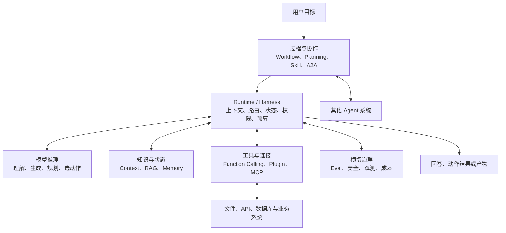
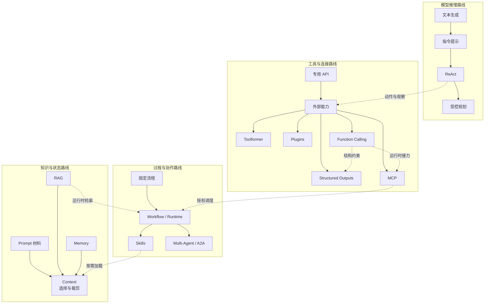
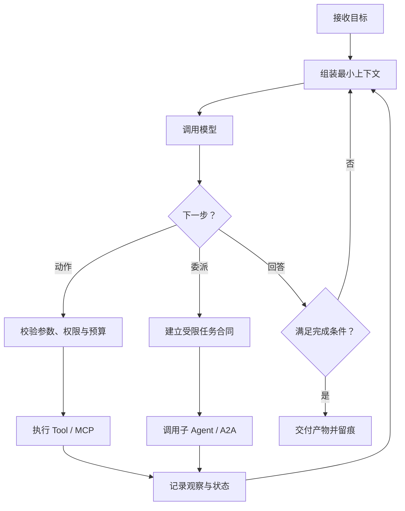
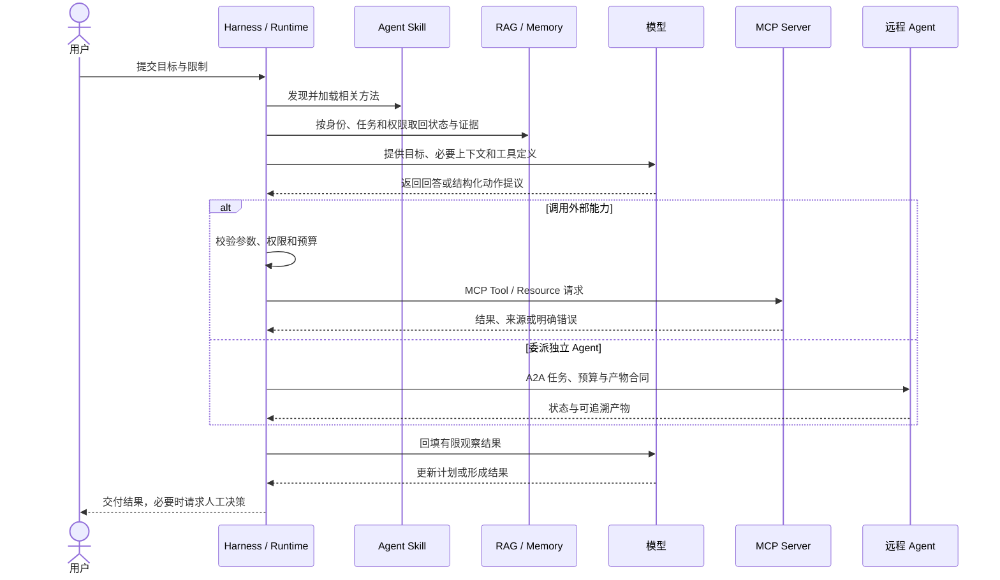
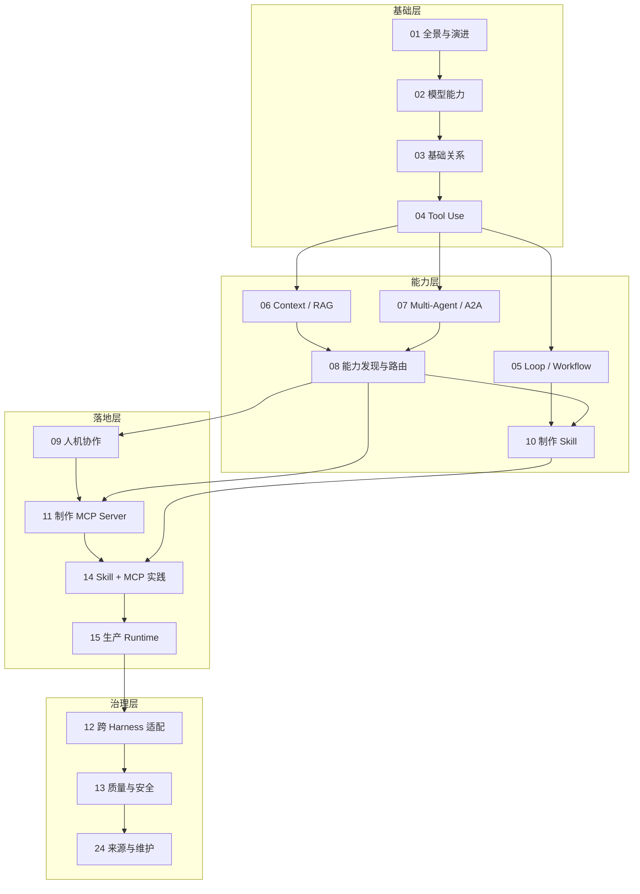

# 01. AI Agent 全景与演进史

> AI Agent 不是某一天突然被发明出来的单一技术。它更像一套逐步分工的系统：模型负责理解和提出候选动作，知识与状态机制提供当前证据，工具接口连接外部世界，运行时控制执行循环，Skill 与协作协议再把过程和组织边界表达清楚。先建立全景，再进入后续专题。

> **时间范围：** “智能体”研究早于大语言模型数十年，经典规划、BDI、多智能体系统、强化学习和机器人都有自己的历史。这里不重写整个 AI 史，而是聚焦 2017 年 Transformer 之后的现代 LLM Agent 工程；把 2017 年当作本表起点，不代表 Agent 在这一年才出现。

## 2017 年之前：现代 Agent 继承了什么

下面不是一条完整年表，而是几条重要思想来源。BDI 是 Belief-Desire-Intention，通常译为“信念-愿望-意图”。这些传统与 LLM Agent 并非简单父子关系，但今天的目标、状态、动作、环境反馈、协作和承诺等概念都能在更早研究中找到来路。

| 研究传统 | 当时关注的核心问题 | 留给现代 Agent 工程的概念 |
| --- | --- | --- |
| 经典规划与搜索 | 已知状态、动作和目标时，怎样找到可行计划 | 状态、动作、前置条件、计划、目标测试 |
| BDI 智能体 | 系统怎样基于所知、所求和当前承诺持续决策 | 信念更新、目标管理、意图与承诺 |
| 强化学习与机器人 | 行动者怎样通过观察、动作和环境反馈改进行为 | 观察-动作循环、奖励、策略、部分可观测环境 |
| 多智能体系统 | 多个自治参与者怎样协调、通信、协商或竞争 | 委派、协议、身份、协作与分布式状态 |
| 任务型对话与语义接口 | 怎样识别用户意图、抽取参数并映射到领域动作 | 意图、槽位、对话状态、自然语言到结构化语义 |

这张表不替代经典 Agent 或对话系统课程，只用于划清范围：2017 年之后的 LLM Agent 把通用自然语言模型接入了既有的 Agent 和自然语言接口问题，而不是从零发明“行动者”或“自然语言到参数”。代表性来源见[来源索引 A00](24-sources.md#a00-经典智能体研究范围)与[A00A](24-sources.md#a00a-任务型对话与语义接口前史)。

## AI Agent 知识地图：Agent 是系统，不是一个模型功能

只让语言模型根据一段输入生成一段文本，解决的是“怎样续写或回答”。要让它持续完成一项真实任务，系统还要回答更多问题：当前应该看到什么资料，下一步可以做什么，谁真正执行动作，失败后是否重试，状态保存在哪里，以及何时必须停下来交给人。



这张图是一张**职责地图**，不是产品安装清单。同一个应用可以把多项职责放在一个进程里，也可以拆成多个服务。重要的不是用了多少新名词，而是每一层的输入、输出、权限和失败边界是否清楚。

评测、安全、可观测性和成本不是上线前才临时补上的“第五条演进路线”，而是横切每一层的控制。检索需要评测召回，Tool 需要验证授权与副作用，Skill 需要路由正反例，Multi-Agent 需要追踪委派，Runtime 则要把预算、终态和停用开关变成程序行为。

这里采用“**Agent = 模型 + 运行时提供的上下文、状态、工具和执行循环**”这条简化关系建立直觉。这不是某项开放规范规定的公式，而是用于强调三个边界：模型生成一个工具调用建议，不等于工具已经执行；模型读到一段检索结果，不等于它拥有知识库；系统可以循环，也不等于它应获得无限自主权。更完整的基础定义见[03. 先认识 Agent、Skill 与 MCP](03-foundations.md)。

## 四条路线同时演进

AI Agent 的历史很容易被写成“Prompt 被 RAG 替代，Plugin 被 Function Calling 替代，MCP 又替代一切”的单线故事。这个故事不准确。下面四条路线解决的是不同问题，旧机制今天仍可能是正确选择。

下面是问题关系和常见组合，不是严格时间线或替代链。尤其是 Memory 研究远早于 LLM，Context Engineering 也不是 RAG 的“下一代产品”，而是统一选择和组装多种上下文来源的工程层。



四条路线可以这样记：

| 路线 | 核心问题 | 典型机制 | 不负责什么 |
| --- | --- | --- | --- |
| 模型推理 | 模型怎样理解目标并提出下一步 | Transformer、提示、ReAct、Planning | 不直接执行代码，也不授予权限 |
| 知识与状态 | 当前一步应看到什么，过去状态怎样保存 | Context Engineering、RAG、Memory | 不天然保证来源正确，也不决定业务动作 |
| 工具与连接 | 候选动作怎样结构化，外部能力怎样接入 | Plugins、Function Calling、Structured Outputs、MCP | 不自动形成完整工作方法 |
| 过程与协作 | 多步任务怎样控制、复用、委派和验收 | Workflow、Agent Runtime、Agent Skills、Multi-Agent、A2A | 不因角色或 Agent 数量增加就自动提高质量 |

很多关键进展恰好发生在路线交叉处。ReAct 把模型推理和环境行动放进同一轨迹；RAG 需要运行时先检索再组装上下文；MCP 标准化运行时与能力服务之间的连接；Skill 把过程知识按需带入上下文；A2A 则处理独立 Agent 系统之间的任务与产物交换。

## 2017-2026：可证实的关键节点

下表使用论文首个 arXiv 版本、厂商公告或规范发布作为日期依据。“能证明什么”刻意写得较窄：公开节点可以证明一种方法、产品能力或协议在当时被提出或发布，不能单独证明它发明了整个领域，也不能证明后续产品由它直接促成。

| 日期 | 节点 | 所属路线 | 一手来源与最窄结论 |
| --- | --- | --- | --- |
| 2017-06-12 | Transformer | 模型推理 | [Attention Is All You Need](https://arxiv.org/abs/1706.03762) 提出仅基于注意力、舍弃循环与卷积的序列转换架构。它是现代大模型的重要架构基础，但论文不是 Agent 或工具调用论文。 |
| 2020-05-22 | RAG | 知识与状态 | [Retrieval-Augmented Generation for Knowledge-Intensive NLP Tasks](https://arxiv.org/abs/2005.11401) 展示参数化生成模型与外部非参数记忆结合的方法。它不等于今天所有检索系统，也不包含完整 Agent Runtime。 |
| 2020-05-28 | 大规模上下文学习 | 模型推理 | [Language Models are Few-Shot Learners](https://arxiv.org/abs/2005.14165) 展示大规模自回归模型通过任务描述与上下文示例处理多类任务的能力；它不提供事实、权限或 Agent Runtime 保证。 |
| 2021-09-03 | 指令微调 | 模型推理 | [Finetuned Language Models Are Zero-Shot Learners](https://arxiv.org/abs/2109.01652) 研究用多任务指令数据改善未见任务的 zero-shot 泛化；模型行为倾向改变不等于取得实时知识或业务权限。 |
| 2022-01-28 | 思维链提示 | 模型推理 | [Chain-of-Thought Prompting](https://arxiv.org/abs/2201.11903) 展示特定大模型在若干推理任务中利用中间步骤示例的效果；内部推理文本不是执行证据或必须公开的审计日志。 |
| 2022-03-04 | 指令遵循与人类反馈 | 模型推理 | [Training language models to follow instructions with human feedback](https://arxiv.org/abs/2203.02155) 展示监督微调、偏好数据、奖励模型与强化学习组合的一条路线；它不是应用授权或事实验证机制。 |
| 2022-05-01 | MRKL Systems | 工具与连接 | [MRKL Systems](https://arxiv.org/abs/2205.00445) 提出由语言模型、外部知识源和离散推理模块组成的模块化神经符号架构。它是系统架构提案，不是通用工具协议。 |
| 2022-10-06 | ReAct | 模型推理 + 工具 | [ReAct](https://arxiv.org/abs/2210.03629) 研究让模型交错生成推理轨迹与任务动作，并依据外部观察继续推进。它证明一种提示与行动范式，不规定标准 API、权限或运行时。 |
| 2023-02-09 | Toolformer | 模型推理 + 工具 | [Toolformer](https://arxiv.org/abs/2302.04761) 研究用少量示例和自监督方式训练模型决定何时调用哪些 API、传什么参数及怎样利用结果。它不是后来 Function Calling API 的旧名称。 |
| 2023-03-23 | ChatGPT Plugins | 工具与连接 | OpenAI 的 [ChatGPT Plugins 公告](https://openai.com/index/chatgpt-plugins/) 介绍 ChatGPT 中连接第三方工具的产品机制和有限发布。它证明一个产品扩展模式，不代表跨 Harness 的开放工具协议。 |
| 2023-06-13 | OpenAI Function Calling | 工具与连接 | [Function Calling and other API updates](https://openai.com/index/function-calling-and-other-api-updates/) 宣布模型可根据开发者提供的函数描述输出函数名与 JSON 参数。应用仍负责校验并执行函数。 |
| 2023-07-06 | 长上下文位置效应 | 模型推理 + 上下文 | [Lost in the Middle](https://arxiv.org/abs/2307.03172) 在论文评测中展示模型利用长输入信息时与位置有关的性能变化；容量上限不等于所有内容被同等有效使用。 |
| 2023-10-12 | MemGPT | 知识与状态 | [MemGPT](https://arxiv.org/abs/2310.08560) 探索分层管理有限上下文和外部记忆的系统思路；它不把某种 Memory 产品定义成开放标准。 |
| 2023-11-06 | JSON mode 产品节点 | 工具与连接 | OpenAI 的 [DevDay 公告](https://openai.com/index/new-models-and-developer-products-announced-at-devday/) 公布 JSON mode；合法 JSON 不等于符合业务 Schema，也不建立 Tool Call/Result 闭环。 |
| 2024-08-06 | Structured Outputs | 工具与连接 | [Introducing Structured Outputs in the API](https://openai.com/index/introducing-structured-outputs-in-the-api/) 引入对给定 JSON Schema 的严格结构约束。它提高结构可靠性，不保证事实正确、业务合法或动作已获授权。 |
| 2024-11-25 | MCP 公开发布 | 工具与连接 | Anthropic 的 [Introducing the Model Context Protocol](https://www.anthropic.com/news/model-context-protocol) 发布开放协议，目标是用统一边界连接 AI 应用与数据源、工具。公告用于证明发布历史，当前细节应查固定版本规范。 |
| 2024-12-19 | Workflow 与 Agent 工程模式 | 过程与协作 | Anthropic 的 [Building effective agents](https://www.anthropic.com/engineering/building-effective-agents) 区分预定义代码路径主导的 Workflow 与模型动态决定过程和工具使用的 Agent，并总结组合模式。这是工程归纳，不是 Agent Runtime 的“发明日”。 |
| 2025-03-11 | OpenAI Agent 构建工具发布 | 工具与过程 | OpenAI 的 [New tools for building agents](https://openai.com/index/new-tools-for-building-agents/) 发布 Responses API、内置工具、Agents SDK 与 Tracing。这证明该厂商在该日形成更完整的 Agent 构建产品表面，不代表 Agent Runtime 由某一家首次发明。 |
| 2025-04-09 | A2A 公开发布 | 过程与协作 | Google Developers Blog 的 [Announcing the Agent2Agent Protocol](https://developers.googleblog.com/en/a2a-a-new-era-of-agent-interoperability/) 发布 Agent2Agent 协议，面向独立 Agent 系统的发现、任务通信和协作。 |
| 2025-06-23 | A2A 转入开放治理 | 过程与协作 | [Linux Foundation 公告](https://www.linuxfoundation.org/press/linux-foundation-launches-the-agent2agent-protocol-project-to-enable-secure-intelligent-communication-between-ai-agents) 宣布 A2A 项目进入基金会治理。治理变化不等于所有实现已经互通。 |
| 2025-10-16 | Agent Skills 系统介绍 | 过程与知识 | Anthropic 的 [Equipping agents for the real world with Agent Skills](https://www.anthropic.com/engineering/equipping-agents-for-the-real-world-with-agent-skills) 介绍由 `SKILL.md`、脚本和资源组成、按需渐进披露的机制。它不是“过程知识”概念的起点。 |
| 2025-11-25 | MCP 当前稳定基线 | 工具与连接 | [`2025-11-25` MCP 规范](https://modelcontextprotocol.io/specification/2025-11-25) 固定了本系列采用的 Host、Client、Server、能力与消息要求。Current 不表示协议永不变化。 |
| 2025-12-18 | Agent Skills 作为开放标准发布 | 过程与知识 | 上述 Anthropic 文章在该日宣布 Agent Skills 成为开放标准；当前[规范入口](https://agentskills.io/specification)面向跨平台可移植性。该规范是滚动页面，使用时还要记录核对日期并固定仓库提交或快照。 |
| 2026-03-12 | A2A `v1.0.0` | 过程与协作 | 官方仓库发布 [A2A `v1.0.0`](https://github.com/a2aproject/A2A/releases/tag/v1.0.0)。版本发布证明规范达到该项目定义的 1.0，不证明每个 Agent 产品都通过互操作认证。 |
| 2026-05-28 | A2A `v1.0.1` 来源快照 | 过程与协作 | 官方仓库发布 [A2A `v1.0.1`](https://github.com/a2aproject/A2A/releases/tag/v1.0.1) 补丁快照；线缆协议版本仍是 `1.0`，补丁号不参与协商。 |
| 2026-07-10 | 本系列状态截面 | 四条路线汇合 | 截至核对日，MCP、A2A 与 Agent Skills 都已有公开规范或仓库，但版本、实现范围和治理方式不同。当前基线集中记录在[24. 官方来源、事实标签与版本基线](24-sources.md)。 |

## 每个节点究竟改变了哪条边界

### 从文本生成到 RAG：知识从参数内走向调用时证据

Transformer 改变了序列建模的基础架构，后续规模化预训练、上下文学习、指令微调和偏好优化，让“用自然语言描述任务，再生成文本或动作提议”逐步成为通用接口。但单次生成仍只有调用时上下文和模型参数中的统计模式，既不知道企业今天更新的制度，也无法证明回答依据哪一版材料。

模型能力路线本身也不是一个“参数越大就解决全部问题”的故事。上下文学习让任务说明和少量示例在请求内发挥作用；指令微调与人类偏好训练改善模型遵循要求的倾向；思维链和后续推理时计算探索怎样为难题投入更多步骤。它们都不能授予环境权限、修复缺失证据或证明外部动作发生。Token、自回归生成、训练与后训练、长上下文、多模态和推理模型的完整基础见[02. LLM 能力底座](02-model-capabilities.md)。

RAG 把一个新边界放到模型参数之外：**运行时在生成前或生成过程中，从外部知识源选择材料，再把它们提供给模型。** 这让更新知识不必都进入模型参数，也让来源追踪成为可能。它没有自动解决切块、召回、重排、权限、时效和引用问题，更不等于长期 Memory。知识和状态的完整工程链见[06. Context Engineering、RAG 与 Memory](06-context-rag-memory.md)。

### ReAct、MRKL 与 Toolformer：同是“用工具”，研究问题并不相同

MRKL 关注系统怎样组合语言模型、知识源和专用推理模块；ReAct 关注模型怎样把推理、动作和新观察交错起来；Toolformer 关注模型能否从自监督数据中学会决定 API 的调用时机与参数。三者都帮助形成“语言模型不必只靠参数回答”的认识，但抽象层不同：

| 工作 | 主要研究对象 | 工具怎样出现 | 没有定义的部分 |
| --- | --- | --- | --- |
| MRKL | 模块化系统架构 | 路由到外部模块 | 通用消息协议与产品运行时 |
| ReAct | 推理与行动轨迹 | Prompt 中的动作和环境反馈 | API Schema、授权与执行治理 |
| Toolformer | 模型训练方法 | 训练数据中的 API 调用 | 商业 API 接口与插件分发 |

因此不能写成“Toolformer 发明了 Function Calling”，也不能把 ReAct 等同于所有 Agent Loop。它们提供了研究方法和设计语言；真正执行动作、保存状态和控制循环的仍是应用运行时。ReAct、Planning 与 Workflow 的工程取舍见[05. Agent Loop、Workflow 与 Planning](05-agent-loop-workflows.md)。

### Plugins、Function Calling 与 Structured Outputs：产品、接口和结构合同

ChatGPT Plugins 把“第三方能力怎样进入 ChatGPT 产品”做成了用户可感知的扩展模式，包含发现、描述、连接和产品体验。Function Calling 则把边界下沉到 API：开发者声明函数及参数 Schema，模型可以返回结构化调用意图，应用取得参数后决定是否执行。

Structured Outputs 继续收紧的是**结构合同**。普通 JSON mode 主要保证输出可解析为 JSON；Structured Outputs 追求符合开发者提供的 JSON Schema。结构正确仍可能语义错误，例如合法的 `account_id` 指向了错误账户，或退款金额符合数值类型却超过权限上限。因此 Schema 校验之后仍需要业务校验、授权、幂等和审计。

最关键的执行边界是：

```text
模型返回工具调用建议 -> 运行时校验、授权与调度 -> 本地运行时、能力服务或业务系统执行 -> 结果回填模型
```

模型通常不直接运行函数。完整数据流和 Schema 设计见[04. Function Calling 与 Tool Use](04-function-calling.md)。

### Agent Runtime：把一次生成变成受控循环

Agent Runtime 或 Harness 不是一个在某日统一发布的协议，而是一组逐渐清晰的运行职责。它承载模型，并管理一次任务怎样从目标走到终态。



运行时至少负责上下文组装、工具暴露、权限确认、状态与检查点、超时与重试、预算、停止条件和可观测性。模型可以建议“再试一次”，但是否允许重试应由运行策略决定；模型可以建议“任务已完成”，但高风险业务仍应由确定性条件或有授权的人确认。把 Runtime 误写成模型能力，会让执行与责任边界消失。

### MCP：标准化“运行时怎样连接能力服务”

Function Calling 说明模型与应用怎样交换工具调用意图，但接入外部或需要跨应用复用的能力时，各应用仍需处理能力发现、连接、生命周期和结果解析。本地静态注册函数不一定需要这些网络边界。MCP 把外部能力连接的另一条边界协议化：支持 MCP 的 Host 在运行时创建 Client，与 Server 协商协议和能力，并使用 Server 提供的 Tools、Resources 或 Prompts。

MCP 不负责模型一定选对 Tool，不自动授予业务权限，也不把 Server 返回的文字升级成可信指令。Server 提供能力，Host/Harness 决定暴露什么、何时请求审批以及怎样把结果加入上下文。协议结构和最小 Server 实践见[11. 从零制作一个高质量 MCP Server](11-mcp.md)。

### A2A：标准化“一个 Agent 系统怎样与另一个协作”

A2A 面向的是独立、可能内部不透明的 Agent 系统之间的能力发现、任务、消息、状态和产物交换。对方不是一个简单函数，而可能拥有自己的模型、运行时、Skill、工具和人工审批流程。

所以 A2A 与 MCP 是互补关系：

| 比较项 | MCP | A2A |
| --- | --- | --- |
| 主要边界 | Host/Harness 与能力 Server | Agent 系统与 Agent 系统 |
| 交换重点 | Tool、Resource、Prompt 及结果 | 能力、任务、消息、状态和 Artifact |
| 对端内部是否需要自主处理 | 通常按明确原语返回能力或数据 | 可以自行规划并交付任务产物 |
| 典型例子 | 查询制度库、读取工单、执行受控 API | 把供应商审查任务委派给供应商 Agent |

一个 Agent 可以经 A2A 接收任务，再在内部通过 MCP 调用工具。A2A 不替代 MCP；同一进程内的两个子 Agent 若已有可靠调度接口，也不必强行使用 A2A。多 Agent 的委派、权限和交接风险见[07. Multi-Agent、委派与 A2A](07-multi-agent-a2a.md)。

### Agent Skills：把“怎样完成一类任务”变成可发现资源

工具解决“能做什么”，Skill 更接近“这类任务应该怎样做”。Agent Skills 用带 `SKILL.md` 的目录封装触发描述、工作步骤、参考资料、脚本和资产。兼容 Harness 可以先让模型看到精简的名称与描述，匹配任务后再加载正文，具体资料继续按需读取。这种渐进披露把专项过程知识从永远常驻的长 Prompt 中分离出来。

安装 Skill 不会修改模型参数，也不会自动获得文件、网络或业务系统权限。Skill 可以要求在某一步查询制度，但实际能力仍由本地 Tool 或 MCP 提供，执行仍由 Harness 管理。制作方法见[10. 从零制作一个高质量 Agent Skill](10-skills.md)，二者怎样组合见[14. Skill 与 MCP 组合实践](14-skill-mcp-together.md)。

## 层次对照：先找责任主体，再选技术

| 层次 | 主要对象 | 负责 | 不应冒充 |
| --- | --- | --- | --- |
| 模型 | Token、推理轨迹、候选动作 | 理解、生成、比较、规划、提出调用 | 文件系统、权限系统或真实执行器 |
| 上下文 | 当前调用实际收到的材料 | 给模型提供当前目标、证据和能力描述 | 硬盘、数据库或全部组织知识 |
| RAG / Memory | 外部知识与跨步状态 | 检索证据，保存和召回受控状态 | 可信指令源或业务审批者 |
| Function Calling | 函数描述、参数、调用结果 | 在模型与应用之间表达结构化动作意图 | 工具执行、业务校验或连接协议全集 |
| Structured Outputs | JSON Schema 与结构化响应 | 约束支持范围内的输出结构 | 事实验证、授权或完整业务语义 |
| 能力发现与路由 | Skill、Tool、Agent 的精简元数据与候选集 | 资格过滤、相关性选择和执行前校验 | 业务授权本身或能力质量证明 |
| Agent Runtime / Harness | 循环、状态、权限、预算和轨迹 | 组织模型、上下文、工具和人类审批 | 模型本身或某个开放协议 |
| MCP | Host、Client、Server 与协议原语 | 标准化能力发现、连接和结果交换 | Agent 间任务协作或完整工作方法 |
| Agent Skill | 方法、步骤、参考和资源入口 | 封装并按需加载过程知识 | 实时连接、永久记忆或天然权限 |
| A2A | Agent 能力、任务、消息、状态和产物 | 支持跨 Agent 系统发现、委派和协作 | 本地函数调用或所有内部编排 |
| Plugin | 平台扩展与分发单元 | 把一种或多种能力作为产品安装管理 | 天然跨平台的统一抽象 |

一次真实任务通常会跨过多层。下面的时序图展示它们可以怎样组合，但这不是每个 Agent 都必须照搬的固定架构。



## 常见误区：历史叙述怎样写偏

| 常见说法 | 问题在哪里 | 更准确的写法 |
| --- | --- | --- |
| “Transformer 发明了 AI Agent” | 2017 年论文研究序列转换架构，没有提出今天的 Agent Runtime | Transformer 是现代大模型的重要架构基础，Agent 还需要上下文、工具和运行时 |
| “RAG 让模型拥有了数据库知识” | 检索结果只在被取回并加入本次上下文后可见 | RAG 建立调用时的外部知识读取路径，质量取决于检索和上下文工程 |
| “ReAct 就是 Agent” | ReAct 是推理与行动交错的研究范式，不包含完整权限和生命周期 | ReAct 可以作为 Agent Loop 的一种决策模式，由 Runtime 执行和约束 |
| “Toolformer 后来变成 Function Calling” | 前者是自监督训练研究，后者是商业 API 能力，缺少直接继承证据 | 二者分别探索模型学习使用工具和应用表达结构化调用 |
| “Plugins、Function Calling、MCP 是三代替代品” | 三者分别偏产品扩展、模型-应用接口和 Host-Server 协议 | 它们可以并存，比较时要先说明抽象边界 |
| “Structured Outputs 保证工具调用正确” | Schema 正确不等于对象、事实、金额或权限正确 | 它约束结构；应用仍须做语义校验、授权和审计 |
| “模型调用了数据库” | 通常是模型提出调用，Harness 校验、授权和调度，数据库或 Tool 产生结果 | 分清建议者、授权者、执行者和结果拥有者 |
| “MCP 是 Agent 的操作系统” | MCP 规定能力交换，不管理完整任务循环和所有安全策略 | MCP 是受 Host 管理的连接边界，Runtime 才组织任务 |
| “A2A 是 MCP 2.0” | A2A 的对端是 Agent 系统，MCP 的对端通常是能力 Server | A2A 处理 Agent 协作，MCP 处理能力接入，二者互补 |
| “装上 Skill 就训练会了新能力” | Skill 改变上下文，不修改模型权重，也不授予权限 | Skill 是可发现、按需加载的过程资源包 |
| “多 Agent 一定比单 Agent 强” | 多 Agent 会增加协调、权限、状态和错误传播成本 | 只有并行、隔离、权限或组织边界收益明确时才引入 |
| “开放规范发布就代表生态统一” | 规范版本、可选能力和产品实现仍可能不同 | 兼容声明要写明版本、传输、能力和实际验证范围 |

## 怎样继续学习

不需要按历史年份逐项复刻旧系统。更有效的顺序是先建立职责边界，再分别学习过程、知识和连接，随后处理跨平台与生产质量。



可以按目标选择路线：

1. **第一次接触 Agent**：[01. 全景与演进](01-agent-evolution.md) -> [02. LLM 能力底座](02-model-capabilities.md) -> [03. 基础关系](03-foundations.md) -> [04. Function Calling](04-function-calling.md) -> [05. Agent Loop](05-agent-loop-workflows.md)。
2. **要解决知识与状态问题**：[02. LLM 能力底座](02-model-capabilities.md)中的上下文与 Embedding -> [06. Context Engineering、RAG 与 Memory](06-context-rag-memory.md) -> [08. 能力发现与路由](08-capability-discovery-routing.md) -> [11. MCP Server](11-mcp.md)中 Resources 与 Tools 的区别。
3. **要做可复用专项能力**：[10. Agent Skill](10-skills.md) -> [14. Skill 与 MCP 组合实践](14-skill-mcp-together.md)。
4. **要做跨系统协作**：[07. Multi-Agent、委派与 A2A](07-multi-agent-a2a.md)；先证明本地单 Agent 或 Workflow 不足，再引入远程委派。
5. **要交付团队或生产环境**：[09. 人机协作与可控交互](09-human-agent-interaction.md) -> [15. 生产级 Agent Runtime](15-production-agent-runtime.md) -> [12. 跨 Harness 适配](12-cross-harness.md) -> [13. 质量工程与安全](13-quality-and-security.md) -> [24. 官方来源、事实标签与版本基线](24-sources.md)。

## 关键结论

1. AI Agent 的演进至少包含模型推理、知识与状态、工具与连接、过程与协作四条并行路线。
2. Transformer、RAG、ReAct、Toolformer 等论文提出的是特定架构或方法，不能单独承担整个 Agent 历史的起点。
3. Plugins、Function Calling、Structured Outputs 分别改变产品扩展、结构化动作意图和输出 Schema 的边界；它们不负责真实执行与授权。
4. Agent Runtime/Harness 把模型、上下文、状态和工具组织成受控循环，是责任与安全边界的核心。
5. MCP 连接 Agent Runtime 与能力服务，A2A 连接独立 Agent 系统，Agent Skills 则封装可发现、按需加载的过程知识。
6. 新机制通常补充分工，而不是让旧机制失效。选型前先问“谁在和谁交换什么、谁执行、谁授权、谁对结果负责”。
7. 能力发现与路由、Eval、安全、可观测性和成本横切所有路线；生产 Runtime 把这些边界变成可恢复的系统行为。
8. 人机协作让不确定模型的计划、进度、证据和动作状态可理解、可纠正、可取消，并把最终责任留在明确主体上。

