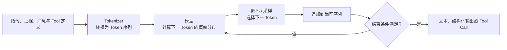
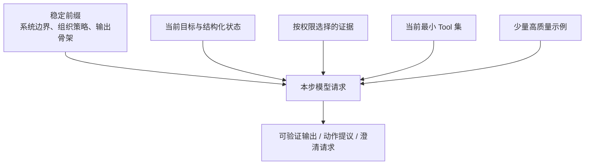

# 02. LLM 能力底座：从 Token 生成到推理、对齐与多模态

> Agent 不是凭空产生动作的黑盒。它依赖一个经过预训练和后训练、在给定上下文中逐步生成结果的模型。这里不展开神经网络推导，而是建立工程上够用的模型心智：模型为什么能遵循指令、怎样生成 Tool Call、为什么会稳定地犯错，以及 Harness 应怎样利用而不是迷信模型能力。

> **目标：** 区分模型训练、模型请求和 Agent Runtime，解释 Token、采样、上下文窗口、指令微调、偏好对齐、推理时计算、多模态与 Embedding 的作用，并把 Agent 故障定位到正确层次。

## 从一个“说得像真的”错误开始

用户问：“这次数据库删字段，最新制度是否允许今晚发布？”模型可能给出一段完整、专业、甚至带编号的回答，却存在三种根本不同的情况：

1. 它只依据训练期间见过的相似文字补全，引用的制度并不存在；
2. Harness 已经提供真实制度，但关键反例被长上下文淹没；
3. 模型正确提出查询动作，Tool 却没有执行，最终回答仍写成“已经核实”。

这三种错误表面都像“模型答错”，修复方法却完全不同。第一种需要外部证据与事实断言，第二种需要上下文工程，第三种需要 Tool Call、运行状态和完成条件。理解模型底座的目的，不是把所有责任推给模型，而是知道每个控制应放在哪一层。

## 模型能力不是沿一条线升级

现代 LLM 能力来自多条路线叠加。下表是学习地图，不是完整模型史；日期与最窄可证明结论见[来源索引](24-官方来源事实标签与版本基线.md#ai-agent模型检索推理与行动研究)。

| 阶段 | 主要变化 | Agent 获得了什么 | 仍然没有什么 |
| --- | --- | --- | --- |
| 2017 年以前 | 统计语言模型、循环网络、Seq2Seq、任务型对话和语义解析长期发展 | 文本建模、意图识别、槽位抽取、领域内动作映射 | 通用自然语言任务接口和开放式迁移能力 |
| 2017 起 | Transformer 让注意力成为大规模序列建模的重要基础 | 更强的长距离依赖建模和并行训练基础 | Agent Runtime、真实工具权限和当前企业知识 |
| 2018-2020 | 大规模预训练、上下文学习和规模化发展 | 一个模型能通过说明与少量示例处理多类任务 | 稳定服从复杂指令、事实保证和动作闭环 |
| 2021-2022 | 指令微调、偏好对齐、思维链等方法发展 | 更容易按人类指令回答，复杂任务可分步推理 | 真实执行权、可靠来源和确定性业务正确性 |
| 2022-2024 | Tool Use 研究、Function Calling、长上下文与多模态接口发展 | 可提出结构化动作，处理更多材料和模态 | 自动授权、无限有效上下文和无条件可靠感知 |
| 2024 起 | 推理时计算在 LLM 扩展与产品中受到集中关注，面向工具交互的训练与 Agent 构建表面继续发展 | 可以在难题上投入更多推理步骤，并从包含 Tool Call/Result 的训练轨迹学习怎样使用工具 | “思考更久就必然正确”或“更强模型替代 Runtime” |

这条演进最重要的结论是：

```text
模型能力增强 != 模型获得环境真相、身份、权限和执行状态
```

模型越强，越可能生成看起来完整的计划和参数；这提高了可用性，也提高了错误被流畅语言掩盖的风险。

## 一次生成到底发生了什么

### Token 不是汉字，也不一定是单词

模型接收和生成的基本单位通常是 Token。Tokenizer（分词器）把文本转换成 Token ID；一个中文词可能由一个或多个 Token 表示，空格、标点、代码片段和长数字也可能被拆分。不同模型的词表和切分方式不同，因此字符数不能直接换算成固定 Token 数。



对于常见的自回归生成模型，当前已有 Token 决定下一 Token 的条件分布，生成结果再进入下一步。这个机制不意味着模型“只是随机词典”或完全没有推理能力：大规模训练可以形成复杂表示、模式组合和任务求解能力。但它意味着**流畅度来自生成分布，不是事实数据库的事务保证**。

### Tool Call 仍然来自模型输出

Function Calling 并没有在神经网络中打开一个数据库连接。模型根据本轮可见的 Tool 名称、描述和 Schema，按 API 约定生成调用内容；模型服务或 SDK 将其表示成结构化输出项、内容块或流式事件。平台是否使用约束解码以及具体怎样实现，并不是跨厂商统一保证。Harness 取得这项提议后，才进入解析、业务校验、授权和调度。

```text
模型生成 / 平台 Tool Call 表示
  -> Tool Call 结构
  -> Harness 校验与授权
  -> 具体执行方产生结果
  -> Tool Result 进入下一次模型请求
```

因此，更好的 Tool Use 训练可以提高“何时调用、选择哪个工具、参数怎样填写”的概率，却不能替代 Server 的对象级授权，也不能证明动作已经发生。

## 预训练、后训练和运行时分别改变什么

把所有模型改进都叫“训练”会掩盖它们的目标差异。

| 层次 | 典型机制 | 主要改变 | 不能替代 |
| --- | --- | --- | --- |
| 预训练 | 在大规模数据上学习预测与表示 | 语言、代码、世界模式和迁移基础 | 当前企业事实、来源证明、业务权限 |
| 监督微调（SFT） | 用输入与期望输出示例继续训练 | 格式、任务风格、指令遵循和领域行为倾向 | 每次请求的动态证据和实时状态 |
| 偏好优化 | 根据人类或合成偏好调整回答倾向 | 有用性、拒绝方式、风格和部分安全行为 | 更广义的模型与系统对齐、确定性策略、法律判断和对象级授权 |
| 推理与 Tool Use 训练 | 使用推理轨迹、可验证结果或工具交互数据 | 分解问题、选择工具和利用观察的能力 | Harness 的循环、预算、超时和真实执行 |
| 蒸馏 | 让较小模型学习教师模型的软目标、标签或生成轨迹 | 在特定能力上改善成本与延迟 | 自动继承教师全部能力或安全边界 |
| 推理时控制 | Prompt、上下文、采样、工具和计算预算 | 当前一次任务实际怎样求解 | 修改模型长期权重 |

`[研究]` InstructGPT 展示了监督微调与人类反馈训练改善指令遵循的一条公开路线；DPO 提供了另一类直接偏好优化方法；知识蒸馏则早于现代 LLM。它们是不同训练方法，不应统称为某一个产品的“对齐开关”。来源见 [A12](24-官方来源事实标签与版本基线.md#a12-指令微调与人类反馈)、[A16](24-官方来源事实标签与版本基线.md#a16-直接偏好优化)与[A17](24-官方来源事实标签与版本基线.md#a17-知识蒸馏)。

四种经常混用的方法可以这样区分：

| 方法 | 训练信号与基本做法 | 不应混同 |
| --- | --- | --- |
| SFT（监督微调） | 用输入和目标输出训练模型模仿期望回答或动作轨迹 | 不需要偏好对，也不等于事实更新系统 |
| InstructGPT 式 RLHF | 收集偏好比较，训练奖励模型，再用强化学习优化策略；PPO 是其中一种实现 | RLHF 不只有 PPO，也不自动形成应用安全策略 |
| DPO | 使用偏好对和参考模型直接优化策略，不显式训练奖励模型或运行 RL 优化循环 | DPO 仍是偏好优化方法，不等于全部 Alignment（对齐） |
| 蒸馏 | 让学生模型学习教师的软目标、标签、答案或生成轨迹 | 不是“把任意任务数据喂给小模型”的泛称，也不保证完整复制教师 |

### Fine-tuning 适合稳定倾向，不适合保存实时事实

如果任务需要稳定的内部分类标签、输出语气或领域格式，Fine-tuning（微调）可能减少重复提示并改善一致性。如果制度每天更新、回答必须引用当前记录，应该使用 RAG 或受控 Tool，而不是不断把新制度训练进模型。

微调也不授予权限。即使训练样本包含“创建工单”的正确格式，模型仍只能提出动作；真实身份、Scope、对象权限和副作用控制仍属于 Runtime 与业务系统。

## 模型请求是一份临时执行合同

一个高质量 Prompt 不是一段“神奇咒语”，而是模型请求中一组有来源、有优先级、有版本的合同。请求可拆成六块：

| 合同块 | 应回答什么 | 常见错误 |
| --- | --- | --- |
| 控制边界 | 哪些规则不可被低信任内容覆盖 | 把组织规则和网页正文拼成同一段自由文本 |
| 当前目标 | 这一步要完成什么，成功与停止怎样判断 | 只给宽泛角色，不给可验收目标 |
| 结构化状态 | 已完成、未决、预算、对象和版本是什么 | 用长聊天记录代替任务状态 |
| 外部证据 | 哪些事实来自何处、何时观察、适用范围是什么 | 去掉来源后让模型区分不了事实与猜测 |
| 允许动作 | 当前可提议哪些 Tool，哪些动作禁止或需批准 | 永久暴露全部工具并依赖描述做权限控制 |
| 输出合同 | 文本、Schema、引用、不确定性和部分结果怎样表达 | 要求“JSON”却不定义字段语义和失败状态 |



Few-shot（少样本上下文示例）适合展示边界案例和期望输出，而不是堆很多相似范文。示例也属于上下文，会占预算并可能把旧规则带入新任务。稳定前缀可以版本化和缓存，动态证据必须按身份、时效和当前步骤重新组装；两者不应混成一份不断增长的系统 Prompt。

### 让模型可以弃权和澄清

如果合同只允许“给一个答案”，模型更容易在证据不足时猜测。高风险任务应提供结构化出口：

- `needs_clarification`：关键输入存在多种业务解释；
- `insufficient_evidence`：缺少支持结论的权威证据；
- `action_proposed`：已生成待校验动作，尚未执行；
- `partial`：只有部分来源或步骤完成；
- `completed`：满足由 Harness 验证的完成条件。

这些状态不是让模型自行宣布终态。模型返回的是候选分类，Harness 还要依据实际 Tool 记录、Artifact 和业务断言转换任务状态。

## 上下文窗口大，不等于有效上下文大

上下文窗口描述模型一次请求可接收的 Token 容量。更大的窗口可以容纳更多代码、文档和历史，但至少有四个限制：

1. 内容能放进去，不表示每个位置都被同等利用；
2. 冲突、过期和低信任材料不会因窗口变大而自动消失；
3. 更多 Tool Schema 会增加选择干扰与攻击面；
4. 长上下文增加成本、延迟，也让复核和来源追踪更难。

`[研究]` “Lost in the Middle”展示了模型使用长输入时与相关信息位置有关的性能变化。它不证明所有模型或任务具有相同曲线，但足以反驳“只要没超过窗口就等于都读懂了”。工程上仍要选择、排序、压缩和追踪来源，详见[Context Engineering](06-上下文工程RAG与Memory.md)。

## 采样、非确定性与可复现性

模型通常输出一个候选 Token 分布，解码策略决定怎样选择。Temperature（温度）、Top-p 等参数会改变输出分布；即使温度为零，服务实现、模型快照、并行请求、上下文差异和外部 Tool 状态也可能改变最终轨迹。

| 目标 | 更可靠的方法 | 不充分的方法 |
| --- | --- | --- |
| 输出结构稳定 | 严格 Schema + 解析与业务校验 | 只把温度设为零 |
| 行为可比较 | 固定模型快照、Prompt、Tool 与数据版本，重复采样 | 保存一次看起来最好的结果 |
| 动作不重复 | 幂等键、状态查询、唯一约束和写前记录 | 假设模型不会再次提议 |
| 路由稳定 | 候选裁剪、正反例数据集和分层指标 | 只改一句描述后凭感觉试用 |
| 事实可追溯 | 外部证据、来源 ID、时间与断言 | 要求模型“不要幻觉” |

`[建议]` 把概率模型放在确定性外层中：让模型处理理解、比较和候选生成，让程序处理权限、预算、状态转换、唯一约束和安全不变量。模型输出不必逐字相同，只要关键业务合同稳定通过。

## 推理模型与推理时计算改变了什么

推理时计算（test-time compute）指在模型参数已经确定后，为当前问题投入更多生成、搜索、验证或采样资源。它可能表现为更长的推理过程、多个候选的比较，或用验证器分配计算。Agent 在 Tool 观察后再次调用模型属于运行循环；它可以与推理时计算组合，但不是这个术语本身的必要定义。

`[研究]` 推理时计算缩放工作比较了不同推理计算分配策略，并说明收益依赖问题难度、验证器和计算分配方式。它支撑“测试时可以增加计算”在现代 LLM 中受到集中研究这一节点，不表示搜索、采样或测试时计算在 2024 年才被发明，也不证明任意模型只要延长输出就会单调变好，来源见 [A19](24-官方来源事实标签与版本基线.md#a19-推理时计算缩放)。

这类能力适合：

- 多约束规划、数学和代码等可以验证中间或最终结果的任务；
- 需要先分解问题再选择 Tool 的复杂任务；
- 有明确 Rubric、测试、编译器或业务断言可用于验证的任务。

但投入更多推理并不自动获得缺失事实，也不能克服错误权限。若检索没有召回关键制度、Tool 返回旧数据或 Harness 把写操作误标为只读，更长推理可能只会形成更精致的错误解释。

```text
更强推理 = 更好的候选搜索机会
可靠 Agent = 候选搜索 + 真实观察 + 确定性控制 + 可验证终态
```

产品不必向用户、日志或下游 Agent 暴露内部 Chain of Thought（思维链）。需要协作和审计时，应保存可验证的计划摘要、使用的证据、动作记录、决策理由类别和断言结果，而不是把内部推理全文当作审计证据。

## 多模态不是“看见就等于理解正确”

多模态模型可以在一次任务中处理文本、图像、音频或视频等两种或多种输入。每个产品只支持其中一个子集，输入与输出能力也可能不同，必须分别核对支持矩阵；这里仅讨论 Agent 的多模态观察，不展开生成不同模态产物。对 Agent 而言，多模态扩展了观察表面：读取截图、识别界面、理解图表、转录会议或检查扫描件。代表性输入理解技术报告见 [A20](24-官方来源事实标签与版本基线.md#a20-多模态模型能力边界)，但它不能单独证明所有多模态产品具有相同能力。

| 模态 | 可支持的任务 | 新增风险 | 推荐控制 |
| --- | --- | --- | --- |
| 图像 / 截图 | 图表理解、GUI 状态观察、文档页面识别 | 小字遗漏、坐标漂移、遮挡、视觉注入 | 保留原图引用、关键字段 OCR/结构化复核、动作后截图验证 |
| 音频 / 语音 | 转录、实时助手、口头指令 | 说话人混淆、噪声、敏感旁听、误触发 | 说话人和同意边界、敏感动作二次确认、保存有限转录 |
| 视频 / 连续界面 | 时序事件和操作过程 | 帧采样遗漏、状态变化快、成本高 | 明确时间段、关键事件检测、状态机与外部事实核对 |
| 文档布局 | 表格、表单、扫描件 | 阅读顺序错误、合并单元格丢失、OCR 误差 | 结构化解析优先，关键数值与原页坐标可追溯 |

有稳定 API 或 DOM 时，优先使用结构化接口。Computer Use 适合没有可靠接口的遗留环境，但观察和动作都更弱，应使用隔离环境、域名与应用允许列表、关键动作预览和结果复核。模型能描述“我看到提交成功”不等于业务系统已经记录成功。

## Embedding 是表示能力，不是事实与权限

Embedding（向量表示）把文本、图像或其他对象映射为一组数值，使相近内容在某种训练语义下更容易被检索或聚类。它通常不负责生成最终回答，而是服务于 RAG、能力召回、去重和相似案例查找。文本句向量、非对称文本检索与图文联合表示分别可参考 [A15](24-官方来源事实标签与版本基线.md#a15-embedding-与语义检索)、[A21](24-官方来源事实标签与版本基线.md#a21-非对称双编码检索)和[A22](24-官方来源事实标签与版本基线.md#a22-跨模态向量表示)。

相似度只说明“在该表示空间中接近”，不证明内容真实、最新、权威或当前主体有权读取。Embedding 适合召回候选，权限、关键词、时间和业务规则仍要在模型之外处理。查询/文档编码器对、索引迁移和 Recall@k 评测等实现细节集中见[Context Engineering、RAG 与 Memory](06-上下文工程RAG与Memory.md#embedding把对象映射到可比较的表示)，避免把模型直觉与 RAG 运维重复两遍。

## 不要把所有失败都叫“幻觉”

分层诊断是关键原则。只有先定位失败层，修复才不会变成“换一个更大模型”。

| 表面症状 | 更准确的失败类别 | 应先检查哪一层 | 典型修复 |
| --- | --- | --- | --- |
| 编出不存在的制度或引用 | 无依据生成 / 伪造引用 | 模型输出与证据断言 | 强制来源合同、引用蕴含检查、允许证据不足 |
| 说“已经创建工单”，Trace 中没有调用 | 虚构执行 | Agent Loop 与完成条件 | 用 Tool 记录和外部状态验证动作声明 |
| 关键制度在库中却没进入回答 | 检索或上下文遗漏 | RAG、权限过滤、排序与裁剪 | Recall@k、黄金证据、上下文快照 |
| 选了网页搜索而不是内部制度 Tool | 能力路由错误 | 候选、描述、权威性和路由器 | 近邻反例、来源优先级、允许弃权 |
| Tool 参数合法但对象错了 | 语义或状态错误 | 业务校验、当前对象与审批 | 对象 ID 复核、计划摘要绑定、状态前置条件 |
| Tool 返回超时后重复创建对象 | 执行与恢复错误 | Runtime、幂等和外部对账 | 幂等键、外部操作 ID、未知状态人工处置 |
| 长任务恢复后重复旧步骤 | 状态漂移 | Checkpoint、版本和租约 | 结构化状态、条件写、fencing token |
| 回答使用了另一个租户的历史 | Memory / 数据隔离错误 | 召回主体、租户、缓存键 | 权限分区、来源与用途校验、删除传播 |

“幻觉率”作为单一总指标会把这些问题混在一起。评测应分别观察事实、检索、路由、参数、执行、状态和业务结果，详见[质量工程与安全](13-质量工程与安全治理.md)。

## 怎样为 Agent 选择模型

不要只按排行榜总分或参数规模选模型。先把任务拆成步骤，再为每一步定义最低能力和风险：

| 维度 | 要验证的问题 |
| --- | --- |
| 指令与结构 | 能否稳定遵循控制层级、输出 Schema、正确弃权和请求澄清 |
| Tool Use | 能否在近邻工具中选对、构造参数、利用错误和并行结果 |
| 推理 | 是否能处理任务所需约束、规划和验证，而非只在通用基准上高分 |
| 上下文 | 在真实长度、位置、语言和噪声下，关键证据是否仍被使用 |
| 模态 | 对实际截图、扫描件、音频或表格的错误分布是什么 |
| 安全 | 是否遵守权限边界、抵抗注入、在高风险时拒绝或升级 |
| 运行 | 延迟、吞吐、限额、地域、保留、版本稳定性与成本是否满足合同 |

同一个 Agent 可以让小模型处理低风险分类，让强模型处理复杂综合，让确定性程序负责安全门。模型降级不是简单替换名称：备用模型必须分别验证消息角色、Tool Call、Schema、多模态和拒绝行为。

## 完成检查

- [ ] 能解释 Token、自回归生成与 Tool Call 之间的关系，而不把模型写成真实执行器。
- [ ] 能区分预训练、SFT、偏好优化、Tool Use 训练、蒸馏和推理时控制。
- [ ] 模型请求分开稳定控制、动态状态、外部证据、允许动作和输出合同。
- [ ] 上下文窗口容量与有效上下文质量分开评测。
- [ ] 温度为零不会被当作绝对确定性保证，关键行为使用重复采样与确定性断言。
- [ ] 推理模型不会替代 RAG、授权、Runtime 或外部状态验证。
- [ ] 多模态观察有来源、状态复核和高风险动作控制。
- [ ] Embedding、索引、切块和权限元数据一起版本化。
- [ ] 失败按模型、上下文、检索、路由、Tool 和 Runtime 分层归因。
- [ ] 模型选型基于真实任务与安全 Eval，而不是单一排行榜。

## 继续阅读

- [AI Agent 全景与演进史](01-AI-Agent全景与演进史.md)：把模型路线放回知识、工具、过程和协议的并行历史；
- [模型请求、Harness 与上下文](03-Agent-Skill-MCP基础关系.md)：理解这些能力怎样被一次请求真正使用；
- [Function Calling 与 Tool Use](04-Function-Calling与Tool-Use.md)：追踪 Tool Call 的消息与执行闭环；
- [Context Engineering、RAG 与 Memory](06-上下文工程RAG与Memory.md)：设计证据选择、Embedding 检索和状态生命周期；
- [人机协作与可控交互](09-人机协作与可控交互.md)：把不确定模型放进可理解、可纠正的用户体验；
- [质量工程与安全](13-质量工程与安全治理.md)：把模型能力变成可重复的组件、轨迹和业务评测；
- [官方来源与版本基线](24-官方来源事实标签与版本基线.md)：核对论文与规范来源。

