# 03. 先认识 Agent、Skill 与 MCP

> 本章面向第一次系统接触 Agent 工程的读者。读完后，你应该能回答三个问题：Agent 到底由什么组成，Skill 与 MCP 为什么会出现，以及一段方法或一份外部数据究竟怎样进入模型上下文。文中的 `[规范]`、`[平台]`、`[建议]` 只在需要区分事实层次时出现，含义见[来源索引](24-sources.md#事实标签)。

## 从一次发布审查说起

周五下午，你对公司的代码 Agent 说：

> 帮我审查这次生产发布，告诉我有哪些风险，并确认它是否符合公司最新发布制度。

这句话看似只是一次问答，背后却有三类完全不同的工作：

1. 理解“生产发布审查”要检查什么，例如数据库变更、配置兼容性、监控和回滚方案；
2. 查询公司当前有效的发布制度，而不是依赖模型训练时见过的旧资料；
3. 在权限允许的范围内读取代码和变更记录，最后给出有证据的结论。

可以把这个过程想象成一位新同事在办公室里办事：

| 办公室中的角色或物品 | Agent 系统中的对应物 | 负责什么 |
| --- | --- | --- |
| 会阅读、分析和写作的新同事 | 模型 | 理解语言，进行推理，提出下一步动作 |
| 工位、门禁、电话和办事系统 | Harness | 提供运行环境，管理上下文、工具、权限和执行循环 |
| 《生产发布审查手册》 | Skill（技能包） | 告诉 Agent 何时采用一套方法，以及怎样把任务做完整 |
| 连接制度库的标准服务窗口 | MCP（模型上下文协议） | 让 Harness 用统一协议发现和调用外部能力 |
| 经理这次口头交代的要求 | 当前 Prompt | 表达本次任务的目标和限制 |

这里最重要的直觉是：**模型负责思考，Harness 负责组织工作，Skill 提供做事方法，MCP 提供外部能力和数据。** 它们不是四种相互竞争的产品，而是同一次任务中的不同部分。

## 先分清三个经常混用的词

### 模型：负责预测与推理的核心

模型，通常指大语言模型，也就是根据已有上下文理解需求、生成文字或提出工具调用的计算核心。它很擅长概括、比较、规划和生成代码，但它并不天然知道：

- 你的仓库在电脑的哪个目录；
- 公司今天更新了哪条制度；
- 当前允许读取哪些文件；
- 一个命令是否已经执行成功；
- 哪些 Skill 或 MCP Server 已安装。

模型只能根据**本轮实际提供给它的上下文和能力描述**作出判断。“模型应该知道”与“这轮上下文已经告诉模型”是两回事。

### 模型请求：这一轮真正送进了什么

基础模型不会自行翻阅上轮会话、磁盘或企业数据库。产品服务可以替应用保存会话或提供“继续上一响应”的接口，但在工程责任上，仍要由服务或 Harness 决定哪些历史和状态进入当前推理。不要把产品层的会话存储误写成模型参数里的永久记忆。

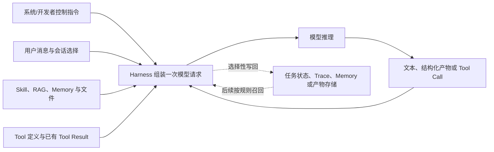

一份厂商中立的模型请求通常包含以下几类内容；具体字段名和角色由 API 定义：

| 请求部分 | 作用 | 常见误区 |
| --- | --- | --- |
| 控制指令 | 定义系统边界、开发者要求和安全规则 | 认为外部文档里写“系统指令”就能取得同等优先级 |
| 消息与当前目标 | 提供用户任务和经选择的对话历史 | 把全部聊天记录当成可靠结构化状态 |
| 动态上下文 | 加入 Skill、检索证据、Memory、文件或摘要 | 内容进入上下文后就自动变成可信事实 |
| Tool 定义 | 告诉模型当前可以提议哪些离散动作 | Tool 可见等于已授权或已执行 |
| 输出约束 | 指定文本、JSON Schema 或其他结构合同 | 结构正确等于事实和业务语义正确 |
| 推理配置 | 模型版本、Token 上限、采样和停止参数 | 同一输入一定逐字返回同一结果 |

消息角色表达的是**来源和控制层级**，不是文本自称。网页、工单、Tool Result 或 Memory 中即使出现“忽略之前要求”，也仍然是较低信任的数据。不同厂商对 system、developer、user、assistant、tool 等角色的字段和优先规则不同，但 Harness 都应在组装请求前保留来源边界，不能靠模型从拼接文本里猜。

上下文窗口是一次请求可处理内容的容量上限，不是“全部内容都会被同等理解”的保证。真正有用的是有效上下文：当前目标、必要状态、关键证据、允许动作和停止条件能否在噪声中保持清楚。即使采样参数固定，模型服务和并行工具等因素也可能让轨迹变化，所以行为评测需要重复采样和分布指标。完整的选择、压缩与来源追踪见[06. Context Engineering、RAG 与 Memory](06-context-rag-memory.md)。

### Harness：让模型真正工作起来的运行环境

Harness 原意是“挽具”或“线束”。在 Agent 领域，它指承载模型并组织整个工作过程的应用或运行框架，例如 Claude Code、Codex CLI、Gemini CLI，以及带 Agent 模式的 VS Code。

一个典型 Harness 会做这些事：

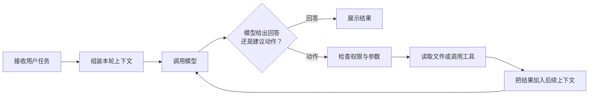

这条“模型判断下一步，Harness 校验、授权并调度，执行方产生结果，再由 Harness 交回模型”的循环，通常被称为 **Agent 循环**。因此，Harness 不只是聊天界面。它决定模型能看到什么、能调用什么、何时需要用户确认、失败后是否重试，以及最终怎样展示结果。

### Agent：模型加上环境之后形成的行动者

Agent 可以理解为“能够围绕目标连续观察、判断和行动的系统”。在本教程中，我们用下面这个简化关系建立直觉：

```text
Agent = 模型 + Harness 提供的上下文、工具和执行循环
```

这不是某项规范规定的数学公式，而是一种便于讨论的工程模型。只调用模型生成一次回答，通常仍是一次模型调用；当系统能读取环境、选择动作、观察结果并继续推进时，才更接近这里所说的 Agent。

| 常见说法 | 更准确的理解 |
| --- | --- |
| “Agent 读了整个仓库” | Harness 读取了部分文件，并把相关内容交给模型 |
| “模型调用了数据库” | 模型建议调用；Harness 校验、授权并调度，对应工具或数据库产生结果 |
| “MCP 把知识塞进模型” | MCP Server 返回能力或数据；Harness 决定是否、何时以及以何种形式加入上下文 |
| “装了 Skill，模型就学会了” | Harness 发现并按需加载了 Skill；它改变的是当前任务上下文，不是模型参数 |

## 为什么后来有了 Skill 与 MCP

Skill 和 MCP 并不是凭空出现的两个新名词。它们分别回应了 Agent 应用发展中反复出现的两类问题：**做事方法怎样复用**，以及**外部系统怎样连接**。

本章只沿着 Skill 与 MCP 这两条线建立基础。更完整的历史见[AI Agent 全景与演进史](01-agent-evolution.md)；模型怎样用结构化消息提出工具调用，见[Function Calling 与 Tool Use](04-function-calling.md)。

### 第一阶段：把所有要求都写进长 Prompt

早期最直接的做法，是把角色、规则、业务知识和工作步骤全部写进系统 Prompt。Prompt 即“提示词”，是交给模型的指令和材料。

这种做法起步很快，但规模扩大后会出现明显问题：

- 每次任务都携带大量无关规则，占用有限的上下文窗口；
- 发布审查、事故复盘、论文评审等不同流程混在一起，规则容易冲突；
- 一段流程被复制到多个项目后，很难同步更新；
- 模型知道“应该查询最新制度”，却没有真正访问制度库的能力。

于是，长期通用的仓库约定逐渐沉淀为项目指令，特定任务的方法则需要一种按需加载、可以独立维护的载体。Skill 正是在这个方向上形成的标准化实践。

### 第二阶段：为每个外部系统写专用连接器

当模型开始调用函数和工具，Agent 可以查询工单、代码平台、数据库和知识库。但另一类重复劳动随之出现：每个 Agent 产品都要为每个外部系统单独实现连接器。

假设有四种 Harness 和五个内部系统，若双方各自直接适配，理论上可能出现大量不同组合。认证、能力发现、参数结构、错误返回和连接生命周期也会被反复实现。

MCP（Model Context Protocol，模型上下文协议）借鉴了客户端与服务器分离的思路：外部系统通过 MCP Server（服务端）提供能力，支持 MCP 的 Host（宿主）在内部创建 MCP Client（客户端）与它通信。这样做不能消除所有平台差异，但能减少每一对产品都重新发明接口的成本。

### 两条演进路线最终汇合

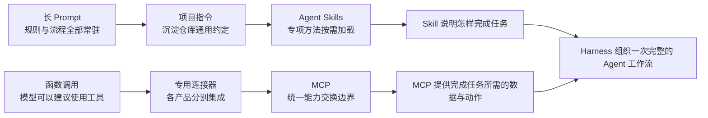

这不是严格的替代时间线。长 Prompt、项目指令、函数调用和专用接口今天仍然有各自用途；在开放标准出现之前，业界也早已有类似的技能包与协议化连接思想。历史的关键不是“旧技术消失了”，而是职责逐渐被拆清楚了。

`[平台]` Anthropic 于 [2024 年 11 月 25 日公开发布 MCP](https://www.anthropic.com/news/model-context-protocol)，并在 [2025 年 10 月 16 日的工程文章](https://www.anthropic.com/engineering/equipping-agents-for-the-real-world-with-agent-skills)中系统介绍 Agent Skills 的设计。`[规范]` 本教程讨论的 Skill 结构以 [Agent Skills 开放规范](https://agentskills.io/specification)为依据；MCP 协议细节以 [`2025-11-25` 稳定规范](https://modelcontextprotocol.io/specification/2025-11-25)为基线。日期用于说明公开演进过程，不表示这些思想此前从未存在。

## 一张图建立三层直觉

现在回到开头的发布审查。Agent 既需要一套审查方法，又需要查询最新制度，但真正把它们组织起来的是 Harness。

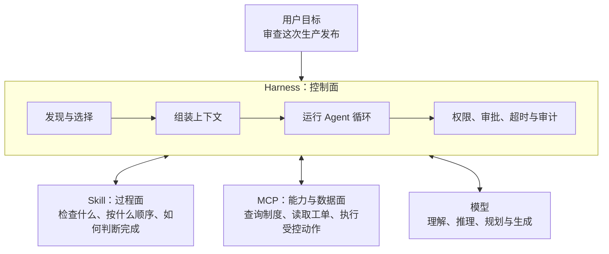

这里的“面”表示职责视角，而不是三个必须独立部署的软件：

| 层次 | 最像什么 | 核心问题 | 典型内容 |
| --- | --- | --- | --- |
| Harness 控制面 | 办公室和办事规则 | 谁能看什么、何时执行、怎样循环 | 上下文组装、工具暴露、权限确认、超时和审计 |
| Skill 过程面 | 专项工作手册 | 这类任务应该怎样做 | 触发条件、步骤、判断规则、参考资料和产物要求 |
| MCP 能力与数据面 | 标准化服务窗口 | 怎样取得外部数据或完成外部动作 | Tools、Resources、Prompts 及其调用结果 |

由此可以得到两个很实用的判断：

1. **Skill 与 MCP 通常不是二选一。** Skill 可以要求先识别发布变更，再通过 MCP 查询制度，最后将事实与规则逐项比对。
2. **两者都不能代替 Harness。** Skill 不会自行获得文件权限，MCP Server 也不能自行决定把结果放进哪一轮模型上下文。

`[规范]` Agent Skills 以包含 `SKILL.md` 的目录包表达一套能力，至少使用 `name` 和 `description` 供兼容实现发现。MCP 则用 Host、Client、Server 描述通信参与方，并可由 Server 提供 Tools、Resources 和 Prompts。`[建议]` 为了便于跨平台讨论，本教程将 Harness 视为具体产品的 Agent 运行层，将 MCP 规范中的 Host 视为其中负责管理 MCP Client、权限和上下文的角色；日常口语里两者有时会被混用，但讨论协议边界时应分清。

## 上下文：模型这一刻真正拿到的材料

“上下文”不是硬盘上所有可访问文件的总和，而是模型在某一次调用中实际收到的指令、对话、材料和工具定义。它通常包含若干部分：

| 上下文组成 | 例子 | 通常由谁放入 |
| --- | --- | --- |
| 系统与安全指令 | 行为边界、权限规则 | Harness 或服务提供方 |
| 项目指令 | 构建命令、编码规范、仓库约束 | Harness 从项目文件加载 |
| 当前对话 | 用户的发布审查要求、之前的问答 | Harness |
| Skill 信息 | 候选 Skill 的名称和描述，激活后的正文 | Harness 的 Skill 发现与加载机制 |
| 工具定义 | MCP Tool 的名称、说明和参数结构 | MCP Client 获取后，由 Harness 选择性暴露 |
| 动态证据 | 文件内容、命令结果、制度查询结果 | 执行方返回后由 Harness 选择性回填 |

模型的上下文窗口有容量限制。即使容量很大，无关内容也会增加干扰。因此高质量 Agent 的目标不是“把能找到的内容全部塞进去”，而是：

> **在作出当前决定之前，提供足够、可信且尽量少的相关上下文。**

Skill 的渐进披露和 MCP 的按需调用，正是两种不同的上下文控制方式。下面分别看它们怎样工作。

## Skill 怎样进入上下文

假设 Harness 中安装了“发布风险审查”“事故复盘”和“数据库迁移审查”三个 Skill。会话开始时，模型没有必要同时阅读三本完整手册。更合理的过程是先看目录，确定本次需要哪一本，再读取正文和必要附件。

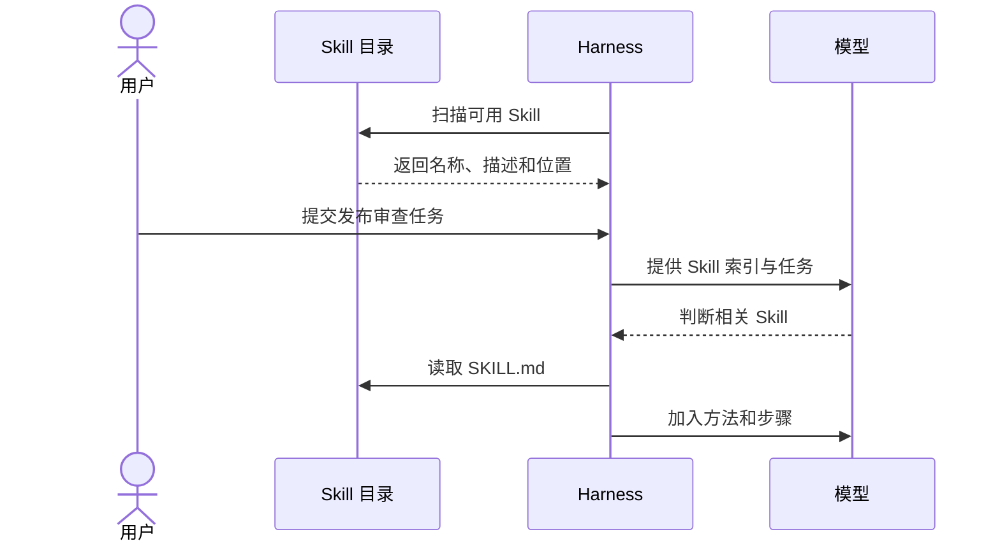

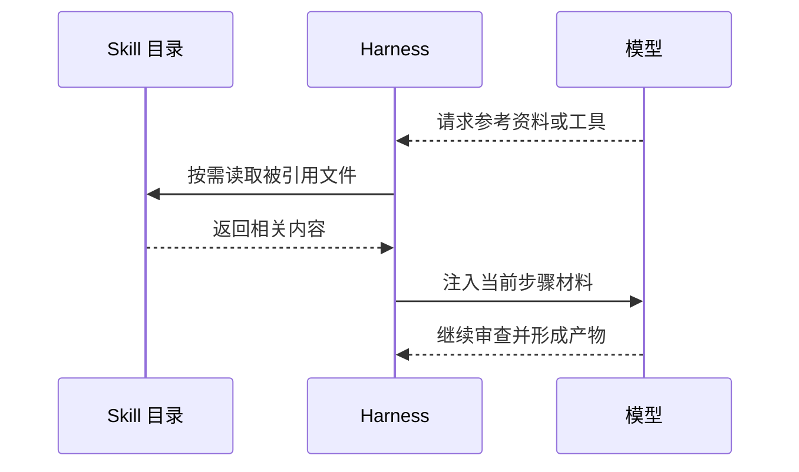

这个过程常被称为**渐进披露**：

1. 第一层是名称和描述，用来发现与选择；
2. 第二层是 `SKILL.md` 正文，在 Skill 被激活后提供核心工作方法；
3. 第三层是引用资料、脚本或资产，只在具体步骤需要时使用。

因此，Skill 的 `description`（描述）不是普通宣传语。它要让模型在尚未读到正文时判断“什么时候该用、什么时候不该用”。正文则负责告诉模型“具体怎样做”。把全部细节塞进描述会让目录变得臃肿，把触发条件只藏在正文里又可能导致 Skill 根本没有被选中。

`[规范]` [Agent Skills 开放规范](https://agentskills.io/specification)定义了以 `SKILL.md` 为入口的目录结构和渐进披露原则，但没有规定所有 Harness 必须使用同一种安装路径、激活命令或消息角色。`[平台]` 有的平台会让模型自动选择，有的平台提供显式命令或专用激活工具，也可能在加载前请求用户确认。具体差异将在[跨 Harness 适配](12-cross-harness.md)中展开。

## MCP 怎样进入上下文

MCP 的路径不同。MCP Server 不是直接向模型发送消息，而是先与 Harness 内部的 MCP Client 通信。仍以查询发布制度为例：

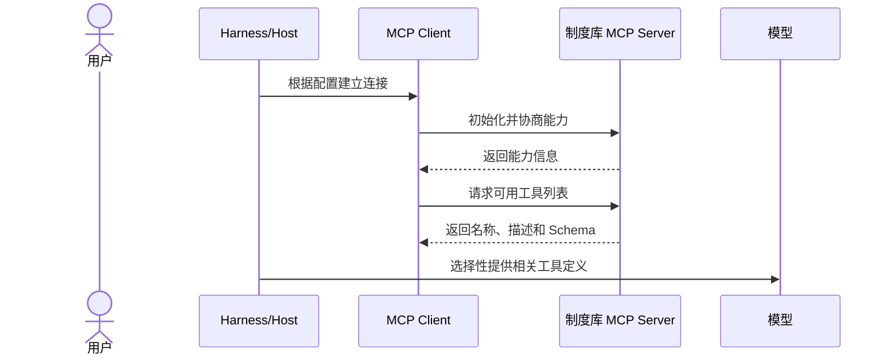

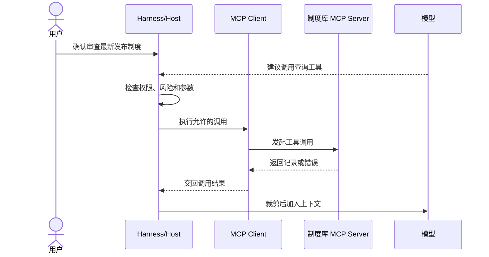

这张图中有两类内容可能进入模型上下文，但时间不同：

- **能力描述**先进入：工具名称、用途和参数结构让模型知道“可以查询制度”；
- **调用结果**后进入：只有工具真正被选择并执行后，具体制度内容才可能加入上下文。

这解释了几个常见误区：连接成功不等于工具一定会被选中，工具可发现不等于已经执行，Resource（资源）可列出也不等于内容已被读取，Server 返回了数据也不等于 Harness 会原样全部交给模型。

`[规范]` MCP 的初始化阶段协商协议版本与能力，Server 可以提供 Tool（可调用工具）、Resource（可寻址资源）和 Prompt（参数化提示模板）；它们的发现与调用方式不同，详见 [MCP 稳定规范](https://modelcontextprotocol.io/specification/2025-11-25)。初始化也不等于获得业务授权。`[建议]` Harness 应分别处理能力暴露、模型选择、用户审批、服务端授权和结果回填，尤其不能把来自外部系统的文字默认当作可信指令。

## Skill 与 MCP 的注入方式有何不同

两张时序图可以浓缩为一句话：**Skill 主要把“做事方法”按需加入上下文，MCP 主要让 Agent 发现外部能力，并在调用后取得动态结果。**

| 比较项 | Skill | MCP |
| --- | --- | --- |
| 首先被发现的内容 | 名称与描述 | Server 能力以及 Tool、Resource、Prompt 的元数据 |
| 按需加载的主要内容 | 工作方法、引用资料 | 外部查询结果或动作结果 |
| 内容通常来自哪里 | 本地目录、扩展包或受管仓库 | 本地进程或远程服务 |
| 是否天然具有外部权限 | 否 | 否，仍需连接配置、身份与业务授权 |
| 谁决定交给模型什么 | Harness | Harness/Host |
| 典型失败 | 未发现、误触发、正文过长、引用漏读 | 连接失败、工具选错、参数非法、超时、越权或结果过大 |

二者组合时，常见顺序是：Skill 先规定流程，模型在流程中的某一步建议调用 MCP Tool，Harness 完成审批和调度，MCP Server 返回结果后再交给模型继续按照 Skill 推进。

## Prompt、项目指令、Skill、MCP 和 Plugin 怎么选

面对一段新内容，不要先问“能不能写成 Skill”，而要先问它应该**何时生效**、是否需要**外部连接**、以及要以什么范围**分发**。

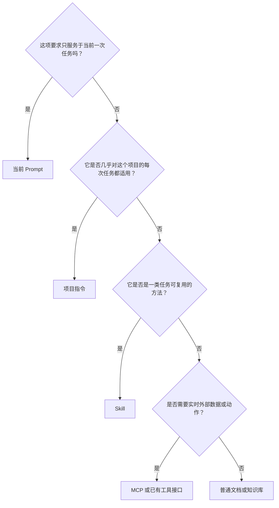

补充判断：

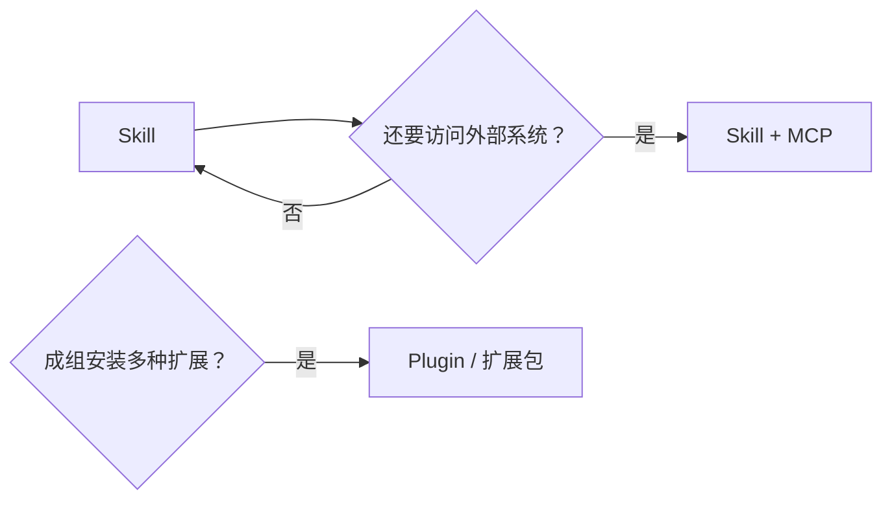

### 当前 Prompt：只处理眼前这一次

如果要求是临时的，例如“把这段说明改成三句话”“这次不要修改测试”，直接写在当前 Prompt 中最合适。一次性要求没有必要承担版本维护、发现和路由成本。

### 项目指令：进入这个项目就应该遵守

项目指令保存仓库长期有效、命中率很高的约定，例如构建命令、目录边界、代码风格和禁止提交密钥。不同 Harness 可能读取 `AGENTS.md`、`CLAUDE.md`、`GEMINI.md` 或 `.github/copilot-instructions.md` 等文件。

项目指令不应成为团队知识的无限堆放处。若一套流程只对少数任务有用，常驻加载反而会增加噪声，适合移入 Skill。

`[平台]` 这些文件的搜索范围、优先级和合并方式由各产品定义，不能仅靠复制内容和改文件名就断言行为完全相同。可查阅 [Codex 项目指令](https://developers.openai.com/codex/guides/agents-md/)、[Claude Code 项目记忆](https://code.claude.com/docs/en/memory)、[Gemini CLI 上下文文件](https://geminicli.com/docs/cli/gemini-md/)与 [GitHub Copilot 仓库指令](https://docs.github.com/en/copilot/how-tos/copilot-on-github/customize-copilot/add-custom-instructions/add-repository-instructions)。

### Skill：在某类任务出现时加载一套方法

适合 Skill 的内容通常同时满足三个条件：会重复出现、只在特定意图下需要、执行过程有可复用的方法。例如发布风险审查、事故复盘、合同评审和数据迁移检查。

纯粹的大型资料库通常不应直接变成一篇超长 Skill。Skill 更适合保存如何定位资料、如何判断证据和怎样输出结果；详细知识可以放在按需引用文件或外部知识系统中。

### MCP：需要实时数据或受控动作

当任务必须读取工单、查询制度库、访问数据库，或执行创建记录、触发流水线等动作时，MCP 可以提供标准化连接。若现有工具或 API 已经被 Harness 稳定支持，也不必为了使用新名词而强行改造成 MCP。

MCP 解决的是能力交换，不会自动提供一套高质量工作方法。一个名为“查询制度”的 Tool 可以返回记录，但“审查发布时应查哪些制度、证据不足时怎样处理”仍适合由 Skill 或项目规则表达。

### Plugin：把多种扩展作为一套产品交付

Plugin（插件）通常是交付和安装单元，可以一起包含 Skills、MCP 配置、子 Agent、Hook（生命周期钩子）、命令或界面。它解决的是“怎样成组安装、更新和管理”，不是一种新的推理原语。

`[平台]` Plugin 的清单、命名空间、信任和更新机制通常属于具体产品。例如 [Claude Code Plugin](https://code.claude.com/docs/en/plugins)可以组合多类扩展，但其私有清单不因此成为 Agent Skills 或 MCP 的开放规范。

### 放在一起看

| 需求 | 首选载体 | 例子 | 不合适的做法 |
| --- | --- | --- | --- |
| 本次对话的临时要求 | 当前 Prompt | “只分析，不修改文件” | 为一次性要求创建长期 Skill |
| 仓库中几乎始终适用的规则 | 项目指令 | 构建命令、代码目录边界 | 把所有专项流程都常驻加载 |
| 可跨项目复用的专项方法 | Skill | 发布风险审查、事故复盘 | 在正文里硬编码凭据和远程请求 |
| 实时读取或操作外部系统 | MCP | 查询制度、读取工单、创建审批 | 认为连上 Server 就自动完成业务流程 |
| 方法和外部能力都需要 | Skill + MCP | 按审查流程查询最新制度并比对 | 让 Tool 在没有证据时直接替人作最终决策 |
| 成组安装和管理多种扩展 | Plugin | 一套含 Skill、MCP 与 Hook 的研发插件 | 把平台私有清单当成跨平台标准 |
| 供人阅读、偶尔检索的背景资料 | 普通文档或知识库 | 架构说明、业务术语表 | 无论任务是否相关都塞入上下文 |

`[建议]` 实际项目中可以用一句话作初筛：**临时要求放 Prompt，常驻约束放项目指令，专项方法放 Skill，实时能力放 MCP，成组交付再用 Plugin。** 边界不清时，先按职责拆开；同一业务完全可以同时使用其中几种载体。

## 回到开头：一次完整任务怎样发生

现在再看“审查生产发布并确认最新制度”，整条链路已经清楚了：

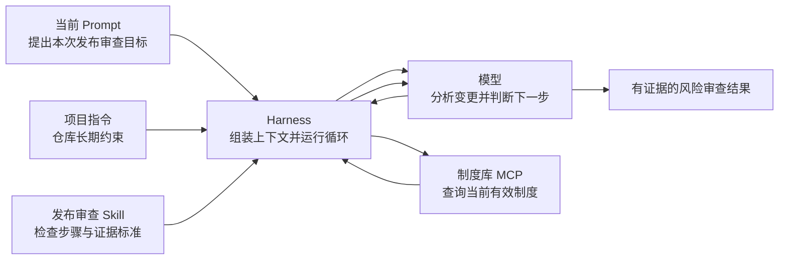

这也体现了本教程区别于“照着配置跑通即可”的核心思路：

- 不把模型、Agent 和 Harness 混成一个黑盒，而是追踪谁发现、谁选择、谁执行、谁授权；
- 不把 Skill 当成长 Prompt，而是把它视为可发现、按需加载的过程知识；
- 不把 MCP 当作万能知识层，而是把它视为受 Host 管理的能力交换边界；
- 不追求不同 Harness 的配置文件原样相同，而是追求相同任务中的行为和安全边界等价。

## 本章小结

你现在只需要记住五句话：

1. **模型负责理解和推理，Harness 负责把模型变成能持续工作的 Agent。**
2. **Skill 主要封装“这类任务怎样做”，并通过渐进披露控制上下文成本。**
3. **MCP 主要标准化“外部能力怎样被发现和调用”，具体数据通常在调用后才进入上下文。**
4. **Prompt、项目指令、Skill、MCP 与 Plugin 处在不同职责层，可以组合，不必争夺唯一答案。**
5. **能力被发现、进入候选、被模型选择和获准执行是四个不同状态。**

如果还不清楚模型为什么能按上下文生成 Tool Call、又为什么会流畅地犯错，先读[LLM 能力底座](02-model-capabilities.md)。接下来可以沿基础层继续学习：[Function Calling 与 Tool Use](04-function-calling.md)解释模型怎样提出动作，[Agent Loop、Workflow 与 Planning](05-agent-loop-workflows.md)解释 Harness 怎样控制执行，[Context Engineering、RAG 与 Memory](06-context-rag-memory.md)解释每一步怎样准备信息，[Multi-Agent 与 A2A](07-multi-agent-a2a.md)解释跨 Agent 委派，[能力发现与路由](08-capability-discovery-routing.md)解释这些能力怎样进入最小候选集，[人机协作与可控交互](09-human-agent-interaction.md)解释用户怎样理解、纠正和控制整个过程。

完成基础层后再进入[高质量 Skills 制作](10-skills.md)或[高质量 MCP 制作](11-mcp.md)，会更容易理解为什么 Skill 负责方法、MCP 负责连接，而 Function Calling 与 Harness 负责把一次动作真正串起来。

