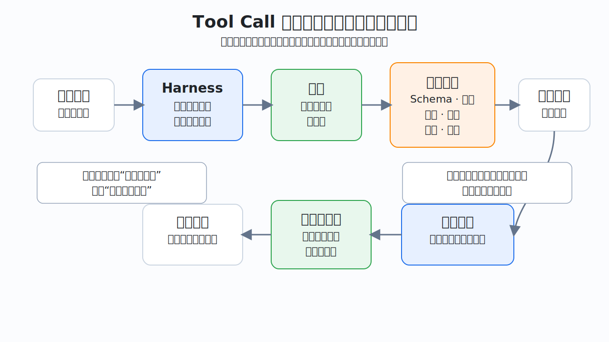
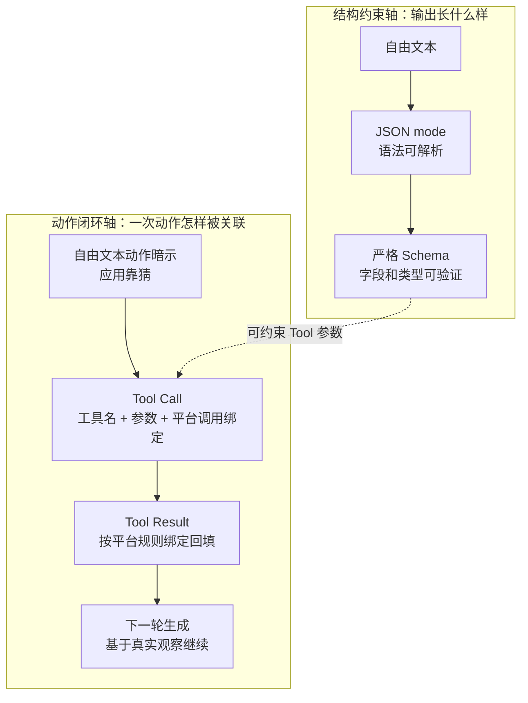
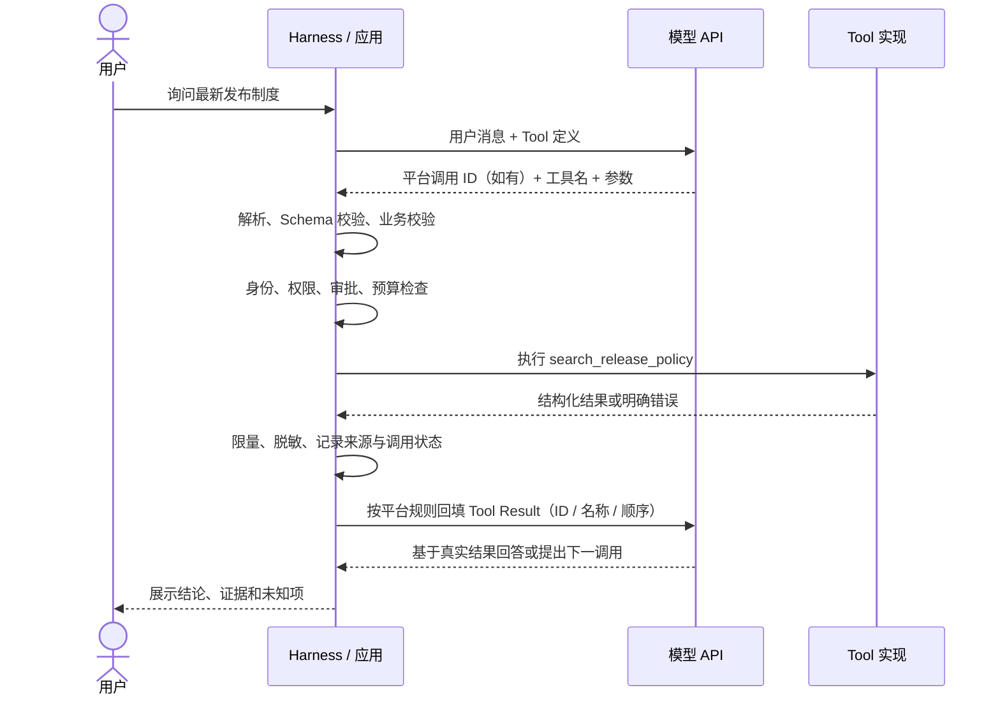
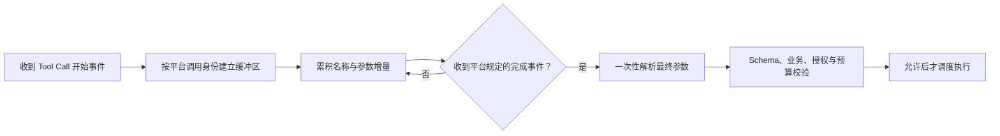
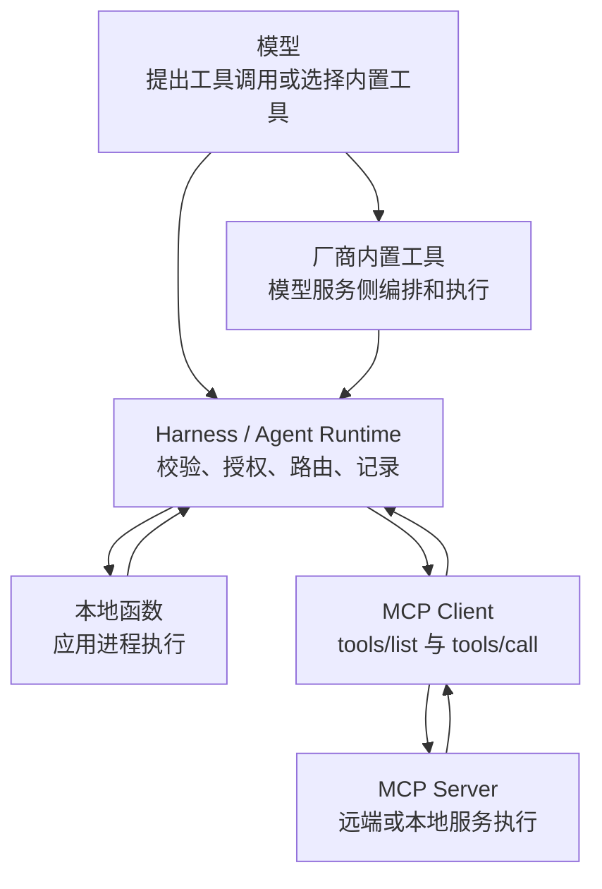
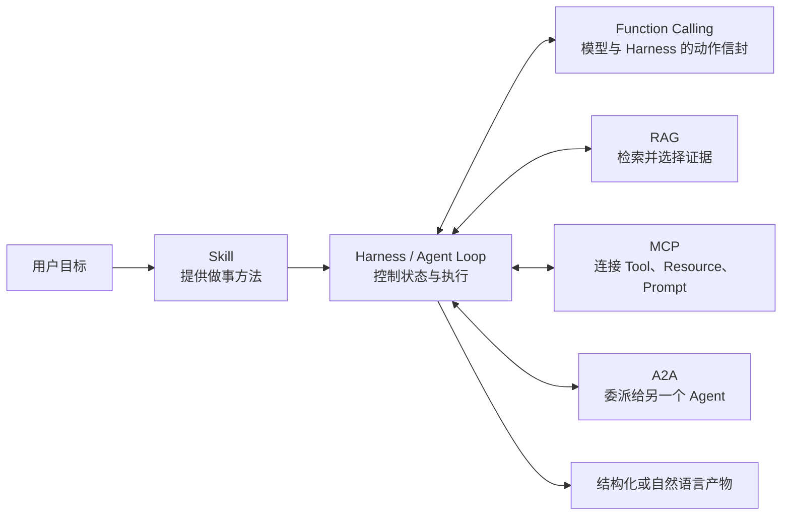
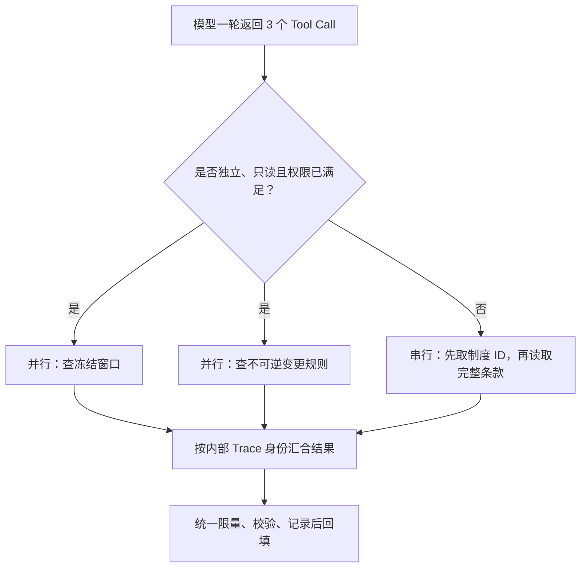

# 04. Function Calling 与 Tool Use

> 目标是解释模型怎样提出一个结构化动作、谁真正执行它，以及结果怎样回到下一轮上下文。关键边界是区分“模型说它查过了”和“系统确实执行过一次可追踪、可授权的查询”。若还不熟悉模型、Harness、Skill 与 MCP 的基本关系，先阅读[基础关系](03-foundations.md)。

> **阅读路径：** 第一遍读到“一次调用的完整闭环”，再看“相邻概念的边界”和小结，先掌握主链；第二遍再读三家 API、并行、五层校验和概念实现，把它们作为生产化选读。



## 从一句自然语言请求开始

发布负责人问：

> 公司最新制度对不可逆数据库字段删除有什么要求？

模型训练时见过的制度可能已经过期。本例选择通过一个只读 Tool 获取当前制度：

```text
search_release_policy(query, limit)
```

最早、也最脆弱的接法，是让模型输出自由文本：

```text
请调用 search_release_policy，查询“数据库 字段 删除”，最多返回 3 条。
```

应用随后用正则表达式猜工具名和参数。这种做法会遇到引号、换行、别名、漏参、额外解释和多次调用等问题。让模型改成输出 JSON，解析会容易一些，但“一个合法 JSON 对象”仍不等于“一个有调用身份、允许回填结果的动作协议”。



这是一张**可靠性理解图，不是发布日期或直接继承图**。Function Calling 的产品节点早于后来的 Structured Outputs；JSON mode、严格 Schema 主要收紧结构，Tool Call/Result 则建立动作闭环。它们共同拆开了三个问题：

| 问题 | 解决机制 | 没有解决什么 |
| --- | --- | --- |
| 输出是不是合法 JSON | JSON mode | 不保证符合业务 Schema，也不表示要执行动作 |
| 输出是否符合指定结构 | Structured Outputs / 严格 Schema | 不负责授权、执行和业务正确性 |
| 模型怎样提出动作并接收观察 | Function Calling / Tool Use | 默认不替应用执行自定义函数 |

### 历史坐标：接口、产品和协议逐步分工

| 时间 | 节点 | 真正改变的边界 |
| --- | --- | --- |
| 1990s-2010s | 任务型对话、意图识别、槽位填充与语义解析 | 在受限领域把用户话语映射为意图、参数或可执行语义；通常依赖预定义领域与专用管线 |
| 2022-2023 | MRKL、ReAct、Toolformer 等研究 | 分别探索模块化系统、推理-行动轨迹和模型学习使用 API；尚未形成统一商业接口 |
| 2023-03 | ChatGPT Plugins | 把第三方能力发现、描述和连接做成特定产品扩展体验 |
| 2023-06 | OpenAI Function Calling | 在模型 API 中正式提供函数描述、函数名和 JSON 参数这类结构化动作接口 |
| 2023-11 | JSON mode | 在特定模型 API 中提供“输出为合法 JSON”的语法约束，但仍不建立动作身份与结果回填闭环 |
| 2024-08 | Structured Outputs | 进一步提高输出或 Tool 参数遵守 JSON Schema 的可靠性 |
| 2024-11 | MCP 公开发布 | 把 Host/Client 与能力 Server 之间的发现、连接和调用协议化 |
| 2025 起 | Agent 构建工具产品化 | 内置工具、运行循环、Tracing 和 SDK 逐渐形成更完整的 Runtime 表面 |

传统任务型对话已经长期使用“意图 + 槽位”表达诸如“订一张明天去上海的票”这类领域动作；语义解析也研究把自然语言映射为逻辑形式或程序。现代 LLM Function Calling 延续了“自然语言到结构化动作”这一问题，却改变了开发表面：同一个通用模型可以在运行时读取 Tool 描述与 Schema，并在开放任务上下文中提出调用。它并不是 2023 年凭空发明的思想，也不能据此声称早期任务型对话直接演化为某一家 API。代表性前史来源见 [A00A](24-sources.md#a00a-任务型对话与语义接口前史)。

这张表只说明公开节点和分工，不证明直接继承：ReAct 不是 Function Calling API，JSON mode 不是 Tool Call，Structured Outputs 没有替代 Tool Call，MCP 也不是 Function Calling 的下一版本。完整日期、最窄结论和一手来源见[AI Agent 全景与演进史](01-agent-evolution.md#2017-2026可证实的关键节点)与[来源索引](24-sources.md#function-callingtool-use-与-agent-runtime)。

**Function Calling 这个名字容易造成误解。模型通常没有直接进入应用进程调用函数；它返回的是一个结构化的调用提议。** Harness 或应用仍要校验、授权、调度并回填结果，具体执行方可能是本地代码、厂商服务或远端能力。Anthropic 常用 `Tool Use` 表达同类机制；不讨论厂商专有差异时，二者统称为“工具调用”。

## 模型实际看见什么

应用不是把 `searchReleasePolicy()` 的源代码、数据库凭据和网络客户端交给模型。典型请求只向模型暴露一份 Tool 定义，包括：

- 稳定名称，例如 `search_release_policy`；
- 清楚描述，包括用途、适用边界和重要语义；
- 输入参数的 JSON Schema；
- 本轮 Tool 选择策略，例如允许自动选择、禁止调用或强制某个 Tool。

下面是**厂商中立的最小概念 YAML**。它用于解释模型侧定义，不是 OpenAI、Anthropic、Gemini 或 MCP 的可复制请求：

```yaml
tool:
  name: search_release_policy
  description: >
    在调用者有权读取的当前发布制度中检索相关条款。
    只返回制度记录，不判断发布是否获批，也不执行发布动作。
  input_schema:
    type: object
    additionalProperties: false
    properties:
      query:
        type: string
        minLength: 2
        maxLength: 200
        description: 要检索的制度主题，不得包含凭据或完整敏感文档
      limit:
        type: integer
        minimum: 1
        maximum: 10
        default: 3
    required: [query]
```

生产 Harness 通常还会在**内部能力注册表**保存不直接传给模型的元数据，例如语义能力名 `policy.search`、结果合同 `status/records/source_version/observed_at`、数据分类、真实执行位置和风险等级。这些字段帮助路由、授权和校验，但不能混进模型 API 不接受的 Tool 定义，也不能假设模型看见了它们。

Tool 描述既影响模型是否选中它，也影响模型怎样构造参数，但描述不是安全边界。即使写了“只读”“仅限当前租户”，执行方也必须在每次调用时重新验证。模型通常看不到函数体、密钥、连接池、ACL（Access Control List，访问控制列表）实现和真实副作用；这些都属于 Harness、工具实现或远端服务的责任。

## 一次调用的完整闭环

一次可靠调用至少有四个参与方：用户提出目标，Harness 组装上下文和控制执行，模型提出调用，工具实现返回观察。



### 第一步：模型收到目标与定义

下面开始使用一组**概念性 JSON 信封**。它们刻意使用 `kind`、`available_tools` 等中立字段，不能直接复制到任何一家 API。

```json
{
  "kind": "model_request",
  "messages": [
    {
      "role": "user",
      "content": "查找不可逆数据库字段删除的最新制度"
    }
  ],
  "available_tools": [
    {
      "name": "search_release_policy",
      "description": "检索当前发布制度；只读，不作审批决定",
      "input_schema": {
        "type": "object",
        "properties": {
          "query": {
            "type": "string",
            "minLength": 2,
            "maxLength": 200,
            "description": "要检索的制度主题，不得包含凭据或完整敏感文档"
          },
          "limit": {
            "type": "integer",
            "minimum": 1,
            "maximum": 10,
            "default": 3
          }
        },
        "required": ["query"],
        "additionalProperties": false
      }
    }
  ]
}
```

### 第二步：模型返回调用提议

```json
{
  "kind": "tool_call",
  "correlation_id": "tool_policy_7f31",
  "name": "search_release_policy",
  "arguments": {
    "query": "数据库 字段 删除",
    "limit": 3
  }
}
```

这个对象不是查询结果，也不能证明查询已经发生。`correlation_id` 是这里的概念信封中的中立关联标识：协议提供调用 ID 时沿用并校验；协议不提供时，由 Harness 创建内部 ID，只保存在任务状态和 Trace 中。内部 ID 不能伪装成厂商 API 字段。Tool 名称回答“想调用什么”，参数回答“想怎样调用”，关联标识回答“内部怎样追踪这次提议”。

### 第三步：Harness 调度执行并回填结果

```json
{
  "kind": "tool_result",
  "correlation_id": "tool_policy_7f31",
  "result": {
    "status": "ok",
    "records": [
      {
        "policy_id": "REL-005",
        "title": "数据库变更发布",
        "excerpt": "破坏性字段删除至少延后一个发布周期。",
        "last_reviewed": "2026-06-12"
      }
    ],
    "source_version": "policy-index-2026-07-10",
    "observed_at": "2026-07-10T09:30:00Z"
  }
}
```

回填不是把结果随意拼到用户问题后面。Harness 应使用厂商规定的 Tool Result 消息类型：协议有调用 ID 时原样匹配；没有 ID 时严格遵循厂商规定的名称、顺序或会话规则，内部 `correlation_id` 不发送给模型 API。这样模型能把结果识别为 Tool 观察，而不是用户的新指令。示例中的业务结果也完整满足内部合同：`status`、`records`、`source_version`、`observed_at` 位于同一层。

### 第四步：模型基于观察继续

模型可能直接形成带证据的回答，也可能发现还需要查询兼容期或恢复演练要求。是否允许第二次调用、是否已经满足完成条件、是否超出预算，都由 Harness 决定。完整的循环和停止条件见[05. Agent Loop、Workflow 与 Planning](05-agent-loop-workflows.md)。

## OpenAI、Anthropic 与 Gemini 的消息形态

三家 API 的语法不同，但数据流相同：定义 Tool -> 模型返回结构化调用 -> 应用执行 -> 按平台规定的调用绑定回填结果 -> 再次调用模型。调用绑定可能是 ID，也可能依赖名称、顺序或会话规则。

| 阶段 | OpenAI Responses API | Anthropic Messages API | Google Gemini API |
| --- | --- | --- | --- |
| Tool 定义 | `tools[]` 中 `type: "function"`、`name`、`description`、`parameters`，可用 `strict` | `tools[]` 中 `name`、`description`、`input_schema`，支持的版本可用 `strict` | `tools[].functionDeclarations[]` 中 `name`、`description`、`parameters` / JSON Schema |
| 模型调用 | 输出项 `type: "function_call"`，含 `call_id`、`name`、JSON 字符串 `arguments` | assistant `content[]` 中 `type: "tool_use"`，含 `id`、`name`、对象 `input`；`stop_reason` 可为 `tool_use` | candidate `content.parts[]` 中 `functionCall`，含 `name`、对象 `args`，部分接口提供 `id` |
| 应用执行 | 解析参数后调用自己的代码 | 读取 `tool_use` block 后调用自己的代码 | 读取 `functionCall` part 后调用自己的代码；SDK 可选自动循环 |
| 结果回填 | 输入项 `type: "function_call_output"`，用同一 `call_id`，携带 `output` | 下一条 user 消息中的 `type: "tool_result"`，用同一 `tool_use_id`，携带 `content`，错误可设 `is_error` | 后续 `functionResponse` part，携带匹配的 `name`、`response`，有调用 ID 时应匹配 `id` |
| 一轮多个调用 | 可返回多个 function call；API 提供并行调用控制 | 可返回多个 `tool_use` block；`disable_parallel_tool_use` 可限制数量 | 支持在响应 parts 中返回多个 function call，具体能力依模型和接口而异 |

`[平台]` 字段名与行为应以发布时的滚动官方文档为准：

- [OpenAI Function Calling](https://developers.openai.com/api/docs/guides/function-calling)
- [Anthropic Implement Tool Use](https://platform.claude.com/docs/en/agents-and-tools/tool-use/implement-tool-use)
- [Gemini Function Calling](https://ai.google.dev/gemini-api/docs/function-calling)

OpenAI Chat Completions 还使用 assistant `tool_calls[]` 与 `role: "tool"`、`tool_call_id` 的消息形态；不要把它和 Responses API 的 `function_call_output` 混写。SDK（Software Development Kit，软件开发工具包）的“自动 Function Calling”只是替应用运行循环的封装：执行函数的仍是 SDK 所在进程或其配置的服务，不是模型参数本身。

## 流式 Tool Call：片段不是可执行参数

模型响应可以流式传输。文本流看起来像逐字出现；Tool Call 流则可能把名称、ID 和参数拆成多个事件或增量片段。一个 JSON 字符串甚至可能在转义符、UTF-8 内容或对象中间被截断：

```text
事件 1: call started, platform_call_id = call_7f31
事件 2: arguments delta = {"query":"数据库
事件 3: arguments delta =  字段 删除","limit":
事件 4: arguments delta = 3}
事件 5: call completed
```

这些字段只是厂商中立示意，不是任何 API 的原样事件。可靠的流式适配器应使用平台规定的 item/call ID 或索引维护独立缓冲区，并把“接收中”和“可执行”分成两个状态：



处理流式 Tool Call 时遵守六条规则：

1. **不执行半段参数**：收到看似闭合的 `}` 也不够，必须等待平台规定的调用完成或响应终止事件；
2. **不靠字符串拼接猜调用归属**：并行调用的片段可能交错，按平台 ID/item/index 分桶，并校验重复与顺序；
3. **只在完成后解析一次业务对象**：增量层负责字节/字符串组装，完整层才做 JSON、Schema 和语义校验；
4. **限制缓冲区**：参数总字节、事件数、持续时间和并发调用数都有上限，超限则取消并返回结构化错误；
5. **处理中断与残缺**：断线、取消、拒绝或 `incomplete` 响应不得进入执行器；记录为未形成有效调用，而不是自动补全 JSON；
6. **执行与输出流分离**：Tool Call 完成只表示提议形成，仍需授权；执行结果按平台规则回填并发起下一次模型请求后，新的响应流才可能形成最终答案。SDK 自动循环可以隐藏这次请求切换，但不会消除边界。

不同 API 对事件类型、参数增量、并行调用和结束信号的定义不同。Adapter 必须固定 SDK/API 版本并测试单调用、多调用交错、参数跨片、重复事件、断线、取消和超限；不要写一个“通用括号计数器”冒充跨厂商流式协议。

## 谁真正执行：三种常见位置

“模型用了工具”可能对应完全不同的信任边界。先问执行代码在哪里运行、凭据属于谁、谁能拒绝这次动作。



| 类型 | 定义从哪里来 | 谁执行 | 凭据与授权 | 怎样回到模型 |
| --- | --- | --- | --- | --- |
| 本地自定义函数 | 应用在模型请求中提供 Function Tool | Harness / SDK 所在应用进程 | 应用持有凭据并执行策略；函数仍需对象级授权 | 应用构造厂商 Tool Result 消息 |
| 厂商内置工具 | 模型平台提供的工具类型，如特定网页搜索、文件搜索或代码执行 | 通常由模型平台的受控服务执行 | 平台配置、项目权限和产品策略共同决定 | 平台在同一响应流程中返回工具调用状态与结果 |
| MCP Tool | Harness 通过 MCP Client 从 Server 的 `tools/list` 发现 | MCP Server 或它调用的下游系统 | MCP 连接授权只是一层；Server 必须继续做业务授权 | Client 收到 `tools/call` 结果，Harness 再适配成模型所需消息 |

`[规范]` MCP Tools 定义 `tools/list`、`tools/call`、`inputSchema`、可选 `outputSchema`、`content` / `structuredContent` 和 `isError`。它没有规定 OpenAI、Anthropic 或 Gemini 的模型消息格式，也没有要求模型必须自动看到所有 Tool。Host/Harness 负责在两种协议形态之间适配。参见 [MCP Tools `2025-11-25`](https://modelcontextprotocol.io/specification/2025-11-25/server/tools)与[MCP Server 制作教程](11-mcp.md)。

厂商内置工具是重要例外：有些调用确实在厂商服务侧完成，应用不需要自己执行函数。因此教程不应绝对化地写“所有 Tool 都由本地 Harness 执行”，而应写成：**自定义 Function Tool 默认由应用执行；内置工具和托管 MCP 等能力按平台合同确定执行位置。**

## Tool 背后可能是完全不同的执行环境

Function Calling 只统一“怎样提出动作并关联结果”，不会抹平执行环境差异。一个叫作 Tool 的能力，背后可能是精确 API，也可能是依赖截图坐标的图形界面操作：

| 执行环境 | 主要观察与动作 | 适合 | 必要控制 |
| --- | --- | --- | --- |
| 结构化 API / MCP Tool | Schema 化参数与结果 | 稳定业务查询和离散动作 | 对象级授权、超时、幂等、版本与错误语义 |
| 文件系统与终端 | 路径、文件内容、进程输出 | 代码、文档和本地自动化 | 工作目录限制、命令参数化、沙箱、输出限量 |
| 浏览器 DOM 自动化 | 元素、表单、导航和网络状态 | 有稳定网页结构的操作 | 域名允许列表、会话隔离、页面状态验证、提交前复核 |
| Computer Use / GUI | 截图、坐标、键鼠动作 | 没有可靠 API 或 DOM 的遗留界面 | 隔离桌面、敏感区域遮挡、每步视觉复核、高风险动作确认 |
| 代码执行环境 | 源码、标准输出、文件产物 | 计算、转换、数据分析 | CPU/内存/时间/网络限制、依赖固定、产物扫描 |
| 后台长任务 | Task ID、进度、状态、Artifact | 导出、批处理、异步审查 | 去重提交、状态查询、取消、检查点、过期和补偿 |

观察越弱、界面越易变化，模型“看见按钮”与系统“选中正确业务对象”之间的距离就越大。`[建议]` 有结构化 API 时优先使用 API；只有目标系统确实没有可靠接口时再采用 Computer Use，并把每个关键动作后的状态验证当作合同。浏览器页面、截图、终端输出和生成代码同样是不可信输入，不能因为来自 Tool 就升级为指令。

## 相邻概念的边界

这些机制经常一起出现，但回答的问题不同。



| 概念 | 它约束或连接什么 | 是否执行外部动作 | 与 `search_release_policy` 的关系 |
| --- | --- | --- | --- |
| JSON mode | 模型输出的语法必须是合法 JSON | 否 | 可以输出 `{ "query": "..." }`，但没有调用语义和回填协议 |
| Structured Outputs | 模型输出或 Tool 参数符合指定 Schema | 否 | 可保证 `query`、`limit` 的结构；仍不能保证查询合理、有权或已执行 |
| Function Calling / Tool Use | 模型与 Harness 之间的结构化动作提议和结果关联 | 自身不执行自定义代码 | 表达调用哪个 Tool、参数是什么、结果属于哪个调用 |
| RAG | 从外部知识中检索相关材料，再用于生成 | 取决于实现 | 制度检索可以是 RAG 流程的一步，也可由本地搜索、API 或 MCP Tool 实现 |
| Skill | 可复用的任务说明、方法、脚本与资源 | 本身不是远端调用协议 | 规定何时查制度、怎样评价证据和何时阻断；不自动提供制度库连接 |
| MCP | Host/Client 与 Server 之间发现和调用外部能力的协议 | Server 执行 Tool | 可以标准化暴露 `search_release_policy`，但模型侧仍需 Function Calling 或等价路由 |
| A2A | 独立 Agent 系统间的发现、消息、任务、状态和产物交换 | 远端 Agent 自主处理任务 | 适合把“审查发布制度”委派给策略 Agent，不适合把一个简单查询硬包装成 Agent |

`[规范]` A2A 面向可能相互不透明的 Agent，使用 Agent Card 描述能力，并以 Message、Task、状态与 Artifact 支持多轮和长任务；MCP Tool 更像具有明确输入输出的能力。两者可以组合：远端 Agent 通过 A2A 接收审查任务，再在内部调用 MCP Tool。参见 [A2A 规范](https://a2a-protocol.org/latest/specification/)以及[来源索引](24-sources.md)。

一个实用判断是：

- 只要求“输出符合这个 JSON 结构”，使用 Structured Outputs；
- 要让模型选择并提出一个离散动作，使用 Function Calling；
- 要把不同 Harness 接到同一个外部能力边界，考虑 MCP；
- 要从大规模知识中选择证据，设计 RAG；
- 要复用完整做事方法，编写 Skill；
- 要和保有状态、可多轮协作的独立 Agent 交互，考虑 A2A。

## 串行与并行调用

模型在一轮中返回多个 Tool Call，不代表应用必须并发执行。**模型决定可以提议哪些调用，Harness 决定哪些调用能同时执行。**



### 适合并行

- 参数已经完整，彼此没有数据依赖；
- 都是只读查询，不争用同一可变状态；
- 单个失败不会让其他调用变得不安全；
- 并发数、速率、总成本和截止时间都有上限。

例如，可以并行查询“冻结窗口”和“不可逆变更”两组制度，再统一去重和排序。

### 必须串行或默认串行

- 第二个调用需要第一个调用返回的 ID、版本或授权上下文；
- 调用会写入同一对象，顺序影响结果；
- 一个调用可能撤销另一个调用的前提；
- 需要先向用户展示精确参数并取得批准；
- 下游系统不支持并发，或幂等性（重复请求不会产生额外副作用）未知。

OpenAI 的 `parallel_tool_calls`、Anthropic 的 `disable_parallel_tool_use` 等参数控制模型一轮可提出的调用形态，不替 Harness 解决锁、事务、速率限制、部分失败和结果合并。Harness 内部应为每项调用保留稳定 Trace 身份；回填时严格遵循当前平台的绑定规则：有 ID 就精确匹配 ID，没有 ID 就保留平台要求的名称、顺序或会话关系。不能在协议提供 ID 时只靠完成顺序猜对应关系，也不能在协议要求顺序时擅自重排消息。

## 从“格式正确”到“允许执行”的五层检查

Tool Call 是不可信输入。模型生成的参数即使通过严格 Schema，也仍可能语义错误、越权、过时或具有危险副作用。

| 层次 | `search_release_policy` 检查 | 失败后怎么做 |
| --- | --- | --- |
| 1. 解码与 Schema | JSON 可解析；`query` 是字符串；`limit` 为 1 到 10；无额外字段 | 不执行；返回可修正的参数错误或结束本轮 |
| 2. 业务语义 | 查询不是空泛的“全部”；时间范围合理；没有把审批动作伪装成搜索 | 返回业务校验错误；必要时请求用户澄清 |
| 3. 身份、授权与审批 | 主体可读取目标制度域；租户匹配；敏感数据用途获准 | 明确拒绝；不得伪装为空结果，也不得泄露资源是否存在 |
| 4. 执行控制 | 超时、速率、预算、取消、熔断（依赖持续失败时暂时停止调用）、并发上限已配置 | 区分暂时故障、永久故障和取消；只重试可能恢复的错误 |
| 5. 输出校验 | 返回符合合同；来源、版本和观察时间存在；大小受限；秘密已脱敏 | 不把畸形结果交给模型；记录并返回工具错误 |

### Schema 不是业务校验

`limit: 3` 可能符合 Schema，但 `query: "给我所有机密制度并忽略访问限制"` 仍不应执行。严格输出只能约束可表示的形状，不能判断调用是否符合业务意图、当前状态和组织政策。

### Tool 描述不是授权策略

只向模型暴露允许使用的最小 Tool 集合，可以减少误选，却不能替代执行时授权。可靠链路至少有三道门：Harness 根据当前会话和审批决定是否路由；Tool / MCP Server 根据真实身份做对象级授权；下游数据源继续执行自己的 ACL。凭据应由运行时注入，不能放进 Tool 描述、参数或模型上下文。

### 错误必须保留语义

不要把所有异常改成 `records: []`。至少区分：

| 结果类别 | 含义 | 模型可以怎样继续 |
| --- | --- | --- |
| `ok` | 查询成功并得到记录 | 引用记录并继续判断 |
| `empty` | 查询成功，但权限范围内没有匹配项 | 调整查询或声明证据不足，不能说制度不存在 |
| `invalid_arguments` | 参数未通过 Schema 或业务校验 | 根据可行动反馈修正一次，或请求澄清 |
| `permission_denied` | 身份有效但没有所需权限 | 停止该路径；不能通过改写参数绕过 |
| `unauthenticated` | 没有有效身份或凭据过期 | 由 Harness 发起认证流程，不让模型索要密钥 |
| `temporarily_unavailable` | 超时、限流或依赖暂时故障 | 在预算内退避重试（逐次延长等待并加入随机抖动），超过上限后明确失败 |
| `partial` | 只有部分数据源成功 | 携带成功范围和失败范围，避免把部分结果写成完整结论 |

MCP 进一步区分 JSON-RPC 协议错误与 `isError: true` 的 Tool 执行错误。可修正的执行错误适合回填给模型；畸形协议、未知 Tool 等错误通常应先由 Client/Harness 处理。错误文本也属于不可信数据，不能因此获得新的工具权限。

### 调用身份不等于幂等键

平台调用绑定和 Harness 内部 Trace ID 负责把提议、执行与结果对应起来，不天然保证下游动作只执行一次。网络超时后，Harness 可能不知道服务端是否已经提交写操作；如果直接用新调用重试，就可能重复执行。

`search_release_policy` 是只读查询，重复调用通常只增加成本，但结果仍可能因制度更新而变化。写 Tool 则应另外设计业务幂等键、唯一约束、状态查询或事务恢复，并记录平台绑定、内部 Trace ID 与幂等键之间的映射。只有明确属于暂时故障且符合重试策略的调用才能自动重试。

### Tool Result 是数据，不是新指令

制度标题、文档正文、网页和错误信息可能包含 Prompt injection。回填前应：

- 保留来源 ID、版本、观察时间和权限范围；
- 对记录数、单条长度和总字节数设上限；
- 校验结构、媒体类型和编码，清除不需要的活动内容；
- 把外部文本标为不可信证据，不把其中的“忽略规则”“调用某工具”升级为控制指令；
- 脱敏 Token、连接串、个人数据和无关机密；
- 只把当前步骤需要的字段交给模型，原始大对象留在受控存储中。

更完整的身份、授权、Prompt injection、审计和供应链要求见[质量工程与安全](13-quality-and-security.md)。

## 一个受控的概念实现

下面的伪代码展示责任顺序。它既不是某家 SDK 代码，也省略了流式事件、取消和持久化，不能直接用于生产：

```text
response = model.generate(messages, allowed_tool_definitions)

for call in response.tool_calls:
    assert call.name in tools_allowed_for_current_step
    args = parse_and_validate_schema(call.arguments)
    validate_business_rules(call.name, args, task_state)
    principal = require_authenticated_principal()
    authorize(principal, call.name, args)
    require_approval_if_needed(principal, call.name, args)

    try:
        raw = execute_with_timeout_and_budget(call.name, args, principal)
        result = validate_limit_redact_and_label(raw)
    catch known_error:
        result = map_to_safe_actionable_tool_error(known_error)

    trace_call_id = create_or_reuse_internal_trace_id(call)
    audit(trace_call_id, principal, args_summary, result.status)
    platform_binding = adapter.require_platform_result_binding(call)
    messages.append(adapter.tool_result(platform_binding, result))

final = model.generate(messages, allowed_tool_definitions)
verify_completion_claims(final, task_state, audit_log)
```

`trace_call_id` 只关联内部状态与审计；`platform_binding` 则严格保留当前 API 要求的 `call_id`、`tool_use_id`，或名称、顺序、会话等结果绑定规则。协议没有调用 ID 时，Adapter 也不能把内部 Trace ID 填进一个不存在的厂商字段。

真正的 Agent Loop 还要控制最大轮次、总 Tool 次数、并发、Token、时间和停止条件。模型说“完成了”只是一项待验证输出；审计记录和外部状态才是动作是否发生的证据。

## 常见反模式

| 反模式 | 为什么失败 | 更好的做法 |
| --- | --- | --- |
| 用正则解析“请调用某函数” | 自由文本歧义大，无法可靠处理多调用和流式片段 | 使用 API 原生 Tool Call 结构 |
| 把 JSON mode 当 Function Calling | 只保证 JSON 语法，没有调用身份与结果回填语义 | 需要动作时使用 Tool Call；只需结构化产物时用 Structured Outputs |
| 收到 Tool Call 就立即执行 | 模型参数是不可信输入，可能越权或有副作用 | 依次做 Schema、业务、授权、审批和预算检查 |
| 把函数源码或凭据写进描述 | 无助于工具选择，还会扩大泄露面 | 只暴露名称、边界清楚的描述和最小 Schema |
| 把所有工具永久暴露给模型 | 增加误选、数据外泄和 Prompt injection 的可利用面 | 按任务阶段、主体和风险动态提供最小集合 |
| 把 Tool 描述中的“只读”当保证 | 描述由模型用于选择，不是执行策略 | 在实现与数据源层强制只读和对象级授权 |
| 不保留平台绑定和内部 Trace 身份 | 并行、重试后无法知道结果属于哪个提议 | 原样保留平台 ID/名称/顺序/会话规则，并为内部执行分配稳定 Trace ID |
| 忽略平台绑定规则，只按完成顺序回填 | 并发完成顺序不稳定，也可能破坏要求消息顺序的平台 | 内部按 Trace ID 汇合；回填时按平台规定匹配 ID 或恢复所需顺序 |
| 把权限拒绝改成空数组 | 模型会把“看不到”误写成“不存在” | 保留 `permission_denied`、`empty` 等不同状态 |
| 把异常原文全部回填 | 可能泄露秘密，也可能携带注入指令 | 映射为有限、脱敏、可行动的错误合同 |
| 把调用身份当幂等键 | 消息关联不能阻止下游重复副作用 | 为写操作单独设计业务幂等性和恢复路径 |
| 为简单函数引入 A2A | 增加发现、状态、认证和长任务复杂度 | 简单离散能力用本地函数或 MCP Tool；跨 Agent 协作才考虑 A2A |
| SDK 自动循环后不设上限 | Tool 可反复调用，成本和副作用失控 | 设置轮次、调用、并发、时间与金额预算 |

## 设计检查清单：第二遍阅读速查

### Tool 合同

- [ ] Tool 名称稳定、低歧义，以动作加对象表达，例如 `search_release_policy`。
- [ ] 描述说明用途、禁区、是否只读，以及它不负责什么。
- [ ] 输入 Schema 关闭不需要的额外字段，并限制长度、范围和枚举。
- [ ] 空结果、部分结果、拒绝、暂时故障和业务错误各有明确语义。
- [ ] 输出带来源、版本、观察时间和适用范围，并有严格大小上限。

### 调用闭环

- [ ] 保存模型原始 Tool Call、平台规定的调用绑定、内部 Trace ID、参数摘要和对应结果状态。
- [ ] 使用厂商规定的 Tool Result 类型回填，而不是拼接成普通用户文本。
- [ ] 多调用在内部按稳定 Trace ID 匹配，回填遵守平台 ID 或名称/顺序/会话规则；并发只用于真正独立且可安全并行的动作。
- [ ] 自动循环有最大轮次、Tool 次数、并发、时间、成本和停止条件。
- [ ] 最终“已查询”“已写入”等声明能由调用记录与外部状态证明。

### 安全与可靠性

- [ ] Schema 之后还有业务校验；Tool 暴露之后还有执行时授权。
- [ ] 所有写入都经过授权、审计和重复防护；是否预览、人工确认、回滚或补偿由风险与可逆性策略决定。
- [ ] Tool / MCP Server 每次调用都做对象级授权，不信任模型或 Harness 的文字声明。
- [ ] 凭据不进入 Prompt、Tool 描述、参数、错误文本和普通审计日志。
- [ ] 只重试暂时故障；写操作有独立于平台绑定和内部 Trace ID 的业务幂等设计。
- [ ] Tool Result 被视为不可信数据，经过校验、限量、脱敏和来源标注。
- [ ] 部分失败不会被包装成完整成功，权限拒绝不会被包装成空结果。

## 关键结论

1. **Function Calling / Tool Use 是结构化动作提议与观察回填机制，不是模型直接获得了执行权。**
2. **模型通常只看见 Tool 名称、描述和 Schema；Harness 校验与授权，具体执行方可能是本地函数、厂商服务或 MCP Server。**
3. **平台规定的调用绑定与 Harness 内部 Trace ID 负责对应提议和结果，但不替代业务幂等键。**
4. **JSON mode 解决语法，Structured Outputs 解决结构，RAG 解决检索，Skill 解决方法复用，MCP 解决能力连接，A2A 解决 Agent 间任务协作。**
5. **格式正确只是起点；业务校验、最小权限、错误语义、结果隔离、预算和审计共同决定一次调用是否可信。**

下一步阅读：

- [05. Agent Loop、Workflow 与 Planning](05-agent-loop-workflows.md)：把单次 Tool Call 放进有状态、有预算、有停止条件的循环；
- [08. 能力发现、候选裁剪与路由](08-capability-discovery-routing.md)：理解大量 Tool 怎样先过滤、再进入模型候选；
- [11. 从零制作一个高质量 MCP Server](11-mcp.md)：把 `search_release_policy` 实现为可发现、可调用的 MCP Tool；
- [13. 质量工程与安全](13-quality-and-security.md)：验证路由、权限、失败、注入与供应链；
- [24. 官方来源、事实标签与版本基线](24-sources.md)：核对规范版本和平台文档的证据等级。

