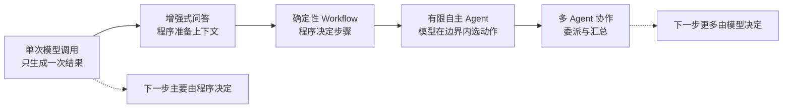
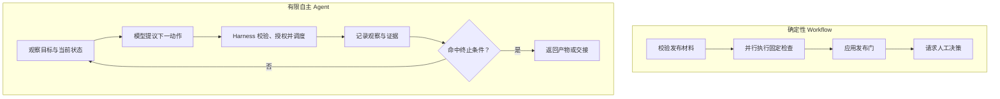
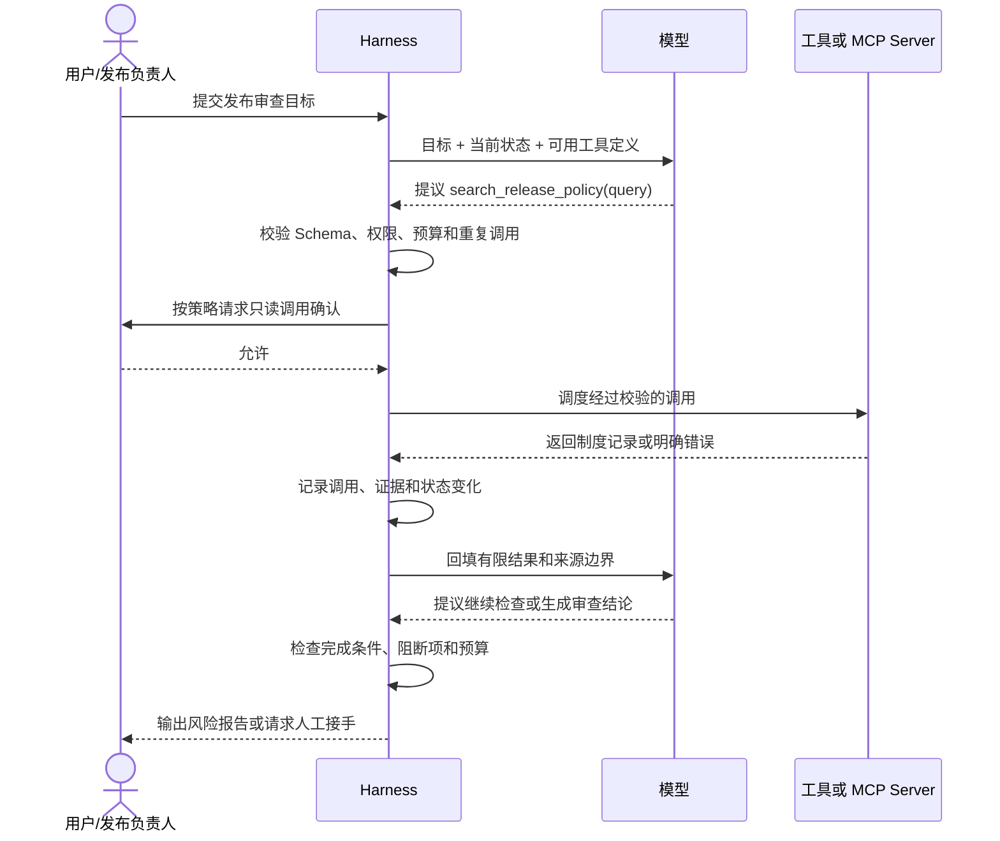
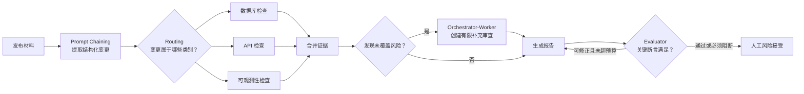
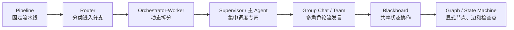
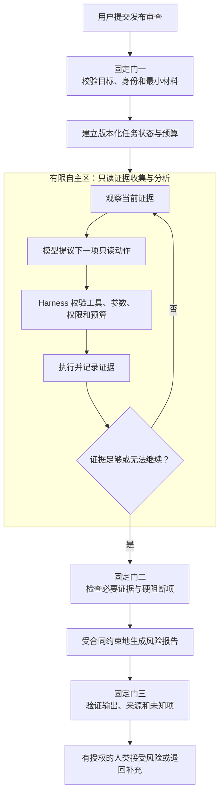

# 05. Agent Loop、Workflow 与 Planning

> 在[基础关系](03-foundations.md)中，我们把 Agent 简化为“模型 + Harness 提供的上下文、工具和执行循环”。本章继续拆开这个“执行循环”：谁决定下一步，模型提出的动作怎样真正发生，一次任务又该在什么时候停止。若还不熟悉工具定义、参数 Schema 和工具结果回填，建议先阅读[04. Function Calling 与 Tool Use](04-function-calling.md)。

## 从“帮我审查发布”开始

仍然使用贯穿教程的任务：

> 审查今晚的生产发布，核实最新制度，列出风险，并判断现有证据是否足以放行。不要执行部署。

这个任务至少包含以下步骤：

1. 明确版本、环境、变更范围和证据截止时间；
2. 阅读代码变更、工单、迁移方案和回滚材料；
3. 识别数据库、接口、配置、监控等风险；
4. 查询与风险相关的现行制度；
5. 处理缺失、冲突、过期或不可访问的证据；
6. 汇总风险，应用发布门，交给有授权的人作最终决定。

问题是：这些步骤应该全部写死在程序里，还是让模型自己决定？

答案通常不是二选一。生产系统更常见的做法是：**程序固定高风险边界和阶段，模型只在边界内处理需要理解、选择和综合的部分。** 要理解这个选择，先看自主性并不是一个开关，而是一条光谱。

## 自主性是一条光谱，不是等级勋章

| 形态 | 谁决定下一步 | 是否循环 | 发布审查中的例子 | 主要风险 |
| --- | --- | --- | --- | --- |
| 单次模型调用 | 调用方 | 否 | 根据一份已准备好的材料写摘要 | 遗漏信息后无法主动补充 |
| 增强式问答 | 程序先准备材料，模型回答 | 通常否 | 程序固定检索三份制度，再让模型比较 | 检索策略不适合所有变更 |
| 确定性 Workflow | 代码、配置或状态机 | 可以，但路径预先定义 | 固定执行“校验输入 -> 三类检查 -> 汇总 -> 人工审批” | 新情况不在预设分支中 |
| 有限自主 Agent | 模型在允许动作和预算内选择 | 是 | 模型根据已发现风险决定继续读哪个文件、查哪条制度 | 循环、误选工具、越界和成本失控 |
| 多 Agent 协作 | 编排器和多个 Agent 共同决定 | 通常是 | 数据库、接口和可观测性审查分别委派，再由监督者汇总 | 协调成本、状态冲突和错误相互放大 |

自主性越高，系统可以应对的开放情况越多，可能的失败路径也越多。**更自主不等于更先进，更不等于质量更高。** 如果步骤稳定、规则明确且错误代价高，确定性 Workflow 往往更合适；只有当下一步确实依赖对当前材料的语义判断时，才值得把这部分控制权交给模型。

## Workflow 与 Agent 到底差在哪里

本教程采用下面两个工程定义：

- **Workflow（工作流）**：主要执行路径由代码、配置、规则或状态机预先规定；模型可以参与某些步骤，但通常不能任意改变整个流程。
- **Agent（智能体）**：模型会根据当前目标、状态和观察，在受限动作集合中选择下一步；Harness 校验、授权并调度动作，具体执行方产生结果，再由 Harness 把结果交回模型，直到命中终止条件。

判断边界时，关键不是“有没有使用大模型”，也不是“有没有调用工具”，而是：

> **运行过程中，下一步的控制权主要在预先编写的程序中，还是会根据观察动态交给模型？**

| 常见系统 | 是否必然是 Agent | 原因 |
| --- | --- | --- |
| 用模型把工单分类后进入固定队列 | 否 | 模型只是 Workflow 中的一个分类步骤 |
| 程序固定调用搜索接口，再让模型写摘要 | 否 | 工具和顺序都由程序预定 |
| 模型可以在代码搜索、制度查询和停止之间选择 | 是，更接近有限自主 Agent | 模型依据观察动态选择下一动作 |
| 使用 Function Calling | 否 | Function Calling 只是表达动作提议的接口 |
| 使用 MCP | 否 | MCP 只标准化外部能力的发现和调用 |
| 循环调用模型直到它输出“完成” | 形式上像 Agent，但设计不合格 | 没有可信停止条件、预算和外部控制 |

“Agentic Workflow”在业界常被用来泛指两者的混合。为了避免争论名词，本教程会明确写出：哪些阶段是固定 Workflow，哪些步骤允许模型动态选择，谁拥有最终执行权。

## Agent Loop 不是模型自己执行动作

一次受控 Agent Loop 可以分成七步：

1. **观察**：Harness 组装当前目标、状态、证据和可用动作；
2. **判断**：模型基于当前上下文判断下一步；
3. **提议**：模型返回回答，或提出带参数的工具调用；
4. **校验**：Harness 检查工具是否允许、参数是否合法、预算是否充足；
5. **授权与调度**：必要时请求用户确认，Harness 选择允许的执行方；本地运行时、Tool/MCP Server、厂商托管工具或业务系统产生真实效果；
6. **记录**：把结果、错误、证据来源和状态变化写入任务状态；
7. **继续或停止**：Harness 根据终止条件决定再次调用模型，还是结束、阻断或交给人。

这条链路中最重要的责任边界是：

> **模型不执行；Harness 负责校验、授权和调度，具体执行方产生真实效果。**

模型输出的工具名、参数、计划和“我已完成”都只是待验证数据。Harness 不能因为模型语气肯定就跳过 Schema 校验、权限策略、业务授权、预算或完成断言。Tool 或业务系统也必须再次做对象级授权，不能把 Harness 的确认当作最终业务权限。这里的“调度”可能是在本进程调用函数，也可能是把请求交给 MCP Server 或厂商托管工具；不要把控制责任与执行位置混为一谈。

## Agent 的状态不只是聊天记录

只把所有内容追加进消息历史，很快会遇到上下文膨胀、状态歧义和无法恢复的问题。一个可维护的任务状态至少应区分：

| 状态部分 | 发布审查示例 | 为什么要独立保存 |
| --- | --- | --- |
| 不可变目标 | 审查版本 `v2.8.0`，不得执行部署 | 防止后续内容悄悄改写原始目标 |
| 当前阶段 | `collecting_evidence` | 决定此刻允许哪些动作 |
| 结构化事实 | 存在删除字段迁移 | 不必每轮从长对话重新抽取 |
| 证据账本 | 文件、制度 ID、观察时间、证明范围 | 区分事实、推断、未知和来源 |
| 待办与依赖 | 等待目标库快照、恢复演练记录 | 支持暂停、恢复和人工交接 |
| 工具调用记录 | 平台或内部关联 ID、参数摘要、结果类别 | 关联提议与结果并支持追踪 |
| 审批记录 | 谁批准了哪项只读查询 | 审批范围必须可核对，不能只存“已批准” |
| 预算 | 剩余轮次、Tool 次数、时间和成本 | 防止无界循环和拒绝服务 |
| 终止状态 | 完成、阻断、失败、取消或超预算 | 让结束原因可由程序判断 |

自然语言报告适合给人阅读，结构化状态适合让系统控制执行。两者可以互相生成，但不能只依赖模型从旧对话中“回忆”当前状态。

## 五种常用 Workflow 模式

下面五种模式并不都要求 Agent Loop。前三种通常可以完全由程序控制；后两种是否具有 Agent 性，取决于模型能否动态决定子任务或修订动作。

### Prompt Chaining：固定步骤逐段处理

Prompt Chaining（提示链）把复杂任务拆成顺序固定的小步骤，前一步的结构化结果经过检查后再进入下一步。

发布审查可以固定为：提取变更 -> 分类风险 -> 核对证据 -> 生成报告。它适合阶段稳定、每一步都有明确输入输出的任务。

关键不是连续调用了几次模型，而是每一步之间是否有程序校验。若第一步没有识别出数据库迁移，后续步骤应停下或进入人工复核，而不是继续生成一份看似完整的报告。

### Routing：先判断类型，再选择固定分支

Routing（路由）先识别任务或变更类型，再把它送到专门流程。例如：

- 数据库迁移进入数据库审查；
- 公共 API 变更进入兼容性审查；
- 只改文档进入轻量审查；
- 无法可靠分类时进入通用流程或人工分诊。

路由器可以是规则，也可以是模型。即使由模型分类，只要后续分支和允许范围由程序预设，整体仍然是 Workflow。路由结果需要置信边界、兜底分支和近邻反例评测。

### Parallelization：并行处理真正独立的部分

Parallelization（并行化）适合彼此独立、没有写冲突的检查。例如数据库兼容性、API 兼容性和可观测性可以并行读取材料，最后统一汇总。

并行不适用于存在前置依赖的步骤，也不应默认用于写操作。多个分支若同时修改同一状态，必须有合并规则、版本检查或单一写入者；否则节省的时间会变成难以复现的竞态条件。

### Orchestrator-Worker：动态拆分并委派

Orchestrator-Worker（编排者-工作者）由编排者根据当前任务动态创建子任务，再交给一个或多个工作者。对于发布审查，编排者可能在看到字段删除后临时增加“恢复可行性审查”，而不是永远执行同一组检查。

这比固定并行分支更灵活，也更需要合同。每个工作者应收到：有限目标、允许的数据和工具、输出 Schema、预算、截止时间和禁止动作。编排者负责去重、处理冲突和判断缺口，不能把多个结论简单拼接。

当工作者成为具有独立状态、身份或网络边界的 Agent 时，委派还需要处理交接、权限传播和任务产物，见[07. Multi-Agent、委派与 A2A](07-multi-agent-a2a.md)。

### Evaluator-Optimizer：按标准检查并有限修订

Evaluator-Optimizer（评估者-优化者）先生成候选产物，再由评估步骤按照明确规则找缺口，最后进行有限次数修订。

例如，优化者生成发布报告，评估者按照一份明确的评分标准（Rubric）检查是否包含版本、环境、证据状态、硬阻断项和未覆盖范围。评估者不能只说“可以更详细”，而应返回可执行的缺口；修订也必须设置上限，避免两个模型反复追求没有客观终点的“更好”。

| 模式 | 控制方式 | 最适合 | 主要失败 | 必要控制 |
| --- | --- | --- | --- | --- |
| Prompt Chaining | 固定顺序 | 可分阶段、每步合同清楚 | 上游错误向后传播 | 步间 Schema 与门禁 |
| Routing | 固定候选分支 | 不同类型需要不同流程 | 误分类、无兜底 | 反例集、未知分支、人工分诊 |
| Parallelization | 固定或动态并发 | 相互独立的只读子任务 | 依赖错误、竞态、重复工作 | 依赖图、并发上限、合并策略 |
| Orchestrator-Worker | 动态分解 | 子任务无法预先穷举 | 重复委派、范围膨胀、结论冲突 | 子任务合同、预算、去重与汇总规则 |
| Evaluator-Optimizer | 生成、评估、修订 | 有明确质量标准的产物 | 无限修订、评估者自信但错误 | 明确 Rubric、最大轮次、外部断言 |

## 三种常见 Planning 模式

Workflow 描述系统怎样组织步骤；Planning（规划）描述模型怎样决定接下来做什么。三种常见模式可以单独使用，也可以嵌在同一 Workflow 的不同阶段。

### ReAct：根据最新观察逐步行动

ReAct 可以理解为 Reason + Act：模型根据当前观察选择一个动作，Harness 校验并调度，具体执行方返回新观察，再由模型决定下一步。

在发布审查中，模型先看到迁移文件，发现字段删除，再查询相应制度；制度要求兼容两个版本，于是模型继续查找兼容期证据。它适合一开始无法知道需要哪些材料的探索任务。

工程实现不应要求保存或展示模型的内部思维过程。系统真正需要记录的是：动作提议、简短的可审计理由、工具输入、观察结果、证据来源和状态变化。

### Plan-and-Execute：先列计划，再按观察修订

Plan-and-Execute 先生成任务计划，再由执行器逐项推进。它适合长任务，因为人和系统可以提前检查范围、依赖和高风险步骤。

但计划只是关于未来的假设，不是执行证据。实际观察可能让原计划失效，例如目标环境没有快照、制度已经更新，或用户拒绝某项查询。系统应标记每个计划项的状态，并在前提改变时重新规划，而不是为了“完成计划”忽略新事实。

### Reflection：按标准复核，而不是凭感觉自省

Reflection（反思）让模型或独立评估者检查当前结果，再决定是否修订。它适合发现报告遗漏、论据与结论不一致或格式不符合合同。

反思不是事实来源。同一个模型再次阅读自己的答案，仍可能重复同一种错误。高风险判断应依赖外部证据、确定性断言或有授权的人，而不是让模型不断反思直到“感觉有把握”。

| Planning 模式 | 适合的问题 | 必须保存的外部状态 | 典型风险 | 结束方式 |
| --- | --- | --- | --- | --- |
| ReAct | 下一步依赖刚取得的观察 | 动作、观察、证据与剩余预算 | 局部探索、工具循环 | 完成断言、无可行动项或预算耗尽 |
| Plan-and-Execute | 长任务、依赖和范围需要预览 | 计划项、依赖、状态、计划版本 | 计划过时、把计划当结果 | 全部必要项终结或触发重新规划/阻断 |
| Reflection | 产物有明确 Rubric | 评估结果、缺口、修订次数 | 自我确认、无限润色 | Rubric 通过、不可修复或达到轮次上限 |

## Agent 架构范式：从流水线到图状态机

把 ReAct、Plan-and-Execute、LangChain Agent、LangGraph、AutoGen Team、Supervisor 或群聊混在一起，会让读者误以为它们是同一层东西。更准确的分法是：**Workflow 模式描述步骤怎样组织，Planning 模式描述模型怎样决定下一步，Runtime 架构描述状态、边和恢复怎样落地。**

| 架构范式 | 控制权在哪里 | 适合 | 不适合 | 与 LangChain/LangGraph 的关系 |
| --- | --- | --- | --- | --- |
| Pipeline / 流水线 | 代码按固定顺序推进 | 阶段稳定、合同清楚 | 下一步高度依赖未知观察 | 可用普通链或 LangGraph 固定边实现 |
| Router / 路由 | 分类器选择预设分支 | 意图或任务类型边界清楚 | 类别重叠、无兜底 | LangChain 常见 agent/router middleware；LangGraph 可建条件边 |
| ReAct Agent | 模型根据观察选择动作 | 探索式检索、调试、资料搜集 | 高风险写操作、无停止条件 | 许多 Agent Harness 的基础循环 |
| Plan-and-Execute | 计划器先列任务，执行器逐项推进 | 长任务、需要人先看范围 | 计划前提频繁变化且无人校验 | 可拆成 planner 节点和 executor 节点 |
| Orchestrator-Worker | 编排者动态创建子任务 | 子任务数量和类型无法预先穷举 | 子任务边界模糊、合并规则缺失 | Anthropic 将其列为常用 workflow；LangGraph 可用子图或动态扇出实现 |
| Supervisor / 主 Agent | Supervisor 选择专家并合并 | 专家能力清晰、需要集中把关 | Supervisor 成为单点瓶颈 | LangGraph 多 Agent 文档常用 supervisor 模式 |
| Group Chat / Team | 多 Agent 在共享会话中轮流发言 | 需要互相质询、角色视角互补 | 容易跑题、责任不清 | AutoGen 将 Team 作为核心抽象，并提供 selector group chat、swarm 等形式 |
| Handoff / Swarm | 当前 Agent 把控制权交给下一个 | 客服升级、专业领域接力 | 交接信息不完整、责任丢失 | LangGraph/AutoGen 都把 handoff/swarm 作为多 Agent 模式之一 |
| Blackboard / 共享状态 | 多个角色读写同一任务板 | 证据、假设、待办需要持续汇总 | 写冲突和状态污染 | 需要外部状态存储、版本和权限，而不只是聊天记录 |
| Graph / State Machine | 节点、边、检查点显式建模 | 生产长任务、可恢复执行、人审和分支 | 很小的一次性任务 | LangGraph 的核心价值是把确定性流程与 Agent 步骤放进可持久化图运行时 |

LangChain 早期更常被理解为“链 + Agent + Tool”的开发框架；当前官方文档强调 `create_agent` 是可组合的 Agent Harness，并说明 LangChain Agent 构建在 LangGraph 之上，以获得持久执行、Human-in-the-loop、状态和恢复等能力。这个变化很重要：**Agent 范式不再只是 Prompt 模板，而是运行时状态管理问题。**

因此，设计公司内部 Agent 时可以按下面顺序选型：

1. 若流程可预先确定，优先用 Pipeline 或状态机；
2. 若只有入口类别不同，用 Router；
3. 若下一步取决于刚拿到的观察，用 ReAct；
4. 若任务长且需要提前对齐范围，用 Plan-and-Execute；
5. 若需要多个专业视角，先用 Supervisor-Worker 或 Orchestrator-Worker；
6. 若 Agent 属于不同系统或组织边界，再考虑 A2A；
7. 若需要生产恢复、取消、审计和人审，把流程显式建成图或状态机。

`[建议]` 不要因为框架支持“多 Agent”就默认上群聊。群聊和 Swarm 适合探索和多角色互评，但生产发布、审批、数据写入和客户影响类任务通常更需要主 Agent、显式状态、强停止条件和可审计委派。

## 运行时控制：让循环有边界

一个 Agent 能否用于真实工作，取决于 Harness 是否把以下控制变成程序行为，而不是只写进 Prompt。

### 检查点：让任务能够暂停和恢复

检查点应出现在长任务、外部调用之后、高风险动作之前，以及人工交接时。检查点至少保存任务阶段、结构化状态、证据引用、未完成事项、关联 ID、预算和适用的策略版本。

不要把秘密、完整敏感文档或模型内部推理原样写入检查点。恢复时也要重新验证身份、权限、数据时效和工具可用性；昨天批准的动作不一定仍能在今天执行。

### 预算：同时约束多种资源

只限制“最多十轮”不够。预算可以同时包含：

- 最大模型轮次和 Tool 调用次数；
- Token、金额和总耗时；
- 单个依赖的重试次数；
- 并发子任务数量；
- 最大读取字节数和返回记录数；
- 允许请求人工介入的次数。

预算接近耗尽时，Agent 应优先汇总已有证据、标记未完成项并交接，而不是在最后一轮假装任务已经完整完成。

### 停止条件：由 Harness 判定终态

可靠的停止条件应能由程序或明确断言判断：

| 终态 | 触发条件 | 应返回什么 |
| --- | --- | --- |
| 完成 | 必要证据和输出断言全部满足 | 结果、来源、适用范围和剩余风险 |
| 阻断 | 命中硬阻断项或关键证据缺失 | 阻断原因、所需补充材料和负责人 |
| 失败 | 依赖不可恢复、状态损坏或合同错误 | 已完成范围、错误类别和恢复建议 |
| 取消 | 用户、策略或系统要求停止 | 已执行动作、未执行项和可恢复检查点 |
| 超预算 | 时间、成本、轮次或调用上限耗尽 | 部分结果、未知项和继续所需预算 |

模型输出“完成”可以成为停止提议，但不能单独成为完成证明。

### 重试：只重试可能暂时恢复的失败

网络抖动、限流或短暂服务不可用可以有限重试，并采用退避和抖动。Schema 非法、权限拒绝、业务规则冲突和明确空结果通常不应原样重试。

每次重试都应关联原调用，记录平台或内部关联 ID、原因并消耗预算。若改变参数、工具或数据源，那已经是一次新的决策，需要重新经过策略检查，不能伪装成“自动重试”。

### 幂等：让重复执行不会产生额外副作用

只读查询通常不会因重复调用产生业务副作用，但返回值仍可能随实时数据变化。写操作必须显式设计幂等与恢复。常见做法包括：

- 使用业务对象和操作生成幂等键；
- 将“生成执行计划”和“确认执行”分成两个 Tool；
- 保存外部系统返回的操作 ID；
- 重放检查点前先查询动作是否已经成功；
- 对并发写入使用版本号或条件更新。

模型说“不要重复”不是幂等机制。幂等必须由 Harness、Tool 和业务系统共同保证。

### Human-in-the-loop：人在关键决策点介入

Human-in-the-loop（人在回路中）适合以下情况：

- 写入、删除、部署、付款或扩大权限；
- 证据冲突且无法由权威来源解决；
- 模型置信不足或路由进入未知分支；
- 达到预算但仍有业务价值继续；
- 最终风险接受、合规例外或责任归属。

高质量审批应展示具体对象、参数、影响范围、依据、可恢复性和审批有效期，而不是只弹出“是否允许 Agent 继续”。用户拒绝后，Harness 必须提供安全降级或结束路径，不能让模型反复劝说用户批准。

| 控制项 | 错误做法 | 正确归属 |
| --- | --- | --- |
| 权限 | Prompt 中写“不要越权” | Harness 策略与业务系统授权 |
| 完成 | 模型说“已经完成” | 结构化完成断言与终态机 |
| 重试 | Agent 不断换参数直到成功 | 分类错误、有限策略、预算 |
| 幂等 | 要求模型记住不要重复 | 关联 ID、业务幂等键、外部状态校验 |
| 审批 | 一个“继续”按钮批准全部后续动作 | 针对具体动作、对象和时限授权 |
| 恢复 | 把整段聊天重新发给模型 | 经版本化的检查点和状态迁移 |

## 推荐架构：确定性外层 + 有限自主步骤

对于发布审查这样的高风险任务，推荐由确定性 Workflow 掌握阶段、权限和终止条件，只在证据发现和语义分析等开放步骤中使用有限自主 Agent。

在这套架构中，控制权分配如下：

| 决策 | 推荐负责人 | 原因 |
| --- | --- | --- |
| 必须收集哪些最低材料 | Workflow/业务规则 | 要求稳定，可审计，不应被模型跳过 |
| 当前风险还需读取哪份文件 | 有限自主 Agent | 依赖材料语义，难以穷举 |
| Tool 是否允许执行 | Harness 策略 | 模型不能给自己授权 |
| Tool 调用是否合法 | Harness + Tool | 需要 Schema、身份和对象级授权 |
| 制度记录证明什么 | 模型按证据合同分析 | 需要语义比较，但必须保留来源边界 |
| 是否命中硬阻断项 | 确定性规则，必要时人工复核 | 高风险门槛应稳定可解释 |
| 是否接受剩余风险 | 有授权的人 | 这是业务责任，不是文本生成问题 |

这个设计的价值不是减少模型能力，而是把灵活性放在最有价值的位置，把权限、状态和风险留在可验证的控制层。

## 常见反模式

| 反模式 | 问题 | 修正方向 |
| --- | --- | --- |
| 给模型一句目标后无限循环 | 无停止、预算和责任边界 | 使用终态机、最大预算和人工交接 |
| 把所有固定步骤都交给 Agent 自己记 | 每轮可能漏步或改变顺序 | 固定门和必要阶段写进 Workflow |
| 模型生成计划后直接视为已执行 | 计划与事实混淆 | 每个计划项记录执行状态和证据 |
| 对所有错误自动重试 | 权限、参数和业务错误被放大 | 分类错误，只重试暂时性失败 |
| 多个分支并行修改同一对象 | 竞态、重复写和不可复现 | 单一写入者、幂等键和版本检查 |
| 评估者不断要求“再优化” | 成本失控且没有客观终点 | 明确 Rubric、外部断言和轮次上限 |
| 每一步都要求人工确认 | 审批疲劳，用户不再认真检查 | 按风险分级，只在关键边界介入 |
| 一次确认授权所有未来动作 | 批准范围不透明且容易被后续内容利用 | 绑定具体工具、对象、参数和有效期 |
| 只保存聊天历史作为状态 | 难恢复、难查询、易受上下文裁剪影响 | 结构化状态、证据账本和检查点 |

## 设计检查清单

- [ ] 能明确指出哪些阶段由 Workflow 固定，哪些步骤允许模型动态选择。
- [ ] 模型只提出动作；Harness 负责 Schema、权限、预算、审批和调度，真实执行位置已记录。
- [ ] 任务状态与聊天记录分离，事实、证据、计划、审批和终态可独立查询。
- [ ] 每个 Agent 步骤都有允许工具、输入输出合同、预算和禁止动作。
- [ ] 完成、阻断、失败、取消和超预算都有确定表示。
- [ ] 暂时性错误才会有限重试，权限和参数错误不会无意义重放。
- [ ] 所有写入都具备授权、审计和重复防护；预览、人工批准、回滚或补偿按风险与可逆性配置。
- [ ] 并行任务确实独立，并有并发上限、去重和合并规则。
- [ ] Plan、Reflection 和模型自述不会被当作外部执行证据。
- [ ] 人工审批绑定具体对象、影响和时限，拒绝后能够安全降级。
- [ ] 高风险业务决策仍由确定性规则或有授权的人负责。

## 本章小结

1. **Workflow 与 Agent 的差别在控制权，而不在是否使用模型或工具。**
2. **Function Calling 只表达动作提议，模型不会因此获得执行权；Harness 控制循环，具体执行方按边界产生效果。**
3. **Prompt Chaining、Routing、Parallelization、Orchestrator-Worker 和 Evaluator-Optimizer 是可组合的编排模式。**
4. **ReAct、Plan-and-Execute 和 Reflection 都需要外部状态、证据与停止条件约束。**
5. **Supervisor、Group Chat、Handoff、Blackboard 和 Graph Runtime 属于不同架构层级，不能只按框架名选型。**
6. **生产系统优先采用“确定性外层 Workflow + 有限自主 Agent 步骤”，让灵活性与安全边界同时可见。**

下一步可以阅读[能力发现、候选裁剪与路由](08-capability-discovery-routing.md)，理解当前循环为什么只应看到最小能力集合；再用[人机协作与可控交互](09-human-agent-interaction.md)设计澄清、批准、进度、纠正和取消。也可以进入[高质量 Agent Skill 制作](10-skills.md)或[MCP Server 制作](11-mcp.md)。准备把长任务交付生产时，再用[生产级 Agent Runtime 参考架构](15-production-agent-runtime.md)和[质量工程与安全](13-quality-and-security.md)验证恢复、路由、执行、权限与失败行为。

