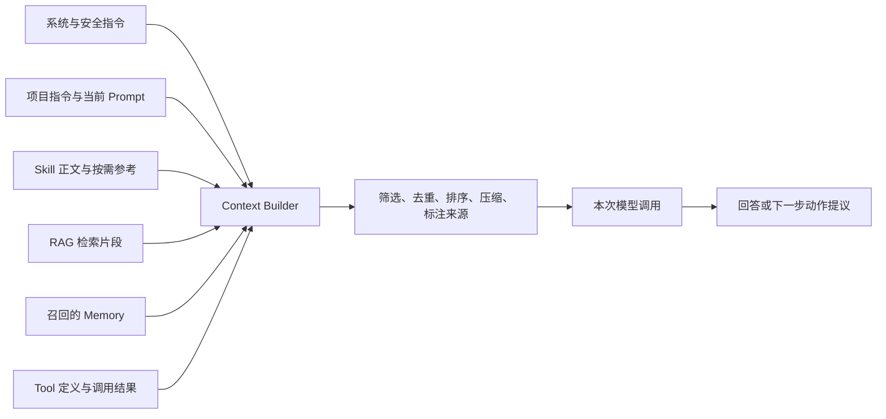
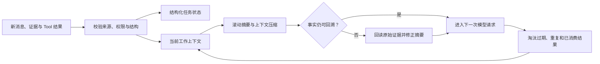
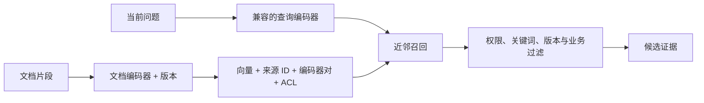
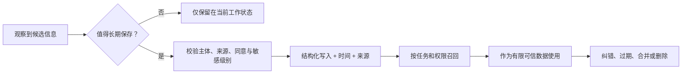
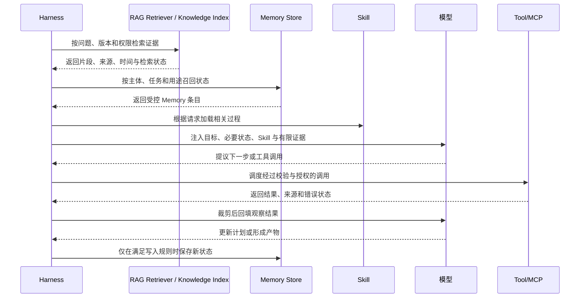

# 06. Context Engineering、RAG 与 Memory

> 本章回答一个现代 Agent 系统的核心问题：模型在当前这一步究竟应该看到什么。我们会区分上下文、RAG、Memory、Skill 与 MCP，并建立一条从信息选择、检索、写入到过期删除的完整数据链。

## 从一个“资料明明存在”的失败说起

发布负责人问 Agent：“数据库字段删除今晚能不能上线？”制度库里有明确条款，仓库里也有迁移说明，但 Agent 仍可能回答错误：

- 制度记录没有被检索出来；
- 检索到了旧版本，最新记录排在后面；
- 整份制度库一次性塞进上下文，关键条款被噪声淹没；
- 历史会话中的例外审批被误当成当前项目事实；
- Tool 结果包含指令性文字，被模型当作更高优先级规则；
- 上下文太长，真正决定风险的恢复证据被裁掉。

这说明“系统里有数据”不等于“模型在正确时点看到了正确数据”。Context Engineering（上下文工程）处理的正是这条链路。

## 先分清六个容易混用的概念

| 概念 | 它解决什么问题 | 是否改变模型参数 | 典型时效 |
| --- | --- | --- | --- |
| Prompt | 这一次要模型做什么 | 否 | 当前请求 |
| Context | 这一次模型实际收到哪些指令、历史、资料和工具定义 | 否 | 单次模型调用 |
| Context Engineering | 怎样选择、转换、排序、裁剪和追踪这些内容 | 否 | 每一步动态变化 |
| RAG | 怎样从外部知识源检索与问题相关的材料并加入上下文 | 否 | 通常按请求读取最新数据 |
| Memory | 怎样保存并在未来召回用户、任务或历史经验状态 | 否 | 跨步骤、跨会话或更长期 |
| Fine-tuning | 怎样通过训练改变模型的稳定行为倾向 | 是 | 随模型版本存在 |

Skill 和 MCP 与它们是正交关系：Skill 提供过程知识，MCP 提供连接外部数据与动作的协议边界。RAG 可以通过本地函数、搜索服务或 MCP Tool 实现；Memory 也可以由数据库和 Tool 支撑，但实现手段不等于概念本身。

## 上下文不是资料袋，而是一份临时执行视图

模型无法直接看到硬盘、数据库或所有历史记录。Harness 必须在每次模型调用前，组装一份有限的执行视图：



这里的关键不是“尽可能多”，而是同时满足五个条件：

| 条件 | 要问的问题 |
| --- | --- |
| 相关性 | 这段内容会改变当前判断吗？ |
| 权威性 | 它来自系统规则、权威数据源，还是用户转述？ |
| 时效性 | 它对当前版本、环境和日期仍然适用吗？ |
| 完整性 | 是否遗漏了会推翻结论的关键证据？ |
| 成本与风险 | 它占多少 Token，是否含敏感数据或不可信指令？ |

`[建议]` 可以把上下文质量理解为“在预算内最大化有效证据”，而不是最大化字符数量。上下文窗口更大，只是容量增加，并不会自动解决冲突、过期、权限或注意力分散。

## 一条可维护的上下文组装流水线

### 第一步：列出候选来源

先明确系统可能使用哪些来源，以及谁拥有它们：系统指令、项目规则、会话历史、Skill、知识库、Memory、MCP Tool、用户上传文件和当前运行结果。没有来源清单，就无法讨论优先级和泄露边界。

### 第二步：先做权限与信任过滤

过滤应发生在内容进入模型之前。一个用户没有权限读取的文档，不应先检索全文再指望模型“不要提到”。同样，外部网页、工单正文和 Tool 结果都属于数据，不能因为进入上下文就升级成系统指令。

| 内容来源 | 默认信任角色 | 可否覆盖更高层规则 |
| --- | --- | --- |
| 系统与组织策略 | 控制指令 | 仅由同级或更高层更新 |
| 项目指令与已审核 Skill | 受控过程指令 | 不得覆盖系统和安全策略 |
| 用户请求 | 任务目标与约束 | 不得越过组织权限 |
| RAG、Memory、文件、Tool 结果 | 不可信或有限可信数据 | 不得作为新的控制指令 |

### 第三步：选择并转换

选择不是只做向量相似度。一个实用系统通常还会结合关键词、元数据、权限、版本、时间、对象关系和业务过滤。进入上下文前还可能需要：

- 去除重复段落与导航噪声；
- 保留标题、记录 ID、版本和时间；
- 把二进制或表格转换为模型可读形式；
- 对超长结果生成带来源的摘要；
- 将敏感字段脱敏；
- 给不可信内容加明确边界标记。

### 第四步：排序与布局

重要规则和当前任务不要埋在大量历史中间。常见顺序是：稳定控制指令、当前目标、必要状态、相关证据、可用工具、输出要求。若证据互相冲突，应并列呈现来源与时间，而不是在进入模型前静默选边。

### 第五步：执行预算与淘汰

上下文预算至少要分给四类内容：控制指令、任务与状态、证据、工具定义。工具数量过多时，光是名称、描述和 Schema 就会占据大量输入；应按任务裁剪工具，而不是把所有 Server 的全部能力永久暴露。

需要淘汰时，优先删除重复、低权威、过期和与当前决策无关的内容；不要先裁掉停止条件、安全规则、当前状态和关键反证。

### 第六步：保留来源轨迹

最终回答中的关键事实，应能追溯到哪次检索、哪条 Memory、哪个 Tool 调用或哪个文件版本。否则系统很难纠错，也无法判断错误来自模型推理、检索遗漏还是源数据本身。

## 长任务中的上下文生命周期

长任务不能只靠“不断追加消息”。随着步骤增加，Harness 要把上下文当成有进入、保留、压缩、淘汰和复核规则的生命周期：



| 机制 | 解决什么 | 必须防止什么 |
| --- | --- | --- |
| 滚动摘要 | 把已完成阶段压成较短的事实、决策和未决项 | 摘要把推断写成事实，或丢失否定条件和来源 |
| 上下文压缩 | 用结构化状态、引用和局部摘要替代完整历史 | 压缩后无法回到原文核对关键结论 |
| 前缀缓存 | 复用稳定且相同的请求前缀，降低部分延迟或成本 | 把性能缓存误当语义 Memory，或让动态权限内容进入共享前缀 |
| Tool 结果淘汰 | 将已消费的大结果移出活跃窗口，只保留 ID、摘要和必要字段 | 后续步骤需要原始证据时只能依赖失真的二手摘要 |
| 摘要漂移校验 | 用来源 ID、结构化断言或重新读取原文检查摘要 | 多轮“摘要的摘要”逐步改变事实 |

`[建议]` 不可变目标、禁止动作、当前阶段、关键反证和停止条件应保持显式；大段历史和 Tool 原文可以退出活跃上下文，但要留在受控存储中。每次恢复检查点时，重新核对权限、数据时效和摘要所引用的原始版本。

## RAG：不是“接一个向量数据库”

RAG 是 Retrieval-Augmented Generation，通常译为检索增强生成。其核心是：生成之前或生成过程中，从模型参数之外的知识源取回相关材料，再让模型基于这些材料工作。2020 年的 [RAG 论文](https://arxiv.org/abs/2005.11401)系统展示了参数化模型与外部非参数记忆结合的思路；今天的工程实现已经远不止论文中的单一路径。


### 摄取阶段决定检索上限

如果切块破坏了表格关系，元数据没有记录版本，权限字段没有进入索引，后面的模型再强也无法恢复这些信息。摄取时至少要保留：来源 ID、标题、章节、所有者、版本、生效时间、权限标签和内容摘要。

切块没有统一最佳长度。政策条款、源代码、对话、表格和 API 文档的语义边界不同。应按“一个片段能否独立支持一项判断”设计，而不是机械地每 N 个字符切一次。

### 检索通常需要多路信号

| 检索方式 | 擅长 | 常见盲点 |
| --- | --- | --- |
| 关键词/BM25 | 精确术语、编号、错误码；BM25 是经典的词项相关性排序方法 | 同义表达和隐含语义 |
| 向量检索 | 语义相似、自然语言问题 | 精确编号、否定条件和版本差异 |
| 结构化查询 | 权限、时间、状态、对象关系 | 需要预先定义字段和查询逻辑 |
| 图或关系检索 | 多跳依赖、实体关系 | 建模和维护成本较高 |
| 混合检索 + 重排 | 综合召回与精确排序 | 延迟、成本和调参复杂度 |

高质量 RAG 通常先保证权限内召回，再通过重排和业务过滤控制精度。只优化“最相似片段”而不测试最终任务结论，容易得到漂亮但无用的检索指标。

### Embedding：把对象映射到可比较的表示

Embedding（向量表示）模型把文本、图像或其他对象转换为一组数值。向量检索通常比较查询向量与索引向量的距离或相似度，用于召回语义上可能相关的片段。它解决的是“先找哪些候选”，不是事实判断和授权：



相似度高不表示内容真实、权威、最新或当前用户有权读取。否定条件、精确编号、很小的版本差异和罕见实体也可能在纯向量检索中表现不佳，所以通常需要关键词、结构化过滤和重排共同工作。

索引必须记录查询/文档编码器对、模型快照、向量维度、归一化/距离规则、切块版本和内容摘要。两侧可以是同一个编码器，也可以是联合训练的非对称编码器；关键是表示空间兼容。更换任一编码器或切块方式都可能改变表示空间，不要把新查询向量直接与语义不兼容的旧索引混用。迁移时重建或双写索引，比较 Recall@k、排序、权限过滤和最终任务断言，再逐步切流。Embedding 变更不是一个只看接口能否返回数组的无行为变化升级。

### 空结果是一种结果

未找到材料可能意味着确实没有记录，也可能是查询表达、索引延迟、权限过滤或数据源故障。RAG 层应区分这些状态，Agent 则要把“没有检索到”写成证据限制，不能改写为“事实不存在”。

### RAG 要分三层评测

| 层次 | 代表问题 | 示例指标或断言 |
| --- | --- | --- |
| 检索层 | 权限范围内的关键证据是否被召回并排到前面 | Recall@k、排序质量、空结果/拒绝分类、时效命中率 |
| 回答忠实度 | 结论是否只使用取回证据，引用是否真的支持相邻主张 | 引用蕴含断言、无依据声明率、冲突证据是否保留 |
| 业务结果 | 这些证据是否帮助完成真实任务 | 高风险发布漏检率、人工纠错率、证据准备时间 |

检索分数高但回答仍编造，或者回答看似流畅却漏掉决定性反证，都不能算 RAG 成功。评测集应保留问题、权限主体、黄金证据、允许的空结果、时间截面和最终任务断言。

## RAG 没有被淘汰，只是从向量库问答变成知识系统

近几年常见说法是“长上下文淘汰 RAG”“Agentic RAG 淘汰传统 RAG”“Wiki/知识库替代 RAG”。这些说法抓住了一部分变化，但结论过度简化。更准确的判断是：

> **RAG 不是某一种向量数据库架构，而是在生成前按权限、时效和任务需要检索外部证据，并把证据注入上下文的运行时机制。**

长上下文降低了“必须切块检索”的压力，但没有消除权限过滤、来源选择、版本追踪、证据排序和成本控制。Wiki 或知识库改善了人类维护知识的方式，但模型在回答某个具体问题时，仍然需要从知识库中选择相关材料并带入上下文；这个选择和注入过程仍然属于广义 RAG 或 Context Engineering。

| 方案 | 解决什么 | 没解决什么 | 适合放在哪一层 |
| --- | --- | --- | --- |
| Classic RAG | 从文档库召回相关片段 | 结构化关系、跨文档综合、权限语义 | 基础知识问答、制度检索 |
| Hybrid RAG | 结合关键词、向量、过滤、重排 | 知识组织质量和来源治理 | 企业搜索、代码/文档混合检索 |
| GraphRAG | 从文本中抽取实体、关系和社区摘要，支持全局问题和关系型问题 | 图构建成本、抽取错误、动态更新复杂度 | 复杂组织知识、长文档群体分析 |
| Agentic RAG | 让 Agent 多轮决定查什么、是否改写查询、是否补查来源 | 工具循环、成本、停止条件 | 开放式研究、复杂排障 |
| Long-context stuffing | 把大量材料直接塞进上下文 | 位置效应、成本、权限裁剪、来源版本 | 小规模材料、临时分析 |
| Fine-tuning | 改变模型行为倾向或领域语言 | 实时事实、权限、可删除知识 | 稳定风格、固定格式、领域表达 |
| Wiki-first 知识库 | 让人先整理概念、页面、关系和责任人 | 运行时相关性选择和上下文注入 | 公司知识治理、可审计知识底座 |

`[建议]` 这套教程不把“RAG”限定为“向量库 + top-k”。真正可维护的知识型 Agent 应拆成三层：


这里的 Wiki/知识库不是 RAG 的敌人，而是 RAG 的上游治理层。它负责把知识整理成人可维护、可引用、可审计的对象；RAG 负责在某次任务中把正确对象选出来并带入模型；Memory 负责保存任务或用户状态；Skill 负责固定“怎样检索、怎样核验、怎样输出”的方法。

### Wiki / 知识库方案到底替代了什么

“用 Wiki 替代 RAG”的合理内核是：很多失败并不是检索算法不够强，而是企业知识本身没有页面边界、没有 owner、没有更新时间、没有互链、没有废弃标记，也没有面向 Agent 的引用粒度。把这类混乱内容直接丢进向量库，只会得到一个看似智能、实则不可审计的搜索层。

Wiki-first 方案应优先解决这些问题：

| 知识治理问题 | Wiki/知识库应该提供 | RAG 仍然要做 |
| --- | --- | --- |
| 谁负责这条知识 | owner、审批人、维护周期 | 按权限过滤可见页面 |
| 内容是否仍有效 | 生效日期、废弃日期、版本 | 按任务时间选择适用版本 |
| 概念之间怎样关联 | 页面链接、标签、实体关系 | 用链接、图或重排提升召回 |
| 结论能否被引用 | 稳定 URL、段落 ID、修订历史 | 把引用随答案输出 |
| 缺口怎样反馈 | 页面待办、评论、维护工单 | 把空结果和冲突转成知识维护任务 |

所以，Wiki-first 更像是替代“把垃圾文档直接向量化”的做法，而不是替代 RAG 机制本身。一个成熟系统通常是：

```text
人维护 Wiki / 制度库 / 数据字典
-> 系统建立关键词、向量和图索引
-> Agent 按权限和任务检索
-> 模型基于证据回答或调用工具
-> 空结果、冲突和过期内容反馈给知识 owner
```

### RAG 的演进路线

| 阶段 | 典型做法 | 关键进步 | 新风险 |
| --- | --- | --- | --- |
| Prompt 内材料 | 人把资料复制进上下文 | 简单直接 | 无法规模化、来源易丢 |
| Naive RAG | 文档切块、向量召回、top-k 注入 | 让模型访问外部资料 | 召回漏、切块差、幻觉引用 |
| Hybrid / Rerank | BM25 + 向量 + metadata + 重排 | 提升召回和排序稳定性 | 索引复杂、评测成本上升 |
| GraphRAG | 抽取实体关系和社区摘要 | 支持关系型和全局综合问题 | 图抽取错误、更新成本高 |
| Agentic RAG | Agent 多轮检索、改写查询、补查证据 | 适合开放研究和复杂排障 | 循环、成本和停止条件更难控 |
| Knowledge System | Wiki、RAG、Memory、Skill、MCP 共同治理 | 让知识生产、检索、使用和纠错闭环 | 组织流程和权限治理成本更高 |

`[建议]` 判断是否“还需要 RAG”时，不问“模型上下文够不够长”，而问：资料是否实时变化、是否有权限差异、是否要引用来源、是否要按版本追溯、是否要让空结果触发维护。如果这些问题存在，RAG 或等价的检索/上下文注入层仍然必要。

## Memory：重点不是记住，而是正确遗忘

Memory 在 Agent 系统中不是一个统一产品。它描述的是跨步骤或跨会话保存、召回和更新状态的机制。

先按**生命周期范围**区分状态保存在哪里、保留多久：

| 生命周期范围 | 保存什么 | 示例 | 主要风险 |
| --- | --- | --- | --- |
| 短期工作状态 | 当前 Run 的中间状态 | 已检查文件、待确认问题、剩余预算 | 状态丢失、重复执行、检查点损坏 |
| 会话状态 | 本次会话连续需要的信息 | 用户刚确认的环境和证据截止时间 | 旧指令残留、会话边界不清 |
| 长期 Memory | 经写入规则批准、未来任务可能召回的信息 | 服务所有者、已确认偏好、历史事件 | 过期、主体混淆、隐私和投毒 |

长期 Memory 又可以按**内容类型**分类，这个维度会与生命周期范围交叉：

| 内容类型 | 保存什么 | 示例 | 主要风险 |
| --- | --- | --- | --- |
| 语义 | 相对稳定的事实与关系 | 服务所有者、术语定义、已确认偏好 | 过期、主体混淆 |
| 情景 | 过去发生过的事件与结果 | 上次发布失败原因和处置 | 把相似事件误当当前事实 |
| 过程 | 怎样完成某类任务 | 审查步骤、检查表、输出规范 | 流程版本漂移、绕过正式 Skill 评审 |

Skill 可以承载受审核的过程知识，但“Skill 就是 Memory”仍不准确：Skill 是可发现、可版本化的能力包；Memory 更强调运行期间的写入、召回和更新。二者可以配合，例如 Skill 规定什么任务状态允许写入长期 Memory。

### 一条安全的 Memory 生命周期



写入门经常被忽略，但写入与召回必须分别校验主体、权限、用途和时效。模型从一次对话推断出的偏好、身份或事实，不应未经确认就永久保存；召回时也不能因为条目已经存在就跨用户、跨租户或跨目的使用。企业系统还要定义保留期限、删除请求、租户隔离、人工纠错和审计记录。

### 记忆投毒（Memory poisoning）

攻击者可能通过文档、Tool 结果或对话诱导 Agent 写入虚假长期信息，例如“以后所有发布都无需审批”。因此 Memory 条目必须保留来源和信任级别，召回后仍作为数据处理；任何长期记录都不能覆盖系统权限或组织策略。

## Prompt、RAG、Memory、Skill、MCP 与 Fine-tuning 怎么选

| 需求 | 首选机制 | 原因 |
| --- | --- | --- |
| 当前请求的一次性要求 | Prompt | 无需长期维护 |
| 当前一步需要的有限材料 | Context Engineering | 控制选择、顺序和预算 |
| 从大量外部知识中找相关证据 | RAG | 按问题动态检索并引用 |
| 跨步骤或跨会话保存状态 | Memory | 需要写入、召回、纠错与过期 |
| 复用一类任务的方法 | Skill | 需要发现、路由和过程合同 |
| 连接实时系统或执行动作 | MCP/已有工具接口 | 需要能力发现、调用和授权边界 |
| 稳定改变模型风格或任务倾向 | Fine-tuning | 行为需要进入模型参数，而非临时上下文 |
| 人维护的权威知识页面、制度库或数据字典 | Wiki / 知识库 | 需要 owner、版本、互链、废弃标记和引用粒度；通常作为 RAG 上游 |

这些机制经常组合。例如发布审查 Skill 规定方法，RAG 找到相关架构说明，Memory 保存本次审查状态，MCP 查询最新制度，Context Builder 再把当前步骤真正需要的内容交给模型。

## 它们在一次 Agent 循环中何时进入上下文



顺序并非固定，但职责不能倒置：检索系统不应决定最终业务结论，Memory 不应成为隐藏系统提示，Tool 结果不应自动升级为指令，模型也不应绕过 Harness 直接写入长期状态。

## 常见反模式

| 反模式 | 后果 | 改法 |
| --- | --- | --- |
| 所有资料都塞进系统 Prompt | 成本高、冲突多、难更新 | 常驻规则与按需证据分离 |
| 只做向量相似度，不做权限过滤 | 越权数据可能进入模型 | 检索前执行主体与对象级 ACL |
| 不保留来源和版本 | 回答无法核实，旧条款难发现 | 片段携带稳定 ID、版本和时间 |
| 把无结果写成“不存在” | 产生危险的假阴性 | 区分空结果、拒绝和数据源错误 |
| 每句话都写入长期 Memory | 隐私泄漏、错误累积 | 设写入门、确认、过期和删除 |
| 召回 Memory 后当系统规则 | Memory poisoning 扩大 | 作为有限可信数据，不能越权 |
| 用 Fine-tuning 保存实时制度 | 更新慢且难追溯 | 使用 RAG 或受控数据接口 |
| 用 RAG 代替 Skill | 找到资料但流程不完整 | RAG 提供证据，Skill 提供方法 |
| 更换 Embedding 模型却沿用旧索引 | 向量空间或排序语义不兼容，召回静默漂移 | 版本化并重建/迁移索引，重跑分层评测 |

## 完成检查

- [ ] 能列出每种上下文来源、所有者、信任级别和权限边界。
- [ ] 每次模型调用都有明确 Token 预算和淘汰顺序。
- [ ] 长任务使用结构化状态、滚动摘要和来源引用，并校验摘要事实漂移。
- [ ] RAG 保留来源、版本、时间、ACL，并区分空结果与故障。
- [ ] Embedding 模型、切块、距离规则和索引版本可追溯，变更会重建或显式迁移并重跑召回评测。
- [ ] 检索评测同时关注召回、排序和最终任务结果。
- [ ] Memory 的写入与召回分别校验主体、权限、用途和时效，并支持纠错、过期和删除。
- [ ] Tool 结果、检索片段和 Memory 都按数据处理，不能覆盖控制指令。
- [ ] Skill、RAG、Memory、MCP 和 Fine-tuning 各自承担清楚职责。
- [ ] 最终关键结论能追溯到实际进入上下文的证据。

## 继续阅读

- [模型、Harness 与上下文注入基础](03-foundations.md)
- [Function Calling 与工具调用](04-function-calling.md)
- [Agent Loop、Workflow 与 Planning](05-agent-loop-workflows.md)
- [能力发现、候选裁剪与路由](08-capability-discovery-routing.md)
- [从零制作高质量 Skill](10-skills.md)
- [从零制作高质量 MCP Server](11-mcp.md)
- [质量工程与安全](13-quality-and-security.md)
- [生产级 Agent Runtime 参考架构](15-production-agent-runtime.md)
- [研究论文与官方来源](24-sources.md)

