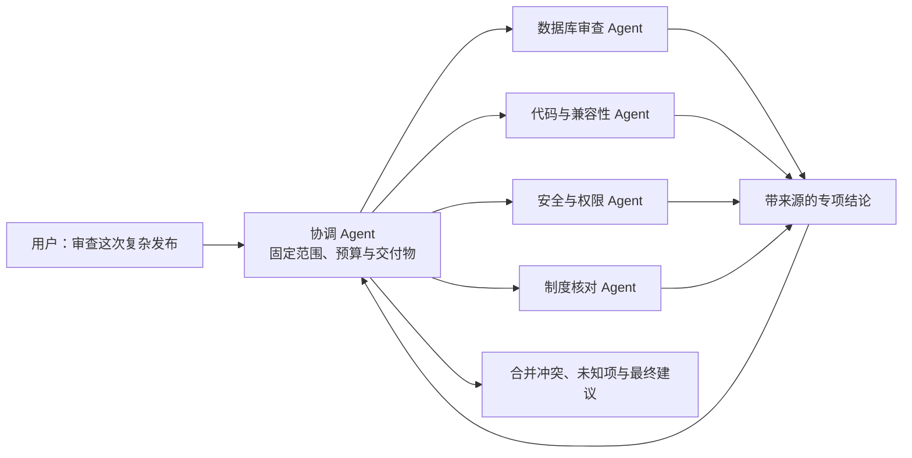
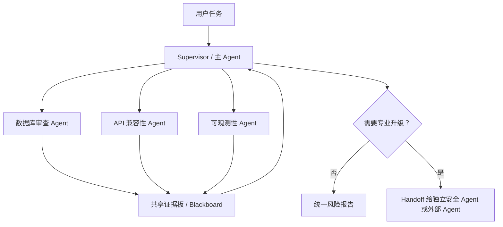
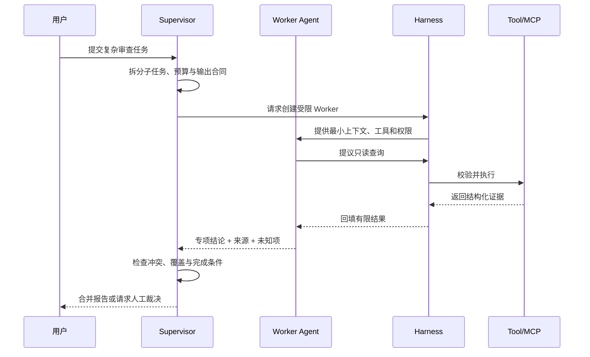
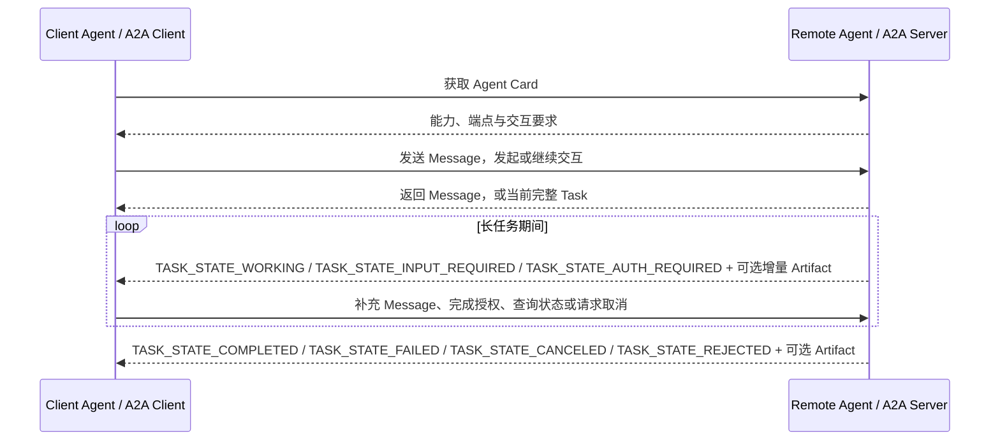
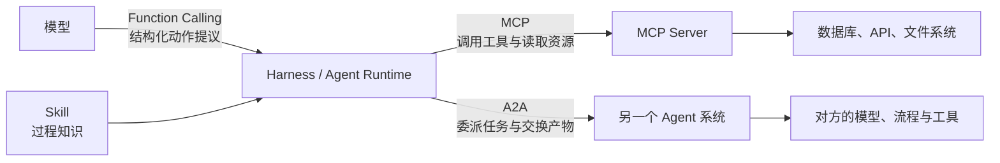
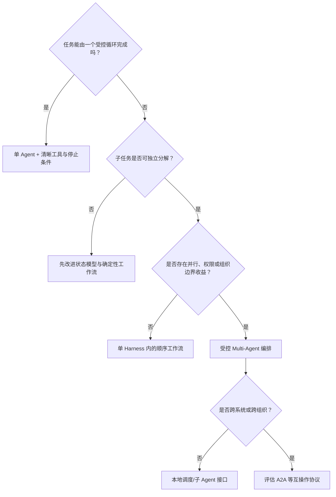

# 07. Multi-Agent、委派与 A2A

> 多 Agent 不是“多开几个模型窗口”。它是一种任务分解、权限分离和结果合并架构。本章解释什么时候值得使用多个 Agent、怎样写委派合同，以及 A2A 与 Function Calling、MCP、Skill 分别处在什么边界。建议先阅读[05. Agent Loop、Workflow 与 Planning](05-agent-loop-workflows.md)，因为委派不会替代单个任务的状态、预算和停止条件。

## 从一次跨专业发布审查说起

一次复杂发布同时包含数据库迁移、权限变更、前端灰度和合规要求。让一个 Agent 从头处理当然可行，但它可能需要加载过多工具和知识，也很难让数据库、安全与业务判断保持独立。

另一种设计是：协调 Agent 固定审查边界，再把独立问题分别委派给专项 Agent，最后合并证据。



这里增加 Agent 的理由不是“更多回答更聪明”，而是任务可以独立分解、需要不同能力边界，并且专项结论可以被结构化合并。

## 先分清四种形态

| 形态 | 典型实现 | 是否需要网络协议 |
| --- | --- | --- |
| 单 Agent 多步骤 | 一个 Harness 中循环调用同一模型与工具 | 不需要 |
| 同一 Harness 的子 Agent | 主 Agent 创建隔离子任务，由本地运行时调度 | 通常不需要 A2A |
| 多 Agent 工作流 | 多个角色按预定义图协作，可能共享状态存储 | 取决于部署边界 |
| 跨系统 Agent 服务 | 不同团队、厂商或网络中的 Agent 相互发现和委派 | 适合使用 A2A 等互操作协议 |

“角色不同”不一定代表真正的多个 Agent。若所有角色共享完整上下文、同一权限并由一段固定代码顺序调用，它更接近多提示工作流。是否称为 Multi-Agent 不重要，重要的是状态、权限、失败和责任边界是否清楚。

## 什么时候多 Agent 真正有价值

### 适合

1. **任务可并行分解**：子任务彼此依赖少，可以同时调查。
2. **上下文差异很大**：每个专家只需加载自己领域的资料与工具。
3. **权限必须隔离**：审查 Agent 只读，执行 Agent 拥有受控写权限。
4. **需要独立复核**：生成者与评审者采用不同合同和证据视角。
5. **由不同系统拥有能力**：例如外部供应商 Agent 处理其自己的工单与数据。

### 不适合

| 情况 | 为什么不值得 |
| --- | --- |
| 任务很短、步骤确定 | 普通函数或工作流更便宜、更容易调试 |
| 子任务频繁共享同一细粒度状态 | 同步成本可能高于分工收益 |
| 多个 Agent 使用相同模型、相同上下文和相同提示 | 错误高度相关，数量不等于独立性 |
| 最终结果无法结构化合并 | 协调 Agent 只能重新阅读全部长文本 |
| 没有预算和停止条件 | Agent 之间可能循环委派，形成成本失控 |

`[建议]` 默认从单 Agent 或确定性工作流开始。只有观察到上下文隔离、并行性、权限分离或组织边界的真实收益，再引入 Multi-Agent。

## 常见协作模式：主 Agent、群聊、流水线与接力

多 Agent 不是“开很多聊天窗口”。它首先是架构选择：任务怎样拆分、谁拥有最终控制权、状态放在哪里、失败怎样回滚。常见模式可以这样区分：

| 模式 | 控制方式 | 适合 | 主要风险 | 最小控制 |
| --- | --- | --- | --- | --- |
| Pipeline / 流水线 | 上一个 Agent 的产物进入下一个 Agent | 固定审查链、资料加工链 | 上游错误被下游放大 | 步间 Schema、门禁和回退 |
| Router + Specialists | 路由器选择一个或多个专家 | 意图边界清楚的任务 | 路由误判、专家重叠 | 近邻反例、未知分支、人工分诊 |
| Supervisor-Worker / 主 Agent | 协调者拆分、派发并合并 | 可并行专项调查、集中把关 | 协调者成为瓶颈或单点错误 | 子任务合同、预算、冲突合并 |
| Group Chat / 群聊 | 多个 Agent 在共享会话中轮流发言 | 头脑风暴、互相质询、开放研究 | 跑题、重复发言、责任不清 | 发言规则、终止条件、主持者 |
| Panel / 专家委员会 | 多个专家独立判断，再由裁决者汇总 | 高影响判断、需要反方意见 | 观点表演化、假独立 | 盲审输入、统一评分表 |
| Generator-Reviewer | 一个生成，一个按独立标准评审 | 文档、代码、决策复核 | 评审者与生成者错误相关 | 明确 Rubric、外部证据 |
| Blackboard / 共享状态 | 多个角色读写同一任务板 | 证据、假设、待办持续积累 | 写冲突、状态污染 | 版本、锁、来源和权限 |
| Handoff / 接力 | 当前 Agent 把控制权和责任边界交给更合适者 | 客服分流、专业升级 | 责任和上下文在交接中丢失 | 交接摘要、状态、权限重核 |
| Swarm | 多个 Agent 通过 handoff 或规则自组织 | 开放探索、复杂任务接力 | 全局目标漂移、成本失控 | 全局预算、主持者、停止门 |



`[建议]` 企业内部高风险任务通常先采用 Supervisor-Worker 或 Pipeline。Group Chat 更适合作为探索、评审或教学模式；如果没有主持者、发言上限、共享状态和完成条件，它很容易变成“多模型互相附和”。

## 委派合同决定协作质量

一个高质量委派不能只有“请深入分析”。协调者至少要交付以下合同：

| 合同字段 | 要回答的问题 | 发布审查示例 |
| --- | --- | --- |
| 目标 | 子 Agent 要解决哪个具体问题 | 判断字段删除是否可恢复 |
| 输入 | 哪些材料可信、版本是什么 | 迁移脚本、目标版本、证据截止时间 |
| 范围 | 明确做什么与不做什么 | 只读审查，不执行迁移 |
| 能力 | 可以使用哪些 Skill、Tool 与数据源 | 数据库审查 Skill、只读元数据 Tool |
| 预算 | 最多多少步骤、时间、Token 或调用 | 最多 6 步、2 次制度查询 |
| 输出 | 返回什么结构和证据 | 风险、来源、未知项、建议 |
| 停止 | 何时完成、阻断或转人工 | 缺目标快照时标记证据不足 |

子 Agent 返回的应是**任务产物**，而不是一段无法验证的“我认为”。至少保留证据 ID、来源、时间、未覆盖范围和失败状态。

## 一次受控委派怎样发生



协调者不应把完整主会话无差别复制给每个 Worker。最小上下文既减少成本，也降低跨任务和跨权限泄漏。

## 状态、身份和权限不能只靠提示词

Multi-Agent 系统至少要区分：

- **运行身份**：哪个用户或服务发起本次任务；
- **Agent 身份**：谁生成了某项提议或产物；
- **调用身份**：访问 Tool 和业务系统时使用谁的凭据；
- **授权链**：委派是否允许把哪些权限传给下游；
- **责任主体**：谁能批准高风险动作和接受剩余风险。

主 Agent 有某项权限，不表示 Worker 自动继承。安全设计应传递最小的、受众明确且可撤销的权限，并让下游系统重新做对象级授权。

## 本地多 Agent、LangGraph Team 与 A2A 的边界

很多框架都能在一个进程或一个 Harness 内组织多个 Agent。AutoGen 把一组协作 Agent 称为 Team，并提供 Group Chat、Swarm、GraphFlow 等形态；LangGraph 则强调用图结构表达节点、边、状态、检查点和多 Agent handoff/supervisor 模式。这些都属于**本地或同一运行时内的编排模式**。

A2A 解决的是另一类问题：两个独立 Agent 系统之间怎样互相发现、发消息、创建任务、跟踪状态和交换产物。它不是把一个函数包装成远程调用，也不是替代 MCP Tool。

| 需求 | 本地多 Agent / LangGraph / AutoGen | A2A |
| --- | --- | --- |
| 多个角色由同一团队部署 | 更合适 | 通常过重 |
| 需要共享同一个状态机和检查点 | 更合适 | 需要额外同步 |
| 对方是独立产品、组织或权限域 | 不够 | 更合适 |
| 任务生命周期长，需要跨系统状态 | 可能可以 | 更贴近协议目标 |
| 只是调用数据库、搜索或业务 API | 不适合，用 Tool/MCP | 不适合 |
| 需要传递完整任务目标和产物 | 可以在本地做 | 适合跨系统委派 |

`[建议]` 先问“这是子步骤，还是另一个独立 Agent 的任务？” 如果只是查资料、读文件、创建工单，用 MCP 或普通 Tool；如果要把一个目标、上下文、状态和产物交给另一个 Agent 系统处理，再考虑 A2A。

## A2A 解决什么

A2A 是 Agent2Agent 协议，面向不同 Agent 系统之间的发现、任务委派、消息交换和产物交付。本教程固定官方仓库 `v1.0.1` 作为规范来源快照，核对日期为 2026-07-10；A2A 的线缆协议版本仍是 `1.0`，补丁版本不进入请求、响应、Agent Card 或版本协商。`latest` 文档只是滚动阅读入口，发布兼容声明时必须固定规范/SDK 快照、接口绑定和实际通过的生命周期。来源见[版本基线](24-sources.md#版本基线)与[A2A 规范来源](24-sources.md#p02-a2a-规范)。

### 六个核心对象先建立直觉

| 对象 | 作用 | 不要误解成什么 |
| --- | --- | --- |
| Agent Card | 描述远端 Agent 的身份、能力、端点和交互要求，供客户端发现 | 业务授权凭据或能力质量证明 |
| Message | 用户、客户端或 Agent 之间一次有角色的内容交换 | 必然已经创建长任务 |
| Part | Message 或 Artifact 中的一个内容单元，可承载文本、文件或结构化数据 | 可直接信任的控制指令 |
| Task | 需要状态跟踪的工作单元，拥有稳定任务 ID，并可用 `contextId` 关联上下文 | 一个无状态函数调用 |
| Task Status | 描述 Task 当前所处状态及相关消息，让调用方判断等待、补充输入或结束 | 模型一句“快完成了” |
| Artifact | Agent 在任务中产生的可交付结果，由一个或多个 Part 组成 | 没有来源与版本的自由文本摘要 |

这些对象把“发一条消息”和“跟踪一个可能持续很久的任务”分开。简单请求可以直接得到消息；需要异步进度、补充输入、取消或产物更新时，Task 才成为核心状态边界。

### 一次 A2A 任务生命周期



`v1.0.1` 的 ProtoJSON 线缆枚举使用完整字符串：`TASK_STATE_SUBMITTED`、`TASK_STATE_WORKING`，以及需要调用方继续行动的 `TASK_STATE_INPUT_REQUIRED`、`TASK_STATE_AUTH_REQUIRED`；终态包括 `TASK_STATE_COMPLETED`、`TASK_STATE_FAILED`、`TASK_STATE_CANCELED`、`TASK_STATE_REJECTED`。实现和协议样例都应保留完整值。

发送 Message 后，Server 可以返回 Message 或当前完整 Task；Task 的首次可见状态取决于是否立即返回以及执行已经推进到哪里，可能是已提交、工作中、中断态或终态，不能假定首次响应只会是 `SUBMITTED/WORKING`。Artifact 可以增量产生，也可能在失败、取消或拒绝时不存在，不能把“有最终产物”写成终态保证。流式更新、轮询或推送只是取得更新的方式；调用方仍要保存 Task ID、最后状态、`artifactId`、已组装内容和接收的更新序列，并用自己的业务断言验收 Artifact。

可以用一张边界图理解它：



| 边界 | 主要交换对象 | 另一端是什么 |
| --- | --- | --- |
| Function Calling / Tool Use | 工具名、参数、调用结果 | 模型与其 Harness |
| MCP | Tools、Resources、Prompts 及结果 | Harness 与能力 Server |
| A2A | Agent 能力、任务、消息、状态和产物 | Agent 系统与 Agent 系统 |
| Skill | 方法、步骤、参考与资源入口 | Harness 与模型上下文 |

因此，MCP 不会“被 A2A 替代”。一个远程 Agent 可以通过 A2A 接收任务，再在内部通过 MCP 使用工具；它也可以加载自己的 Skill。反过来，若同一进程中的两个子 Agent 已有可靠调度接口，就没有必要为了使用新协议而增加 A2A。

## A2A 也不会自动解决语义一致性

协议可以规范消息和生命周期，却不能保证两个 Agent 对“完成”“高风险”或“权威证据”有相同理解。跨 Agent 合同仍需定义：

1. 能力描述与版本；
2. 输入、输出和错误 Schema；
3. 身份、租户、权限与数据分类；
4. 任务状态、进度、取消和超时；
5. 产物来源、完整性与保留期限；
6. 重复请求、幂等与恢复；
7. 人工升级与责任边界。

## 多 Agent 的失败往往发生在交接处

| 失败 | 表现 | 控制方式 |
| --- | --- | --- |
| 上下文丢失 | Worker 不知道版本或关键限制 | 使用结构化委派包，不依赖聊天暗示 |
| 权限扩散 | Worker 获得主 Agent 全部凭据 | 每次委派签发最小、限时、限受众权限 |
| 循环委派 | A 委派给 B，B 又委派回 A | 记录调用链、深度上限和预算 |
| 重复执行 | 超时重试造成两次写操作 | 幂等键、任务 ID、计划与执行分离 |
| 证据漂移 | 合并时来源和时间被删除 | 产物携带来源、版本和未覆盖范围 |
| 相关错误 | 多个 Agent 一致但都错 | 引入独立数据源、不同检查合同或人工裁决 |
| 成本失控 | 并行 Agent 无限扩张 | 并发、Token、时间和 Tool 调用预算 |
| 间接注入传播 | 一个 Agent 把恶意数据作为指令转发 | 标记信任级别，下游仍按数据处理 |

## 怎样观察一条多 Agent 轨迹

日志至少要关联以下层级：

```text
Run
├── Agent Task / Handoff
│   ├── Model Step
│   ├── Tool or MCP Call
│   ├── Approval
│   └── Artifact
└── Final Merge / Human Decision
```

只记录最终回答无法定位是路由错误、委派缺字段、Worker 工具失败还是合并阶段遗漏反证。每个产物应能回到创建它的 Agent、模型步骤、工具证据和委派合同。

评测也不能只问“最后答案看起来好不好”。至少检查：任务是否正确分解、是否选择合适 Agent、上下文是否最小充分、权限是否受限、冲突是否显式、是否按预算停止，以及最终结论是否能追溯。

## 选择单 Agent、工作流还是 Multi-Agent



| 情况 | 优先选择 |
| --- | --- |
| 步骤固定、规则明确、错误代价高 | 确定性 Workflow |
| 单个 Agent 能在有限工具内完成 | 单 Agent |
| 子任务可并行、需要不同专业视角 | Supervisor-Worker 或 Orchestrator-Worker |
| 需要多角色互相质询、探索未知空间 | Group Chat / Panel，但要有主持者和停止条件 |
| 多个角色持续读写同一证据板 | Blackboard / 图状态机，并显式管理版本 |
| 需要独立 Agent 系统之间委派任务 | A2A |
| 只是需要查询或执行外部能力 | MCP / Tool |

## 完成检查

- [ ] 引入多个 Agent 有明确的并行、上下文、权限或组织收益。
- [ ] 每次委派都有目标、输入、范围、能力、预算、输出和停止合同。
- [ ] Worker 只获得完成任务所需的上下文与权限。
- [ ] 任务 ID、调用链、超时、取消、幂等和最大委派深度明确。
- [ ] 专项产物携带来源、时间、未知项和未覆盖范围。
- [ ] 合并阶段显式处理冲突，不用多数票代替证据判断。
- [ ] A2A 只用于真实的 Agent 间互操作，不代替 MCP 或本地函数调用。
- [ ] Agent Card、Message、Part、Task、Task Status 与 Artifact 的归属和版本明确。
- [ ] 创建、更新、补充输入、完成、失败和取消路径都有可追踪状态。
- [ ] 整条 Run 可以追踪到 Agent、模型、Tool、审批、交接和产物。
- [ ] 高风险决策仍由有授权的人类或确定性业务策略完成。

## 继续阅读

- [AI Agent 全景与演进史](01-agent-evolution.md)
- [Agent、Harness 与上下文基础](03-foundations.md)
- [Function Calling 与工具调用](04-function-calling.md)
- [Agent Loop、Workflow 与 Planning](05-agent-loop-workflows.md)
- [Context Engineering、RAG 与 Memory](06-context-rag-memory.md)
- [能力发现、候选裁剪与路由](08-capability-discovery-routing.md)
- [Skill 与 MCP 组合实践](14-skill-mcp-together.md)
- [质量工程与安全](13-quality-and-security.md)
- [生产级 Agent Runtime 参考架构](15-production-agent-runtime.md)
- [研究论文与官方来源](24-sources.md)

