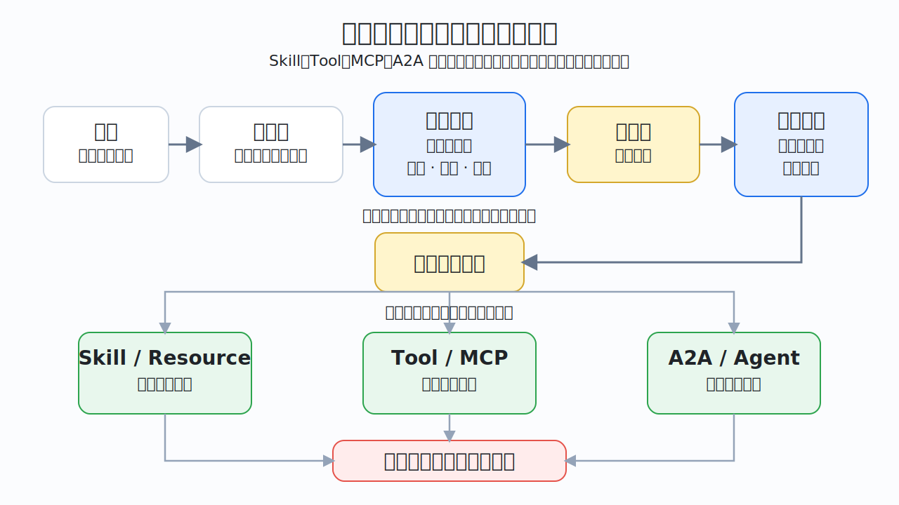
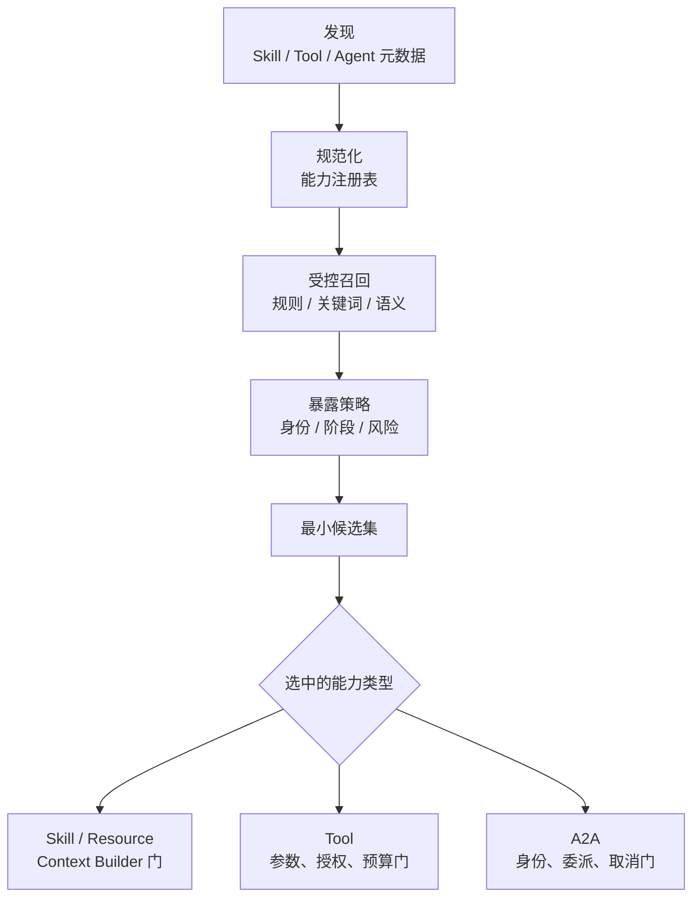
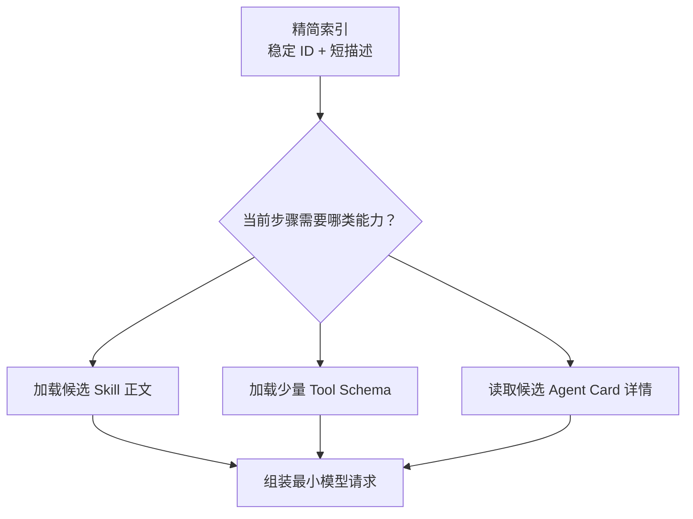

# 08. 能力发现、候选裁剪与路由

> 一个高质量 Skill 或 MCP Tool，只有在正确任务、正确身份和正确阶段被选中时才真正有价值。这里统一讨论 Skill 激活、Tool 选择、MCP 能力发现与 A2A Agent 发现的治理和评测，但保留它们在选中后的不同语义。建议先阅读[基础关系](03-foundations.md)、[Function Calling](04-function-calling.md)和[Agent Loop](05-agent-loop-workflows.md)；阅读上下文分支前参考[Context Engineering、RAG 与 Memory](06-context-rag-memory.md)，阅读 A2A 分支前参考[Multi-Agent、委派与 A2A](07-multi-agent-a2a.md)。



## 从“能力都装好了，却还是选错”说起

假设团队已经准备好：

- `release-risk-review`：发布风险审查 Skill；
- `database-migration-review`：数据库迁移 Skill；
- `search_release_policy`：查询制度的 MCP Tool；
- `web_search`：通用网页搜索 Tool；
- `deployment_agent`：可以接收部署任务的远端 Agent。

用户只问：“这个删字段的版本今晚能上吗？”

系统可能出现四种完全不同的失败：

1. **没发现**：Skill 或 Server 已安装，但 Harness 没扫描到；
2. **没进入候选**：能力已发现，却因名称、描述或检索召回不足被漏掉；
3. **选错**：模型用通用网页搜索代替权威制度 Tool，或把部署 Agent 当审查 Agent；
4. **不该暴露、加载或调用却发生了**：候选相关，但当前身份、阶段或风险不允许后续处理。

因此，“能列出来”“进入候选”“模型选中”“允许后续处理”是四个不同结论。路由不是一次神秘的模型选择，而是一条可以记录、评测和治理的系统流水线。

## 多种发现表面，共享治理问题，不共享执行语义

| 能力表面 | 发现入口 | 通常先暴露什么 | 选中后发生什么 |
| --- | --- | --- | --- |
| Agent Skill | Skill 目录与 `SKILL.md` Frontmatter（文件头元数据） | `name`、`description` 和位置 | 经过内容权限、信任和大小门后加载正文，再按需读取引用 |
| 本地 Function Tool | 应用注册表或 SDK 配置 | 名称、描述、输入 Schema | 模型提出 Tool Call，Harness 校验并调度本地实现 |
| MCP Tool | 初始化后的能力协商与 `tools/list` | Tool 名称、描述和 Schema | Client 调用 Tool，Harness 与 Server 分别执行授权和结果门 |
| MCP Resource / Prompt | 相应列表或用户/应用入口 | 可寻址资源或参数化模板元数据 | 经过权限、信任和大小门后读取或组装上下文，不等于执行 Tool |
| A2A Agent | Agent Card 或受控 Agent 目录 | 身份、能力、端点和交互要求 | Client 发送 Message（消息）；远端可直接返回 Message，或创建并返回 Task（任务）供跟踪 |

`[规范]` 这些入口来自不同规范，不能强行合并成一个网络协议。这里统一的是**发现、注册、候选治理、Trace 与评测方法**，不是声明 Skill、Resource、Tool 和 A2A 具有同一种消息或执行语义。

## 路由的核心：受控召回、授权暴露、分类型处理

一个稳健路由器通常包含六个发现与候选阶段，再按能力类型进入不同的后置门。实现可以先在不含敏感元数据的受控索引中召回稳定 ID，也可以先按主体做授权感知预过滤；不变量是敏感元数据暴露给模型前，必须由模型之外的权威策略决定。



具体先检索还是先过滤取决于索引是否敏感、是否支持授权感知查询和资格判断需要哪些参数：

- **索引可公开但能力元数据敏感**：可以先召回 ID，再在读取描述或暴露给模型前过滤；
- **目录本身就敏感**：检索必须在主体和租户范围内完成，避免泄露能力是否存在；
- **对象资格依赖生成参数**：候选暴露前先做粗粒度资格，Tool Call 产生后再做对象级授权；
- **所有实现都要保留**：自然语言描述不决定权限，具体 Tool 执行和 A2A 委派仍要再次授权。

路由可分成三道门：

| 门 | 主要问题 | 典型负责人 | 失败结果 |
| --- | --- | --- | --- |
| Eligibility / Exposure（资格与暴露） | 当前主体和步骤是否允许看见或考虑它 | Harness 策略、组织目录、连接状态 | 从可见候选中移除，并记录规则原因 |
| Relevance（相关性） | 它是否最适合解决当前问题 | 规则、检索器、模型或组合路由器 | 降低排名、保留兜底或请求澄清 |
| Post-selection（选中后处理） | 内容能否进上下文、Tool 能否执行、任务能否委派 | Context Builder、Harness、Server、远端 Agent 与业务系统 | 拒绝、审批、修正参数、缩减内容或安全降级 |

## 能力注册表：统一治理，不抹平差异

`[建议]` 团队可以在 Harness 或平台层维护一份内部能力注册表。它不是 MCP 或 Agent Skills 规范要求的文件，而是把来自不同表面的元数据转换成可检索、可授权、可追踪的内部记录。

下面是概念性 YAML，不是可复制配置：

```yaml
capability:
  semantic_id: policy.search
  kind: mcp_tool
  exposed_name: policy-knowledge.search_release_policy
  source:
    server: policy-knowledge
    protocol: mcp
    protocol_version: "2025-11-25"
    server_build_digest: sha256:...
    capability_contract_version: "2.1"
  owner: release-governance
  description:
    use_when: 需要核对当前发布制度
    do_not_use_when: 需要查询实时发布状态或执行审批
  contract:
    description_digest: sha256:...
    input_schema_digest: sha256:...
    output_schema_digest: sha256:...
    empty_means: 查询成功但未找到权限范围内的匹配项
  risk:
    side_effect: none
    data_classification: internal
  eligibility:
    allowed_stages: [evidence_collection]
    required_scopes: [policy.read]
  lifecycle:
    status: active
    observed_at: "2026-07-10T09:30:00Z"
```

一条可维护的能力记录至少回答：

| 字段组 | 要回答的问题 |
| --- | --- |
| 稳定身份 | 语义上是什么能力，平台展示名是否会变化 |
| 来源与版本 | 来自哪个 Skill、进程、MCP Server 或 Agent Card；协议、实现构建与能力合同分别是什么版本 |
| 所有者 | 谁解释语义、处理事故和批准升级 |
| 触发边界 | 什么时候使用，什么时候不要使用 |
| 输入输出合同 | 参数、结果、空结果、错误和 Artifact（任务产物）怎样表示 |
| 风险与数据 | 是否写入，接触哪类数据，是否需要人工批准 |
| 资格规则 | 哪些身份、租户、任务阶段和策略版本可以使用 |
| 运行状态 | 当前可用、降级、弃用还是停用，健康信息何时观测 |

注册表不能成为新的“万能真相”。Server 的 Tool 描述、Skill 的 Frontmatter 和 Agent Card 都可能过期或不可信；发现时要记录来源，执行时仍以真实身份、当前策略和业务系统授权为准。

元数据进入注册表前也要过内容门：来源允许列表、字段和长度规范化、危险富文本清理、签名或摘要核对，以及高风险变更审核。模型面向的自然语言描述可以帮助相关性选择，但 `side_effect`、数据分类、批准要求和授权 Scope（权限范围）必须来自权威策略或经审核字段，不能由描述自行声明。

## 资格与暴露门：决定必须落到模型外的权威策略

资格过滤用于回答“能否进入候选”，不用于判断“最相关的是谁”。常见过滤条件包括：

1. 当前主体、租户和授权 Scope（权限范围）；
2. 任务阶段，例如证据收集阶段只暴露只读能力；
3. 用户或组织禁用列表；
4. Tool 的数据分类、网络和文件系统边界；
5. 是否需要当前 Harness 不支持的模态或协议能力；
6. Server、Skill 或远端 Agent 是否处于停用、过期或故障状态；
7. 预算是否足以承担该能力的预计成本与延迟；
8. 委派深度、并发和地域等运行限制。

```text
已发现 42 项
  -> 当前主体有资格 18 项
  -> 当前阶段允许 9 项
  -> 运行状态可用 7 项
  -> 进入相关性路由
```

不要让模型决定自己是否有权限。模型可以解释用户意图，策略也可以使用经校验的模型分类结果作为一个输入，但“`policy.read` 是否存在”“当前阶段能否写入”“这个 Agent 是否允许跨地域处理数据”的最终决定必须由模型之外、可审计的权威策略和外部状态给出。上面的数字漏斗只是一种先过滤再召回的实现，不排斥在受控索引中先召回 ID、再完成暴露过滤。

## 相关性路由：不只靠一段描述

从合格集合中选择能力，可以组合多种信号：

| 信号 | 擅长 | 主要风险 |
| --- | --- | --- |
| 确定性规则 | 明确前缀、文件类型、任务阶段和强制流程 | 规则膨胀，难覆盖自然语言变体 |
| 关键词 / BM25 | 稳定术语、能力名、错误码和业务编号；BM25 是经典词项相关性排序方法 | 同义词与隐含意图召回不足 |
| 向量或语义检索 | 自然语言近义表达和大规模能力目录 | 近邻能力混淆，描述投毒，精确条件被弱化 |
| 模型分类或选择 | 结合当前目标、上下文和多个约束 | 随机性、位置偏差、描述长度偏差和成本 |
| 历史反馈 | 根据已确认成功/失败改进排序 | 反馈循环放大旧偏差，跨租户数据污染 |

推荐顺序是“规则缩小明显边界 -> 关键词/语义召回 -> 模型在小候选集中选择或弃权”。模型应能返回“没有合适能力”或请求澄清，不能为了完成每次路由而强行选一个最相似项。

### 描述合同的共同写法

无论是 Skill `description`、Tool 描述还是 Agent Card 中的能力描述，都应尽量回答：

1. **做什么**：使用稳定的动作和对象；
2. **什么时候用**：列出用户意图、输入或任务阶段；
3. **什么时候不用**：写出最容易混淆的近邻边界；
4. **需要什么**：关键输入、身份或前置状态；
5. **返回什么**：结果、空结果和未覆盖范围；
6. **有什么风险**：是否只读、是否写入、何时需要批准。

但三者仍有差异：Skill 描述主要决定是否加载一套方法；Tool 描述主要帮助选择一个离散动作并构造参数；Agent 能力描述用于判断是否值得把一个完整任务委派给独立系统。不要把一个 Tool 的函数级描述复制成远端 Agent 的任务级承诺。

## 动态候选集：上下文预算也是路由问题

把全部 Tool Schema、所有 Skill 正文和每个 Agent Card 永久放进上下文，会增加成本，并降低安全性与选择质量。候选裁剪应采用渐进披露：



对于数百或数千个 Tool，可以先用能力检索器或受控“工具搜索”能力找到候选，再把精确 Schema 暴露给模型。这里有两个门槛：

- 候选召回必须有离线 Recall@k 测试，即检查正确能力是否出现在前 k 个候选中；不能只优化最终 Top-1（第一名）选择；
- 工具搜索结果本身只是目录数据，执行前仍要做资格、Schema 和授权校验。

过度裁剪也会失败。如果关键 Tool 从未进入候选，后面的模型再强也无法选择。上下文节省与候选召回必须一起评测。

## 语义能力别名：跨 Harness 保持意图稳定

不同 Harness 可能给同一 MCP Tool 加上 Server 前缀、命名空间或内部 ID。Skill 若写死 UI 展示名，就会把平台差异带进可移植核心。

`[建议]` 用内部语义能力 ID 表达稳定意图，例如：

```text
policy.search
  -> Claude Code 当前暴露名
  -> Codex 当前暴露名
  -> Gemini CLI 当前暴露名
  -> Copilot / VS Code 当前暴露名
  -> 业务 Tool: search_release_policy
```

语义 ID 至少可以用于测试、审计和跨平台报告归一化，这不要求 Harness 理解它。只有自建 Capability Gateway 或明确的适配器才能把语义 ID 在运行时重写为实际 Tool；原生 CLI/IDE Harness 若没有这种扩展能力，Skill 必须使用当前实际 Tool 身份，或维护平台专用适配副本，不能声称别名会被自动解析。完整例子见[Skill 与 MCP 组合实践中的能力别名](14-skill-mcp-together.md#进阶能力别名与适配)。

## 冲突、版本与弃用怎样处理

| 冲突 | 示例 | 处理方法 |
| --- | --- | --- |
| 同名不同义 | 两个 Server 都暴露 `search` | 加来源命名空间，禁止静默覆盖 |
| 同义不同名 | `policy_lookup` 与 `search_release_policy` | 映射同一语义能力，比较权威性和合同 |
| 近邻能力 | 发布审查与数据库迁移审查 Skill | 用近邻反例、任务阶段和组合规则评测 |
| 新旧版本并存 | Tool Schema 新增必填字段 | 注册版本与 Schema 摘要，按兼容策略选择 |
| 能力已弃用 | 旧制度 Server 仍可连接 | 从默认候选移除，给出迁移目标和截止时间 |
| 多能力都必要 | 先加载审查 Skill，再调用制度 Tool | 显式定义组合顺序，不强迫路由器二选一 |

重命名 Tool、修改 Skill `description`、改变 Agent Card 能力或扩大数据范围，都属于路由合同变更。发布时应比较能力目录快照，而不只是比较代码 Diff。

## 选中后的分类型门：仍要重新校验

模型选择 `search_release_policy` 只证明“它提出了这个动作”。执行前还要检查：

1. Tool 仍在当前允许集合中；
2. 参数通过 Schema 与业务语义校验；
3. 真实主体对具体制度域有权限；
4. 当前调用没有突破结果量、时间、成本和速率预算；
5. 风险策略是否要求预览或人工批准；
6. Server 与下游系统是否重新做对象级授权；
7. 返回结果是否满足结构、来源、大小与敏感数据合同。

远端 Agent 同理：Agent Card 适合描述能力，不是委派授权。发起 A2A 委派、向对方发送 Message 前，仍要核对对方身份、数据边界、预算、交付合同和取消路径；Task 是否创建由远端响应决定。

## 路由 Trace：记录为什么，而不记录秘密

一条可诊断路由轨迹至少包含：

```text
route_trace
├── request_id / task_stage / principal_summary
├── query_input_ref / digest + router/model version
├── registry_snapshot_ref / index_snapshot_ref / ranking_policy_version
├── discovered_capability_ids + protocol/build/contract versions
├── eligibility_filtered_ids + reason_codes
├── retrieved_candidates + rank/reason
├── capabilities_exposed_to_model + metadata_object_refs/digests
├── selected / abstained / clarification_requested
├── execution_gate_result + policy_version
└── final executor, result class and latency
```

不必默认把完整 Prompt、敏感参数或所有描述正文复制进普通日志。可复现路由需要保留受控快照引用或内容寻址对象，以及路由器、路由模型、索引和策略版本；摘要只能标识内容，不能恢复已经丢弃的原文。敏感快照仍受权限、地域和保留期控制。若平台不保留这些材料，就应把结论写成“可关联”而不是“可完全复现”。只记录“模型最终选了 X”，无法区分发现失败、过滤错误、召回遗漏、模型误选和执行策略拒绝。

## 一套跨 Skill、Tool 与 Agent 的路由评测

每项能力都应维护同一类行为用例：

| 用例 | 要证明什么 |
| --- | --- |
| 直接正例 | 明确意图能进入候选并正确选中 |
| 隐晦正例 | 不含能力名时仍能召回 |
| 近邻反例 | 不会被相似但不同的任务误触发 |
| 无关反例 | 能够不选择任何能力 |
| 冲突场景 | 多个合理候选时按权威性、范围或组合规则处理 |
| 无资格正例 | 语义相关但无权限时，在模型选择前被过滤或在执行门拒绝 |
| 故障与过期 | Server/Agent 不可用或版本过期时选择安全降级 |
| 注入场景 | 外部描述和结果不能扩大权限或改变路由策略 |

分层指标比一个“路由准确率”更有诊断价值：

| 层次 | 代表指标 |
| --- | --- |
| 发现 | 已安装能力发现率、元数据解析失败率、目录新鲜度 |
| 资格 | 越权能力暴露数、错误过滤率、策略原因码覆盖率 |
| 召回 | Recall@k、关键能力漏召回率、候选集大小与 Token 成本 |
| 选择 | Top-1 / Top-k（第一名 / 前 k 名）正确率、近邻误触发率、正确弃权率、澄清率 |
| 执行 | 参数首次通过率、授权拒绝正确率、结果合同通过率 |
| 任务 | 最终任务成功率、安全不变量、成本与延迟分布 |

跨 Harness 测试不要求 UI 名称和确认弹窗逐字一致。白盒自建 Harness 可以记录完整发现集合、过滤、候选暴露和排序 Trace；黑盒 CLI/IDE 只断言它实际暴露的 Skill/Tool 列表、最终调用、审批和结果，内部候选不可观察时明确标为“未暴露”。不能根据相同最终调用反推内部路由算法等价。固定同一组任务、身份、能力版本和可观察行为断言，比较结果与安全边界。

## 常见反模式

| 反模式 | 为什么失败 | 修正方向 |
| --- | --- | --- |
| 把所有能力永远暴露给模型 | 上下文膨胀、误选和攻击面增加 | 按身份、阶段和相关性动态裁剪 |
| 只靠名称路由 | 名称短且易冲突，无法表达禁区 | 名称 + 描述边界 + Schema/合同 + 正反例 |
| 只靠向量相似度 | 最相似不等于有资格、权威或可执行 | 受控召回与权威暴露策略组合，执行时再授权 |
| 模型决定自己的权限 | 文字判断不能替代真实身份和策略 | 模型外的可审计资格策略与服务端授权 |
| Tool 可见就认为已授权 | 暴露是候选控制，不是对象级授权 | 每次具体调用重新校验 |
| 用 Agent 包装简单函数 | 发现、状态和交接成本远大于收益 | 本地函数或 MCP Tool 优先 |
| 路由失败统一归因于模型 | 无法定位发现、过滤、召回或执行错误 | 保存分层 Route Trace |
| 跨平台断言完整 Tool 名 | 平台可能加前缀和命名空间 | 断言语义能力与业务合同 |
| 修改描述后只做格式检查 | 触发边界已经改变 | 重跑路由正例、反例和冲突集 |

## 完成检查

- [ ] 能区分发现成功、进入候选、模型选择和允许执行四个状态。
- [ ] 所有能力都有稳定身份、来源、所有者、版本、触发边界和风险元数据。
- [ ] 敏感元数据在暴露给模型前经过模型外的权威策略；具体 Tool 调用和 Agent 委派再次授权。
- [ ] 大目录使用可评测的召回与候选裁剪，不把全部 Schema 永久注入。
- [ ] 路由器允许弃权和请求澄清，不会强行选择最相似能力。
- [ ] 同名、同义、近邻、版本并存和组合能力都有明确规则。
- [ ] 白盒 Route Trace 带路由器、模型、目录/索引快照和策略版本；黑盒平台明确标出不可观察阶段。
- [ ] 正例、隐晦正例、近邻反例、无关反例、冲突和无资格场景进入固定测试集。
- [ ] 跨 Harness 断言可观察语义与安全行为，不依赖平台展示前缀，也不臆测黑盒内部候选。

## 继续阅读

- [Agent Skill 制作](10-skills.md)：把 `name`、`description` 和正文写成高质量路由合同；
- [MCP Server 制作](11-mcp.md)：设计容易被选对、又不能越权的 Tool；
- [跨 Harness 适配](12-cross-harness.md)：把可移植核心映射到不同平台；
- [质量工程与安全](13-quality-and-security.md)：建立路由测试集、Trace 与发布门；
- [Skill 与 MCP 组合实践](14-skill-mcp-together.md)：查看语义能力别名的完整案例；
- [Multi-Agent 与 A2A](07-multi-agent-a2a.md)：把函数级选择扩展到任务级委派。
- [官方来源、事实标签与版本基线](24-sources.md)：核对 Skill、MCP、A2A 和各 Harness 的来源边界。

