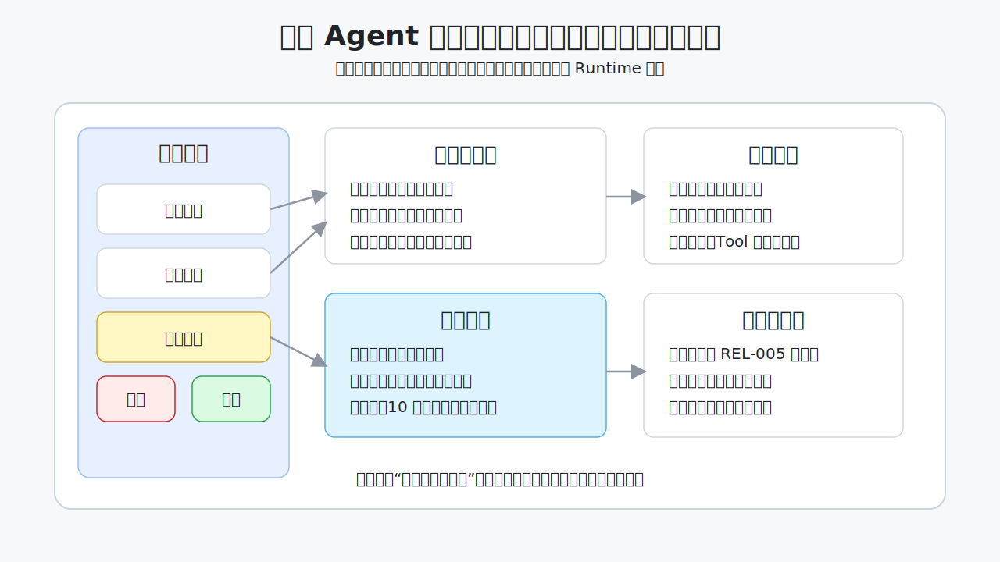
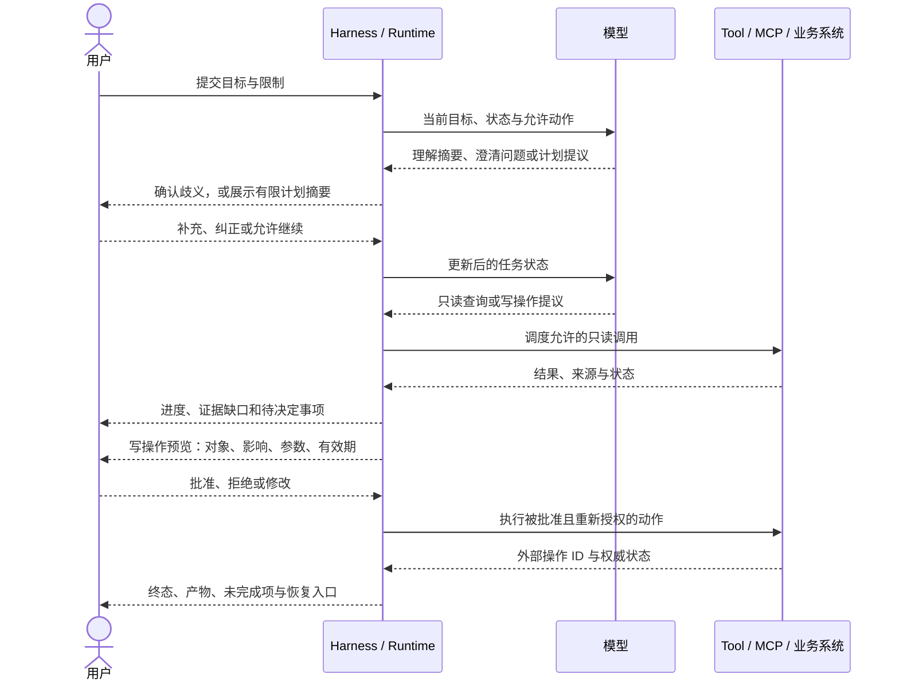
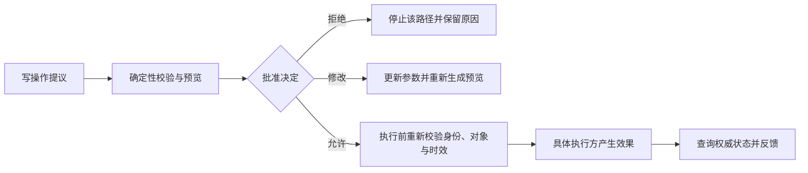

# 09. 人机协作与可控交互

> 一个 Agent 即使内部架构正确，如果用户不知道它正在做什么、依据什么、能否中断，以及哪一步真的执行过，仍然不是高质量系统。澄清、计划、审批、进度、证据、不确定性、纠正、取消、恢复和人工交接共同构成人机合同。

> 这里讨论交互原则，不规定某个产品必须使用哪种按钮或界面。聊天、IDE、命令行、工单机器人和后台任务可以有不同界面，但应提供同样关键的控制与证据。



## 从一个危险的“好的，正在处理”开始

用户说：“帮我处理今晚的发布。”Agent 回复：“好的，正在处理。”

这句话隐藏了太多问题：

- “处理”是审查材料、创建发布单，还是直接部署？
- 它是否已经读取生产数据，是否会写入外部系统？
- 当前卡在模型推理、等待 Tool、等待审批，还是已经失败？
- 用户按下取消后，已提交的写操作会不会继续？
- 最终显示“完成”，指报告生成完成，还是发布真的成功？

高质量交互不是让 Agent 每一步都长篇解释，而是在**意图、风险、状态和责任发生变化的节点**，给用户足以理解和控制任务的信息。

## 人机合同的八个问题

一次可控交互至少持续回答八个问题：

| 问题 | 用户需要看到什么 | 系统真实依据 |
| --- | --- | --- |
| 系统理解的目标是什么 | 对象、环境、范围、成功条件 | 结构化任务目标与当前状态 |
| 系统准备怎么做 | 简洁步骤、将使用的数据和能力 | 版本化计划摘要，不是内部思维全文 |
| 系统现在能做什么 | 只读、写入、外发、委派及限制 | 当前身份、Scope、策略和能力目录 |
| 哪一步需要我决定 | 具体对象、影响、选项和有效期 | 风险策略与 Approval 记录 |
| 当前进行到哪里 | 阶段、已完成项、等待原因和预计下一事件 | Run / Step / Call 状态 |
| 结论依据什么 | 来源、观察时间、缺口和冲突 | Evidence / Artifact 引用 |
| 我怎样纠正或停止 | 修改范围、撤销未执行计划、取消与恢复入口 | 状态机、取消传播和外部动作对账 |
| 最终谁负责 | Agent 建议、系统执行和人类决策的边界 | 组织责任、授权记录与审计 |

这八项不要求永远同时显示。入门聊天可以渐进披露：默认展示目标、当前状态和关键证据，风险升高或用户展开时再显示参数、版本和 Trace 摘要。

## 一次完整的人机协作循环



模型可以提出澄清问题、计划和动作，但 Harness 应从结构化状态决定当前允许哪种交互。用户点击“允许”只是审批记录的一部分；业务系统仍要验证真实身份和对象权限。

## 什么时候应先澄清

不是每个请求都要反问。无意义的连续澄清会把工作全部推回用户；未经确认地猜关键对象又会制造风险。可以按**歧义是否影响安全、范围或结果**判断。

### 必须澄清

- 同一个词对应多个生产对象，例如“支付服务”有三个区域实例；
- 环境、租户、时间范围或写入目标缺失，猜错会产生副作用；
- 用户要求之间冲突，例如“直接发布”与“不能改生产”；
- 缺少法定、组织或业务上必须由人提供的决定；
- 证据不足以区分两个高影响路径。

### 可以声明假设后继续

- 采用可逆、低风险、只读的默认范围；
- 假设不会扩大数据访问，也不会改变最终业务对象；
- 结果会明确列出假设，用户可以低成本纠正；
- Harness 能在真正写入前再次展示精确计划。

### 不应询问

- 系统可以从当前结构化状态可靠取得的信息；
- 只为了让用户替模型选择技术实现细节；
- 用户无权决定或无法判断的安全策略；
- 密码、API key、Access Token 等本应由认证或凭据代理处理的秘密。

一个好的澄清问题应一次解决一个决策，并给出差异清楚的选项。例如：“目标是生产环境 `orders-ap-southeast-1`，还是测试环境 `orders-staging`？”比“请提供更多信息”更可行动。

## 展示计划，但不暴露内部思维全文

用户需要知道 Agent 将做什么，不需要阅读模型每个中间联想。应展示**可验证计划摘要**：

```yaml
goal: 判断数据库字段删除是否满足发布条件
scope:
  environment: production
  service: orders
steps:
  - 读取迁移与恢复材料
  - 查询当前发布制度
  - 对照风险门并列出证据缺口
write_actions: []
external_data:
  - 内部发布制度库
stop_before:
  - 任何部署、迁移或工单写入
completion:
  - 输出带来源的风险报告
```

计划摘要应该包含目标、范围、主要步骤、将访问的数据、可能的写操作、停止点和完成条件。它可以在执行中修订；发生以下变化时应再次向用户显式展示：

- 从只读分析转为写操作；
- 对象、环境、数量或影响范围扩大；
- 更换不等价的数据源或远端 Agent；
- 需要把数据发送到新的接收方或地域；
- 原批准绑定的参数或计划摘要已经改变。

计划不是执行证据。显示“下一步创建工单”与显示“工单 `CHG-2048` 已由业务系统创建”必须使用不同状态和文案。

## 自主程度应该随风险变化

自主性不是产品越高越好的等级。同一个 Agent 在不同动作上可以采用不同控制：

| 风险与可逆性 | 推荐交互 | 例子 |
| --- | --- | --- |
| 低风险、只读、可重试 | 在预先授权范围内自动执行，结果可见 | 查询公开文档、读取当前仓库文件 |
| 中风险、可逆、范围明确 | 先展示计划或首次确认，批量步骤持续报告 | 创建草稿工单、生成未发布分支 |
| 高风险或影响广 | 精确对象级批准，执行后权威验证 | 生产配置修改、外部通知、权限变更 |
| 不可逆、法律或财务影响 | 强制职责分离、二次复核或转人工 | 删除生产数据、付款、最终合规决定 |
| 状态不确定 | 暂停自动动作，先对账或人工处置 | 写请求超时，不知道下游是否已提交 |

风险控制不能只来自模型对动作的文字分类。Side effect、数据分类、金额、环境、可逆性和所需批准应来自经审核的能力元数据、参数与业务策略。

## 批准不是一个万能“继续”按钮

一次有意义的 Approval（批准）应让用户理解具体决定，并绑定：

- 要调用的能力与业务动作；
- 对象 ID、租户、环境、数量和接收方；
- 关键参数或不可变计划摘要；
- 预期影响、可逆性和最坏影响范围；
- 将读取或外发的数据类别；
- 有效期、批准主体和策略版本；
- 拒绝、修改和稍后处理的选项。



批准与授权必须分开：用户批准表达“我同意按这个计划继续”，授权表达“当前主体根据权威策略有权操作这个对象”。用户不能通过点击批准获得原本没有的权限，模型也不能代替批准人。

## 进度要报告状态，不要表演忙碌

“正在思考”“快完成了”无法帮助用户判断是否应该等待、取消或补充信息。进度应来自 Runtime 状态，而不是模型自由编写。

| 状态 | 合格的信息 | 不合格的信息 |
| --- | --- | --- |
| 排队 | 当前队列阶段、是否可取消、下一次更新条件 | “马上开始”但没有状态依据 |
| 运行 | 已完成步骤、当前步骤、调用对象类别 | 暴露内部思维全文或滚动生成废话 |
| 等待输入 | 缺少什么、为什么需要、可选项 | “任务暂停”但不给恢复方式 |
| 等待批准 | 精确动作、对象、影响、批准有效期 | 只显示“允许 Agent 继续吗？” |
| 外部慢任务 | 外部 Task/Operation ID、最后状态、下次查询 | 用模型估计冒充业务系统进度 |
| 部分失败 | 成功范围、失败范围、是否可安全重试 | 把部分结果包装成完整成功 |

不要生成没有证据的精确剩余时间。若无法可靠预测，可以说明“下一次状态变化来自制度查询返回或 30 秒超时”，而不是承诺“还需 12 秒”。长任务应允许用户离开界面后凭 Run ID 查询，而不是把连接存活当作任务存活。

## 结果要区分事实、判断、未知和动作

自然语言容易把不同认知状态揉成一段确定语气。一个可复核结果至少区分：

| 内容类型 | 表达要求 | 示例 |
| --- | --- | --- |
| 已观察事实 | 来源、版本、时间和范围 | “制度 `REL-005` 于 2026-06-12 复核，要求……” |
| 模型或规则判断 | 说明使用的公开标准与证据 | “根据风险门 R3，此项构成阻断” |
| 假设 | 明示未经验证及其影响 | “假设本次目标为生产环境；若为测试环境，结论不同” |
| 未知 / 证据缺口 | 说明缺什么、怎样补齐 | “没有目标库恢复演练记录，无法验证恢复时间” |
| 已执行动作 | 外部操作 ID、权威状态和观察时间 | “草稿工单 `CHG-2048` 已创建并再次查询为 `draft`” |
| 仅提议动作 | 明确尚未执行及所需决定 | “建议创建草稿，等待批准” |

引用数量不等于可信。引用必须真的支持相邻主张；搜索结果标题、模型记忆或不存在的 URL 不能充当证据。若来源冲突，应并列展示冲突和时间，而不是为了给出单一答案静默选边。

### 不确定性要可行动

仅给“置信度 87%”常常没有可校准含义。更有用的是说明不确定性来自哪里：

- **输入不完整**：需要用户补充对象或时间；
- **证据不足**：需要查询另一个权威源或人工材料；
- **来源冲突**：需要数据所有者裁决；
- **模型判断不稳**：需要确定性检查、第二评审或人工复核；
- **执行状态未知**：需要外部对账，禁止自动重试。

如果使用数值置信度，必须说明它怎样校准、适用于哪类任务，并用历史结果验证。不能把模型自报概率直接当作业务风险概率。

## 用户必须能纠正、取消和恢复

### 纠正

用户纠正“不是生产，是预发布”时，Harness 应更新结构化状态，识别哪些证据、计划和批准已经失效，再从安全检查点继续。不要只把纠正追加为最后一句聊天，仍让旧对象隐藏在摘要和 Tool 参数中。

纠正后至少检查：

1. 目标对象和身份范围是否改变；
2. 已取证据是否仍适用；
3. 已批准参数是否失效；
4. 未完成 Tool Call 能否取消；
5. 已发生副作用是否需要对账或补偿。

### 取消

取消是一项请求，不是瞬间抹去历史。Runtime 要停止后续调度，向可取消的模型、Tool 和远端 Task 传播信号，再查询已经在途的外部动作。只有对账完成后，任务才能进入 `canceled`；已发生的动作和部分 Artifact 仍应保留并向用户说明。

### 恢复

恢复界面应展示：原目标、最后可靠状态、未完成项、已发生动作、当前权限和版本变化。长时间暂停后，旧批准、Token、数据快照和计划都可能过期；恢复不是把历史聊天重新发送给模型，而是从结构化 Checkpoint 重新校验。

## 拒绝与失败也要给出安全下一步

高质量拒绝不是模糊道歉，也不是泄露策略细节。它应说明：

- 哪一类边界阻止了任务，例如无对象权限、动作风险过高或证据不足；
- 哪些部分仍可以安全完成，例如只读分析或生成草稿；
- 用户能否通过正常认证、补充信息或联系责任人继续；
- 系统不会尝试绕过拒绝，也不会把拒绝伪装成空结果。

| 结果 | 推荐降级 | 禁止行为 |
| --- | --- | --- |
| 无权限 | 提供权限申请或数据所有者入口；继续不需该数据的部分 | 改写查询尝试旁路，或声称对象不存在 |
| 用户拒绝 Tool | 尊重决定，使用已有证据并降低结论范围 | 反复诱导批准或静默调用替代 Tool |
| 数据源不可用 | 明示来源与时间，保存部分结果，给出重试/人工取证选项 | 回退到模型记忆后伪装成实时查询 |
| 安全策略拒绝写入 | 提供只读预览、草稿或人工流程 | 让模型换一个工具完成同一禁用动作 |
| 预算耗尽 | 交付已验证部分、未完成项和恢复入口 | 在后台无界继续消耗 |

## 人工交接是一份新的最小上下文

转人工不是把全部会话、内部 Prompt 和敏感 Tool 结果转发给某个群。交接包应最小化并结构化：

```yaml
handoff:
  goal: 审查订单服务数据库字段删除
  current_state: waiting_for_risk_acceptance
  completed:
    - 已读取迁移方案
    - 已取得制度 REL-005
  open_questions:
    - 缺少目标库恢复演练
  decisions_needed:
    - 是否延期字段删除
  actions_already_taken: []
  evidence_refs:
    - artifact://run-42/evidence/REL-005
  permissions_not_delegated:
    - production.deploy
  trace_ref: trace://run-42
```

接手人需要知道目标、当前状态、已验证证据、已发生动作、未决决定和责任边界。默认不传内部思维全文、凭据、其他租户数据或与决定无关的历史。若交给另一个 Agent，仍要使用委派合同、最小权限和 Artifact 验收，详见[Multi-Agent 与 A2A](07-Multi-Agent委派与A2A.md)。

## 面向团队的交互评测

不要只测最终回答文字。人机交互应使用任务轨迹和用户行为共同评测：

| 维度 | 代表性断言或指标 |
| --- | --- |
| 目标理解 | 关键对象、环境和完成条件提取正确；高影响歧义会澄清 |
| 控制感 | 用户能在合理步骤纠正、拒绝、取消和恢复；取消生效时间可测 |
| 批准质量 | 批准前展示具体对象、影响和参数；计划变化会使旧批准失效 |
| 状态诚实 | “已执行”均能回到 Tool/外部状态；排队、等待和失败不被伪装成运行 |
| 证据可读 | 关键主张有真实支持来源；事实、判断、假设和未知可区分 |
| 认知负担 | 不要求用户回答系统已知问题；批准不被大量低风险弹窗淹没 |
| 可访问性 | 不只依赖颜色、动画或鼠标；文本、键盘和辅助技术可完成关键控制 |
| 责任清晰 | 高风险最终决定和接手人明确，Agent 建议不冒充组织授权 |

用户满意度不能替代安全断言。一个“从不打断、什么都答应”的 Agent 可能评分很高，却更容易越权。反过来，弹窗数量也不是安全性：过度批准会造成确认疲劳，让用户习惯无脑同意。

## 常见反模式

| 反模式 | 为什么失败 | 更好的做法 |
| --- | --- | --- |
| 每个请求都先问一串问题 | 增加负担，掩盖系统本可取得的状态 | 只澄清会改变安全、范围或结果的歧义 |
| 展示完整内部思维作为透明度 | 可能泄密、误导且不等于可靠解释 | 展示计划摘要、证据、动作记录和断言结果 |
| 用“正在思考”代替进度 | 用户无法判断卡点和取消后果 | 从 Runtime 状态生成阶段、等待和下一事件 |
| 一个“允许”批准整个会话 | 参数和对象变化后仍可写入 | 批准绑定动作、对象、摘要、范围和有效期 |
| 用户批准后不再授权 | 同意不能创造业务权限 | 执行时由 Server 和业务系统重新授权 |
| 把 Tool 计划写成已执行 | 产生虚构执行 | 只有外部操作 ID 与权威状态支持完成声明 |
| 取消后立即显示已取消 | 在途副作用可能仍发生 | 先停止后续调度并对账，再进入终态 |
| 转人工时转发全部聊天 | 扩大隐私和注入传播 | 使用最小结构化交接包和受控引用 |
| 用单一置信度隐藏原因 | 数字不可校准，也不给下一步 | 分类说明输入、证据、判断或执行不确定性 |

## 完成检查

- [ ] 关键歧义会澄清，低风险可逆默认则在明示假设后继续。
- [ ] 用户看到的是目标与计划摘要，不是内部 Chain of Thought 全文。
- [ ] 自主程度按动作风险、可逆性和影响范围配置。
- [ ] Approval 绑定精确动作、对象、参数、范围、有效期和策略版本。
- [ ] 用户批准与业务授权分开，执行方每次重新校验权限。
- [ ] 进度来自结构化 Runtime 状态，不由模型虚构。
- [ ] 事实、判断、假设、未知、提议动作和已执行动作明确区分。
- [ ] 用户可以纠正、取消和恢复；状态变化会使旧证据或批准失效。
- [ ] 拒绝和失败提供安全、正常的下一步，不引导绕过边界。
- [ ] 人工或 Agent 交接使用最小结构化包，保留证据与责任边界。
- [ ] 交互评测同时覆盖控制感、状态诚实、认知负担、可访问性和安全断言。

## 继续阅读

- [LLM 能力底座](02-LLM能力底座与模型选型.md)：理解模型能力和错误从哪里来；
- [Agent Loop、Workflow 与 Planning](05-Agent循环工作流与规划.md)：把交互节点落到状态、预算和停止条件；
- [Multi-Agent、委派与 A2A](07-Multi-Agent委派与A2A.md)：设计跨 Agent 交接合同；
- [质量工程与安全](13-质量工程与安全治理.md)：测试批准、注入、身份、数据与用途治理；
- [生产级 Agent Runtime](15-生产级Agent-Runtime架构.md)：实现持久状态、取消对账和在途迁移；
- [官方来源与版本基线](24-官方来源事实标签与版本基线.md)：核对人本设计与风险治理来源。

