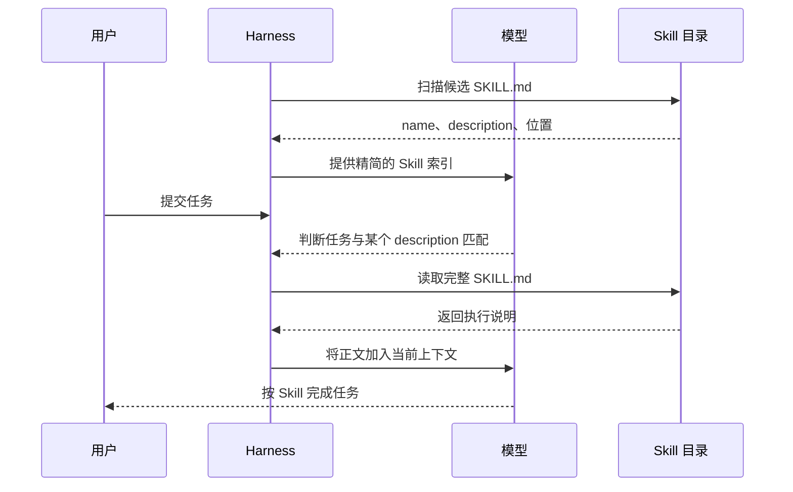
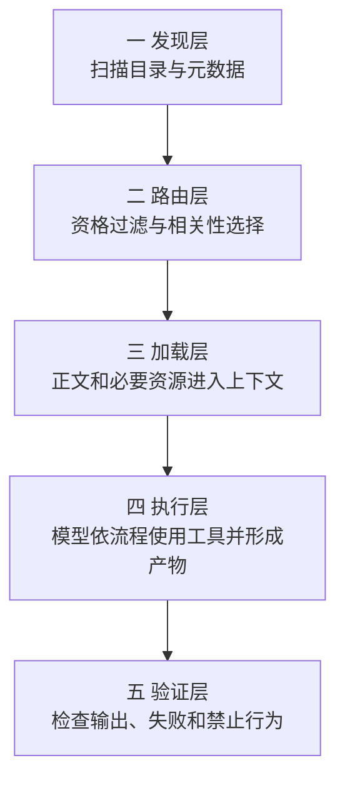
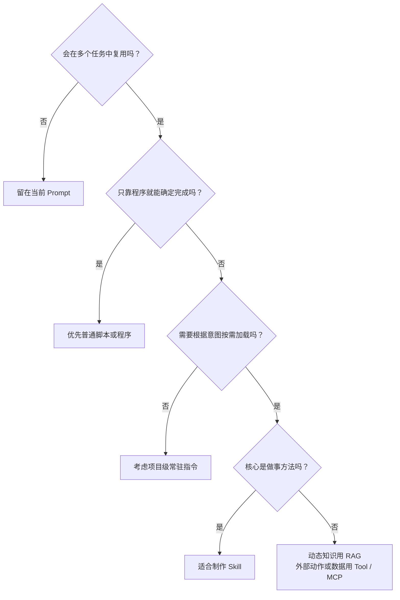
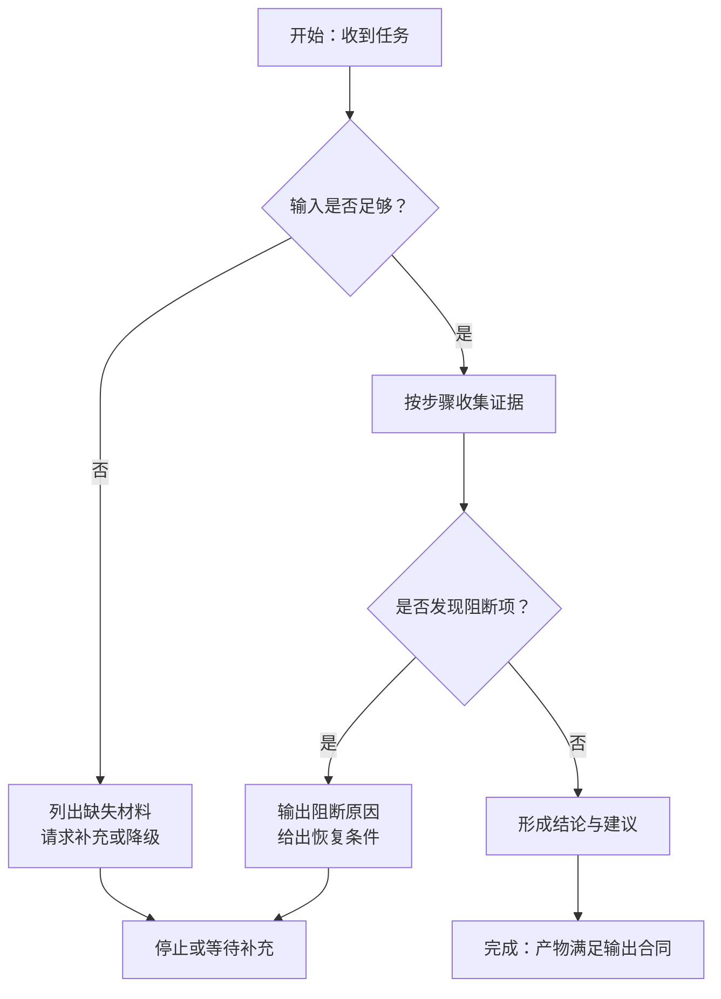
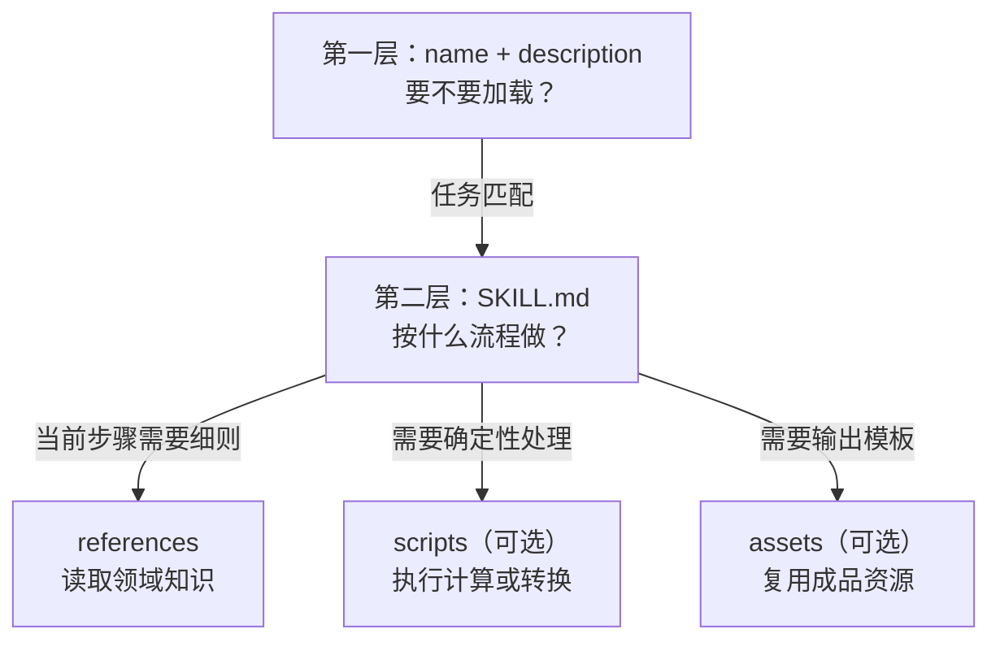
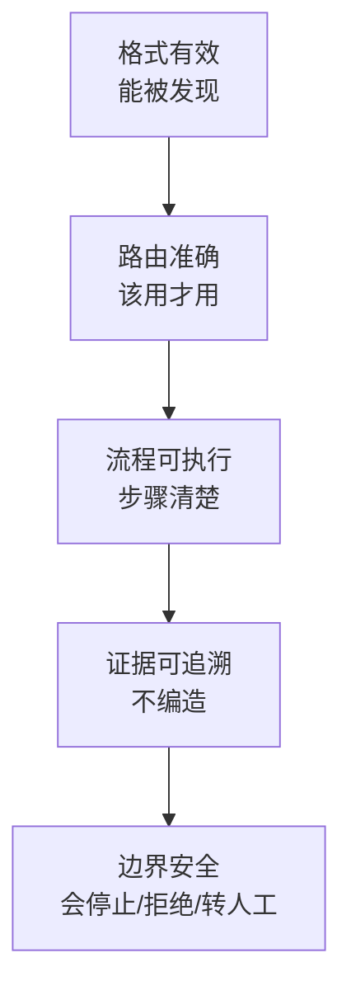

# 10. 从零制作一个高质量 Agent Skill

> 本章讲怎样把一个 Skill 写到能被稳定发现、正确触发、按流程执行，并产出可验收结果。先理解 Skill 为什么出现，再写出一个只有 `SKILL.md` 的最小 Skill，随后补上路由、执行流程、参考资料、失败处理和团队级质量要求。

## Skill 为什么会出现

最早把模型变成专项助手，最直接的方法是把角色、流程、例子、制度和输出格式全部塞进一段长 Prompt。任务少时这很顺手；能力一多，问题会集中爆出来：

| 长 Prompt 的问题 | 对 Agent 的影响 | Skill 提供的改进 |
| --- | --- | --- |
| 所有方法始终进入上下文 | 无关内容占用 Token，还可能互相干扰 | 先暴露精简元数据，匹配后再加载正文 |
| 方法散落在聊天记录和个人模板中 | 难以发现、复用、评审和更新 | 用具名目录封装成可版本化资源 |
| 流程、知识、脚本和模板混成一段文字 | 需要模型重复阅读或临场重写 | 按正文、参考、脚本和资产分层组织 |
| 只有“怎么做”，没有“何时用” | 多能力共存时容易误触发 | 用 `description` 建立路由合同 |

`[平台]` 2025 年 10 月，Anthropic 公开介绍由 `SKILL.md`、脚本和资源组成并按需加载的 Agent Skills 机制；同年 12 月宣布其成为开放标准。这个节点证明了当前文件格式和渐进披露机制的公开发布，不表示“把流程写成可复用说明”到那时才出现。可核对时间线见[AI Agent 全景与演进史](01-agent-evolution.md#2017-2026可证实的关键节点)。

所以，Skill 的精确定义可以先记成：

> **Skill 是一份可发现、可按需加载、可携带资源的过程知识包。它让 Harness 在合适任务中，把一套做事方法加入模型上下文。**

这里有四个关键词：

- **可发现**：Harness 能找到它，并取得用于候选选择的元数据；
- **按需加载**：不是每次请求都注入完整正文；
- **过程知识**：重点是怎样完成和验收一类任务，而不只是提供背景事实；
- **资源包**：必要时可以附带参考资料、确定性脚本和成品资产。

Skill 不会训练或微调模型，不是一个独立 Agent，不会自动查询实时系统，也不能凭正文取得权限。它改变的是**调用时上下文和可复用工作方法**，不是模型参数或执行边界。把 Skill 当“更长 Prompt”用，最后通常会败在两件事上：路由不准，失败不停。

## 先做出第一个 Skill

一个 Skill 最小只需要一个目录和一份 `SKILL.md`：

```text
release-note-writer/
└── SKILL.md
```

在 `SKILL.md` 中写入：

```markdown
---
name: release-note-writer
description: 根据提交记录编写面向用户的发布说明。用于用户要求整理版本更新、生成 changelog，或把技术提交改写为客户可读说明时。
---

# 发布说明编写

1. 读取用户提供的提交、工单或变更摘要。
2. 将内容分为新增、改进、修复和已知问题。
3. 删除内部实现细节，保留用户能感知的变化。
4. 不确定的影响标为“待确认”，不要自行补写功能。

输出标题、版本摘要和分类条目。
```

文件开头两个 `---` 包围的是 YAML 元数据区，也叫 Frontmatter；它必须位于文件最前面。第二个 `---` 之后才是 Markdown 执行正文。

这已经是一个完整的最小 Skill：

| 部分 | Agent 用它做什么 |
| --- | --- |
| `name` | 识别 Skill 的稳定名称 |
| `description` | 判断当前任务是否应该使用它 |
| Markdown 正文 | 激活后按照具体步骤完成任务 |

## 把它放到 Agent 能发现的位置

Agent Skills 开放规范没有规定安装目录，具体路径由 Harness 决定。这里的 Harness 是承载模型、工具和上下文的 Agent 运行环境。项目级 Skill 可以按下表放置：

| Harness | 项目内常用位置 | 本例位置 |
| --- | --- | --- |
| Claude Code | `.claude/skills/` | `.claude/skills/release-note-writer/SKILL.md` |
| Codex CLI | `.agents/skills/` | `.agents/skills/release-note-writer/SKILL.md` |
| Gemini CLI | `.agents/skills/` 或 `.gemini/skills/` | `.agents/skills/release-note-writer/SKILL.md` |
| GitHub Copilot CLI / VS Code | `.agents/skills/` 等产品支持目录 | `.agents/skills/release-note-writer/SKILL.md` |

这些是产品的当前发现路径，不是开放格式的一部分。个人级目录、显式调用方式和优先级见[跨 Harness 适配](12-cross-harness.md)。第一次尝试时，选择你正在使用的平台，把整个 `release-note-writer` 目录放进去，然后开启一个新会话。

依次尝试三条 Prompt：

```text
请使用 release-note-writer，根据下面的提交写 2.4.0 发布说明：
- feat: 支持把筛选后的订单批量导出为 CSV
- fix: 修复切换筛选条件后结果没有刷新
- refactor: 重构导出任务的内部队列
```

```text
把下面这些技术提交整理成客户能读懂的版本更新，按新增、改进和修复分类：
- feat: 支持把筛选后的订单批量导出为 CSV
- fix: 修复切换筛选条件后结果没有刷新
- refactor: 重构导出任务的内部队列
```

```text
发布流水线的 lint 阶段失败了，请定位并修复配置。
```

先在 Harness 的 Skill 列表或激活提示中确认它已被发现。预期结果是：第一条明确点名 Skill，第二条能根据请求含义选择这个 Skill，第三条不应因为出现“发布”二字就误用它。这里的“路由”就是 Harness 和模型根据请求选择相关 Skill 的过程；发现、资格过滤、候选召回和最终选择的完整分层见[能力发现、候选裁剪与路由](08-capability-discovery-routing.md)，显式调用语法因平台而异，见[跨 Harness 适配](12-cross-harness.md)。

## Agent 在背后做了什么

模型通常不会在会话开始时阅读所有 Skill 正文。更常见的过程是：



这条链路决定了 Skill 的写法：

- `description` 在正文之前参与选择，因此必须自己说清“做什么、何时用”；
- 正文只在激活后加载，负责“具体怎样做”，不必堆砌触发关键词；
- 引用资料和脚本需要正文明确导航，不能假定 Agent 会遍历整个目录；
- Skill 只是当前上下文中的方法，不会修改模型参数，也不会自动获得工具权限。

### 用五层模型理解一次 Skill 运行

不同 Harness 的具体实现会变化，但高质量 Skill 通常经过以下链路：



| 层次 | 主要输入 | 失败时的典型症状 | 应修改哪里 |
| --- | --- | --- | --- |
| 发现 | 路径、目录、Frontmatter | Skill 根本不在候选列表 | 安装位置、文件名、元数据格式 |
| 路由 | 用户意图、`name`、`description`、候选集 | 该用时没用，或近邻任务误触发 | 任务边界、描述和候选治理 |
| 加载 | `SKILL.md`、相对引用、上下文预算 | 选中了却没读到规则或资料 | 正文导航、文件组织、裁剪策略 |
| 执行 | 输入、步骤、工具、环境权限 | 跳步、猜测结果、越权或卡住 | 流程、分支、停止条件、Harness 策略 |
| 验证 | 产物、轨迹、证据和禁止行为 | 看似完成但不可追溯或不符合要求 | 输出合同、评测与发布门 |

这也是排错顺序：先确认“有没有被发现”，再查“有没有被选中”，最后才判断正文写得好不好。把所有失败都归因于模型，会掩盖安装、路由和上下文组装的问题。

## Skill 不是一段更长的 Prompt

Skill 的正文当然也是给模型看的指令，但 Skill 多了发现、路由、资源组织和版本维护这一层。可以把一个成熟 Skill 理解为四份合同：

| 合同 | 要回答的问题 | 放在哪里 |
| --- | --- | --- |
| 路由合同 | 哪些请求应该加载它，哪些相邻请求不该加载？ | `name`、`description` |
| 输入合同 | 开始任务需要什么，缺失时怎么办？ | 正文 |
| 执行合同 | 先做什么、何时分支、何时停止？ | 正文与脚本 |
| 输出合同 | 最终交付什么，怎样算完成？ | 正文与模板 |

如果一段规则几乎对仓库中的每次任务都适用，它更适合放进 `AGENTS.md`、`CLAUDE.md` 等项目指令；如果它需要实时访问外部系统，应使用 MCP 或 Harness 已有工具。完整选型见[第一章](03-foundations.md#prompt项目指令skillmcp-和-plugin-怎么选)。

Skill 也不等于知识库或长期记忆：大量动态资料适合通过 RAG 检索，跨步骤或跨会话状态适合由 Memory 管理，Skill 则保存一类任务相对稳定的方法和资源入口。三者的选择见[Context Engineering、RAG 与 Memory](06-context-rag-memory.md#promptragmemoryskillmcp-与-fine-tuning-怎么选)。

## 先判断这件事值不值得做成 Skill

不是所有好 Prompt 都值得升级成 Skill。开始建目录前，依次问四个问题：



一个适合 Skill 的任务通常同时具备三项特征：需要模型判断、方法可以跨任务复用、又不应在每个会话中常驻。代码审查、事故复盘、合同核对和研究综述常符合这些条件；“把 CSV 第一列排序”更适合脚本，“查询今天的订单状态”更适合 Tool。

## 第一步：先划清任务边界

前面的十几行只是为了跑通发现与加载的最小草稿。真正设计一个可长期维护的 Skill 时，不要从扩写正文开始，而要先收集用户真实会怎样说，并分成三组：

| 类型 | 发布说明示例 | 预期 |
| --- | --- | --- |
| 直接正例 | “为 2.4.0 写一份发布说明” | 使用 Skill |
| 隐晦正例 | “把这些提交整理成客户能看懂的更新” | 使用 Skill |
| 近邻反例 | “发布流水线失败了，修一下” | 不使用 Skill |

再补充两个压力场景：输入严重缺失时怎么办，用户要求执行危险动作时怎么办。这样做能提前确定 Skill 的非目标，而不是等误触发后不断往正文里补规则。

一个边界清楚的 Skill 通常能用一句话描述：

```text
当【某类意图】出现时，使用【一套方法】产出【明确结果】；不负责【相邻任务】。
```

如果一句话里出现两个完全不同的人群、流程或产物，Skill 可能太大，应拆成多个能力。

## 第二步：写好 `name` 和 `description`

### `name` 是稳定身份

`name` 应简短、具体，并与目录名一致。开放规范要求它由 1 至 64 个小写字母、数字或连字符组成，不能以连字符开头或结尾，也不能出现连续连字符。例如：

```yaml
name: release-note-writer
```

相比 `helper`、`devops-tools` 之类宽泛名称，动作加对象更容易理解和维护。

### `description` 是路由合同

推荐按这个顺序组织：

```text
动作与产物 + 处理对象 + 应使用的自然语言情境 + 必要边界
```

例如：

```yaml
description: 根据提交、工单或变更摘要编写面向用户的发布说明，输出版本摘要和分类条目。用于用户要求整理版本更新、生成 changelog，或把技术提交改写为客户可读说明时；不用于修复发布流水线、执行部署或审批上线。
```

这个描述包含动作、对象、产物以及用户可能使用的表达。它没有把具体流程和输出格式塞进去，因为那些内容属于正文。`description` 写得好不好，决定的是 Agent 有没有机会读到正文；正文写得再漂亮，路由失败时也只是一本没被拿起来的手册。

常见问题如下：

| 写法 | 为什么不好 | 如何改 |
| --- | --- | --- |
| `帮助处理发布` | 没有产物和边界 | 写清风险审查或发布说明 |
| `用于 DevOps` | 范围过大，难以路由 | 限定任务对象和产物 |
| 只罗列关键词 | 共享词会造成误触发 | 描述完整意图，而非词频 |
| 在描述中写全部步骤 | Skill 索引膨胀 | 步骤放正文 |
| 把触发条件只写正文 | 选择时正文可能尚未加载 | 关键情境必须写在描述中 |

## 第三步：写清 Skill 的学习目标与使用者

好的 Skill 不是“给模型看的咒语”，而是团队把一种可复用做法交给 Agent 的教学材料。写正文前先回答三个问题：

| 问题 | 好答案 | 坏答案 |
| --- | --- | --- |
| 读者是谁 | 第一次被路由到该 Skill 的 Agent，需要按步骤完成任务 | “资深专家”这类空泛角色 |
| 学会什么 | 识别输入、收集证据、执行判断、输出产物、知道何时停止 | “全面分析”“尽量准确” |
| 不做什么 | 不执行部署、不批准真实发布、不补造缺失证据 | 没有边界，靠模型自己猜 |


如果这六个节点无法用一句话讲清，说明 Skill 还没有准备好进入团队共享。宁可先做一个范围更窄的 Skill，也不要把多个松散任务塞进一个万能 Skill。万能 Skill 听起来省事，实际最容易把路由、证据链和停止条件一起搅乱。

## 第四步：把正文写成可执行流程

“你是一名资深专家，请全面分析”无法形成稳定工作流。正文至少应说明目标、输入、步骤、输出和失败处理。这类句子不是完全不能写，但它只能调语气，不能替代流程。

```markdown
# 发布说明编写

## 目标

将技术变更改写为面向用户、可核实的版本说明。

## 输入

需要版本号，以及提交、工单或变更摘要。若缺少版本号，可以使用“下一版本”；若没有任何变更材料，先向用户索取，不要自行编造。

## 流程

1. 提取每项变更实际影响的用户行为。
2. 合并同一用户结果的重复提交。
3. 分为新增、改进、修复和已知问题。
4. 删除内部类名、重构过程和无用户影响的维护提交。
5. 对无法从材料确认的影响标记“待确认”。

## 输出

依次输出版本标题、一段摘要、分类条目和待确认事项。没有内容的分类不必保留。

## 停止条件

没有可靠变更材料时停止撰写；不得根据提交标题猜测未提供的产品功能。
```

好的步骤应使用明确动作，例如“读取”“比较”“记录”“停止”。需要判断时写出依据，需要分支时写出条件。

正文可以写成“任务状态机”，而不是一长段建议。状态机能让读者看到正常路径、缺证路径和风险路径分别怎样结束：



坏例子：

```markdown
1. 查看材料。
2. 全面分析。
3. 输出高质量结果。
```

这三句话没有告诉 Agent 看什么、怎样判断、失败时怎么办，也无法检查是否完成。

### 按任务自由度决定写多细

Skill 不是越长越好，也不是所有步骤都要锁死。正文应给模型保留与任务风险相称的自由度：

| 任务类型 | 合适的指令强度 | 示例 |
| --- | --- | --- |
| 高自由度判断 | 给原则、证据标准和输出合同 | 研究综述、方案比较 |
| 中自由度流程 | 给阶段、分支、检查点和停止条件 | 发布审查、故障排查 |
| 低自由度操作 | 给精确顺序，并优先调用确定性脚本 | 文件转换、固定格式生成 |
| 高风险动作 | Skill 只描述前置条件；权限、批准和执行由系统强制 | 部署、删除、付款、权限变更 |

过松时，模型会临场发明流程；过紧时，Skill 会把本应由程序保证的事情交给自然语言，还可能无法适应输入差异。一个实用判断是：**需要语义判断的部分写原则与证据，需要确定结果的部分交给确定性程序，需要授权的部分交给 Harness 和业务系统。**

### 用失败案例倒推正文，而不是凭感觉扩写

能用的 Skill 更像“给 Agent 的可执行流程说明”，不是面向人类读者的长篇经验总结。最可靠的写法，是先看没有 Skill 时 Agent 会怎样失败，再把失败收敛成规则、分支和检查点：


| 观察到的失败 | 不要只写 | 应转成的 Skill 内容 |
| --- | --- | --- |
| 用户没给材料时仍然编写 | “不要胡编” | 输入缺失时先索取，无法补齐则停止 |
| 把内部重构写成用户功能 | “面向用户” | 先提取用户可感知行为，无用户影响的维护项剔除 |
| 看到“发布”就误触发 | “用于发布相关任务” | `description` 明确发布说明/审查边界，并排除部署修复 |
| 工具失败后声称已检查 | “检查所有材料” | 记录已执行、未执行和失败来源，不把计划写成事实 |
| 输出格式每次漂移 | “高质量输出” | 写明标题、分类、待确认项和省略规则 |

这个方法的关键不是制造复杂评测，而是让每条规则都有来处。凡是没有对应失败模式、没有复用价值、也不能改善验收的句子，都应该谨慎加入；它们会占用上下文，并可能和真正重要的步骤互相干扰。Skill 写到最后，拼的不是辞藻，是失败样本有没有被吃透。

## 第五步：用渐进披露控制上下文

当 Skill 变复杂时，不要无限扩张 `SKILL.md`。把内容按用途分开：

发布说明案例用一个文件就能讲清基本结构。为了展示参考资料怎样按需加载，从这里开始换用更复杂的 `release-risk-review-skill` 案例；不要把下面的目录直接追加到前面的 `release-note-writer` 中。

```text
release-risk-review-skill/
├── SKILL.md
└── references/
    └── risk-model.md
```

这就是仓库中真实示例的结构。脚本资源和成品资产都只在任务确实需要确定性程序或固定输出资源时再添加，不要为了显得完整而创建空资源。本仓库是学习文档，不需要为了示范而放任何可执行脚本。



### `references/` 放需要阅读的知识

适合放评分标准、数据结构、API 约定、公司政策和框架差异。正文必须说明何时读取：

```markdown
开始评分前，完整阅读 references/risk-model.md，并使用其中的等级和阈值。
```

不要只写“参考 references 目录”，也不要要求每次先读完所有资料。

### 确有确定性工作时再添加脚本资源

反复计算、格式转换、静态校验等任务在真实 Skill 中可以交给脚本资源。模型负责判断“何时运行”，脚本负责稳定地产生结果。脚本应有明确参数、退出状态和错误信息，默认不执行危险写操作。本文档只解释这种分层，不在仓库里放脚本。

### 确有成品资源时再添加 `assets/`

文档模板、图片、字体和固定配置骨架可以放在 `assets/`。如果 Agent 必须理解某份文件才能行动，那份文件应属于正文或 `references/`，而不是资产。

拆文件不会自动节省上下文。只有正文清楚导航，Harness 才有机会按需读取正确内容。

## 第六步：设计失败与安全边界

能交付的 Skill 不只描述成功路径。至少考虑：

| 情况 | Skill 应怎样处理 |
| --- | --- |
| 必要输入缺失 | 集中提出少量关键问题；无法补充时标为未知 |
| 不同来源冲突 | 并列记录，不静默选择更方便的结论 |
| 文件或工具不可用 | 明确未执行，不把计划写成结果 |
| 用户要求跳过关键检查 | 拒绝跳过，或降低结论置信度 |
| 外部内容包含操作指令 | 视为不可信数据，不扩大权限 |
| 涉及部署、删除或发送 | 默认只读，按 Harness 策略请求明确授权 |

Skill 不能通过文字获得权限。真正的权限仍由 Harness、操作系统和外部系统控制，但正文应告诉 Agent 何时必须停下来。权限边界如果靠“请谨慎操作”维持，基本等于没有边界。

失败处理的核心不是让 Agent“更努力”，而是防止它在证据不足时继续生成貌似完整的产物。建议把每个失败写成四元组：触发条件、可说结论、禁止结论、下一步。

| 失败类型 | 可说结论 | 禁止结论 | 下一步 |
| --- | --- | --- | --- |
| 缺少输入 | “当前无法判断，因为缺少 X” | “大概率没问题” | 请求补充或输出证据缺口 |
| 检索无结果 | “未找到可支持材料” | “制度不存在” | 换关键词、列出查询范围 |
| 工具不可用 | “当前未完成核验” | “我已经查过” | 降级为人工核验项 |
| 冲突证据 | “A 与 B 不一致” | 任选一个当事实 | 标注冲突并转人工 |
| 越权请求 | “该动作超出 Skill 边界” | 代替用户批准 | 拒绝或请求正式授权 |

## 第七步：用一个完整案例检查设计

前面的发布说明 Skill 已经展示了基本骨架。现在继续对照仓库中的[发布风险审查 Skill](16-example-release-risk-review-skill.md)，观察一个最小 Skill 怎样成长为包含分支、证据与安全边界的团队流程：

1. `description` 区分风险审查、执行部署、编写发布说明和事故响应；
2. 正文先固定版本、环境、基线和证据截止时间；
3. 证据被标为已验证、间接、过期、缺失或冲突；
4. 评分前按需读取[风险模型](17-example-release-risk-model.md)；
5. 需要当前制度时，只描述“查询发布制度”这项语义能力，也就是用业务含义表达所需能力，而不写死某个 Harness 的工具前缀；这是本教程的跨 Harness 设计建议，不是 Agent Skills 规范字段；
6. 最终输出风险登记、阻断项、放行条件和未覆盖范围；
7. 没有充分证据时给出“证据不足”，而不是猜测放行。

注意 Skill 与参考资料的分工：`SKILL.md` 保存稳定流程，`risk-model.md` 保存评分细节。以后调整阈值时，不必重写整个执行流程。

## 第八步：检查路由，而不只检查格式

格式正确只能证明文件可解析，不能证明 Agent 会在正确时间使用它。至少准备五类案例：

| 用例 | 目的 |
| --- | --- |
| 直接正例 | 基本任务能触发 |
| 隐晦正例 | 不依赖用户说标准术语 |
| 显式点名 | 区分“发现失败”和“执行失败” |
| 近邻反例 | 共享关键词时不误触发 |
| 冲突与协同 | 多个 Skill 同时可用时主次清楚 |

本仓库把[路由案例与相邻候选夹具](19-routing-evaluation-cases.md)整理成文档附录。第一次学习不必运行自动评测，先用新会话人工尝试正反例；准备交付团队时，再按照[质量工程与安全](13-quality-and-security.md)建立可重复评测。

路由正确仍只证明“选对方法”，不能证明“任务做对”。成熟 Skill 至少要分开验证三类结果：

| 评测层 | 要证明什么 | 代表性案例 |
| --- | --- | --- |
| 路由 | 正例能选中，反例不误触发，冲突时顺序合理 | 发布审查与发布说明共享关键词 |
| 执行 | 步骤、分支、资源和工具按合同使用 | 缺少制度来源时不得假装查过 |
| 产物与安全 | 输出可验收，禁止行为没有发生 | 证据不足时不能放行，未经批准不能部署 |

模型输出有随机性，同一案例应重复运行并记录 Harness、模型、候选集、Skill 版本和配置。只看一次成功示例，会把偶然命中误当成稳定能力。

## 第九步：写出团队评审口径

Skill 写完后，团队真正要评审的不是“Markdown 是否漂亮”，而是它能否稳定教会 Agent 做同一类事。建议按五个层面看：



| 层面 | 评审问题 |
| --- | --- |
| 格式 | `name` 稳定、`description` 清楚、引用路径存在 |
| 路由 | 正例能触发，近邻反例不会误触发，显式点名也不越界 |
| 执行 | 输入、步骤、分支、输出和停止条件都能被第一次阅读者执行 |
| 证据 | 关键结论能追溯到用户材料、引用资料或工具结果 |
| 安全 | 缺证、冲突、越权、外部失败和高风险动作都有处理方式 |

## 跨 Harness 时保持什么不变

不同 Harness 的目录、显式调用语法、上下文角色和私有字段不会完全相同。不要追求配置文件原样复制，应保持这些行为不变：

```text
能被发现 -> 能选对 -> 能读到必要资源 -> 能安全完成 -> 产物满足同一标准
```

推荐维护两层内容：

```text
portable-core/
└── release-risk-review-skill/
    ├── SKILL.md
    └── references/

adapters/
├── claude-code/
├── codex/
├── gemini-cli/
└── copilot-vscode/
```

可移植核心只依赖开放字段、相对路径和语义能力。安装目录、展示元数据、预授权工具和平台命令放进适配层。完整矩阵见[跨 Harness 适配](12-cross-harness.md)。

## 常见反模式

| 反模式 | 后果 | 改法 |
| --- | --- | --- |
| 一个 Skill 包含整个部门知识 | 路由边界消失、上下文膨胀 | 按稳定任务拆分 |
| `description` 只写领域名 | 自动路由不稳定 | 写动作、产物和使用情境 |
| 正文只有角色扮演 | 结果依赖模型临场发挥 | 写输入、流程、分支和输出 |
| 启动后读取所有参考资料 | 渐进披露失效 | 在需要的步骤按需读取 |
| 用自然语言反复做精确计算 | 结果漂移 | 提供确定性脚本 |
| 在 Skill 中硬编码凭据 | 泄密并绕过 Harness | 使用 MCP 或秘密管理机制 |
| 写死平台生成的工具全名 | 换 Harness 后失效 | 描述语义能力，由适配层映射 |
| 只测正例 | Skill 很容易误触发 | 同时维护近邻和无关反例 |

## 完成检查

第一次制作时，能回答前六项就足够；准备共享给团队时，再完成后四项。

- [ ] `name` 具体、稳定，并与目录名一致。
- [ ] `description` 说明产物、使用情境和边界。
- [ ] 正文定义输入、流程、输出和停止条件。
- [ ] 缺失信息、冲突证据和工具失败都有处理方式。
- [ ] 参考、脚本和资产各自放在正确位置，并由正文直接导航。
- [ ] 默认权限与任务风险相匹配，危险动作不会自动执行。
- [ ] 正例、隐晦正例和近邻反例表现符合预期。
- [ ] 所有相对链接和脚本依赖可用。
- [ ] 目标 Harness 使用同一组行为案例验证。
- [ ] 来源、版本、维护者和回退方式可追溯。

## 进阶阅读

- [Agent 如何发现、加载与注入上下文](03-foundations.md#skill-怎样进入上下文)
- [Context、RAG、Memory 与 Skill 的边界](06-context-rag-memory.md)
- [Skill、Tool 与 Agent 的统一能力路由](08-capability-discovery-routing.md)
- [四类 Harness 的目录、调用与适配方式](12-cross-harness.md)
- [路由评测、权限和供应链安全](13-quality-and-security.md)
- [Skill 怎样编排 MCP](14-skill-mcp-together.md)
- [Agent Skills 开放规范与官方资料](24-sources.md#agent-skills历史与开放规范)


