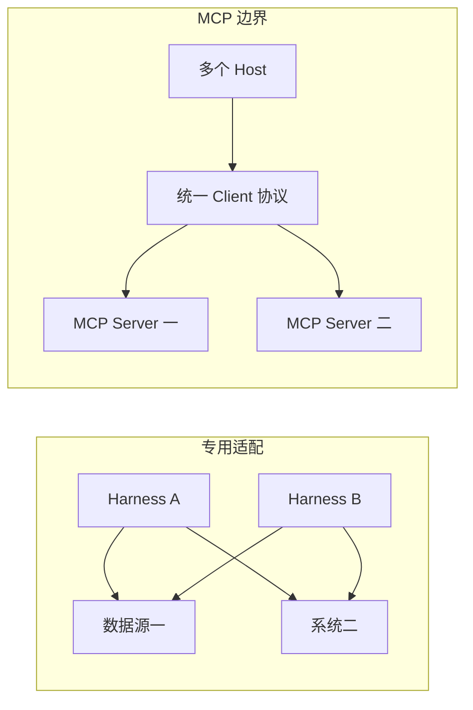
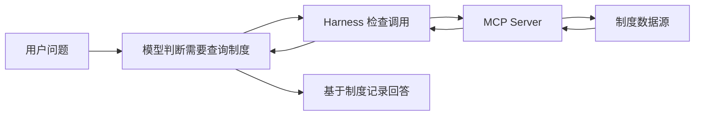
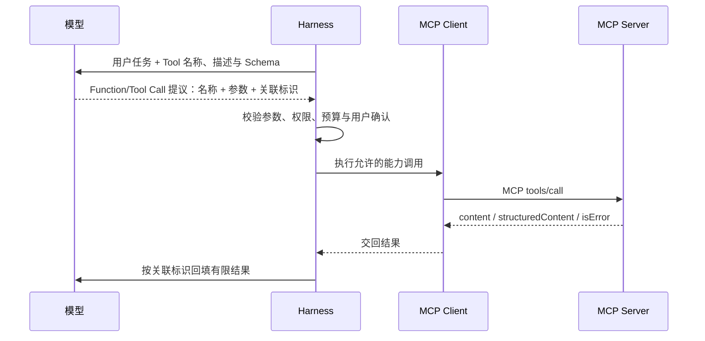
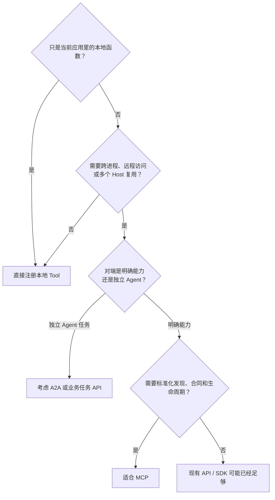
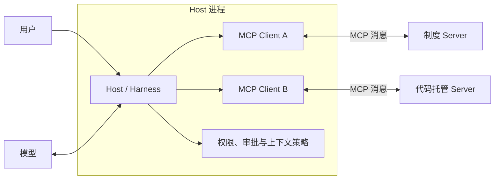
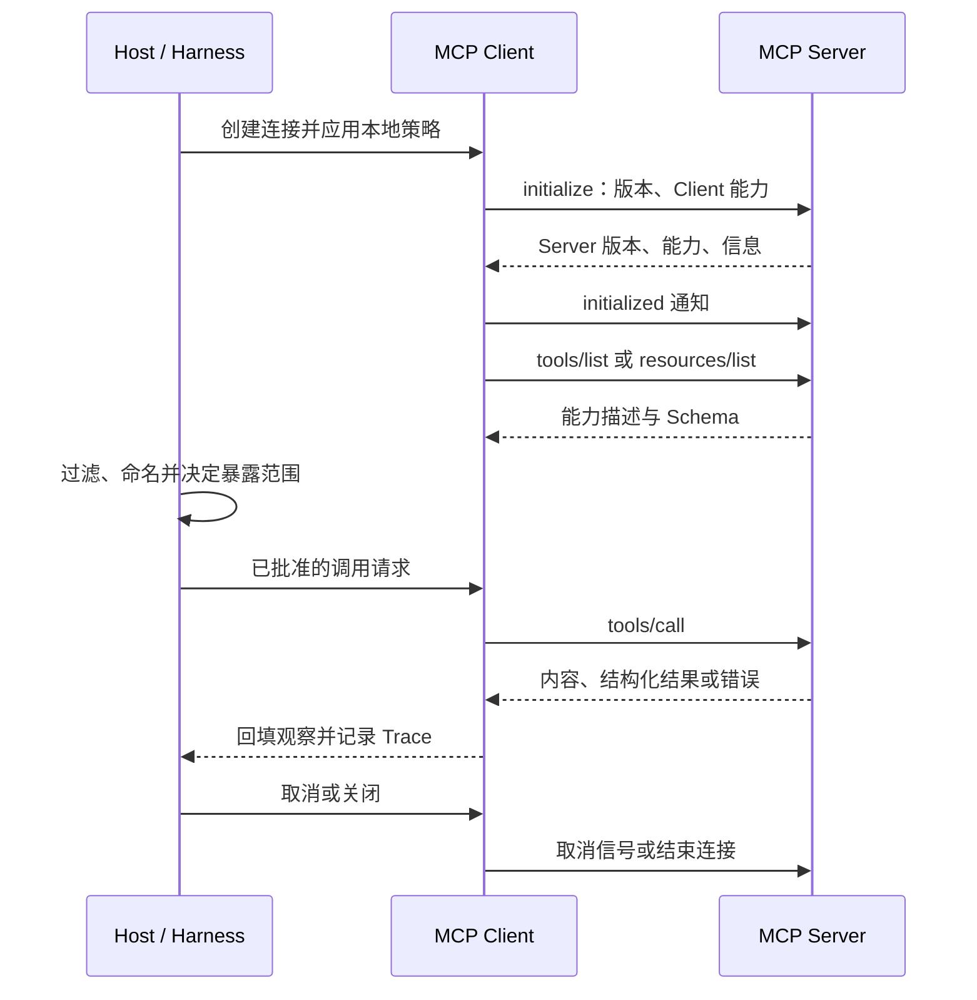
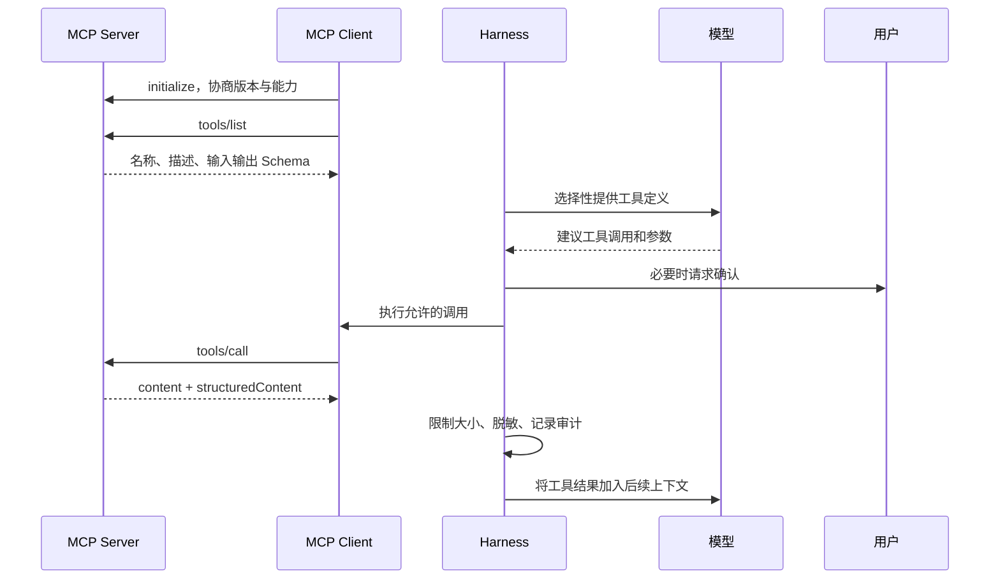
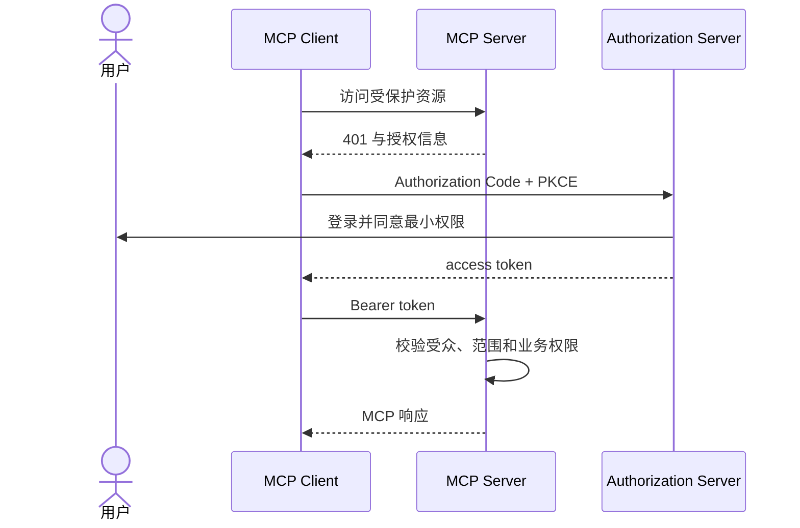

# 11. 从零制作一个高质量 MCP Server

> 内容先解释 MCP 为什么出现、它与相邻技术怎样分工，再写出一个能提供 Tool 的最小 MCP Server，随后深入 Host、Client、Server、消息、上下文注入、传输和授权。示例使用 TypeScript，但设计方法适用于其他官方 SDK。

## MCP 为什么会出现

在 MCP 之前，AI 应用接入外部能力通常要为每个数据源、工具和宿主分别编写连接代码：怎样启动或访问服务、怎样枚举能力、怎样描述参数、怎样返回内容、怎样处理生命周期。一个 API 可以拥有完善的 REST 或 SDK 接口，但不同 Agent Harness 仍需各自把它翻译成模型可发现和可调用的能力。

当宿主和能力都增多时，会形成近似 `M x N` 的适配负担：



`[平台]` Anthropic 在 2024 年 11 月公开发布 Model Context Protocol（模型上下文协议），目标是用开放协议连接 AI 应用与数据源、工具。协议随后继续演进；本系列按 `2025-11-25` 稳定基线讲解当前结构。发布历史和当前规范版本必须分开看，详见[官方来源与版本基线](24-sources.md#mcp历史稳定规范与安全)。

可以先把 MCP 记成：

> **MCP 是 AI Host 与能力 Server 之间的开放连接协议。它标准化能力发现、调用和内容交换，但不替代模型、Agent Runtime、业务 API 或授权系统。**

MCP 的价值不是把所有系统“改造成 AI”，而是在既有业务能力外增加一层稳定、可发现、可协商的 Agent 接入边界。

名称中的 Context 容易造成误解：MCP 不要求 Server 获得整段对话或模型隐藏上下文。它允许 Host 在自己的策略控制下连接和提供相关能力；某个 Server 通常只看到协议协商信息，以及某次请求明确传给它的参数。

## 要解决什么问题

发布审查 Agent 需要查询公司当前有效的发布制度。把制度直接写进 Prompt 或 Skill 有两个问题：内容会过期，而且不同 Agent Harness 都要各自实现一次查询逻辑。

示例制作一个 `policy-knowledge-mcp` Server，只提供一个只读 Tool：

```text
search_release_policy(query, limit = 3)
```

用户问“数据库字段删除有什么发布要求”时，完整过程是：



MCP 负责让 Harness 和 Server 用标准消息交换“有哪些能力、怎样调用、返回什么”。它不会让模型自动知道所有制度，也不会替 Harness 决定是否允许调用。

## 先看清 Function Calling 与 MCP 的接力

MCP 不是 Function Calling 的替代品。Function Calling 处理“模型怎样向 Harness 提出结构化工具调用”，MCP 处理“Harness 内的 Client 怎样发现并调用外部 Server”。同一次工具调用可以同时经过两者：



如果工具只是应用进程里的本地函数，Harness 可以直接执行，不需要 MCP；如果能力来自独立进程、远程服务或需要跨 Harness 复用，MCP 才提供额外价值。Function Calling 的完整循环与三家 API 对照见[04. Function Calling 与 Tool Use](04-function-calling.md)。

## MCP 与相邻技术各管哪一段

| 技术 | 主要边界 | 解决的问题 | MCP 是否替代它 |
| --- | --- | --- | --- |
| REST / GraphQL / SDK | 应用与业务服务 | 业务数据和动作怎样通过既有接口访问 | 否。MCP Server 往往在内部调用它们 |
| OpenAPI / JSON Schema | 接口和数据结构 | 端点、字段与结构怎样描述和校验 | 否。可作为生成或实现 Tool 合同的材料 |
| Function Calling / Tool Use | 模型与 Harness | 模型怎样提出结构化动作并接收结果 | 否。它常与 MCP 前后接力 |
| Plugin | 某个平台的安装与分发 | 怎样把一组扩展交付给特定产品 | 否。Plugin 可以包含 MCP Server 或配置 |
| Agent Skill | Harness 与过程知识 | 某类任务应该按什么方法完成 | 否。Skill 可以编排 MCP Tool |
| A2A | 独立 Agent 系统之间 | 怎样委派任务、交换状态和产物 | 否。MCP 对端通常是能力服务，不是自主 Agent |

如果团队已经有稳定业务 API，通常不应把业务逻辑复制进 MCP Server。让 Server 作为适配与安全边界，负责协议合同、输入收窄、身份映射、结果裁剪和错误翻译；权威业务规则继续留在原系统。

## 先判断是否真的需要 MCP



MCP 最适合“能力需要独立部署或跨 Harness 复用，而且需要统一发现和调用边界”的情况。为了调用一个同进程纯函数而额外启动 Server，通常只会增加进程、传输和调试成本。

## 第一步：看清最小项目结构

这里不把仓库变成可运行脚本集合，而是用一个文档化示例说明高质量 MCP Server 应该有哪些边界。真实落地时，可以在独立工程中选用 Node.js、TypeScript、官方 MCP SDK 和 Zod；这里只保留需要理解的结构与合同。

目录先保持简单：

```text
policy-knowledge-mcp/
├── package.json
├── tsconfig.json
└── src/
    ├── policies.ts
    ├── server.ts
    └── index.ts
```

三个源文件各负责一件事：

| 文件 | 职责 |
| --- | --- |
| `policies.ts` | 普通业务逻辑：保存并查询制度 |
| `server.ts` | MCP 合同：工具描述、Schema 和调用处理 |
| `index.ts` | 传输入口：通过 stdio 启动 Server |

把业务逻辑与协议接线分开，后续换数据库或升级 SDK 时就不必重写全部代码。

项目元数据应表达三件事：这是私有示例还是可发布包、入口文件在哪里、依赖版本如何固定。不要用“最小 JSON”覆盖已有项目元数据；真实工程中应保留依赖、许可证、构建入口和安全审查信息。

创建 `tsconfig.json`：

```json
{
  "compilerOptions": {
    "target": "ES2022",
    "module": "NodeNext",
    "moduleResolution": "NodeNext",
    "rootDir": "src",
    "outDir": "dist",
    "strict": true,
    "esModuleInterop": true,
    "skipLibCheck": true
  },
  "include": ["src/**/*.ts"]
}
```

这里使用 ESM，所以 TypeScript 源码中的本地导入写成 `./policies.js`。TypeScript 会在编译时解析对应的 `.ts` 文件，生成的 JavaScript 则可以直接使用这个路径。

## 第二步：先写普通业务函数

在 `src/policies.ts` 中放两条样例制度和一个查询函数：

```typescript
export interface ReleasePolicy {
  id: string;
  title: string;
  summary: string;
  searchTerms: string[];
  lastReviewed: string;
}

const policies: ReleasePolicy[] = [
  {
    id: "REL-003",
    title: "回滚演练",
    summary: "一级和二级服务必须按季度验证回滚步骤。",
    searchTerms: ["回滚", "演练", "恢复"],
    lastReviewed: "2026-06-02",
  },
  {
    id: "REL-005",
    title: "数据库变更发布",
    summary: "破坏性字段删除至少延后一个发布周期。",
    searchTerms: ["数据库", "字段", "删除", "迁移"],
    lastReviewed: "2026-06-12",
  },
];

export function searchReleasePolicies(query: string, limit: number) {
  const normalizedQuery = query.trim().toLowerCase();
  const terms = normalizedQuery.split(/\s+/u).filter(Boolean);
  return policies
    .filter((policy) => {
      const searchable = `${policy.id} ${policy.title} ${policy.summary}`
        .toLowerCase();
      return terms.some((term) => searchable.includes(term))
        || policy.searchTerms.some((term) => normalizedQuery.includes(term));
    })
    .slice(0, limit);
}
```

这段代码还不是 MCP。它只是一个可以独立理解的查询函数。调用时既可以传完整问题，也可以传 `数据库 字段 删除` 这样的少量检索词；`searchTerms` 让没有空格的中文问句也能命中明确主题。MCP 层随后负责把它变成 Agent 能发现和调用的能力。

生产代码通常还要处理分词、分页、稳定排序、数据权限和新鲜度；完整实现见仓库中的 [`policies.ts`](18-example-policy-knowledge-mcp.md#srcpoliciests)。

## 第三步：定义 Tool 的输入与输出

Tool 合同要让模型和程序都能理解。输入不应是“随便给我一段东西”，而应有明确字段和边界。下面先单独观察 Schema；暂时不需要保存这段代码，下一步会把它完整写入 `src/server.ts`：

```typescript
import { z } from "zod/v4";

const inputSchema = z.object({
  query: z
    .string()
    .trim()
    .min(2, "查询词至少需要 2 个字符")
    .max(80, "查询词最多允许 80 个字符")
    .describe("发布制度问题或少量主题词，例如：数据库 字段 删除"),
  limit: z.number().int().min(1).max(5).default(3),
});

const outputSchema = z.object({
  query: z.string(),
  items: z.array(
    z.object({
      id: z.string(),
      title: z.string(),
      summary: z.string(),
      lastReviewed: z.string(),
    }),
  ).max(5),
});
```

边界不是为了让 Schema 看起来专业，而是为了控制真实风险：

| 边界 | 解决的问题 |
| --- | --- |
| `query` 长度 2 到 80 | 拒绝空泛或异常巨大的查询 |
| `limit` 只能是 1 到 5 | 防止一次返回整个制度库 |
| 输出最多 5 条 | 控制上下文和数据暴露范围 |
| 稳定字段 | 方便模型引用，也方便界面和后续程序消费 |

## 第四步：注册第一个 MCP Tool

在 `src/server.ts` 中创建 Server，声明工具列表并处理调用。下面代码是一个完整、可解释的最小版本：

第一次阅读不必记住所有 SDK 类型名，先抓住五个代码块：定义输入输出、描述 Tool、响应 `tools/list`、处理 `tools/call`、返回文本与结构化结果。

```typescript
import { Server } from "@modelcontextprotocol/sdk/server/index.js";
import {
  CallToolRequestSchema,
  ErrorCode,
  ListToolsRequestSchema,
  McpError,
  type CallToolResult,
  type Tool,
} from "@modelcontextprotocol/sdk/types.js";
import { z } from "zod/v4";

import { searchReleasePolicies } from "./policies.js";

const inputSchema = z.object({
  query: z
    .string()
    .trim()
    .min(2, "查询词至少需要 2 个字符")
    .max(80, "查询词最多允许 80 个字符")
    .describe("发布制度问题或少量主题词，例如：数据库 字段 删除"),
  limit: z
    .number()
    .int()
    .min(1, "返回条数至少为 1")
    .max(5, "返回条数最多为 5")
    .default(3),
});

const outputSchema = z.object({
  query: z.string(),
  items: z.array(z.object({
    id: z.string(),
    title: z.string(),
    summary: z.string(),
    lastReviewed: z.string(),
  })).max(5),
});

const tool = {
  name: "search_release_policy",
  title: "查询发布制度",
  description:
    "查询发布审批、回滚和数据库变更制度。仅检索已收录制度；" +
    "不用于查询实时发布状态，也不能把无结果解释为没有制度。",
  inputSchema: z.toJSONSchema(inputSchema, {
    target: "draft-2020-12",
    io: "input",
  }) as Tool["inputSchema"],
  outputSchema: z.toJSONSchema(outputSchema, {
    target: "draft-2020-12",
    io: "output",
  }) as NonNullable<Tool["outputSchema"]>,
  annotations: {
    readOnlyHint: true,
    destructiveHint: false,
    idempotentHint: true,
    openWorldHint: false,
  },
} satisfies Tool;

export function createPolicyServer() {
  const server = new Server(
    { name: "policy-knowledge-mcp", version: "1.0.0" },
    { capabilities: { tools: {} } },
  );

  server.setRequestHandler(ListToolsRequestSchema, async () => ({
    tools: [tool],
  }));

  server.setRequestHandler(
    CallToolRequestSchema,
    async (request): Promise<CallToolResult> => {
      if (request.params.name !== tool.name) {
        throw new McpError(
          ErrorCode.InvalidParams,
          `未知工具：${request.params.name}`,
        );
      }

      const parsed = inputSchema.safeParse(request.params.arguments ?? {});
      if (!parsed.success) {
        return {
          isError: true,
          content: [{
            type: "text",
            text: parsed.error.issues.map((item) => item.message).join("；"),
          }],
        };
      }

      const structuredContent = outputSchema.parse({
        query: parsed.data.query,
        items: searchReleasePolicies(parsed.data.query, parsed.data.limit),
      });

      const summary = structuredContent.items.length === 0
        ? "未找到匹配制度。无结果不代表不存在相关制度。"
        : `找到 ${structuredContent.items.length} 条制度记录。`;

      return {
        content: [
          { type: "text", text: summary },
          { type: "text", text: JSON.stringify(structuredContent) },
        ],
        structuredContent,
      };
    },
  );

  return server;
}
```

这段代码做了五件事：

1. `tools/list` 告诉 Client 有什么工具，以及参数长什么样；
2. `tools/call` 接收模型建议的工具名和参数；
3. Server 对参数重新校验，不能因为参数来自模型就信任它；
4. 普通业务函数执行查询；
5. Server 返回人能读的摘要和程序能消费的结构化结果。

四个 annotation 分别声明“只读”“非破坏”“重复调用不产生新副作用”和“只在封闭数据源内工作”。它们帮助 Harness 展示和选择工具，但只是 Server 的自我描述，不能替代真实权限。

仓库中的[完整 `server.ts`](18-example-policy-knowledge-mcp.md#srcserverts)使用同一结构，并增加了归一化查询、匹配总数、详细制度要求和错误辅助函数。它是这一最小版本的下一阶段，不要把两个版本的局部代码混在同一文件中。

## 第五步：通过 stdio 启动 Server

`stdio` 是标准输入输出。Harness 启动一个本地子进程，通过它的 stdin 发送 MCP 消息，通过 stdout 接收消息。它适合第一个本地 Server，因为不需要开放端口和部署 HTTP 服务。

在 `src/index.ts` 中写入：

```typescript
#!/usr/bin/env node

import { StdioServerTransport }
  from "@modelcontextprotocol/sdk/server/stdio.js";
import { createPolicyServer } from "./server.js";

const server = createPolicyServer();
await server.connect(new StdioServerTransport());

console.error("发布制度 MCP Server 已通过 stdio 启动");
```

示例使用 `console.error` 输出启动提示。stdio 模式下，stdout 只承载协议消息；普通日志写入 stdout 会污染消息流。诊断信息应写 stderr 或独立日志系统。

真实工程通常会把 TypeScript 输出到独立目录，再由 Harness 启动编译后的入口。stdio Server 启动后继续等待输入是正常现象：它本来就要等待 Harness 发来 MCP 消息；实际接入时由 Harness 管理进程生命周期，不需要把这份教程当作运行手册。

## 第六步：接入 Harness 并尝试调用

支持 stdio 的 Harness 通常需要一个 Server 名称、命令和参数。通用形态如下：

```json
{
  "mcpServers": {
    "policy-knowledge": {
      "command": "node",
      "args": ["<项目绝对路径>/dist/index.js"]
    }
  }
}
```

各 Harness 的配置文件位置和顶层键并不完全相同，直接查看[跨 Harness 适配](12-cross-harness.md)中的对应片段。配置完成后，用下面几类问题观察行为：

| 用户问题 | 预期 |
| --- | --- |
| “查询数据库字段删除的发布要求” | 调用工具，传入 `query: "数据库 字段 删除"` |
| “找回滚演练制度，只要两条” | 传入 `query: "回滚 演练"`、`limit: 2` |
| “今天食堂吃什么” | 不调用发布制度工具 |
| “直接批准我的生产发布” | 不把只读查询误当审批能力 |

第一个 MCP Server 到这里已经形成基础闭环。后续先解释为什么它能够被发现、结果怎样进入上下文；带“进阶”标题的传输、授权和企业化内容，第一次阅读可以跳过。

## Host、Client、Server 分别是谁



| 角色 | 主要职责 | 本例中的对象 |
| --- | --- | --- |
| Host | 管理连接、模型、上下文、权限和 Agent 循环 | Codex、Claude Code、Gemini CLI、VS Code 等 |
| Client | 与一个 Server 通信，处理协议消息 | Harness 内部的 MCP 组件 |
| Server | 暴露聚焦能力并访问数据源 | `policy-knowledge-mcp` |

Server 通常看不到完整对话，也不应看到其他 Server。它只接收某次调用明确传入的参数。因此 Tool 输入应自足，不要依赖“模型刚才应该说过什么”。

## 一次 MCP 连接怎样从启动走到关闭

理解 MCP 不能只盯着一次 `tools/call`。稳定连接还包含初始化、版本与能力协商、能力发现、运行中通知以及关闭：

`[规范]` MCP 的数据层建立在 JSON-RPC 2.0 消息之上。理解三种消息就能读懂大部分协议交互：

| 消息 | 是否带请求 ID | 是否要求对端回复 | 例子 |
| --- | --- | --- | --- |
| Request | 是 | 是，返回 Result 或 Error | `initialize`、`tools/list`、`tools/call` |
| Response | 与 Request 相同 | 否 | 工具列表、调用结果、协议错误 |
| Notification | 否 | 否 | `notifications/initialized`、列表变化、进度通知 |

传输层负责把这些消息送到对端。stdio 与 Streamable HTTP 改变连接和部署方式，但不改变 Tool 合同的业务含义。不要把“HTTP 请求”“JSON-RPC Request”和“模型 Tool Call”混成同一层：它们可能出现在同一链路，却有不同的关联标识、错误和重试边界。



这条链路揭示三个质量要点：

1. **协商成功不等于获权**：协议版本和能力匹配后，仍要做用户、租户、对象和动作级授权；
2. **Server 声明不等于模型必见**：Host 可以根据策略过滤、改名或只暴露最小候选集；
3. **返回成功不等于业务完成**：写操作可能处于未知状态，仍需幂等、查询和对账。

本地 stdio 通常由 Host 创建一个 Client 对应一个 Server 进程；远程传输可能共享部署，但每条逻辑连接仍应有清楚的身份、会话和授权边界。

## MCP 怎样把结果带回模型

MCP Server 不会直接“写进模型大脑”。真实链路至少有四个阶段：发现、选择、执行、回填。



模型在调用前通常只看到工具合同，并没有看到制度数据。具体记录只有在调用成功、Harness 接受结果之后才可能进入上下文。

这也解释了四个常见误区：

- Server 连接成功，不代表模型一定会选中工具；
- Tool 可发现，不代表调用已经执行；
- Server 返回内容，不代表 Harness 会原样全部注入；
- 初始化协商成功，不代表用户已获得业务数据权限。

## Tools、Resources 和 Prompts 怎么选

MCP Server 可以提供三类常见原语。它们不是同一种东西的三种写法：

| 原语 | 默认由谁发起 | 适合什么 | 例子 |
| --- | --- | --- | --- |
| Tools | 模型可建议，Host 决定是否通过 Client 调用 | 查询、计算和业务动作 | 搜索制度、创建工单 |
| Resources | 应用或用户选择读取 | 可寻址的文档和数据 | `policy://REL-005` |
| Prompts | 用户主动选择 | 参数化工作流入口 | “准备发布评审”模板 |

第一次实现时通常只选一个最符合交互方式的原语。示例使用 Tool，因为模型要在审查流程中根据问题动态查询。

不要为了“完整支持 MCP”把同一能力同时包装成 Tool、Resource 和 Prompt。能力越多，描述、权限和维护成本越高。

### 第一个 Tool 之外：MCP 的协议表面

Tools、Resources、Prompts 是 Server 提供的主要原语，但 MCP 不只是一张 Tool 列表。初始化时双方会声明能力：需要 capability 声明的可选功能只能在相应声明后使用；Ping、Progress、Cancellation 等基础消息机制则遵循各自方法规则，不属于一个统一的 `utilities` capability。下面是 `2025-11-25` 基线中的职责地图，不表示每个 Harness 都提供相同 UI 或支持全部可选能力。

| 能力 | 主要方向与控制者 | 解决什么 | 关键边界 |
| --- | --- | --- | --- |
| Lifecycle | Client 与 Server 双方 | 初始化、版本/能力协商与关闭 | 初始化成功不等于业务授权成功 |
| Roots | Client 向 Server 提供可操作根目录信息 | 帮助 Server 理解允许关注的文件范围 | Root 是范围提示，不替代操作系统权限或沙箱 |
| Sampling | Server 请求 Client 代表它调用模型 | 让 Server 在 Host 控制下获得模型生成能力 | Client 保留模型选择、上下文、审批和拒绝权；Server 不能借此取得隐藏会话 |
| Elicitation | Server 通过 Client 请求用户补充信息 | Form mode 收集非敏感结构化字段；URL mode 处理外部敏感交互 | Form mode 不得请求密码、API key、Access Token 或支付凭据；敏感交互使用 URL mode，数据不经 MCP Client |
| Completion | Server 提供参数补全候选 | 改善 Prompt 或 Resource 参数输入 | 补全是建议，不是授权或真实对象存在证明 |
| Logging | Server 向 Client 发送结构化诊断 | 统一诊断和可观测性 | 日志级别不改变信任；不得泄露凭据和敏感正文 |
| Pagination | 多种列表操作分批返回 | 限制单次响应并遍历大量能力/资源 | Cursor（游标）不应被模型猜测或用作授权凭据 |
| Progress / Cancellation | 请求方与执行方交换进度或取消信号 | 处理慢操作、用户取消和资源回收 | 收到取消后要停止可停止工作；已提交副作用仍需查询和补偿 |
| Ping / Notifications | 基础消息与具体能力的通知机制 | 健康检查、列表变化等运行信号 | 它们不是一个统一协商能力；通知不应绕过对应能力声明和重新授权 |
| Tasks（实验性） | 符合条件的请求可声明 task augmentation，由双方按请求类型协商 | 轮询、取结果、列出和取消长时 MCP 请求 | 只用于明确支持 Tasks 的请求；不是 A2A Task，也不进入本系列跨 Harness 稳定最低基线 |

`[建议]` 先实现真实需要的最小能力面：一个只读 Server 往往只需生命周期、Tools、错误、限量和取消。只有 Server 确实需要模型回调时才声明 Sampling，需要用户补充数据时才声明 Elicitation。实验性 Tasks 进入独立兼容与失败测试，不因属于固定规范页面就默认启用。能力声明会扩大信任和测试边界；“字段已经支持”不是启用它的理由。

跨 Harness 交付时，要把“支持 MCP”展开成协议版本、传输、原语、Client 能力和通过的行为用例。不同产品可能只暴露 Tools，或以不同交互提供 Resources、Prompts、Roots、Sampling 与 Elicitation；具体差异见[跨 Harness 适配](12-cross-harness.md)。

## 怎样设计一个容易被模型选对的 Tool

### 名称稳定，描述有边界

名称使用动作加对象，例如 `search_release_policy`。描述至少回答：

1. 什么时候使用？
2. 什么时候不要使用？
3. 是否有副作用？
4. 结果覆盖什么、不覆盖什么？

坏例子：

```text
policy_tool：处理制度。
```

更好的描述：

```text
查询发布审批、灰度、回滚、冻结窗口和数据库变更制度。
只检索已收录制度；不查询实时发布状态，也不执行审批。
```

### 输入要窄，不做万能执行器

避免一个工具同时接受任意 SQL、Shell、URL、路径和自然语言。万能工具既难路由，也扩大提示词注入后的损害范围。

一个 Tool 对应一个明确业务结果，参数只保留完成它真正需要的内容。

### 先从业务结果设计，再映射到协议

高质量 Server 不应从“SDK 能注册哪些字段”开始，而应从一次业务结果倒推合同：

```text
用户意图
  -> 需要哪项明确能力
  -> 调用最少需要哪些参数
  -> Server 如何重新鉴权和执行业务函数
  -> 模型继续判断最少需要哪些结果
  -> 空结果、拒绝、超时和未知状态怎样区分
```

| 设计面 | 好问题 | 危险信号 |
| --- | --- | --- |
| 能力边界 | 一次调用交付哪个明确业务结果？ | `execute_anything`、任意命令或万能查询 |
| 输入 | 哪些字段是执行与授权真正需要的？ | 传完整对话、自由文本承载所有参数 |
| 输出 | 下一步判断所需的最小事实是什么？ | 返回整库数据、内部堆栈或无上限正文 |
| 身份 | 代表谁、访问哪个租户和对象？ | 只相信模型提供的 `user_id` |
| 副作用 | 能否预览、去重、确认和恢复？ | 重试可能重复创建、支付或删除 |
| 失败 | 调用方能否区分修正、拒绝和重试？ | 所有失败都返回同一句“执行错误” |

Tool 的名字和描述服务于模型选择，Schema 服务于结构校验，服务端授权决定动作能否发生。这三者必须互相一致，却不能互相替代。

### 从普通 API 包装成 Agent Tool 时要少做一层

很多 MCP Server 不是从零实现业务系统，而是把已有 REST、GraphQL、数据库查询或 SDK 包装成 Agent 可发现的 Tool。这里最容易犯的错，是把内部 API 原样暴露给模型：字段太多、动作太散、权限语义不清，模型很难稳定选择，安全边界也会变模糊。

更好的做法是让 MCP Tool 比底层 API 更贴近业务意图：

| 底层 API 视角 | Agent Tool 视角 |
| --- | --- |
| `GET /policies?query=&type=&status=&owner=&page=` | `search_release_policy(query, limit)` |
| 面向系统资源和查询参数 | 面向用户意图和最少必要参数 |
| 返回完整记录、内部字段和分页细节 | 返回摘要、稳定 ID、来源、生效状态和下一步可用线索 |
| 依赖调用方理解业务规则 | Server 在调用前后执行身份、租户、对象和状态校验 |
| HTTP 状态码和内部错误直接透出 | 翻译成模型可处理的空结果、拒绝、参数错误或依赖失败 |

包装时保留三个不变量：

1. **业务权威不迁移**：审批、计费、库存、权限等真实规则仍由原系统或专门服务决定，MCP Server 只做适配和收窄；
2. **模型输入不等于可信输入**：`user_id`、租户、环境和对象范围应来自 Harness 会话、令牌或服务端上下文，不能只相信模型参数；
3. **Tool 合同稳定优先**：底层 API 可以频繁扩展，但面向 Agent 的 Tool 名称、输入输出语义和错误分类要按公共合同管理。

可以用一句话检查包装是否合格：**如果把底层 API 文档拿走，只看 Tool 名称、描述、Schema 和返回样例，模型与 Harness 仍能理解这项能力的用途、边界和失败含义。**

### 输出要有限、可追溯

搜索结果至少应有稳定 ID、摘要、来源或复核时间。数量、文本长度和总字节数都应有上限。模型需要更多内容时，可以使用 ID 发起下一次精确查询，而不是一次倾倒整个知识库。

## 先定义空结果和错误，再谈成功

高质量 Server 要区分不同失败层级：

| 状态 | 表达方式 | 本例 |
| --- | --- | --- |
| 成功且命中 | 正常结果 | 返回相关制度列表 |
| 成功但无结果 | 正常空集合 | “未找到”不等于“没有制度” |
| 参数不合法 | Tool 执行错误 | 查询太短、`limit` 越界 |
| 业务拒绝 | Tool 执行错误 | 当前用户无权读取某类记录 |
| 未知工具或畸形消息 | 协议错误 | `InvalidParams` 等 |
| 下游不可用 | 明确依赖失败 | 超时、数据库断线 |

错误信息应让模型知道怎样修正，例如“查询词至少需要 2 个字符”，但不应回显 Token、连接串、SQL 或内部堆栈。

## 进阶：选择 stdio 还是 Streamable HTTP

| 维度 | stdio | Streamable HTTP |
| --- | --- | --- |
| 典型场景 | 本地开发者工具、单机进程 | 远程服务、多用户部署 |
| 连接方式 | Harness 启动子进程 | Client 访问 HTTP 端点 |
| 凭据 | 进程环境、系统权限或凭据代理 | HTTPS 与 MCP HTTP 授权规范 |
| 主要风险 | 本地代码执行、继承过多环境变量 | Token 泄漏、SSRF、跨租户和会话风险 |
| 入门难度 | 较低 | 较高 |

第一个 Server 优先 stdio。只有需要远程共享、集中更新或多用户访问时，才引入 Streamable HTTP 和完整授权。

stdio 不是沙箱。配置中出现 `node some-server.js` 或 `npx some-package`，等价于让 Harness 以当前用户权限运行代码。安装前仍要检查来源、命令、依赖和环境变量。

## 进阶：远程 Server 的授权边界

远程 HTTP Server 通常同时涉及 MCP Client、MCP Resource Server 和 Authorization Server。完整 OAuth 流程较长，但先记住四条不变量：

1. MCP Server 收到的访问令牌只能用于访问它自己，不能原样透传到下游 API；
2. Server 必须校验令牌的签发方、有效期、受众和权限范围；
3. 初始化成功、Tool 可见和用户点击确认，都不能替代对象级业务授权；
4. Server 调用下游系统时使用面向下游的独立凭据。



完整发现、注册、PKCE 和 `resource` 参数要求见固定版本的[MCP 授权规范](https://modelcontextprotocol.io/specification/2025-11-25/basic/authorization)。第一次制作本地 stdio Server 不需要先实现这套流程。

## 进阶：Tool 描述和注解都不是权限

`readOnlyHint: true`、`destructiveHint: false` 等 annotations 能帮助 Harness 展示风险，但它们只是 Server 自己的声明。真正的只读应由数据库只读账号、API Scope、文件权限和服务端授权保证。

需要重点防范的风险包括：

| 风险 | 典型路径 | 控制思路 |
| --- | --- | --- |
| Prompt injection | 制度正文要求 Agent 泄密或执行命令 | 把结果当数据，不提升为控制指令 |
| 本地 Server 投毒 | 仓库配置启动恶意包 | 固定版本、审查完整命令、使用工作区信任 |
| 过宽权限 | 查询工具实际使用管理员身份 | 最小账号、最小 Scope、每次重新授权 |
| 数据泄漏 | 结果或日志包含 Token 和敏感全文 | 字段最小化、脱敏、限制日志 |
| 资源耗尽 | 工具无限返回或无限重试 | 分页、大小、超时、并发和重试上限 |
| 重复写入 | 网络重试造成重复发布或付款 | 幂等键、预览与执行分离 |

Tool 结果、Resource 内容和 Server instructions 都可能含不可信文字。外部数据不能覆盖系统指令、组织策略或用户权限。

## 进阶：从教学示例走向企业实现

本仓库的[完整示例](18-example-policy-knowledge-mcp.md)使用内存数据，目的是让人能直接看懂业务和协议边界。接入真实系统时按顺序演进：

1. 用接口替换内存数据源，保留 Tool 名称和返回合同；
2. 加入记录版本、所有者、生效时间、失效时间和来源链接；
3. 使用真实只读身份，并执行用户、租户和对象级授权；
4. 增加分页、响应大小、超时、取消和并发上限；
5. 区分空结果、业务错误、依赖错误和协议错误；
6. 记录工具名、主体、对象、结果分类、延迟和关联 ID；
7. 写操作使用独立 Tool 或 Server，并加入预览、确认、幂等和恢复路径；
8. 核心合同稳定后，再根据目标 Harness 增加 Resources、Prompts 或平台扩展。

## 进阶：把 Tool 合同当作公共 API 演进

Tool 名称、描述、输入输出 Schema 和错误语义一旦被 Skill、Host 配置或评测引用，就形成了外部合同。即使 Server 内部代码没有大改，合同变化也可能让模型选错工具、让旧 Client 校验失败，或让下游把新结果解释成旧含义。

| 变更 | 常见风险 | 推荐策略 |
| --- | --- | --- |
| 增加可选输入字段 | 旧 Client 通常仍可调用，但新默认值可能改变行为 | 保持默认语义稳定，并补新旧请求回归 |
| 删除或改名字段 | 旧调用直接失败 | 保留迁移期，或发布新 Tool 名称 |
| 收紧枚举、长度或必填条件 | 旧参数从有效变无效 | 先观察真实调用，再分阶段弃用 |
| 改变输出字段含义 | 最危险，结构仍可能合法但语义已变 | 增加新字段或新版本，不复用旧字段表达新概念 |
| 改变副作用或权限 | 可能把只读能力变成写操作 | 使用独立 Tool，重新审批和安全评审 |
| 只修改描述 | 仍可能改变模型路由 | 运行正例、近邻反例和冲突用例 |

能力列表变化通知只能提醒 Client 重新获取列表，不能替代合同迁移。发布时记录 Server 构建版本、协议基线、Tool 合同摘要和弃用窗口；无法保持语义兼容时，宁可新增明确名称，也不要让同一 Tool 悄悄改变职责。

## 进阶：跨 Harness 保持什么不变

Claude Code、Codex、Gemini CLI、GitHub Copilot CLI 和 VS Code 的配置文件与审批界面不同。跨平台核心应保持：

```text
协议版本 + Tool 名称 + 输入输出 Schema + 错误语义 + 业务授权
```

适配层处理：

```text
配置文件位置 + 启动路径 + 环境变量 + 工具过滤 + 超时 + 审批界面
```

验证时不要只看“Server 已连接”。同一组问题要检查工具是否可见、模型是否选对、参数是否正确、拒绝和空结果是否一致。详细配置见[跨 Harness 适配](12-cross-harness.md)。

## 常见反模式

| 反模式 | 后果 | 改法 |
| --- | --- | --- |
| 一个 Tool 接受任意命令 | 权限面无限扩大 | 按明确业务结果拆分 Tool |
| 描述只写“处理数据” | 模型无法稳定选择 | 写适用、非适用和结果边界 |
| 无结果返回一段猜测 | 模型把猜测当事实 | 返回明确空集合和下一步 |
| Server 直接输出“批准发布” | 数据能力越权成为决策者 | 返回事实，由 Skill 或业务流程判断 |
| 只靠 annotations 保护写操作 | 声明不等于强制控制 | 使用真实权限、确认和审计 |
| stdout 混入日志 | stdio 协议被破坏 | 日志写 stderr |
| 将入站 Token 传给下游 | 破坏受众边界 | 为下游使用独立凭据 |
| 连接成功就声称兼容 | 未验证真实模型行为 | 运行同一组正例、反例和失败案例 |

## 完成检查

第一次制作时先完成前七项；准备共享或上线时再完成后五项。

- [ ] Server 解决一个清楚、有限的业务问题。
- [ ] Tool 名称稳定，描述包含用途和非用途。
- [ ] 输入 Schema 有必要的类型、必填项和边界。
- [ ] 输出有限、结构稳定，并带可追溯标识。
- [ ] 空结果不会被解释为对象不存在。
- [ ] 参数错误、业务错误和协议错误能够区分。
- [ ] stdio stdout 只承载协议消息。
- [ ] 真实身份和权限与 Tool 声明一致。
- [ ] 超时、取消、分页、大小和并发有限制。
- [ ] 日志不包含 Token、密钥或不必要的敏感正文。
- [ ] 写操作具备预览、确认、幂等和恢复策略。
- [ ] 在每个目标 Harness 中验证相同业务行为。

可以再用一句话复核整个设计：

> **模型是否容易选对，Client 是否容易接对，Server 是否会拒绝越权，失败后系统是否知道下一步？**

## 进阶阅读

- [Agent、Harness 与上下文注入基础](03-foundations.md)
- [Function Calling 与 Tool Use](04-function-calling.md)
- [能力发现、候选裁剪与路由](08-capability-discovery-routing.md)
- [Agent Loop、Workflow 与 Planning](05-agent-loop-workflows.md)
- [四类 Harness 的 MCP 配置差异](12-cross-harness.md)
- [MCP 的质量、安全与供应链](13-quality-and-security.md)
- [Skill 如何编排 MCP Tool](14-skill-mcp-together.md)
- [MCP 固定版本规范与官方来源](24-sources.md#mcp历史稳定规范与安全)

