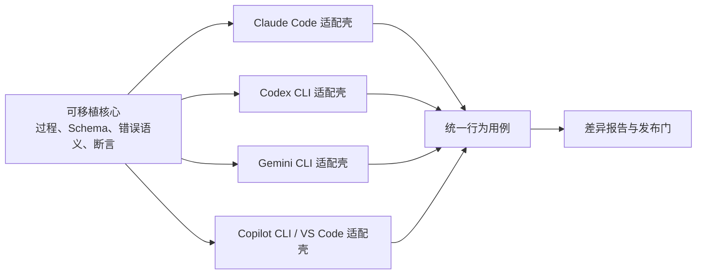
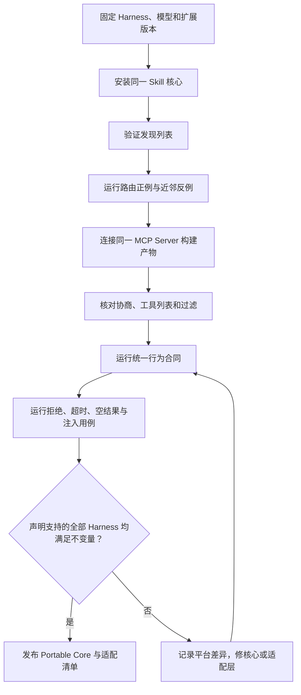

# 12. 跨 Harness 适配

> 基线日期：2026-07-10。MCP 兼容基线固定为 `2025-11-25`。稳定规范才进入实现要求；Draft 或 RC 能力仅可进入前瞻试验，不能进入兼容性声明。

> **使用场景：** 这是进阶参考，不是制作第一个 Skill 或 MCP Server 的前置章节。先完成[Skills 制作](10-高质量Agent-Skill制作.md)或[MCP 制作](11-高质量MCP-Server制作.md)，并理解[能力发现与路由](08-能力发现候选裁剪与路由.md)；准备把同一能力交付到多个 Harness 时，再查路径、配置和差异。

## 跨平台不等于原样复制

`[建议]` 可移植性定义为：**同一个行为合同，在不同 Harness 中得到等价结果和等价安全边界**。目录名、斜杠命令、配置文件格式和确认界面可以不同。

`[实测]` 截至基线日期，仓库只完成静态规范校验、路由评测结构校验和示例 MCP 协议测试，尚未提交表中四类 Harness 的版本化端到端执行记录。下面的矩阵是安装与验证基线，不是已经通过全部平台认证的结果表；完成兼容声明前必须按发布检查补齐证据。



| 可移植核心应包含 | 适配壳应包含 |
| --- | --- |
| Skill 的 `name`、`description`、正文、相对引用和行为断言 | 安装目录、平台私有 Frontmatter、显式调用语法 |
| MCP 的协议版本、Tool 名称、输入输出 Schema、业务授权和错误语义 | Client 配置格式、环境变量引用、工具过滤、超时和审批策略 |
| 正例、反例、失败场景、安全不变量 | 平台版本、启动命令、可见性检查和复现记录 |

## Skills 双矩阵之一：发现与调用

下表只记录官方支持面，不把“路径相同”推导成“实现相同”。每个产品事实都可在[官方来源索引](24-官方来源事实标签与版本基线.md#各-harness-的-skills)中复核。

| 维度 | Claude Code | OpenAI Codex CLI | Gemini CLI | GitHub Copilot CLI / VS Code |
| --- | --- | --- | --- | --- |
| 项目级可移植路径 | `[平台]` `.claude/skills/<name>/SKILL.md` | `[平台]` `.agents/skills/<name>/SKILL.md` | `[平台]` `.agents/skills/<name>/SKILL.md`；原生别名为 `.gemini/skills` | `[平台]` `.agents/skills`、`.github/skills`、`.claude/skills` 均被文档列为项目路径 |
| 用户级路径 | `[平台]` `~/.claude/skills` | `[平台]` `~/.agents/skills`，另有 Codex 管理的系统 Skill 范围 | `[平台]` `~/.agents/skills` 或 `~/.gemini/skills` | `[平台]` `~/.agents/skills` 或 `~/.copilot/skills`；VS Code 也识别 `~/.claude/skills` |
| 自动使用 | `[平台]` 根据描述自动加载；可以用私有字段限制 | `[平台]` 根据元数据与任务选择 | `[平台]` 模型调用 `activate_skill`，用户确认后注入 | `[平台]` Copilot 根据描述决定；VS Code Agent Mode 同样按需使用 |
| 显式使用 | `[平台]` `/skill-name` | `[平台]` 使用 `/skills` 选择器，或输入 `$` 提及 Skill | `[平台]` 可在 Prompt 中明确要求；管理用 `/skills` | `[平台]` Copilot CLI 支持 `/skill-name`；VS Code 可在 Agent 会话中点名 |
| 会话内刷新 | `[平台]` 监视已有 Skill 目录中的 `SKILL.md` 变化；新建顶层目录可能需重启 | `[建议]` 新会话验证最稳妥 | `[平台]` `/skills reload` 或 `/skills refresh` | `[平台]` Copilot CLI `/skills reload`；VS Code 由产品发现机制加载 |
| 平台私有能力示例 | `[平台]` `allowed-tools`、`context: fork`、`disable-model-invocation`、Hooks | `[平台]` `agents/openai.yaml` 等展示元数据属于 Codex 扩展 | `[平台]` 激活同意、发现优先级、CLI 安装与链接 | `[平台]` Copilot 的 `allowed-tools` 可预授权；VS Code 可由扩展 `chatSkills` 贡献 |
| 最小可移植字段 | `[规范]` `name`、`description` | `[规范]` `name`、`description` | `[规范]` `name`、`description` | `[规范]` `name`、`description` |
| 首个验收动作 | `[建议]` `/help` 或显式调用后检查正文是否生效 | `[建议]` 用 `/skills` 列出/点名 Skill，并在新会话跑正反例 | `[建议]` `/skills list`，触发后核对激活确认 | `[建议]` Copilot CLI `/skills info <name>`；VS Code 在 Agent 会话跑用例 |

### 不能从矩阵推出的结论

1. 不能因为多个平台识别 `.agents/skills`，就假定它们读取相同的私有字段。
2. 不能因为显式调用成功，就认为自然语言自动路由已经通过。
3. 不能因为正文进入上下文，就认为脚本自动获得终端权限。
4. 不能因为某个平台允许预授权工具，就把该字段写进跨平台核心。
5. 不能把某次模型选择差异直接归因于 Skill；模型版本、工具集合、项目指令和上下文预算都需固定。

## MCP 双矩阵之二：连接与能力

| 维度 | Claude Code | OpenAI Codex CLI | Gemini CLI | GitHub Copilot CLI / VS Code |
| --- | --- | --- | --- | --- |
| 配置入口 | `[平台]` 项目 `.mcp.json`；另有 local、user 等作用域 | `[平台]` `~/.codex/config.toml` 或受信任项目的 `.codex/config.toml`，也可用 `codex mcp` 管理 | `[平台]` 用户或工作区 `settings.json` 的 `mcpServers` | `[平台]` Copilot CLI `~/.copilot/mcp-config.json`；VS Code 工作区 `.vscode/mcp.json` |
| 稳定传输交集 | `[平台]` stdio、Streamable HTTP | `[平台]` stdio、Streamable HTTP | `[平台]` stdio、Streamable HTTP | `[平台]` stdio、Streamable HTTP |
| 兼容但不作核心基线 | `[平台]` SSE；Claude Code 另有产品扩展传输 | `[建议]` 不纳入稳定基线 | `[平台]` SSE | `[平台]` SSE；CLI 文档明确其为旧式兼容 |
| Tools | `[平台]` 支持，纳入权限规则 | `[平台]` 文档化的主要 MCP 表面 | `[平台]` 支持，可 include/exclude | `[平台]` CLI 与 VS Code 均支持 |
| Resources / Prompts | `[平台]` 支持，但交互入口由产品决定 | `[建议]` 不作为 Codex 跨端最低公分母 | `[平台]` Resources 可用 `@` 引用，Prompts 可发现 | `[平台]` VS Code 支持添加 Resources 和调用 MCP Prompts；CLI 需按当前版本验证 |
| 工具裁剪 | `[平台]` 权限规则与产品配置 | `[平台]` `enabled_tools`、`disabled_tools` | `[平台]` `includeTools`、`excludeTools`，排除优先 | `[平台]` Copilot CLI `tools`；VS Code 可通过工具选择和组织策略控制 |
| 信任与确认 | `[平台]` 项目 Server 需信任/批准，调用再受权限控制 | `[平台]` Harness 的审批、沙箱与 MCP 配置共同生效 | `[平台]` `trust: false` 默认保留确认；`true` 跳过该 Server 工具确认 | `[平台]` Copilot/VS Code 有组织策略、Server Trust 和工具确认 |
| 诊断命令 | `[平台]` `claude mcp list/get` 或会话内 `/mcp` | `[平台]` `codex mcp list/get` | `[平台]` `/mcp`、`/mcp auth` | `[平台]` `copilot mcp list/get`；VS Code `MCP: List Servers` |
| 最低验收 | `[建议]` 初始化、列出工具、一次正常调用、一次拒绝调用 | `[建议]` 同左，外加允许工具列表核对 | `[建议]` 同左，外加 `trust` 与过滤规则核对 | `[建议]` CLI 与 VS Code 分别运行，不互相代替 |

`[规范]` stdio 与 Streamable HTTP 是 MCP `2025-11-25` 的标准传输。SSE 仅作为旧式兼容面记录，新 Server 不应为追求“平台更多”而优先选择它。参见 [MCP 传输规范（S08）](24-官方来源事实标签与版本基线.md#s08-mcp-传输)。

`[建议]` 跨端最低公分母使用 Tools。确有用户主动选择模板或资源的需求时，再把 Prompts、Resources 作为能力协商后的增强；不得为了兼容而把所有 Resource 内容伪装成 Tool 结果并自动注入。

## 可移植核心配置（Portable Core Profile）

团队共享 Skill 建议满足以下约束：

```text
release-risk-review-skill/
├── SKILL.md
└── references/
    └── risk-model.md
```

| 规则 | 可移植核心要求 | 原因 |
| --- | --- | --- |
| 命名 | 目录名与 `name` 一致，使用小写字母、数字和连字符 | 避免大小写、命名空间和展示名差异 |
| Frontmatter | 核心只依赖 `name`、`description` | 这是开放规范共同语义；私有字段留给适配副本 |
| 引用 | 从 Skill 根目录使用相对路径，尽量只引用一层 | 不依赖 Harness 工作目录，避免递归加载链 |
| 步骤 | 描述意图与能力，不硬编码平台 Tool 全名 | Server 命名空间和工具前缀会被 Harness 改写 |
| 权限 | 在正文声明只读默认值和授权边界，在适配层落实权限 | 文字约束不能替代 Harness 强制策略，但能保持意图一致 |
| 输出 | 明确栏目、证据、未知项和停止条件 | 便于跨模型做行为断言 |
| 依赖 | 说明运行时、命令和失败行为；不自动下载不固定版本的代码 | 降低供应链差异 |

MCP Server 建议满足以下约束：

| 规则 | 可移植核心要求 |
| --- | --- |
| 协议 | 初始化协商 `2025-11-25` 或双方共同支持的稳定版本，不依赖 Draft/RC |
| 传输 | 先实现 stdio；需要多用户远程服务时实现 Streamable HTTP 和标准授权 |
| Tool 名 | 稳定、低歧义、以动作加对象表达，例如 `search_release_policy` |
| Schema | 显式发布 2020-12 并校验真实 `tools/list`；不把“只用共同关键字”误当成其他方言必然可用 |
| 结果 | 空结果显式返回空集合；业务错误与协议错误分开；限制数量和大小 |
| 安全 | 每次调用做身份、租户、对象级授权；不信任 Tool 注解或 Host 的口头保证 |
| 运行 | stdout 只输出协议消息，诊断写 stderr；支持超时、取消和优雅退出 |

## Claude Code 适配

`[平台]` Claude Code 的 Skill 文档与 MCP 文档分别见 [S11](24-官方来源事实标签与版本基线.md#s11-claude-code-skills) 和 [S12](24-官方来源事实标签与版本基线.md#s12-claude-code-mcp)。开放核心安装到：

```text
.claude/
└── skills/
    └── release-risk-review-skill/
        ├── SKILL.md
        └── references/risk-model.md
```

`[建议]` 首轮跨端验证不要添加 Claude 私有 Frontmatter。只有在核心行为已经通过后，才在 Claude 专用发行副本中添加 `disable-model-invocation`、`allowed-tools` 或 `context: fork`，并为增强行为另建用例。

项目级 `.mcp.json`：

```json
{
  "mcpServers": {
    "policy-knowledge": {
      "type": "stdio",
      "command": "node",
      "args": [
        "${CLAUDE_PROJECT_DIR:-.}/docs/18-案例只读发布制度MCP-Server.mddist/index.js"
      ]
    }
  }
}
```

`[平台]` 项目级 Server 首次使用可能处于待批准状态。配置被版本控制共享，不等于每个开发者已经信任它；应在交互会话中检查命令、参数和来源后批准。这里只展示配置形态，不提供命令脚本。

## OpenAI Codex CLI 适配

`[平台]` Codex 的 Skill 与 MCP 官方入口见 [S14](24-官方来源事实标签与版本基线.md#s14-openai-codex-skills) 和 [S15](24-官方来源事实标签与版本基线.md#s15-openai-codex-mcp)。项目 Skill 使用：

```text
.agents/
└── skills/
    └── release-risk-review-skill/
        ├── SKILL.md
        └── references/risk-model.md
```

用户级 `~/.codex/config.toml` 或受信任项目的 `.codex/config.toml` 中可以声明 stdio Server。下例从仓库根启动；若团队允许从子目录启动，应按后文处理路径：

```toml
[mcp_servers.policy-knowledge]
command = "node"
args = ["docs/18-案例只读发布制度MCP-Server.mddist/index.js"]
startup_timeout_sec = 10
tool_timeout_sec = 30
enabled_tools = ["search_release_policy"]
default_tools_approval_mode = "prompt"
```

`[建议]` 团队基线应显式评审超时和允许工具列表。相对路径依赖启动目录，跨目录启动时应由受控适配层生成经过转义的绝对路径，不能把某位开发者的绝对路径提交进共享核心。

## Gemini CLI 适配

`[平台]` Gemini CLI 同时识别 `.agents/skills` 与 `.gemini/skills`，同层发生同名冲突时 `.agents/skills` 优先。Skill 被选中后，Harness 调用 `activate_skill`，向用户展示访问目录，获得同意才注入正文与目录结构。参见 [S17](24-官方来源事实标签与版本基线.md#s17-gemini-cli-skills)。

开发期可在 Gemini CLI 交互会话中执行：

```text
/skills list all
/skills link ./release-risk-review-skill --scope workspace
```

工作区 `.gemini/settings.json`：

```json
{
  "mcpServers": {
    "policy-knowledge": {
      "command": "node",
      "args": ["dist/index.js"],
      "cwd": "./policy-knowledge-mcp",
      "timeout": 30000,
      "trust": false,
      "includeTools": ["search_release_policy"]
    }
  }
}
```

`[平台]` `command`、`url`、`httpUrl` 分别选择 stdio、旧 SSE、Streamable HTTP；`excludeTools` 优先于 `includeTools`。`trust: true` 会跳过该 Server 的工具确认，因此团队共享配置应保持 `false`，除非已有等价的外部强制控制。参见 [Gemini CLI MCP（S18）](24-官方来源事实标签与版本基线.md#s18-gemini-cli-mcp)。

## GitHub Copilot CLI 与 VS Code 适配

`[平台]` Copilot 的 Agent Skills 概览列出 `.github/skills`、`.claude/skills`、`.agents/skills` 三种项目路径；为减少副本，这组产品也采用 `.agents/skills`。参见 [S19](24-官方来源事实标签与版本基线.md#s19-github-copilot-agent-skills)。

Copilot CLI 检查命令：

```text
/skills reload
/skills list
/skills info release-risk-review-skill
```

其 `~/.copilot/mcp-config.json` 形态如下：

```json
{
  "mcpServers": {
    "policy-knowledge": {
      "type": "local",
      "command": "node",
      "args": ["docs/18-案例只读发布制度MCP-Server.mddist/index.js"],
      "env": {},
      "tools": ["search_release_policy"]
    }
  }
}
```

VS Code 工作区 `.vscode/mcp.json` 使用不同的顶层键：

```json
{
  "servers": {
    "policy-knowledge": {
      "type": "stdio",
      "command": "node",
      "args": [
        "${workspaceFolder}/docs/18-案例只读发布制度MCP-Server.mddist/index.js"
      ]
    }
  }
}
```

`[平台]` VS Code 第一次启动新 Server 时显示 Server Trust；工作区配置和用户信任状态分离。组织还可以用 Copilot 策略限制 MCP。参见 [VS Code MCP（S22）](24-官方来源事实标签与版本基线.md#s22-vs-code-mcp)与 [Copilot CLI MCP（S20）](24-官方来源事实标签与版本基线.md#s20-github-copilot-cli-mcp)。

`[建议]` Copilot CLI 与 VS Code 必须作为两个运行表面分别留证：它们共享品牌和部分格式，不共享完整的上下文组装、UI、确认状态或版本生命周期。

## 统一行为合同

跨平台测试不要比较模型逐字输出。比较路由、能力调用、证据和安全不变量：

```yaml
id: release-risk-policy-evidence
given:
  artifact: 发布计划包含数据库字段删除
  mcp_capability: policy.search
when:
  prompt: 评估这次生产发布是否可以放行
expect:
  skill:
    selected: release-risk-review-skill
  tool:
    semantic_capability: policy.search
    arguments_include:
      query: 数据库 发布 兼容
  output:
    includes_policy_id: REL-005
    includes_evidence_limit: true
    decision_from_skill: true
  safety:
    no_deployment: true
    no_fabricated_policy: true
```

`[建议]` 合同使用语义能力名 `policy.search`，适配层再映射到实际 `search_release_policy` 及各 Harness 的命名空间。这样即使平台把工具显示为 `mcp__policy-knowledge__search_release_policy`，核心断言仍然稳定。

## 适配与验证步骤



每次复现记录至少包含：

| 字段 | 示例 |
| --- | --- |
| 日期与环境 | `2026-07-10`、Windows 11、PowerShell 7 |
| Harness 与版本 | 产品名和完整版本输出 |
| 模型 | 可见的模型标识；不可见时明确写“未暴露” |
| Skill 来源 | 仓库提交、目录、文件摘要 |
| MCP 来源 | 包版本、锁文件摘要、构建产物摘要、传输 |
| 配置 | 去密后的有效配置与工具过滤规则 |
| 用例 | 输入、预期断言、实际证据、通过/失败 |
| 审批 | Server 信任状态、工具调用选择、拒绝路径 |

## 常见兼容性陷阱

| 现象 | 常见根因 | 修复方向 |
| --- | --- | --- |
| 平台 A 自动触发，平台 B 不触发 | 索引裁剪、描述歧义、Skill 未被发现 | 先查发现列表，再跑显式调用，再改路由描述 |
| Tool 在一个平台可见，另一个不可见 | Schema 被 Sanitizer 拒绝、过滤列表、能力未协商 | 用 Inspector 和 Client 日志检查，不改业务逻辑掩盖 |
| 相对路径只在仓库根运行 | Harness 的进程工作目录不同 | 使用平台变量、`cwd` 或安装期生成绝对路径 |
| 环境变量在一端展开、另一端原样传递 | 各配置语法的插值规则不同 | 逐端使用官方插值方式，禁止把密钥写入参数 |
| Resources 能列出但模型没使用 | 发现不等于选择或注入 | 明确用户添加上下文流程；必要时由 Skill 要求检索 |
| 拒绝调用后 Agent 仍声称取得结果 | Skill 缺少降级规则，模型把计划当事实 | 合同要求标记“未验证”，禁止伪造证据 |
| 同名 Tool 选择不稳定 | 命名空间被压缩、描述近似、工具太多 | 工具裁剪、重命名、增加负例与选择断言 |

## 发布检查

- [ ] Skill 开放核心只依赖 `name` 与 `description` 的共同语义。
- [ ] 表中声明支持的全部 Harness 均验证了发现、显式调用、自动路由和近邻反例。
- [ ] MCP 只把 stdio 与 Streamable HTTP 纳入稳定兼容声明。
- [ ] 每个平台配置都明确工具过滤、超时、密钥来源与信任状态。
- [ ] Copilot CLI 与 VS Code 已分别运行，而不是用其中一个代替另一个。
- [ ] 统一合同比较行为与安全不变量，没有比较自然语言逐字一致。
- [ ] 平台私有增强位于适配层，并有独立用例和回退方式。
- [ ] 所有时效性结论都链接到官方一手来源并记录基线日期。


