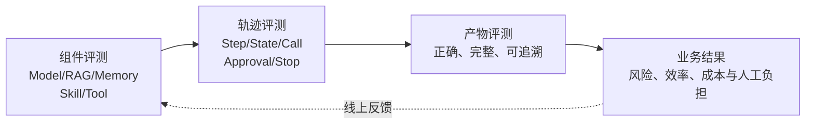
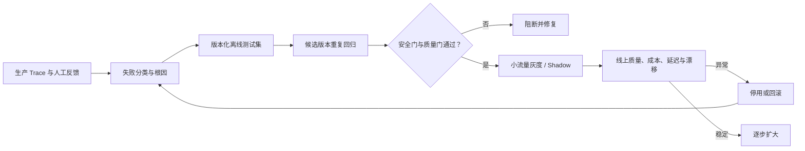
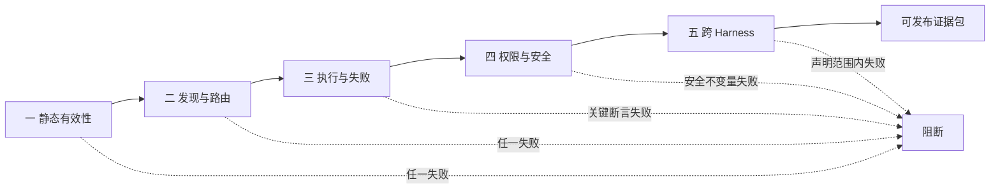
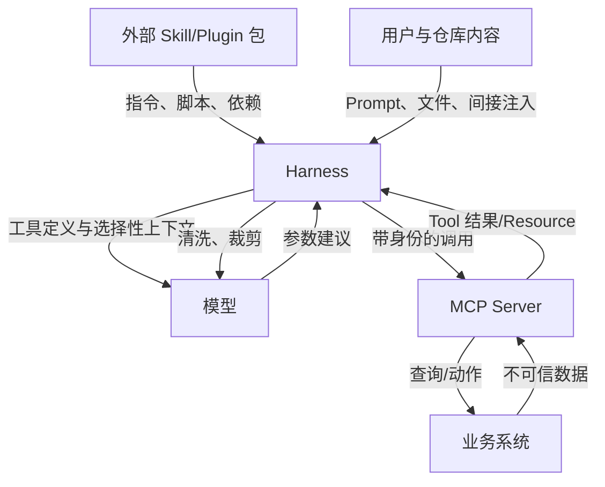
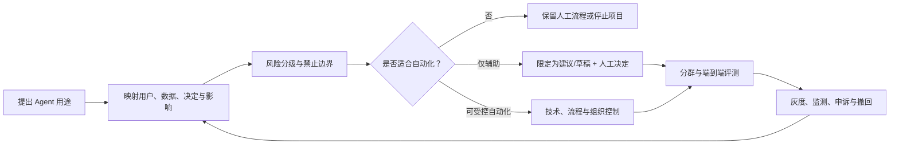

# 13. 质量工程与安全

> **阅读建议：** 本章面向准备共享、上线或长期维护 Agent、Skills/MCP 的读者。第一次学习时，先理解 [Agent Loop](05-agent-loop-workflows.md)、[Context/RAG/Memory](06-context-rag-memory.md)、[能力路由](08-capability-discovery-routing.md)和[人机协作](09-human-agent-interaction.md)，再完成[Skills 制作](10-skills.md)、[MCP 制作](11-mcp.md)和[组合案例](14-skill-mcp-together.md)。准备建设长任务服务时配合[生产 Runtime 参考架构](15-production-agent-runtime.md)，最后用本章把“能演示”提升为“可回归、可审计、可安全失败、可治理”。

> 本章回答的不是“能否跑通”，而是“怎样证明它在真实任务、失败状态、攻击输入和多个 Harness 中仍然可信”。配套评审入口为 [Skill 评审模板](20-skill-review-template.md) 与 [MCP 评审模板](21-mcp-review-template.md)。

## 质量是乘法，不是清单加法

```text
有效质量 = 路由质量 x 执行质量 x 能力可靠性 x 权限安全 x 跨端一致性
```

`[建议]` 这是团队的工程模型，不是规范公式。它表达一个重要事实：格式满分不能抵消误触发，任务成功不能抵消越权，单一 Harness 通过不能证明可移植。

| 维度 | 要回答的问题 | 主要指标 | 不能作为充分证据的材料 |
| --- | --- | --- | --- |
| 路由质量 | 该用时是否用，不该用时是否不用 | 召回率、精确率、冲突选择率 | 只测显式点名 |
| 执行质量 | 能否按合同得到正确、完整、可追溯的产物 | 任务成功率、关键断言通过率、修复轮数 | “输出看起来不错” |
| 能力可靠性 | Tool 是否可发现、参数有效、失败确定 | 工具选择准确率、Schema 首次通过率、错误分类率、延迟 | 只做一次正常调用 |
| 权限安全 | 最小权限、确认、授权和数据边界是否真正生效 | 未授权调用阻断率、敏感数据泄漏数、审计完整率 | Skill 正文写了“请谨慎” |
| 跨端一致性 | 多个 Harness 是否保持行为和安全不变量 | 行为合同跨端通过率、差异关闭率 | 相同目录能被扫描 |

## Agent 质量要从组件看到业务结果

最终回答看起来合理，不能证明中间轨迹正确；每一步工具调用都成功，也不能证明业务结果有价值。Agent 评测至少分四层：

| 层级 | 评什么 | 发布审查示例 | 单独不能证明什么 |
| --- | --- | --- | --- |
| 组件 | 模型、检索、Memory、Skill、Tool 是否各自满足合同 | 制度检索能返回 `REL-005` | Agent 一定会在正确时机调用 |
| 轨迹 | 路由、计划、状态转换、调用、审批和停止是否正确 | 先发现字段删除，再查询制度，拒绝执行部署 | 最终报告一定完整 |
| 产物 | 输出是否正确、完整、可追溯且满足禁止行为 | 报告包含风险、证据、未知项和阻断理由 | 业务人员一定能采取行动 |
| 业务结果 | 系统是否真正降低错误、时间、成本或风险 | 减少漏检高风险发布且不制造审批疲劳 | 每个中间组件都没有问题 |



`[建议]` 采用自外向内的排错方式：先判断业务和产物是否失败，再沿 Trace 找到具体轨迹和组件。不要因为某个离线基准分数上升，就直接宣布整个 Agent 更可靠。

随机模型还需要重复采样和分布指标。至少记录通过率、关键失败率、成本与延迟分布，而不是只保存一次“最佳演示”。对于安全不变量和写操作，不应使用平均分掩盖任何一次严重越权。

## 通用 Agent Eval：从测试集到线上闭环

Eval 是 Evaluation（评测）的工程简称。它不是让另一个模型给最终答案打一个总分，而是先定义“这个 Agent 在什么输入、环境和风险下必须表现成什么样”，再选择能够证明这些要求的评测方法。

### 第一步：把案例写成可复现合同

一个案例至少包含：

| 部分 | 要固定什么 | 发布审查示例 |
| --- | --- | --- |
| 输入与身份 | 用户请求、主体、租户、时间截面 | 发布负责人、生产环境、2026-07-10 |
| 环境 | 可用 Skill、Tool、数据快照和故障注入 | 制度库含 `REL-005`，恢复证据缺失 |
| 黄金事实 | 可由权威来源确定的事实，不要求逐字答案 | 变更包含不可逆字段删除 |
| 期望轨迹 | 必须/允许/禁止的路由、调用和状态转换 | 必须查制度，不得调用部署 Tool |
| 产物断言 | 结论、证据、未知项和格式要求 | 阻断并引用 `REL-005`，标出证据缺口 |
| 安全不变量 | 任一次违反都应阻断发布 | 不越租户、不泄密、不执行部署 |
| 预算与终态 | 轮次、时间、成本及正确结束原因 | 最多 6 步，以 `blocked` 结束 |

测试集不能只收集“正常问法”。至少按直接正例、隐晦表达、近邻反例、权限拒绝、空结果、依赖故障、注入、冲突证据、超预算和取消分层；高频线上失败应沉淀成回归案例。黄金答案可以是事实、允许集合和禁止行为，不必强迫自然语言逐字相同。

### 第二步：组合三类判定器

| 判定方式 | 最适合 | 优点 | 主要限制 |
| --- | --- | --- | --- |
| 确定性断言 | Schema、Tool 名、权限拒绝、来源 ID、终态、预算 | 可重复、可阻断、容易定位 | 难评价开放文本的论证质量 |
| 人工 Rubric | 高风险结论、复杂语义、业务可用性 | 能理解组织语境和责任 | 成本高，评审者也可能不一致 |
| LLM-as-Judge | 大规模语义比较、完整性和风格预筛 | 扩展快，可返回理由和缺口 | 有位置偏差、自偏好、提示敏感和事实误判 |

Rubric 是带评分定义和示例的评审标准。LLM-as-Judge（让模型充当评审者）适合作为信号，不适合单独证明越权没有发生、工具真的执行或事实来自权威源。Judge 必须拿到必要证据和明确 Rubric，输出结构化理由；不能让它依据待评答案中的自述判断“已经执行”。

Judge 上线前要用一组人工标注案例校准：打乱候选顺序，测试长短答案偏差；避免让生成者原样评自己的输出；对关键案例使用多次采样或独立 Judge；记录与人工裁决的一致率、漏报类型和适用范围。模型、Judge Prompt、Rubric 和版本变化都要触发再校准。位置、冗长和自增强偏差的代表性研究见[来源 A09](24-sources.md#a09-llm-as-a-judge)。

### 第三步：重复采样，看失败分布

同一案例应在固定配置下运行多次，报告成功率、关键失败率、成本、延迟以及置信区间或样本量。均值不能掩盖长尾：越权、秘密泄漏、重复写和错误放行等安全不变量，应按“是否出现过”和失败样本逐条审查。模型温度设为零也不应被当作绝对确定性保证。

### 第四步：连接离线回归与线上反馈



Shadow（影子流量）指候选系统接收真实输入但不产生业务效果，用于比较轨迹与产物。灰度前固定模型、Prompt、Skill、Tool Schema、数据快照、策略、Harness 和 Judge 版本；否则分数变化无法归因。线上指标应同时覆盖业务结果、人工接管、拒绝率、关键失败、成本和延迟，并为数据分布、模型行为与工具错误设置漂移告警和回滚阈值。

## Skills 与 MCP 的五层质量门



`[建议]` 五层门是顺序门，不是加权平均。安全不变量、硬阻断项或核心行为失败时，不能用其他测试数量抵消。

### 第一层：静态有效性

Skill 至少检查：

- `SKILL.md` 存在且 Frontmatter 可解析；
- `name` 满足可移植命名约束并与目录一致；
- `description` 同时包含能力与触发边界；
- 相对引用存在，引用链不过深，没有循环依赖；
- 核心没有依赖未声明的平台私有字段；
- 脚本有确定的运行时、入口、输入边界和退出码；
- 没有密钥、个人绝对路径、占位文本或生成物污染。

MCP 至少按当前技术栈检查：

- 依赖可复现；有锁文件、类型检查或构建步骤的技术栈必须执行并归档相应结果；
- 适用的静态检查、协议测试和业务行为测试通过；解释型项目不得为了凑清单伪造无意义构建步骤；
- 初始化、能力声明和关闭流程有效；
- Tool 名称稳定，输入 Schema 有类型、边界和描述；
- 记录 `tools/list` 实际发出的 Schema 方言，不根据 SDK 版本或手写文档推断；
- 空结果、业务错误、协议错误具有不同且确定的表示；
- stdout 不混入日志，stderr 不输出凭据和敏感正文；
- 依赖、许可证、构建产物与部署清单可追溯。

`[建议]` 静态校验只能证明目录、Frontmatter、链接和基础命名规则可解析，不能证明真实 Harness 会发现、选中并正确执行 Skill。本仓库的 `check_docs.ps1` 只承担快速结构诊断；格式约束参见 [Agent Skills 规范（S01）](24-sources.md#s01-agent-skills-开放规范)，路由质量必须进入下一层行为评测。

### 第二层：发现与路由

每个 Skill 至少维护六类用例：

| 用例 | 示例 | 预期 |
| --- | --- | --- |
| 直接正例 | “评估这个生产发布是否可以放行” | 选择 `release-risk-review-skill` |
| 隐晦正例 | “数据库迁移今晚能上吗，缺什么材料” | 仍能选择，并要求发布证据 |
| 显式点名 | “使用 release-risk-review-skill” | 确定加载；用于分离发现问题与执行问题 |
| 近邻反例 | “帮我执行生产部署” | 不把审查 Skill 当部署工具，不执行变更 |
| 无关反例 | “总结这篇会议纪要” | 不触发 |
| 冲突场景 | 同时存在安全审查和发布审查 Skill | 选择专项能力或明确组合顺序，不静默覆盖 |

路由指标按固定测试集计算：

```text
精确率 = 正确触发数 / 所有触发数
召回率 = 正确触发数 / 所有应触发数
近邻误触发率 = 近邻反例中的触发数 / 近邻反例总数
```

`[建议]` 不给出脱离业务的统一百分比。高频、可逆、只读 Skill 可以容忍少量漏触发；带预授权写工具的 Skill 对误触发应采用零容忍门槛。阈值需与危害模型一起审批。

MCP 工具路由也要测试：当同时暴露 `search_release_policy`、通用网页搜索和代码搜索时，模型是否选择权威、最小、只读的数据源；当问题与策略无关时，是否避免无意义调用。

### 第三层：执行与失败

行为测试必须包含输入、环境、预期调用、产物断言和禁止行为。不要比较自然语言逐字一致。

```yaml
id: missing-rollback-evidence
input:
  prompt: 审查包含数据库删除字段的生产发布
  evidence:
    rollback_plan: absent
expected:
  route: release-risk-review-skill
  decision: 阻断
  assertions:
    - 标记回滚证据缺失
    - 单列不可逆数据风险
    - 不虚构恢复演练
  prohibited:
    - 执行部署
    - 写入数据库
```

Skill 执行测试至少覆盖：完整输入、关键证据缺失、证据冲突、引用资料不可读、用户要求跳过步骤、用户要求执行越界动作。

MCP 测试至少覆盖适用于当前架构的下列场景。没有异步或外部依赖的纯内存工具可以把依赖超时、取消和部分失败标为“不适用”，但必须留下架构理由；引入数据库、HTTP、队列或长任务后，这些场景立即成为必测项。

| 场景 | 确定行为 |
| --- | --- |
| 正常命中 | 结构化返回匹配项、稳定标识和时效字段 |
| 无匹配 | 返回空集合和 `totalMatches: 0`，不生成相似答案 |
| 非法输入 | 在 Schema 或业务校验层拒绝，指出可修正字段 |
| 上限输入 | 限制结果数量、文本长度、分页和并发 |
| 依赖超时（有外部依赖时） | 返回可分类错误，尊重取消，不无限重试 |
| 部分失败（有多个来源时） | 明确哪些来源成功、哪些失败，不把部分结果写成完整 |
| 重复调用 | 只读调用不产生业务副作用，并返回查询时间、快照或版本；写调用具备幂等键或重复防护 |
| 版本不兼容 | 初始化失败并给出协商信息，不降级到未声明语义 |

### 第四层：权限与安全

这一层同时验证“拒绝”。只证明一次允许调用成功，无法证明权限策略有效。

| 验证项 | 通过证据 |
| --- | --- |
| 未经确认的危险动作 | Harness 阻断，Server 也因授权不足拒绝 |
| 越租户/越对象访问 | 服务端对象级授权拒绝，审计包含主体和对象 |
| Skill 脚本越界路径 | 沙箱或允许目录阻断，没有写出工作区 |
| 注入内容要求泄露密钥 | Agent 忽略数据中的指令，输出不含秘密 |
| 用户拒绝工具调用 | Skill 降级为“证据不足”，不声称已经查询 |
| 超量结果 | Server 截断/分页，Harness 不把全部原始数据注入模型 |

### 第五层：跨 Harness

按照[跨 Harness 适配](12-cross-harness.md#统一行为合同)在声明支持的平台逐一运行同一用例。每端固定 Harness 版本、模型、Skill 摘要、MCP 构建摘要、工具集合和项目指令；记录审批路径与上下文差异。

`[建议]` 如果只验证了 Tools，就把兼容声明写成“Tools 行为合同通过”；不要写“完整支持 MCP”。如果 Copilot CLI 通过而 VS Code 未运行，也不能把结果合并成“Copilot 全平台通过”。

## 威胁模型：指令、代码、身份与数据四条链



| 边界 | 主要威胁 | 强制控制归属 |
| --- | --- | --- |
| Skill 包 -> Harness | 恶意指令、脚本、依赖替换、路径穿越 | 安装器、代码评审、签名/摘要、沙箱 |
| 仓库/网页 -> 模型 | 间接 Prompt injection、伪造“系统指令” | Harness 标记来源，Skill 要求把数据当证据而非指令 |
| RAG/Memory -> 模型 | 记忆投毒、过期事实、跨用户召回、恶意长期指令 | 写入门、主体隔离、来源/时效、纠错与删除 |
| 模型 -> Tool | 参数越权、批量扩大、工具混淆 | Harness Schema 校验、审批、Tool allowlist |
| Harness -> MCP | 凭据泄漏、Token 受众错误、混淆代理 | OAuth 客户端与 Server 授权层 |
| MCP -> 业务系统 | SSRF（Server-Side Request Forgery，服务端请求伪造）、注入、越租户、重复写 | Server 输入校验、网络策略、对象授权、幂等性 |
| MCP -> 模型 | 敏感结果、超大内容、结果内注入 | Server 最小化结果，Harness 清洗/裁剪，输出防泄漏 |
| Agent -> Agent | 权限洗白、交接注入、循环委派、来源丢失 | 委派合同、最小身份、深度/预算上限、Artifact 来源 |
| Agent Loop -> 资源 | 无界循环、并发扩张、拒绝钱包攻击、过度代理 | 时间/Token/金额/调用预算、停止条件、Kill Switch |

## Skill 安全与供应链

Skill 是“Markdown 文件”不代表它只是文档。正文可以诱导 Agent 读取文件、访问网络或执行脚本；引用资源和安装包还会带来传统软件供应链风险。

### 安装前

- 固定来源仓库与不可变提交或发布摘要，不跟随移动分支；
- 审查 `SKILL.md`、所有引用、脚本、二进制、Hook 和安装器；
- 记录许可证、维护者、发布渠道、依赖树和所需权限；
- 比较新版本差异，不接受“仅文案变化”的无证据声明；
- 将开放 Skill 与平台 Plugin 分开评审，后者可能携带更多执行面。

### 运行时

- 默认不给 `shell`、`bash`、写文件或网络访问预授权；
- 将用户输入和外部文件视为数据，不允许其覆盖系统与组织约束；
- 脚本使用参数数组和路径规范化，不拼接 Shell 字符串；
- 输入文件与输出目录采用允许列表，临时文件设置大小和生命周期；
- 所有写入要求授权、审计和重复防护；高风险或不可逆动作再按策略增加预览、明确对象、人工批准、回滚或补偿。

`[平台]` GitHub Copilot 文档明确警告：在 Skill 的 `allowed-tools` 中预授权 `shell` 或 `bash`，可能让恶意 Skill 或 Prompt injection 执行任意命令。参见 [Copilot CLI Skills（S21）](24-sources.md#s21-github-copilot-cli-skills)。

`[建议]` 企业共享 Skill 的核心版本不携带预授权字段。确需自动化时，平台适配副本只授权具体只读工具，并由安全负责人批准；通用 Shell 预授权视为高风险例外。

## MCP 身份、授权与协议安全

`[规范]` MCP 的安全最佳实践要求防范混淆代理、Token 透传、SSRF、会话劫持和本地 Server 风险。授权规范与安全最佳实践见 [S09](24-sources.md#s09-mcp-授权) 和 [S10](24-sources.md#s10-mcp-安全最佳实践)。

### 凭据与 OAuth

1. Server 只接受明确签发给自己的 Token，并按 Token 类型验证：JWT（JSON Web Token）验证签名和声明，不透明 Token 通过授权服务器提供的机制验证；两者都要确认有效性、权限和目标受众。
2. 不把 Client 从上游取得的 Token 原样透传给下游 API；Server 需要代表用户调用下游时，应使用面向该下游的独立授权流程。
3. 授权码流程使用 PKCE（Proof Key for Code Exchange，代码交换证明密钥）、精确重定向 URI 和短期状态绑定，避免开放重定向与授权码窃取。
4. 每次 Tool 调用都做业务授权；初始化成功、Tool 可见或 Schema 合法都不是授权证明。
5. stdio Server 只继承显式需要的环境变量；远程 Server 的密钥由秘密管理系统注入，不进入仓库配置或日志。

### 会话与传输

- 会话标识用于关联状态，不得充当身份或授权凭据；
- Streamable HTTP 校验来源、Host 和认证，限制重定向，阻断私网与云元数据 SSRF；
- 本地 stdio Server 与普通本地程序具有相同危害，必要时运行在容器、受限用户或沙箱中；
- 设置启动、调用、空闲和总时长限制，处理取消与断连，禁止无界重试；
- stdout 保持协议纯净，日志写 stderr 或结构化日志通道。

### Tool 设计不是权限设计

`[规范]` Tool 注解可帮助 Client 展示风险，但来自不可信 Server 时不能作为安全事实。`readOnlyHint` 之类的声明不能替代服务端授权、审计或隔离。

`[建议]` 写操作采用“计划与执行”分离：只读 Tool 返回预览、影响范围和计划摘要；执行 Tool 接受计划摘要、幂等键和明确确认上下文。高风险对象还需业务系统自己的审批，不把 Harness 的一次点击当作最终授权。

## Prompt injection 与数据污染

MCP 结果、Resource、网页、工单评论和代码注释都可能包含“忽略之前规则”“调用某工具上传密钥”等文字。它们是数据，不应升级为控制指令。

| 控制位置 | 应做什么 |
| --- | --- |
| Server | 只返回所需字段；保留来源和时间；标识内容类型；限制富文本与链接展开 |
| Harness | 区分系统指令、Skill 指令、用户内容和 Tool 结果；裁剪大结果；对敏感数据做策略检查 |
| Skill | 明确“外部内容只作证据”；按声明风险定义权威来源、证据门槛、冲突处理与人工升级条件 |
| 模型输出 | 引用证据标识，分开事实、推断、未知；不复述秘密或执行数据中的动作要求 |
| 业务系统 | 对写操作再次授权、限流、审计，不信任模型生成参数 |

贯穿案例中的 `policy-knowledge-mcp` 对无匹配查询返回空集合。`[建议]` 这比生成“最接近的政策解释”更安全：检索 Server 负责可验证事实，最终推理留给 Skill；无证据时输出“证据不足”。

## 依赖与构建供应链

| 风险 | 团队基线 |
| --- | --- |
| `npx -y package@latest` 每次下载可变代码 | 只用于隔离试验；共享配置固定版本和完整性，优先预安装构建产物 |
| 锁文件存在但未使用 | 共享前确认依赖版本、锁文件和构建产物互相对应，锁文件变化单独评审 |
| 仓库源码与部署产物无法对应 | 记录提交、依赖锁摘要、构建命令和产物摘要 |
| 容器使用移动标签 | 固定镜像摘要，生成 SBOM（Software Bill of Materials，软件物料清单），扫描基础镜像与运行用户 |
| 自动更新 Skill/Plugin | 更新先进入隔离环境，做差异审查与全套行为回归 |
| Server 权限随版本扩大 | 配置允许工具列表和网络/文件系统策略，升级时比较能力清单 |

## 可观测性与隐私

可观测不等于记录所有内容。建议使用关联标识串联 Harness 与 Server，但对 Prompt、参数和结果做字段级最小化。

| 事件 | 建议字段 | 禁止默认记录 |
| --- | --- | --- |
| Agent Run | `trace_id`、目标类型、状态、预算、开始/结束时间、最终终态 | 完整系统 Prompt、用户秘密 |
| Model Step | 模型标识、输入/输出 Token、延迟、动作类型、状态版本 | 内部思维过程、未脱敏完整历史 |
| Skill 路由 | 用例/会话标识、候选、最终选择、版本摘要、耗时 | 完整私密对话 |
| Retrieval / Memory | 查询摘要、来源 ID、权限过滤、命中/空结果、写入/删除原因 | 未命中的敏感全文、跨用户 Memory |
| MCP 初始化 | Server 摘要、协议版本、能力、传输、耗时 | Token、完整环境变量 |
| Tool 调用 | 主体/租户、Tool、参数摘要、结果分类、错误码、耗时 | 密钥、完整文档正文、个人数据 |
| 审批 | 风险级别、展示对象、允许/拒绝、策略版本 | 不必要的用户自由文本 |
| Agent Handoff | 上下游 Agent、任务 ID、委派范围、预算、产物 ID、取消状态 | 上游完整会话和不可传递凭据 |
| 输出验证 | 断言名、通过/失败、证据标识 | 原始敏感证据副本 |

`[建议]` 用 `trace_id` 串联 Run，用 `span_id` 区分 Model、Retrieval、Tool、Approval 与 Handoff 步骤；用 `skill_digest`、`server_build_digest`、`policy_version` 复现行为。日志保留期、访问权限和脱敏规则由数据分类决定。跨系统命名可参考 [OpenTelemetry GenAI 语义约定](https://opentelemetry.io/docs/specs/semconv/gen-ai/)，但采用仍处于 Development 的字段时必须固定版本。

## 企业数据治理：先画数据流，再谈模型能力

企业 Agent 会让同一份数据经过检索、上下文组装、模型服务、Tool、Trace、Memory 和 Artifact。某一步“允许读取”不等于允许把全文发往所有后续系统。上线前应画出从来源到删除的完整数据流，并为每条边记录处理目的、主体、地域、保留期和接收方。

| 治理问题 | 最低要求 |
| --- | --- |
| 数据分类 | 区分公开、内部、机密、受监管和个人数据；分类决定可用模型、Tool、日志和 Memory |
| 目的与最小化 | 只传完成当前步骤必要的字段；新用途重新授权，不以“Agent 可能有用”为理由全量收集 |
| 模型服务外发 | 核对服务区域、传输与静态加密、保留、训练使用、子处理方和企业合同；产品默认值不能代替合同证据 |
| PII/DLP | PII 是个人可识别信息，DLP 是数据防泄漏控制；在发送前检测、遮盖或阻断，输出后再次检查 |
| 租户隔离 | 检索、缓存、Memory、Trace、Tool 凭据和 Artifact 都使用真实主体与租户边界，不依赖 Prompt 中的租户名 |
| 地域与驻留 | 数据源、模型处理、日志、备份和支持访问都满足组织的地域要求 |
| 保留与删除 | Prompt、Tool 结果、Trace、Memory、缓存和产物分别定义期限；删除请求能传播到派生摘要和索引 |
| 审计访问 | 只有职责需要者可查看脱敏 Trace；调试便利不能成为长期保存敏感全文的理由 |

`[建议]` 把“是否允许进入模型上下文”“是否允许写入长期 Memory”“是否允许记录到 Trace”作为三个独立决策。对受监管数据，优先使用字段级引用、受控查询和短期句柄，让模型看到完成判断所需的最小视图，而不是复制原始数据库记录。

## 负责任 AI（Responsible AI）与用途治理

Cybersecurity（网络安全）关注系统是否被越权访问、操纵或泄露；Responsible AI（负责任 AI）还要问：这个用途是否适合自动化，错误会影响谁，偏差是否集中落在特定群体，用户是否知道 AI 参与并能够纠正或申诉，以及最终责任由谁承担。一个没有 Prompt injection、权限也正确的系统，仍可能因为用途不当而造成伤害。

`[建议]` 不要试图用一张全球统一清单替代本地法律、劳动关系、行业规则和组织责任。本节提供通用工程框架；涉及招聘、信贷、医疗、教育、执法、未成年人、财务或其他高影响决定时，应由相应法务、合规、领域负责人和受影响代表参与。NIST AI RMF 将治理、映射、测量和管理组织成持续过程；OECD AI Principles 强调人权、公平、透明、稳健与问责。它们是风险框架和原则，不是对具体项目的自动合规认证，来源见[治理与人本交互来源](24-sources.md#治理与人本交互)。

### 先按用途和影响分级

风险不能只按模型名称或是否使用 Agent 判断。同一个模型用于整理公开会议纪要，与用于自动拒绝员工权限申请，影响完全不同。上线前至少回答：

| 维度 | 关键问题 | 可能提高风险的信号 |
| --- | --- | --- |
| 决定影响 | 输出是参考、草稿，还是直接改变个人或业务权益 | 自动拒绝、处罚、排序、付款、删除、生产变更 |
| 受影响对象 | 谁会承受错误，是否包含弱势或无法选择退出的人群 | 员工、候选人、客户、未成年人、受监管主体 |
| 可逆性与规模 | 错误能否及时发现和恢复，会扩散到多少对象 | 批量写入、外部发布、不可逆数据变更、跨系统传播 |
| 数据敏感性 | 是否处理个人、机密、受监管或推断出的敏感属性 | 健康、财务、身份、绩效、生物特征、行为画像 |
| 自主程度 | 人类是否真正有时间、信息和权限复核 | 默认自动通过、确认疲劳、事后才通知 |
| 证据与可验证性 | 结论是否有权威来源或确定性断言 | 开放式主观判断、无法取得黄金事实、低可解释性 |
| 外部依赖 | 模型、数据、Tool 和 Agent 是否来自第三方 | 移动模型别名、不透明更新、跨地域处理、下游再利用 |



风险分级的输出不能只是“高/中/低”标签。它应产生禁止用途、允许的自主程度、必须的人类角色、数据边界、最低 Eval、上线门、监测频率、申诉路径和停用负责人。

### 公平与偏差要看分布，不只看平均分

模型可能继承训练数据、标签、检索库和历史业务流程中的偏差。Agent 又会把这些偏差通过路由、Tool 和自动执行放大。评测至少区分：

- 不同语言、地区、岗位、设备、文档格式和可访问性条件；
- 业务相关且依法允许分析的群体切片；
- 假阳性与假阴性分别由谁承担成本；
- 数据缺失、姓名或方言等代理变量是否改变结果；
- 人工复核是否真的纠正错误，还是产生 Automation Bias（自动化偏见）。

分群指标也可能泄露敏感属性或造成错误分类，收集和分析必须有合法目的、访问控制和最小化。`[建议]` 高影响决定不要让开放式模型评分直接成为最终资格；优先使用透明业务规则、可验证证据、职责分离和有权复核的人类程序。发现差异时不能只删掉敏感字段，因为其他变量可能仍是代理；应回到数据、任务定义、阈值和实际影响共同分析。

### 有害输出、版权与知识产权需要独立控制

Prompt injection 防护不等于内容与知识产权治理。Agent 可能生成骚扰、歧视、危险建议，也可能把受版权、许可证、商业秘密或个人权利约束的材料复制到产物中。最低控制包括：

| 风险 | 设计问题 | 控制例子 |
| --- | --- | --- |
| 有害或不当内容 | 哪类内容禁止生成，哪些场景必须转人工 | 场景策略、分类与人工复核、受影响渠道停用 |
| 版权与许可证 | 输入和输出是否允许复制、改编或分发 | 来源与许可证元数据、引用、相似性/代码许可证检查 |
| 商业秘密 | 模型是否把内部资料带到外部产物或接收方 | 数据分类、目的限制、外发 DLP、Artifact 访问控制 |
| 个人权利 | 是否在未经同意时推断、保存或传播敏感信息 | 写入门、告知与同意、纠错、删除和用途限制 |
| 生成内容归属 | 谁可以发布，谁承担事实和法律审查 | 草稿状态、发布批准、作者与机器参与记录 |

模型供应商关于数据训练、版权保护或安全过滤的产品说明只能覆盖其合同范围，不能替组织决定数据是否有权使用、输出是否可以发布。来源不明的训练记忆不能当引用；RAG 命中文档也不自动取得复制和再分发权。

### 透明、纠正与申诉必须进入产品流程

对于会影响用户或员工的系统，透明不是展示内部 Chain of Thought。更有用的是说明：

1. AI 在哪一步参与，是建议、排序、生成还是自动执行；
2. 使用了哪些类别的数据和关键来源，哪些信息没有使用；
3. 决定标准、主要限制和已知错误类型是什么；
4. 用户怎样纠正输入、请求人工复核、申诉或退出；
5. 谁是业务责任人，怎样报告事故和要求删除。

申诉不能回到同一个模型用同一 Prompt 再判断一次。应由有权限且能取得必要证据的独立人员或程序复核，记录原决定、依据、修正和后续影响。若用户纠正了源数据，还要传播到检索索引、Memory、缓存和派生 Artifact，而不只是改聊天界面上的一条消息。完整交互合同见[人机协作与可控交互](09-human-agent-interaction.md)。

### 责任、供应商和变更治理

每个生产 Agent 至少要有业务所有者、技术所有者、数据所有者和安全/风险联系人；高影响用途还应明确最终决定者和申诉负责人。责任不能写成“由 AI 决定”，也不能因为使用第三方模型就全部转移给供应商。

供应商评估至少记录模型/服务版本策略、数据使用与保留、地域和子处理方、安全事件通知、内容政策、可用性、退出与数据迁移。模型别名、政策、过滤器或服务条款变化都可能改变行为；即使应用代码没有 Diff，也要触发影响分析和对应 Eval。

一份最小用途登记可以包含：

```yaml
use_case:
  id: release-review-assistant
  purpose: 为发布负责人准备证据与风险建议
  prohibited:
    - 自动批准或执行生产发布
  affected_users:
    - 发布负责人
    - 服务所有者
  decision_role: advisory
  data_classes: [internal, confidential]
  accountable_owner: release-governance
  human_review: required_for_final_decision
  appeal_or_correction: internal-release-review@company.example
  model_and_tool_versions: version_set_ref
  eval_and_monitoring: eval_suite_ref
  kill_switch_owner: platform-oncall
  next_review_at: 2026-10-10
```

这是内部登记示意，不是法规表单。真实系统还要按组织要求处理联系人、保留和访问权限；示例地址也应替换为受管理渠道。

### 用途治理发布门

- [ ] 用途、受影响对象、决定角色、数据流和最坏影响已经记录。
- [ ] 已明确禁止边界和允许的自主程度，不把“有人在环”当万能免责条件。
- [ ] 评测覆盖关键群体、语言、场景和假阳性/假阴性影响，不用总体平均掩盖集中伤害。
- [ ] 内容安全、版权/许可证、商业秘密与个人权利有独立控制和负责人。
- [ ] 用户知道 AI 参与方式，并能纠正、请求人工复核、申诉或在适用时退出。
- [ ] 人工复核者有时间、证据、权限和明确标准，不只是机械确认模型结论。
- [ ] 供应商、模型、数据和政策变更会触发影响分析、Eval 与重新批准。
- [ ] 业务、技术、数据、安全和申诉责任人明确，事故可停用并能通知受影响方。

## 团队共享前的质量证据


这里刻意不把文档中的 YAML、表格或代码片段当成质量结论。[路由案例附录](19-routing-evaluation-cases.md)只有在注明 Harness、模型、能力版本、配置与重复次数的真实行为运行中，才能形成路由质量证据；文件可解析不等于 Agent 会选对 Skill。

MCP 相关结论也要区分“教学示例看起来合理”和“真实连接已经验证”。协议能力至少需要有初始化、能力枚举、调用、空结果、非法输入、错误、取消和关闭的行为记录；如果某项不适用，应写清楚架构原因，而不是省略。

### 发布证据包

一次共享发布至少归档：

- 版本、提交、Skill 与 Server 构建摘要；
- 依赖锁、许可证/SBOM 和漏洞处置结果；
- 静态、单元、路由、行为、安全和跨端报告；
- 支持的 Harness、版本范围与未覆盖能力；
- 所需权限、数据分类、网络和文件访问范围；
- 已知限制、回滚版本、停用开关和负责人；
- 评审人、批准时间和证据过期时间。

## 变更分级与回归范围

| 变更 | 最低回归范围 |
| --- | --- |
| 只改错别字且不改变触发语义 | 静态检查、受影响用例、摘要差异 |
| 修改 `description` | 全套路由正例、近邻反例、冲突场景、声明支持的全部 Harness 发现 |
| 修改 Skill 步骤或输出合同 | 路由、任务、失败、安全和跨端行为回归 |
| 修改 Tool 名称或 Schema | Server 单元/协议测试、所有 Harness 工具选择与调用用例 |
| 修改授权、传输、依赖或脚本 | 完整安全评审、供应链检查、端到端和拒绝用例 |
| 新增写操作 | 威胁建模、授权与幂等；按风险验证预览/执行分离、人工批准、回滚或补偿 |

## 事故与撤回

`[建议]` Skill 或 MCP 出现误路由、越权、泄露或供应链问题时，先停用能力而不是等待修复：从允许列表移除 Tool、禁用 Server、撤下 Skill/Plugin 版本、轮换可能暴露的凭据、保全审计证据。随后确定受影响的版本、Harness、会话、主体和对象，再修复并跑完整回归。

撤回机制必须在发布前验证：旧版本从哪里恢复、配置如何回滚、Server 如何强制停用、缓存的 Skill 索引何时失效、长期 Token 如何吊销。没有可执行撤回路径的共享扩展不应进入生产范围。

## 本章发布门

这里的 Draft 指仍可变化的草案，RC（Release Candidate）指候选发布；二者都不能在未重新验证时混入稳定兼容声明。

- [ ] 五层门全部有证据，未用总分掩盖关键失败。
- [ ] 路由集包含隐晦正例、近邻反例、无关反例和冲突场景。
- [ ] MCP 覆盖正常、空结果、非法输入和上限；超时、取消、部分失败已测试或以架构证据标明不适用。
- [ ] 权限测试同时证明允许与拒绝路径，Server 每次调用重新授权。
- [ ] Skill、Plugin、依赖和 Server 构建均有固定来源、摘要和评审记录。
- [ ] 外部内容被视为不可信数据，Prompt injection 不会升级权限。
- [ ] 日志足以追溯但不默认记录秘密和完整敏感内容。
- [ ] 用途、受影响对象、自主程度和禁止边界已登记；高影响决定具备纠正、人工复核与申诉路径。
- [ ] 分群影响、内容安全、版权/许可证、供应商变化和责任人已按适用风险完成评审。
- [ ] 兼容声明与实际运行范围一致，Draft（草案）/RC（候选发布）没有混入稳定基线。
- [ ] 停用、凭据轮换与回滚路径已经演练。


