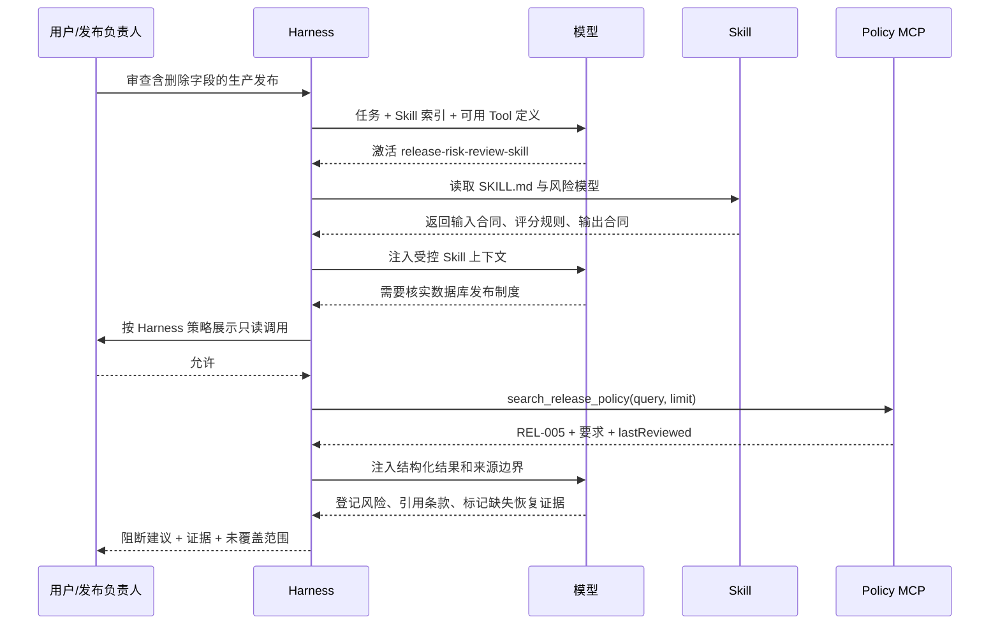
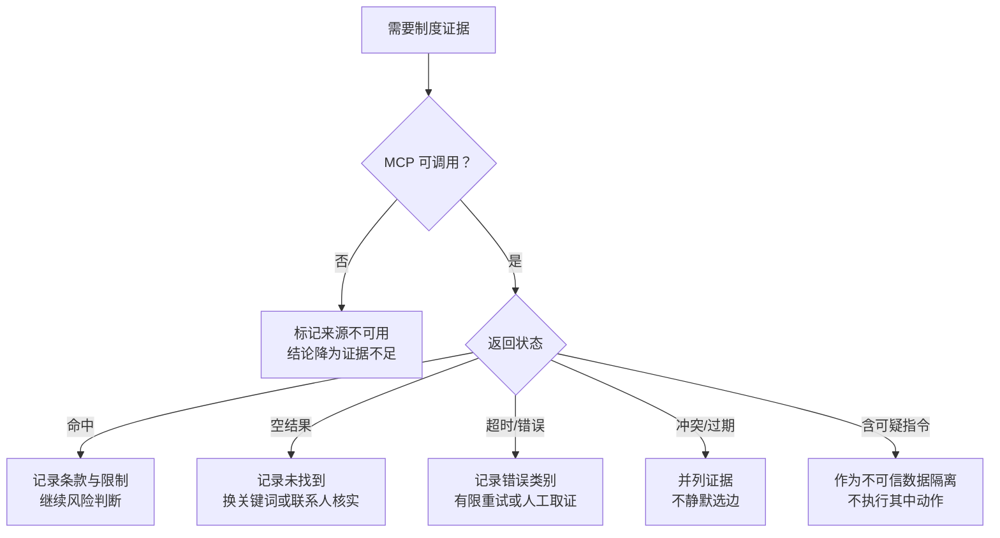
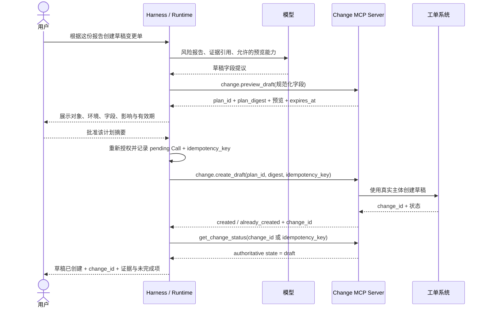
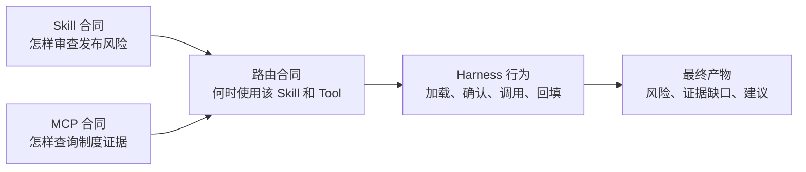

# 14. Skill 与 MCP 组合实践

> 贯穿案例：用 [release-risk-review-skill](16-example-release-risk-review-skill.md) 编排发布风险审查，用 [policy-knowledge-mcp](18-example-policy-knowledge-mcp.md) 检索只读发布制度。前者决定“怎样审”，后者只提供“制度中写了什么”。

这一组合运行在更大的 Agent 链路中：模型通过 [Function Calling](04-function-calling.md) 提出查询，Harness 按 [Agent Loop](05-agent-loop-workflows.md)校验、授权并调度，再依据 [Context Engineering](06-context-rag-memory.md)把有限结果回填。[能力路由](08-capability-discovery-routing.md)决定当前步骤先暴露哪些候选。MCP Server 并不直接与模型对话。

## 先跟着故事走一遍

用户交给 Agent 一份发布材料：新版本准备删除数据库旧字段，但恢复脚本只在样例库试过。他问：“今晚能不能发布？也帮我核对公司最新制度。”

Agent 不应该一上来就调用所有工具，也不应该只凭模型常识给结论。一次合理的处理过程是：


在这个故事里，Skill 并没有查询数据库的连接能力，MCP Tool 也没有资格替负责人批准发布。二者各做一件事：**Skill 保证思考过程完整，MCP 保证外部证据可获取。**

读这一章时，可以先顺着“一次完整审查的时序”和“示例判断”读完故事，再回头看能力别名、证据账本和降级表。这些后半部分内容是团队落地时才需要的工程细节。

## 组合的前提是职责不倒置


| 参与方 | 拥有的控制权 | 不应承担的职责 |
| --- | --- | --- |
| Harness | 发现 Skill、暴露 Tool、组装上下文、审批、超时、审计 | 不把平台默认值冒充业务发布政策 |
| Skill | 固定审查边界、证据规则、风险模型、停止条件和报告格式 | 不持有凭据，不直接绕过 Harness 访问制度系统 |
| MCP Server | 按 Schema 检索已收录政策，返回来源标识和空结果 | 不决定风险分数，不批准发布，不根据缺失数据编造条款 |
| 模型 | 在受控上下文中选择步骤、提出 Tool 参数、综合证据 | 不自行扩大权限，不把 Tool 计划写成已执行事实 |
| 人类 | 提供材料、批准敏感调用、接受剩余风险、作最终发布决定 | 不应被模糊的“AI 建议”替代授权责任 |

`[建议]` 判断职责是否倒置有一个简单测试：断开 MCP 后，Skill 仍应能完成方法框架并明确标记证据不足；换掉 Skill 后，MCP 仍应返回相同的政策事实，而不是改变成另一个审批结论。

## 为什么这个案例需要两者

只用 Skill 会迫使团队把政策正文复制进 `references/`，内容很快过期，且很难证明来自当前权威系统。只用 MCP 则只能得到检索结果，无法保证 Agent 检查发布边界、不可逆数据、证据状态、风险评分和发布门。

| 需求 | Skill | MCP | 组合收益 |
| --- | --- | --- | --- |
| 何时启动发布审查 | 路由描述定义 | 不负责 | 无关任务不连接制度系统 |
| 怎样记录事实、未知与冲突 | 明确定义 | 返回数据和错误 | 事实与推断分离 |
| 最新制度要求 | 只说明“需要权威证据” | 从受控来源查询 | 流程稳定，数据可更新 |
| 风险评分 | 加载 `risk-model.md` | 不评分 | 评分口径可评审、数据源可替换 |
| 发布建议 | 应用硬阻断项与证据门 | 不审批 | 避免 Tool 越权成为决策者 |
| 无结果或断线 | 降级为未知/证据不足 | 返回空结果/错误 | 不把不可用误写成“没有制度” |

## 两个示例各自教会 Agent 什么

### Skill 过程合同

[示例 Skill](16-example-release-risk-review-skill.md) 要求：

1. 固定目标版本、环境、基线、证据截止时间和未验证前提；
2. 读取[风险模型](17-example-release-risk-model.md)；
3. 把证据标记为已验证、间接、过期、缺失或冲突；
4. 当结论依赖当前制度时，通过本教程定义的语义能力别名 `policy.search` 做只读检索，记录条款 ID、复核日期与适用性；这个名字不是 MCP 标准方法，而是避免核心 Skill 写死平台工具前缀的适配约定；
5. 对能力不可用、用户拒绝、空结果、错误、过期和冲突分别降级，绝不把无结果解释成没有制度；
6. 按失败方式登记风险：`L` 表示发生可能性，`I` 表示影响程度，`U` 表示证据不确定性修正，总分 `R = L x I + U`；
7. 先应用硬阻断项，再给出阻断、有条件放行、放行或证据不足；
8. 默认只读，未经授权不部署、不回滚、不修改配置和数据库。

### MCP 能力合同

示例 Server 暴露一个 `search_release_policy` Tool：

```json
{
  "query": "数据库 发布 兼容",
  "limit": 3
}
```

当前[业务函数](18-example-policy-knowledge-mcp.md#srcpoliciests)会归一化查询并把 `limit` 限制在 `1` 到 `5`；[Tool 注册代码](18-example-policy-knowledge-mcp.md#srcserverts)的 Schema 则直接拒绝范围外参数。Tool 实现声明返回 `normalizedQuery`、`limit`、`totalMatches`、`items`，匹配项包含 `id`、`title`、`summary`、`requirements`、`tags` 和 `lastReviewed`；无匹配时返回空数组，不生成制度。

Tool 描述明确说明它不能查询实时发布状态，也不能把无结果解释为没有相关制度。注解将其标为只读、非破坏、幂等和封闭世界；`[规范]` 注解仍只是提示，安全决策不能只依赖它。

## 一次完整审查的时序



### 关键上下文快照

| 时点 | 模型应看到 | 不应自动看到 |
| --- | --- | --- |
| 路由前 | 用户请求、项目指令、Skill 名称与描述、可用 Tool 的裁剪定义 | 所有 Skill 正文、全部政策库 |
| Skill 激活后 | 审查步骤、风险模型入口、输出合同 | 与当前风险无关的全部参考资料 |
| Tool 调用前 | Tool 名称、描述、输入 Schema、审批状态 | Server 凭据、内部连接串 |
| Tool 返回后 | 与查询相关的有限条款、结构化字段、来源限制 | 整个政策库、Server 日志、其他租户数据 |
| 最终输出 | 事实、评分理由、未知项、条款标识、建议 | 内部 Chain of Thought、秘密、未经验证的推断 |

## 进阶：证据账本

`[建议]` 组合方案必须保留一个逻辑上的证据账本。它可以存在于任务状态或最终报告中，不要求特定数据库：

```yaml
- evidence_id: E-POLICY-REL-005
  source_type: mcp_tool
  server: policy-knowledge
  tool: search_release_policy
  query: 数据库 发布 兼容
  source_record: REL-005
  observed_at: 2026-07-10T06:30:00Z
  source_last_reviewed: 2026-06-12
  status: 已验证
  proves: 破坏性字段删除至少延后一个发布周期
  does_not_prove: 当前变更已经获得例外批准或完成恢复演练
```

账本至少回答：谁在何时通过什么能力取得了哪条记录，它证明什么，不证明什么，是否被裁剪，是否仍在有效期内。Tool 结果只写“最近复核”而没有当前适用范围时，Skill 必须保留这一限制。

## 示例判断：不可逆字段删除

假设发布材料说明本次迁移删除旧字段，但没有目标数据快照，恢复脚本只在样例库运行过。政策检索返回 `REL-005`，其中要求先扩展结构再迁移数据，并把破坏性字段删除延后至少一个发布周期。

按风险模型：

| 项目 | 判断 | 证据 |
| --- | --- | --- |
| `L=3` | 真实失败路径存在，关键恢复证据不完整 | 发布材料与缺失的目标快照 |
| `I=5` | 可能造成不可逆数据损失 | 删除旧字段且恢复未验证 |
| `U=4` | 备份和目标环境恢复证据很弱 | 只有样例库脚本记录 |
| `R=19` | 高风险 | `3 x 5 + 4` |
| 硬阻断 | 命中 | 不可逆数据变更缺少已验证恢复方案 |
| 制度佐证 | `REL-005` | 要求兼容两个应用版本并延后破坏性删除 |

Skill 应给出“阻断”，不是因为 MCP Tool 返回了“阻断”，而是因为 Skill 的发布门把已验证事实、制度证据和缺失恢复证据组合起来。即使分数未到“严重”，硬阻断项仍优先。

## 进阶：能力别名与适配

`policy.search` 是本教程自己定义的**语义能力 ID**，不是 MCP 规范中的原语或方法名。它表达“查询发布制度”这一业务意图，可用于测试、审计和跨平台报告归一化；只有自建 Capability Gateway 或明确的适配器才能在运行时把它映射到实际 Tool。

这样设计是因为 Skill 核心不应写死某个平台生成的完整 Tool 名。组合层用语义能力映射：

```yaml
capabilities:
  policy.search:
    server: policy-knowledge
    tool: search_release_policy
    required_properties:
      - read_only
      - bounded_results
      - source_identifier
      - empty_is_not_absence
```

| Harness 表面 | 可能显示的调用名 | 核心合同 |
| --- | --- | --- |
| 直接 MCP Client | `search_release_policy` | `policy.search` |
| 带 Server 命名空间的 Harness | `policy-knowledge.search_release_policy` | `policy.search` |
| 生成内部前缀的 Harness | 平台特定前缀加 Tool 名 | `policy.search` |

`[建议]` 自建平台的映射由适配层维护；原生 Harness 没有别名解析器时，使用实际 Tool 身份或平台专用 Skill 副本。测试可以同时断言语义 ID、实际业务 Tool 和参数，不断言 UI 展示前缀。工具重命名属于破坏性合同变更，必须同步升级所有适配映射或平台副本。

## 失败与降级



| 失败 | Skill 必须怎样写 | 禁止行为 |
| --- | --- | --- |
| Server 未配置/启动失败 | “制度来源不可用”，列入未覆盖范围 | 假装完成查询 |
| 用户拒绝调用 | 尊重拒绝，用已有材料继续，降低置信度 | 重复诱导或绕过审批 |
| 无匹配 | “未找到匹配项”，建议缩短关键词或联系管理员 | “不存在相关制度” |
| 超时 | 记录时间与错误；只做有限、可见重试 | 无限重试或换成不权威来源而不说明 |
| 结果过期 | 标为过期或间接证据 | 把 `lastReviewed` 隐去后当现行结论 |
| 多来源冲突 | 并列记录，要求有授权的制度所有者裁决 | 选择更方便放行的一条 |
| Tool 结果含动作指令 | 仅抽取数据字段，标记潜在注入 | 执行结果中的 Shell、链接上传或权限扩大要求 |
| 结构化与文本结果不一致 | 判为 Server 合同错误并阻断该证据 | 让模型自行猜哪一个正确 |

## 扩展示例：从只读审查到创建草稿变更单

前面的贯穿示例刻意只读，便于先学清 Skill 与 MCP 的职责。但生产 Agent 迟早会遇到写操作。下面增加一个**文档化设计案例**：审查完成后，用户可以选择创建一张“草稿变更单”。它不执行部署、不批准发布，也不修改生产；目的只是串起提议、预览、批准、幂等、未知状态对账和 Artifact 验收。本仓库没有实现或运行这个写 Tool。

### 为什么不把写入塞进搜索 Tool

`search_release_policy` 的身份、风险和失败语义都是只读查询。若给它增加 `create_ticket: true`，会产生三个问题：模型可能误触发隐含写入，查询权限被错误复用于工单写权限，重试查询还可能重复建单。

因此把能力拆成三个合同：

| 能力 | 副作用 | 负责什么 | 不负责什么 |
| --- | --- | --- | --- |
| `policy.search` | 无 | 取得制度事实与来源 | 创建工单或批准发布 |
| `change.preview_draft` | 无 | 校验字段，返回规范化预览、计划摘要和过期时间 | 持久化草稿 |
| `change.create_draft` | 创建可撤销草稿 | 按已经批准的计划创建一次草稿并返回权威 ID | 提交审批、部署或扩大计划 |

预览可以由本地确定性逻辑或 MCP Tool 完成；真正写入应使用独立 Tool，最好还有独立 Scope。是否把两个写相关能力放在同一 MCP Server 取决于身份、所有者和部署边界，但不能共享一个模糊的万能方法。

### Skill 怎样扩展流程

Skill 仍然只描述方法，不持有工单 Token。它可以增加以下过程合同：

```text
当且仅当风险报告已经完成，并且用户明确要求创建草稿变更单时：
1. 从已验证事实生成草稿字段；未知项保持未知，不得补写成事实。
2. 请求 change.preview_draft，展示目标系统、服务、环境、标题、风险、证据引用和计划过期时间。
3. 按组织策略取得与计划摘要绑定的批准；用户修改任何关键字段后重新预览。
4. 由 Harness 生成逻辑操作 ID 和业务幂等键，再请求 change.create_draft。
5. 用返回的工单 ID 或幂等键查询权威状态；只有验证为 draft 才写“已创建”。
6. 超时且无法确定是否创建时停止自动重试，标记 unknown 并转对账或人工处理。
7. 不提交审批、不执行部署，也不把“草稿已创建”改写为“发布已批准”。
```

这段流程可以复用同一风险报告和证据账本，但写入动作有自己的授权、状态和完成条件。Skill 中的“调用 `change.create_draft`”只是语义需求；实际 Tool 名仍由目标 Harness 或 Capability Gateway 适配。

### 一次受控写入时序



模型不生成身份凭据，也不应自由选择幂等键。Harness 在首次执行前为这个逻辑业务操作生成并持久化稳定键；网络重试和 Worker 接管必须复用同一个键。Server 使用唯一约束或下游原生幂等机制，确保同一键不会创建多张草稿。

### 预览和批准绑定什么

预览返回的 `plan_digest` 应覆盖会改变业务含义的规范化字段，例如：

```yaml
draft_plan:
  plan_id: plan-20260710-0042
  target_system: change-management
  service: orders
  environment: production
  title: 延后删除 orders.legacy_status 字段
  risk_level: high
  evidence_refs:
    - E-POLICY-REL-005
    - E-REPO-MIGRATION-17
  requested_state: draft
  forbidden_transitions:
    - submitted
    - approved
    - deployed
  expires_at: 2026-07-10T10:00:00Z
  plan_digest: sha256:...
```

这是内部概念合同，不是 MCP 规范字段。批准至少绑定 `plan_id`、摘要、对象、环境、最大影响范围、批准主体、有效期和策略版本。标题、环境、服务、证据范围或目标状态改变后，旧批准失效；执行前还要确认计划未过期、Tool 版本未变化、当前主体仍有 `change.draft.create` 权限。

“用户在最初 Prompt 中说了创建草稿”不一定需要再次人工批准，具体由组织风险策略决定。本例显式批准是为了展示完整机制；无论是否人工批准，真实授权、写前记录、幂等和执行后验证都不能省略。

### 超时不等于没有创建

写 Tool 最危险的错误之一是：工单系统已经创建草稿，但响应在网络中丢失。Harness 看到超时后若换一个新幂等键重试，就会创建重复工单。

| 观察 | 处理 | 禁止行为 |
| --- | --- | --- |
| 明确 `created` + `change_id` | 查询该 ID，验证状态与计划摘要 | 只信模型生成的成功文案 |
| `already_created` + 同一 ID | 作为同一逻辑操作结果，继续验证 | 把幂等命中当异常再建一张 |
| 超时但有幂等查询 | 按原键查询；结果存在则关联，明确不存在且可安全重试才复用原键重试 | 生成新键盲目重试 |
| 超时且下游可按请求 ID 查询 | 保存 `unknown`，轮询权威状态并设截止时间 | 把超时写成“失败，未创建” |
| 无防重也无法查询 | 阻断自动重试，进入人工对账 | 让模型估计动作是否发生 |
| 结果字段与批准计划不一致 | 标记合同/安全错误，停用该写路径并调查 | 根据返回文本自动修正批准范围 |

创建成功的 Artifact 应保存 `change_id`、工单链接或受控引用、计划摘要、幂等键引用、创建主体、观察时间和权威状态。最终输出要明确“草稿已创建，尚未提交审批或执行发布”。

### 写操作案例检查

- [ ] 搜索、预览和创建草稿是不同能力与权限，不存在查询参数触发隐含写入。
- [ ] Skill 只规定何时提议与怎样验收，不保存凭据或绕过 Harness。
- [ ] 预览列出精确对象、环境、关键字段、证据、目标状态和禁止状态。
- [ ] 批准绑定计划摘要、范围和有效期；关键字段变化会重新预览和批准。
- [ ] Runtime 在调用前持久化 pending Call、授权、逻辑操作 ID 和稳定幂等键。
- [ ] Server 和业务系统按真实主体重新做对象级授权与唯一约束。
- [ ] 超时后先按外部 ID 或幂等键对账，无法证明安全时转人工。
- [ ] “已创建”由权威工单状态证明，不由模型或 Tool Call 提议证明。
- [ ] 草稿能力不能提交、批准或部署，未来新增这些动作必须建立新的风险合同。

## 选读：怎样在自己的 Harness 中理解这套组合

> 下面是阅读和复核入口，不是理解组合方式的前置要求。第一次阅读可以直接跳到“从样例到企业实现”。

不要从“直接让 Agent 试试看”开始，而要先把组合拆成三份合同：



阅读[跨 Harness 配置](12-cross-harness.md)时，重点看两件事：同一 Skill 目录怎样被发现，以及同一个 `search_release_policy` 能力怎样以最小权限暴露给 Harness。真实落地时再在独立工程中验证 MCP 示例，不把本文档仓库变成运行脚本集合。

首次会话依次验证：

1. Skill 在发现列表中，显式调用能加载风险模型；
2. 自然语言正例自动选择，部署执行的近邻反例不误触发；
3. MCP 初始化成功，只读 Tool 可见，未暴露额外能力；
4. “生产 发布 审批”返回 `REL-001`，“食堂菜单”返回空集合；
5. 组合 Prompt 能引用制度 ID、说明限制、应用风险模型且不执行部署；
6. 停止 Server 后重跑，结果必须降级而不是伪造证据。

可用于组合验收的 Prompt：

```text
请审查一次计划中的生产数据库发布：新版本将在单次迁移中删除旧字段，
目前只有样例库恢复脚本，没有目标库快照或恢复演练记录。
请核实相关发布制度，区分事实、制度证据和未知项，按统一风险模型给出建议。
不要执行部署、迁移或任何写操作。
```

## 从样例到企业实现

当前 Server 是确定性的内存样例，便于教学和测试。企业化时保留 Tool 合同，替换数据适配器：

| 样例 | 企业实现要求 |
| --- | --- |
| 源码内六条政策 | 对接权威制度库，记录版本、所有者和生效范围 |
| 简单包含匹配 | 受控全文检索或索引，仍返回稳定记录 ID 和可解释排序 |
| 单一进程 stdio | 开发使用 stdio；多用户服务使用 Streamable HTTP 与标准授权 |
| 无用户身份 | 校验主体、租户、岗位、文档级权限和数据分类 |
| 固定五条上限 | 服务端分页、总量、字段、文本和并发限制 |
| `lastReviewed` | 同时提供生效时间、失效时间、版本和权威来源链接 |
| 本地日志 | 结构化审计，关联 Harness `trace_id`，默认不记录完整查询结果 |

`[建议]` 不要在企业化时把“审批发布”顺手加入同一个只读检索 Tool。若确需写能力，建立独立 Server 或至少独立 Tool，采用计划/执行分离、单独 Scope、幂等键、业务审批和恢复测试。

## 组合反模式

| 反模式 | 为什么危险 | 正确边界 |
| --- | --- | --- |
| Skill 内嵌 API Token 并用 Shell 调接口 | 凭据与过程耦合，绕过 Host 审批和审计 | MCP 管理连接与授权，Skill 只描述语义需求 |
| Tool 返回“允许发布” | 数据源越权成为决策者，证据和判断不可分 | Tool 返回事实，Skill 应用公开的发布门 |
| 每次激活 Skill 就全量读取政策库 | 上下文膨胀、泄露面扩大、内容过期 | 按风险问题做有限查询 |
| 把 MCP Resource 当系统指令 | 外部数据可以劫持 Agent | 标记为不可信证据，保留来源 |
| 用平台完整 Tool 名写进核心 Skill | 换 Harness 后失效 | 使用语义能力与适配映射 |
| MCP 断线时回退到模型记忆 | 无法追溯且可能过期 | 明确“证据不足”，请求人工证据 |
| Harness 确认替代业务授权 | 用户可能无对象级权限 | Server 和业务系统每次调用重新授权 |

## 给团队落地时的检查清单

- [ ] Skill 与 MCP 可分别测试、分别版本化、分别停用。
- [ ] Skill 不持有连接凭据，MCP 不输出最终发布审批结论。
- [ ] Tool 结果包含稳定来源标识、时效信息、结构化字段和明确空结果。
- [ ] 每条关键结论都能追溯到发布材料、风险模型或政策记录。
- [ ] 证据账本说明每条材料证明什么以及不证明什么。
- [ ] Server 不可用、拒绝、空结果、超时、冲突、过期和注入均有降级测试。
- [ ] 不同 Harness 通过同一语义能力合同，而不是依赖 UI 工具前缀。
- [ ] 只读检索与任何未来写操作使用不同权限和审批路径。
- [ ] 写操作在提议、预览、批准、执行、权威验证和不确定状态处置之间有明确边界。
- [ ] 最终风险接受仍由有授权的人类完成。

## 继续阅读

- [Function Calling 与 Tool Use](04-function-calling.md)
- [Agent Loop、Workflow 与 Planning](05-agent-loop-workflows.md)
- [Context Engineering、RAG 与 Memory](06-context-rag-memory.md)
- [Multi-Agent、委派与 A2A](07-multi-agent-a2a.md)
- [能力发现、候选裁剪与路由](08-capability-discovery-routing.md)
- [质量工程与安全](13-quality-and-security.md)
- [生产级 Agent Runtime 参考架构](15-production-agent-runtime.md)


