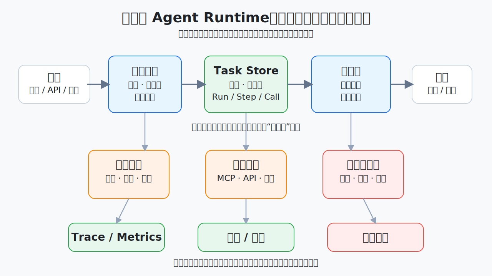
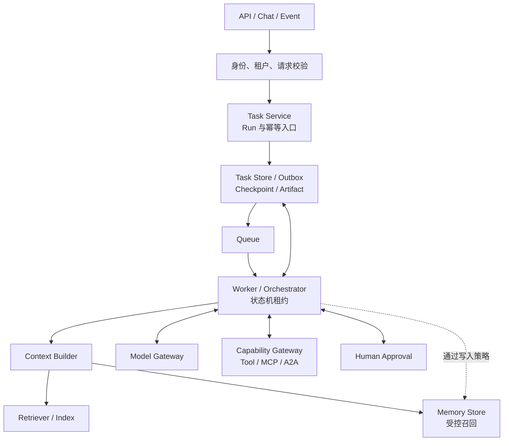
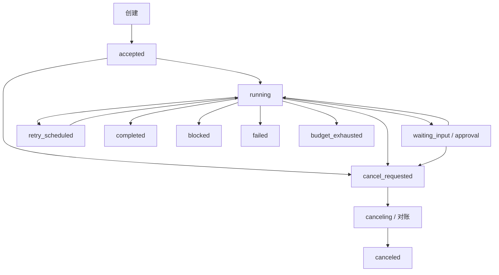
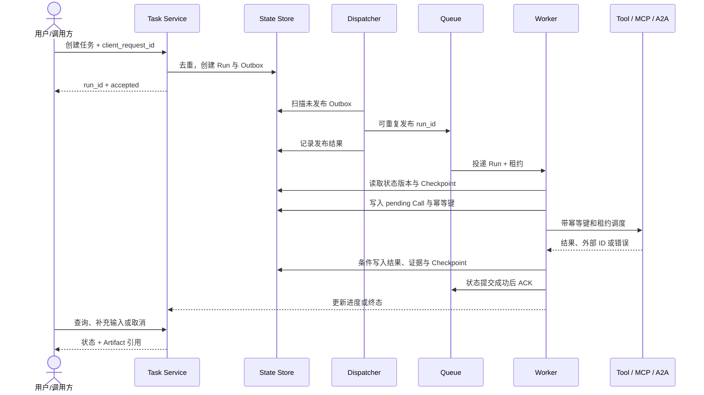
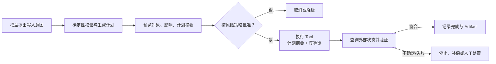

# 15. 生产级 Agent Runtime 参考架构

> 前面的章节分别解释模型请求、Agent Loop、Context、能力路由、Skill、MCP 与 A2A。这里把它们组合成一个可长期运行的服务视图，回答任务存在哪里、进程重启后怎样恢复、写操作怎样验证、模型或 Tool 故障时怎样降级。它是团队参考架构，不是任何开放规范的强制实现。

## 演示系统与生产系统差在哪里

一个本地演示常见的结构是：

```text
用户请求 -> 调一次模型 -> 调一个 Tool -> 返回答案
```

生产系统还必须面对：

- 请求持续数分钟、数小时甚至等待人工数天；
- Worker 重启、网络超时、模型限流和下游部分失败；
- 同一请求被客户端、队列或运维人员重复提交；
- 用户取消时，某个外部动作可能已经提交；
- 模型、Prompt、Skill、Tool、策略和数据版本同时变化；
- 多个租户、身份、预算和数据地域共享一套平台；
- 最终回答正确，但中间曾越权读取或产生了重复副作用。

因此生产 Runtime 的核心不是“让模型多循环几次”，而是把一个不确定决策者放进可恢复、可授权、可观测的确定性控制面。



## 一张参考架构图



同一个小型应用可以把这些模块放在一个进程中；大型平台也可以拆成服务。图中的 Orchestrator 是运行在 Worker 中、实际推进某个 Run 状态机的逻辑组件；若实现为独立服务，也必须保留同样的租约、条件写和回调边界。Retriever 只读知识索引，Memory Store 的写入必须由 Orchestrator 经过独立策略门发起，Context Builder 只负责召回与组装。每个模块都向 Trace、Eval、Audit 和成本系统发出最小化事件，图中省略这些横切箭头。

| 模块 | 主要职责 | 不应承担什么 |
| --- | --- | --- |
| Ingress（入口） | 接收同步请求、事件或回调，限制大小并生成请求 ID | 直接把未校验内容拼成系统 Prompt |
| 身份与租户层 | 认证主体、确定租户、地域和基础策略 | 让模型从自然语言猜当前用户是谁 |
| Task Service | 创建 Run、去重提交、查询状态、取消和返回 Artifact | 把聊天连接本身当唯一任务状态 |
| Worker / Orchestrator | 在租约内驱动状态机、步骤、预算、停止和补偿 | 替模型做所有语义判断，或替业务系统授权 |
| Context Builder | 按步骤组装最小上下文、压缩并追踪来源 | 保存所有企业知识的原始副本 |
| Retriever / Knowledge Index | 按查询、权限和版本返回证据 | 接收运行状态写入或决定业务结论 |
| Memory Store | 按主体、用途和时效召回受控状态，并执行经批准的写入/删除 | 成为隐藏系统提示或知识索引的摄取入口 |
| Model Gateway | 选择模型、执行请求、限流、计费和兼容降级 | 把不同模型的 Tool 语义假定为完全相同 |
| Capability Gateway | 统一能力目录、资格过滤、Tool/MCP/A2A 调度 | 用统一外观抹掉真实执行方和权限边界 |
| Task Store | 保存版本化结构状态、事件、锁或租约 | 用一段自然语言摘要代替可查询状态 |
| Artifact Store | 保存报告、文件、证据包和大结果 | 默认把敏感产物全部塞回模型上下文 |
| Queue | 缓冲任务、投递、重投和背压 | 依靠消息只投递一次来保证业务只执行一次 |
| Approval | 展示具体对象、风险和有效期，记录决定 | 一个“继续”按钮批准所有未来动作 |
| Trace / Audit | 关联 Run、Step、Call、证据、版本和成本 | 默认记录秘密、完整思维过程和敏感全文 |

## 状态模型：不要把整个任务压成聊天记录

一个实用层级是：

```text
Run
├── Step
│   ├── Model Call
│   ├── Tool / MCP / A2A Call
│   ├── Retrieval / Memory Operation
│   └── Approval
├── Artifact
└── Checkpoint
```

| 对象 | 稳定身份 | 必须保存的核心字段 |
| --- | --- | --- |
| Run | `run_id` | 原始目标、主体/租户、当前阶段、终态、预算、版本集合 |
| Step | `step_id` | 输入状态版本、动作类型、允许能力、开始/结束时间、结果类别 |
| Call | `logical_operation_id` | 目标、参数摘要、授权决定、业务幂等键、执行方、外部操作 ID、最终状态 |
| Attempt | `attempt_id` | 所属 Call、租约/fencing token、开始时间、超时、错误与重试原因 |
| Approval | `approval_id` | 精确对象、参数摘要、风险、批准人、有效期、允许/拒绝 |
| Artifact | `artifact_id` + 版本 | 媒体类型、摘要、来源、完整性摘要、访问策略 |
| Checkpoint | `checkpoint_id` + 状态版本 | 恢复所需结构状态、未完成项、预算和策略版本 |

`[建议]` 状态更新使用版本号或条件写，避免两个 Worker 同时推进同一个 Run。产生外部副作用前，先持久化 `pending` Call、参数摘要、授权决定、逻辑操作 ID 和业务幂等键；每次实际尝试使用独立 `attempt_id`，返回后再记录外部操作 ID 与结果。

Worker 取得的是有限期租约，不是永久所有权。可使用 fencing token（单调递增的租约栅栏令牌）让下游拒绝旧 Worker，也可以要求所有接管尝试复用同一业务幂等键。若外部系统既不支持防重也不能查询状态，超时或租约丢失后必须进入 `unknown/manual_review`，不能自动重放。

## Run 的终态必须由状态机表达



这张图是教程建议，不是 A2A 或某家 SDK 的状态枚举，并省略了等待超时等分支。`waiting_*` 和 `retry_scheduled` 是可继续状态；`completed`、`blocked`、`failed`、`canceled`、`budget_exhausted` 是本图终态，不重新打开。需要在终态后继续时，新建关联 Run 并继承经过验证的 Artifact/Checkpoint。只有停止后续调度并对账在途动作后，`cancel_requested` 才能进入 `canceled`。模型输出“完成”只能成为状态转换提议，不能直接写入 `completed`。

## 同步、异步与持久执行怎样选

Durable Execution（持久执行）指任务状态不依赖某个进程或连接存活，进程重启后能根据检查点和/或持久事件历史继续。不同实现可能保存 Activity（外部活动）结果、Timer（持久定时器）、Signal（外部信号），或使用确定性重放；共同要求是代码与状态版本兼容，已经确认的外部结果不会因恢复而被当作未发生。

| 模式 | 适合 | 状态位置 | 主要控制 |
| --- | --- | --- | --- |
| 同步请求 | 时间短、步骤少、无人工等待 | 进程内工作状态；有副作用或跨重试协调时仍保存持久操作记录 | 请求超时、取消、结果大小、外部动作对账 |
| 异步任务 | 时间不确定、需排队或并行 Worker | 持久 Task Store + Queue | Task ID、进度、轮询/推送、去重 |
| 持久工作流 | 长任务、人工审批、跨系统副作用 | 版本化状态机 + Checkpoint 和/或事件历史 | 恢复、持久等待、代码/状态迁移、补偿、策略重新验证 |
| A2A 远程任务 | 对端 Agent 独立运行和持有状态 | 本地映射 + 远端 Task 状态 | 双方 Task ID、超时、取消和 Artifact 验收 |

不要用固定秒数定义模式。判断标准是：调用方连接断开后是否仍要继续、是否会等待外部事件、是否需要恢复和是否产生副作用。任何需要跨重试协调的副作用都要有持久操作记录，与接口表面是同步还是异步无关。

## 一次可恢复的长任务



Run 创建与入队不能做成无协调的两次写，否则进程可能在创建 Run 后、投递消息前崩溃。事务 Outbox 在同一数据库事务中保存 Run 与待发布事件，再由 Dispatcher 重试发布；也可以采用队列原生事务或具有同等故障语义的协调机制。扫描器应修复长期停在 `accepted` 且没有有效投递记录的 Run。消费端只在状态提交后 ACK（确认消费），提交失败则允许重投。

队列通常提供“至少一次”而非业务上的“恰好一次”。即使消息系统声称单次投递，客户端重试、Worker 超时和下游网络故障仍可能造成重复请求。正确目标是：重复调度可以发生，但每类动作都有经过验证的幂等、唯一约束、fencing、状态查询或补偿策略；无法证明安全重放时进入不确定状态并转人工。

## 重试、恢复与补偿不是一回事

| 机制 | 何时使用 | 示例 | 禁止做法 |
| --- | --- | --- | --- |
| 重试 | 已知为暂时故障，动作未发生或可安全重复 | 限流后退避重试只读查询 | 对权限拒绝换参数反复尝试 |
| 恢复 | Runtime 或 Worker 中断后继续同一 Run | 从 Checkpoint 读取未完成步骤 | 把全部聊天重新发给模型并猜状态 |
| 状态查询 | 不确定外部动作是否已提交 | 用外部操作 ID 查询工单是否创建 | 超时后直接创建第二张工单 |
| 补偿 | 动作已发生且无法事务回滚，需要业务反向动作 | 撤销预留、关闭误建草稿 | 把补偿描述成真正回滚而忽略残留影响 |
| 人工处置 | 状态冲突、不可逆或自动规则不足 | 数据写入结果不确定时暂停 | 让模型自行判断高风险事实 |

每个错误要标记可重试性、已知副作用状态和下一步。`timeout` 不能简单等于“未执行”；它只表示调用方没有在期限内取得确定结果。无法通过外部操作 ID、幂等键或权威状态查询完成对账时，将 Call 标为 `unknown`，Run 进入 `manual_review` 或组织定义的非自动处理状态。

## 受控写操作：提议、批准、执行、验证

只读 Agent 不能覆盖真实生产风险。写操作推荐拆成以下状态，而不是让一个万能 Tool 一步完成：



所有写入都需要真实身份、对象级授权、审计和重复防护。是否必须人工批准、是否先预览以及能否回滚，由风险、金额、可逆性和组织政策决定。即使用户已经批准，业务系统也要重新验证 Token 受众、Scope、对象权限和计划是否过期。

批准应绑定：

- Tool 与业务动作；
- 对象 ID、数量和环境；
- 关键参数或计划摘要；
- 最大影响范围；
- 幂等键或外部操作 ID；
- 有效期、批准人和策略版本。

参数、目标状态或计划摘要改变后，应重新校验，不能复用旧批准。

## Model Gateway：选择、降级与缓存

Model Gateway（模型网关）让 Orchestrator 使用稳定内部接口调用不同模型，但它不能假设模型完全可替换。

| 决策 | 应考虑 | 不安全做法 |
| --- | --- | --- |
| 模型选择 | 推理难度、Tool Use、上下文、多模态、数据地域、延迟与成本 | 所有步骤都使用最贵或最便宜的同一模型 |
| 降级 | 备选模型是否支持同一消息角色、Schema、Tool 和安全断言 | 主模型失败后静默换模型并沿用旧兼容结论 |
| 超时 | 首 Token、总时长、长尾和取消传播 | 超时后无界并发请求多个模型 |
| 速率 | 租户、模型、任务和全局配额 | 一个 Agent Loop 耗尽组织额度 |
| 版本 | 模型快照、路由策略、Prompt 和采样参数 | 使用移动别名却不记录实际版本 |
| 缓存 | 稳定前缀、检索结果和确定性计算 | 缓存键遗漏真实结果所依赖的身份、租户、地域、时间或会话状态 |

模型路由可以让低风险分类使用较小模型、复杂综合使用更强模型、高风险门由确定性断言或人工负责。先用 Eval 证明每条路由的能力下限；成本优化不能先于安全和任务合同。

缓存也要分层：前缀缓存减少重复输入成本；检索缓存需要来源版本、授权分区和时效语义；Tool 结果只有在能力显式声明缓存合同后才能缓存，**只读不是充分条件**。缓存合同至少定义结果依赖的主体/租户/地域/隐式会话、来源或快照版本、TTL（存活时间）、失效规则和是否允许跨请求复用。写操作的幂等结果记录是副作用对账证据，不是普通结果缓存。缓存命中必须保留原始观察时间，不能伪装成刚查询的实时结果。

## 背压、预算与 SLI / SLO

Backpressure（背压）指下游处理能力不足时，入口主动减速、排队或拒绝，而不是让队列和并发无限增长。Runtime 至少控制：

- 每个主体、租户和 Run 的并发；
- 队列长度、最老任务等待时间和优先级；
- 模型 Token、金额、Tool 次数和总时长；
- 单个 Server、Agent 和数据源的速率；
- Artifact、上下文和 Tool 结果大小；
- 委派深度、子任务数和重试次数。

SLI（Service Level Indicator，服务级指标）是实际测量值，SLO（Service Level Objective，服务级目标）是在明确窗口和任务范围内对 SLI 的目标。下面先列候选 SLI，不把没有目标值和统计窗口的普通指标冒充 SLO：

| SLI / 运营指标候选 | 为什么重要 |
| --- | --- |
| 合同任务成功率 | 最终是否满足事实、轨迹和产物断言 |
| 安全不变量失败数 | 任一次越权、泄密或错误写入都需单独处置 |
| 人工接管与拒绝率 | 判断自动化是否真正有用，或只是把负担转给人 |
| 端到端与分步骤延迟 | 找到模型、队列、检索或 Tool 的长尾瓶颈 |
| 单任务成本分布 | 发现循环、过度检索和异常高成本长尾 |
| 取消生效时间 | 证明系统能停止后续工作并处理已提交动作 |
| 恢复成功率 | 证明进程重启和租约接管不会丢状态或重复写 |
| Artifact 可追溯率 | 确保结论能回到证据、调用和版本 |

一条可执行 SLO 还要写明任务类别、分母、目标、统计窗口、延迟起止点、人工等待是否剔除和错误预算。例如“过去 7 天，低风险只读制度审查中，排除等待用户补充输入的时间后，99% 在两分钟内进入正确终态”只是格式示例，不是本系列统一门槛。越权、秘密泄漏和错误写入应作为独立事故触发器，不纳入可消耗的普通错误预算。

## 在途 Run 的部署、迁移与停用

Agent 变更不只有代码。模型、Prompt、Skill、Tool Schema、MCP Server、Agent Card、检索索引、Memory 规则、权限策略和路由器都会改变行为。通用离线回归、Shadow、灰度和线上回滚流程见[质量工程与安全](13-quality-and-security.md#第四步连接离线回归与线上反馈)；Runtime 额外要处理已经在途的 Run：

1. 创建 Run 时固定一份 `version_set`，包含模型、Prompt、Skill、Tool、数据/索引和策略版本；
2. 新版本默认只接收新 Run，旧 Worker 按旧版本集合排空，不能在中途静默换模型或 Schema；
3. 必须迁移时，在 Checkpoint 边界执行显式状态迁移，记录迁移前后版本与断言；无法证明兼容则暂停或向前修复；
4. 安全策略、凭据撤销和紧急禁用可以覆盖固定版本，但每个后续步骤都要重新验证，并记录为何改变在途行为；
5. 部署前确认新 Worker 能读取目标状态版本，旧 Worker 不再领取新租约，Outbox 与队列中旧消息仍有兼容消费者或迁移器；
6. 保留按 Skill、Tool、Server、模型和路由规则停用的 Kill Switch（紧急停用开关），并定义它对在途 Call、等待审批和远端 Task 的处理；
7. 软件回滚不能撤销已经发生的业务副作用。回滚后仍要对账外部操作、完成补偿或转人工，并保全 Trace。

任务状态、Checkpoint、Outbox 事件和 Artifact Schema 都要版本化。旧代码不能读取新状态时，不应盲目回滚进程；选择排空、显式迁移、停用或向前修复。

## 常见反模式

| 反模式 | 后果 | 修正方向 |
| --- | --- | --- |
| Run 只存在 WebSocket 连接内 | 断线后无法恢复或查询 | 持久 Task ID、状态与 Artifact |
| 用聊天记录当数据库 | 阶段、预算和外部动作状态不可查询 | 结构化状态 + 证据引用 + Checkpoint |
| 队列重投就直接重做 | 重复工单、付款或变更 | 幂等键、状态查询和补偿 |
| 超时一律重试 | 已提交动作可能重复 | 记录副作用状态，先查询外部操作 |
| 任意模型自动降级 | Tool、角色或安全行为不兼容 | 每条备选路由单独通过 Eval |
| 所有结果都写进长期 Memory | 投毒、隐私和旧状态累积 | 独立写入门、召回门、过期与删除 |
| 日志保存完整 Prompt 方便调试 | 秘密和个人数据长期扩散 | 字段最小化、引用、受控临时取证 |
| 没有 Kill Switch | 事故时只能等待部署修复 | 分层停用能力、撤销 Token 和回滚路由 |

## 生产就绪检查

- [ ] Run、Step、Call、Approval、Artifact 和 Checkpoint 都有稳定 ID 与版本。
- [ ] 同步、异步和持久执行的选择依据明确，断线不等于任务丢失。
- [ ] 每类动作都有经过验证的重复防护和不确定状态处置；无法证明安全重放时会阻断自动重试或转人工。
- [ ] 超时、取消、失败、阻断和超预算都有结构化终态与部分结果合同。
- [ ] 写操作经过授权、重复防护和外部状态验证，并按风险配置批准与补偿。
- [ ] Model Gateway 的每条选择和降级路径都通过对应行为与安全 Eval。
- [ ] 缓存合同声明实际结果依赖、授权分区、版本、TTL 与失效规则，不把旧结果冒充实时观察。
- [ ] 并发、队列、Token、金额、调用、Artifact 和委派深度都有预算。
- [ ] Trace 能串联模型、路由、检索、Tool、审批、产物和策略版本且不默认泄密。
- [ ] Outbox、ACK、长期未调度 Run 扫描、在途版本固定/迁移和分层 Kill Switch 已在发布前设计。

## 继续阅读

- [Agent Loop、Workflow 与 Planning](05-agent-loop-workflows.md)：控制权、状态、预算与停止条件；
- [Context Engineering、RAG 与 Memory](06-context-rag-memory.md)：长任务上下文和记忆生命周期；
- [能力发现、候选裁剪与路由](08-capability-discovery-routing.md)：Capability Gateway 的核心方法；
- [Multi-Agent、委派与 A2A](07-multi-agent-a2a.md)：跨 Agent Task、状态与 Artifact；
- [人机协作与可控交互](09-human-agent-interaction.md)：把 Runtime 状态转换为澄清、批准、进度、纠正、取消与恢复；
- [质量工程与安全](13-quality-and-security.md)：通用 Agent Eval、威胁模型、数据治理与发布门；
- [Skill 与 MCP 组合实践](14-skill-mcp-together.md)：从过程知识到实时能力的贯穿案例。

