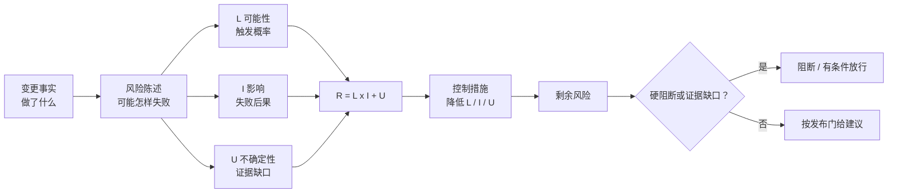

# 17. 示例：发布风险模型

这里定义发布风险审查的统一评分口径和决策门。先识别具体失败方式，再评分；不得先决定“想放行”或“想阻断”，然后反推分数。



## 一、核心原则

1. **风险是未来失败方式，不是改动事实。** “修改了数据库”是事实，“旧版本仍写入旧字段时产生不可恢复的数据丢失”才是风险。
2. **证据与结论分离。** 测试通过只能降低被测试路径的未知性，不能证明未覆盖路径安全。
3. **缺失不是零。** 核心证据缺失时提高不确定性，并限制可给出的发布建议。
4. **按失败方式评分。** 不给整个版本只打一个总分；总体结论由最高未关闭风险和发布门共同决定。
5. **剩余风险才决定放行。** 记录控制措施实施并验证后的剩余风险，同时保留原始评分和变化理由。

## 二、风险陈述

每项风险使用以下句式：

> 由于【变更或条件】，可能发生【可观察的失败方式】，从而影响【用户、系统、数据或合规后果】。

一条合格的风险应满足：

- 能指出触发条件；
- 能描述可观察的失败；
- 能确定影响对象；
- 能通过测试、监控、演练或审查证伪；
- 能指定至少一种降低可能性、影响或不确定性的措施。

## 三、评分公式

使用三个维度：

```text
R = L x I + U
```

- `L`：失败发生的可能性，取 1 到 5。
- `I`：失败发生后的影响，取 1 到 5。
- `U`：证据不确定性修正，取 0、2 或 4。
- `R`：风险总分，范围为 1 到 29。

乘积体现“可能性与影响同时升高时风险快速增加”；不确定性只作上调，防止材料不足被误解为安全。

## 四、可能性 L

| L | 等级 | 判定口径 | 典型证据 |
| ---: | --- | --- | --- |
| 1 | 很低 | 需要多个罕见条件同时成立，且当前版本存在直接预防和验证证据 | 同版本、同配置下的针对性测试；已验证保护机制 |
| 2 | 较低 | 存在可信失败路径，但触发条件不常见或影响范围受可靠控制 | 边界测试通过；小范围灰度已有稳定结果 |
| 3 | 可能 | 失败路径现实存在，历史或架构上合理；或者关键证据不完整 | 间接测试；相似事故；尚未演练的新流程 |
| 4 | 较高 | 常见条件即可触发，控制措施未经验证，或相同问题近期发生过 | 已知缺陷；失败测试；容量接近上限 |
| 5 | 极高 | 问题已在目标版本观察到，或发布步骤几乎必然触发 | 可复现故障；当前监控已出现异常；必然不兼容 |

校准规则：

- 关键证据缺失或冲突时，`L` 不得低于 3，除非存在独立的直接证据证明触发条件不存在。
- “以前没出过问题”不能单独支持 `L=1`。
- 仅靠代码行数少、作者资深或计划谨慎，不能降低 `L`。
- 控制措施只有在当前目标版本上得到验证后，才能降低剩余风险的 `L`。

## 五、影响 I

| I | 等级 | 用户与业务影响 | 技术与恢复影响 |
| ---: | --- | --- | --- |
| 1 | 可忽略 | 无用户感知，内部非关键功能轻微退化 | 自动恢复；无需人工介入；无数据影响 |
| 2 | 较小 | 少量用户或非关键路径短时受影响 | 简单回滚可恢复；无持久数据损坏 |
| 3 | 中等 | 一部分用户、单一区域或重要但可绕行的功能受影响 | 需要人工处置；恢复在可接受窗口内；可能需数据修正 |
| 4 | 重大 | 大量用户、核心交易或多个下游受影响 | 恢复复杂或超出目标时长；存在数据一致性、财务或合同影响 |
| 5 | 严重 | 系统性中断、重大数据损失、安全事件、违法违规或人身安全后果 | 不可逆、无法及时恢复，或需要跨团队重大应急响应 |

校准规则：

- 按可信的最坏后果评分，而不是按最常见的轻微后果评分。
- 灰度只有在能真实限制用户、数据和下游范围时才能降低 `I`。
- 可快速检测但无法快速恢复，不应降低 `I`。
- 涉及不可恢复数据丢失、越权、重大合规或安全后果时，通常取 `I=5`。

## 六、不确定性修正 U

| U | 证据状态 | 判定口径 |
| ---: | --- | --- |
| 0 | 充分 | 目标版本、目标配置和目标环境有直接、当前、可重复的证据；来源相互一致 |
| 2 | 部分 | 证据为间接、抽样、旧版本或只覆盖部分路径，但仍可支撑基本判断 |
| 4 | 很弱 | 核心证据缺失、过期、不可访问或相互冲突；结论主要依赖陈述和假设 |

以下材料通常不能单独获得 `U=0`：

- 没有运行编号或目标提交标识的截图；
- 只写“已测试”“支持回滚”的变更单；
- 与目标配置不同的测试环境结果；
- 上一个版本的恢复演练；
- 没有查询范围和时间范围的监控摘要；
- 未经专项人员确认的安全或合规自评。

## 七、风险等级

| 总分 R | 等级 | 默认处理 |
| ---: | --- | --- |
| 1-6 | 低 | 记录并通过常规监控观察，可接受时说明依据 |
| 7-12 | 中 | 指定负责人和验证措施；在发布窗口内跟踪 |
| 13-19 | 高 | 发布前关闭，或用已验证的隔离、灰度和恢复措施把剩余风险降级 |
| 20-29 | 严重 | 默认阻断；需要消除失败路径或由有授权的风险所有者书面接受 |

基础分矩阵如下；最终总分还需加上 `U`：

| I \ L | 1 | 2 | 3 | 4 | 5 |
| ---: | ---: | ---: | ---: | ---: | ---: |
| 5 | 5 | 10 | 15 | 20 | 25 |
| 4 | 4 | 8 | 12 | 16 | 20 |
| 3 | 3 | 6 | 9 | 12 | 15 |
| 2 | 2 | 4 | 6 | 8 | 10 |
| 1 | 1 | 2 | 3 | 4 | 5 |

## 八、控制措施与剩余风险

控制措施分为四类：

| 类型 | 目标 | 示例 |
| --- | --- | --- |
| 预防 | 降低 L | 兼容性校验、输入约束、双写、依赖锁定 |
| 隔离 | 降低 I | 小流量灰度、租户隔离、区域隔离、功能开关 |
| 检测 | 缩短暴露时间，通常不直接降低 I | 针对性指标、日志、告警、合成探测 |
| 恢复 | 限制持续影响 | 已验证回滚、数据恢复、降级路径、切流方案 |

每项控制措施必须记录：

1. 负责人；
2. 完成时间；
3. 验证方法；
4. 验证证据；
5. 失败时的替代决定。

重新评分时同时保留：

- 原始 `L/I/U/R`；
- 已验证的控制措施；
- 剩余 `L/I/U/R`；
- 分数改变的证据。

“计划执行”“发布后观察”“必要时回滚”都不是已验证控制。没有可执行步骤、权限、负责人和时间目标的回滚方案，应视为恢复路径缺失。

## 九、硬阻断项

无论总分如何，出现以下任一情况都默认给出“阻断”或“证据不足”：

1. 不可逆或破坏性数据变更没有经过验证的备份、恢复或兼容方案；
2. 身份、权限、密钥或安全边界发生变化，却没有针对性验证或专项结论；
3. 核心路径存在已知失败，且没有被可靠隔离；
4. 高影响变更没有可执行的回滚、降级或前向修复路径；
5. 高风险投放没有负责人、关键观测指标、停止条件或值班覆盖；
6. 构建产物、目标提交、配置或迁移版本无法对应，发布对象不确定；
7. 必需的合规、审计或变更授权尚未取得；
8. 证据相互冲突，无法确认实际状态；
9. 用户要求的风险接受超出当前审查者的授权范围。

不得用多个低风险项抵消硬阻断项。

## 十、发布建议决策

按以下顺序判断：

```text
1. 发布对象或核心证据无法确认？ -> 证据不足
2. 存在硬阻断项？               -> 阻断
3. 存在未关闭的严重风险？       -> 阻断
4. 存在未控制的高风险？         -> 阻断
5. 高风险均已降级，但仍有需在窗口内验证的条件？ -> 有条件放行
6. 仅有已接受的中低风险，且投放、观测、恢复证据完整？ -> 放行
```

“有条件放行”必须列出可机器或人工观察的条件、负责人、观察时长、停止条件和未满足时的动作。不能把模糊承诺写成条件。

## 十一、常见风险类别

检查类别用于防止遗漏，不用于机械生成风险条数。

| 类别 | 需要追问的失败方式 |
| --- | --- |
| 行为正确性 | 核心路径、边界条件、错误处理、并发状态是否改变 |
| 数据 | 模式兼容、迁移顺序、回填、双写、幂等、恢复是否可靠 |
| 契约与依赖 | API、事件、客户端、第三方版本和超时策略是否兼容 |
| 配置与基础设施 | 默认值、环境差异、权限、网络、容量和地域是否正确 |
| 安全与合规 | 认证、授权、密钥、敏感数据、审计和批准是否充分 |
| 性能与容量 | 延迟、吞吐、队列、缓存、连接池和资源上限是否退化 |
| 投放 | 顺序、灰度、功能开关、混合版本和暂停步骤是否可行 |
| 观测 | 指标是否对应失败方式，告警是否及时且有人响应 |
| 恢复 | 代码回滚、配置回滚、数据恢复和前向修复是否演练 |
| 组织 | 负责人、值班、沟通、依赖团队和变更窗口是否就绪 |

## 十二、评分示例

### 示例一：旧客户端兼容

事实：响应字段从可选改为必填，仍有旧客户端在线；契约测试只覆盖新客户端。

- `L=4`：常见旧客户端即可触发，现有测试未覆盖。
- `I=3`：部分用户请求失败，但可通过恢复兼容字段修复。
- `U=2`：有客户端版本分布，但缺少旧版本契约测试。
- `R=4 x 3 + 2 = 14`，高风险。

控制：恢复兼容字段，并在目标构建上补充旧客户端契约测试。验证通过后可重新评估 `L` 与 `U`。

### 示例二：不可逆数据迁移

事实：迁移会删除原字段；没有目标数据快照，恢复脚本只在样例库运行过。

- `L=3`：证据不完整，不能取低值。
- `I=5`：可能产生不可逆数据损失。
- `U=4`：备份和恢复证据缺失。
- `R=3 x 5 + 4 = 19`，高风险。

即使分数未达到严重，该场景命中硬阻断项，发布建议仍为“阻断”。这说明发布门优先于单一分数阈值。

### 示例三：文案调整

事实：只修改帮助页面文案；目标构建预览正常；不影响业务逻辑；可即时回滚静态资源。

- `L=1`；`I=1`；`U=0`；`R=1`，低风险。

若同一提交还包含未声明的配置变化，应拆分风险，不得沿用文案调整的低分。

