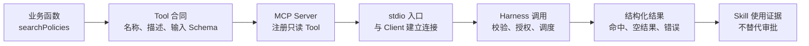

# 18. 示例：只读发布制度 MCP Server

> 这是文档化示例，不再作为仓库中的可运行 npm 项目维护。它保留核心业务函数、MCP Tool 注册、stdio 入口和合同测试，方便读者从教程中直接复制到自己的工程。

## 示例目标

`policy-knowledge-mcp` 只提供一个只读能力：`search_release_policy(query, limit)`。它用于检索发布审批、灰度、回滚、冻结窗口和数据库变更制度，不查询实时发布状态，不执行审批，也不把空结果解释成没有制度。



## 文件结构

```text
policy-knowledge-mcp/
|-- src/
|   |-- policies.ts
|   |-- server.ts
|   `-- index.ts
`-- tests/
    |-- policies.test.ts
    `-- protocol.test.ts
```

<a id="srcpoliciests"></a>

## `src/policies.ts`

```typescript
export const MAX_RESULTS = 5;

export interface ReleasePolicy {
  id: string;
  title: string;
  summary: string;
  requirements: string[];
  tags: string[];
  lastReviewed: string;
}

export interface PolicySearchResult {
  normalizedQuery: string;
  limit: number;
  totalMatches: number;
  items: ReleasePolicy[];
}

const RELEASE_POLICIES: readonly ReleasePolicy[] = [
  {
    id: "REL-001",
    title: "生产发布审批",
    summary: "所有生产环境发布必须由变更负责人发起，并由服务负责人和当班运维完成双人审批。",
    requirements: [
      "关联已通过验收的变更单",
      "附回滚方案和可观测性检查项",
      "高风险变更不得在冻结窗口执行",
    ],
    tags: ["生产", "发布", "审批", "变更"],
    lastReviewed: "2026-06-18",
  },
  {
    id: "REL-002",
    title: "灰度发布与观察窗口",
    summary: "面向用户的变更应先进入灰度环境，并在扩大流量前完成核心指标观察。",
    requirements: [
      "定义灰度人群和流量比例",
      "至少观察一个完整业务高峰",
      "错误率或延迟越过阈值时停止扩量",
    ],
    tags: ["发布", "灰度", "观察", "指标"],
    lastReviewed: "2026-05-30",
  },
  {
    id: "REL-003",
    title: "回滚演练",
    summary: "一级和二级服务必须按季度验证回滚步骤，演练记录需保留一年。",
    requirements: [
      "验证应用版本和数据变更的回退路径",
      "记录恢复时间和未完成项",
      "演练失败后十个工作日内复测",
    ],
    tags: ["发布", "回滚", "rollback", "演练", "恢复"],
    lastReviewed: "2026-06-02",
  },
  {
    id: "REL-004",
    title: "紧急发布",
    summary: "生产事故处置可使用紧急发布流程，但不得跳过身份校验、审计和事后复盘。",
    requirements: [
      "由事件指挥官声明紧急变更",
      "发布完成后二十四小时内补齐审批",
      "在事故复盘中评估变更效果",
    ],
    tags: ["生产", "发布", "紧急", "事故"],
    lastReviewed: "2026-04-21",
  },
  {
    id: "REL-005",
    title: "数据库变更发布",
    summary: "数据库结构变更必须兼容前后两个应用版本，并避免在单次事务中处理大批量数据。",
    requirements: [
      "先扩展结构再迁移数据",
      "提供锁等待和复制延迟监控",
      "破坏性字段删除至少延后一个发布周期",
    ],
    tags: ["发布", "数据库", "兼容", "迁移"],
    lastReviewed: "2026-06-12",
  },
  {
    id: "REL-006",
    title: "发布冻结窗口",
    summary: "重大活动和财务关账期间默认冻结非必要生产变更。",
    requirements: [
      "冻结时间由变更管理平台统一公布",
      "例外申请需说明业务必要性",
      "例外发布必须安排现场值守",
    ],
    tags: ["生产", "发布", "冻结", "例外"],
    lastReviewed: "2026-03-15",
  },
];

export function normalizePolicyQuery(query: string): string {
  return query.normalize("NFKC").trim().replace(/\s+/gu, " ").toLocaleLowerCase("zh-CN");
}

export function searchReleasePolicies(query: string, requestedLimit: number): PolicySearchResult {
  const normalizedQuery = normalizePolicyQuery(query);
  const limit = Math.min(MAX_RESULTS, Math.max(1, Math.trunc(requestedLimit)));

  if (!normalizedQuery) {
    return { normalizedQuery, limit, totalMatches: 0, items: [] };
  }

  const terms = normalizedQuery.split(" ");
  const matches = RELEASE_POLICIES.map((policy, index) => {
    const searchable = normalizePolicyQuery(
      [policy.id, policy.title, policy.summary, policy.tags.join(" "), policy.requirements.join(" ")].join(" "),
    );
    const score = terms.reduce((total, term) => total + (searchable.includes(term) ? 1 : 0), 0);
    return { policy, index, score };
  })
    .filter(({ score }) => score > 0)
    .sort((left, right) => right.score - left.score || left.index - right.index);

  return {
    normalizedQuery,
    limit,
    totalMatches: matches.length,
    items: matches.slice(0, limit).map(({ policy }) => policy),
  };
}
```

<a id="srcserverts"></a>

## `src/server.ts`

```typescript
import { Server } from "@modelcontextprotocol/sdk/server/index.js";
import {
  CallToolRequestSchema,
  ErrorCode,
  ListToolsRequestSchema,
  McpError,
  type CallToolResult,
  type Tool,
} from "@modelcontextprotocol/sdk/types.js";
import { z } from "zod/v4";

import { MAX_RESULTS, searchReleasePolicies } from "./policies.js";

const toolInputSchema = z.object({
  query: z
    .string()
    .trim()
    .min(2, "查询词至少需要 2 个字符")
    .max(80, "查询词最多允许 80 个字符")
    .describe("策略主题或关键词，例如：生产发布审批、回滚演练"),
  limit: z
    .number()
    .int()
    .min(1, "返回条数至少为 1")
    .max(MAX_RESULTS, `返回条数最多为 ${MAX_RESULTS}`)
    .default(3)
    .describe(`返回条数，范围 1-${MAX_RESULTS}`),
});

const toolOutputSchema = z.object({
  normalizedQuery: z.string().describe("归一化后的查询词"),
  limit: z.number().int().min(1).max(MAX_RESULTS).describe("实际采用的返回条数"),
  totalMatches: z.number().int().nonnegative().describe("截断前的匹配策略数量"),
  items: z
    .array(
      z.object({
        id: z.string(),
        title: z.string(),
        summary: z.string(),
        requirements: z.array(z.string()),
        tags: z.array(z.string()),
        lastReviewed: z.string(),
      }),
    )
    .max(MAX_RESULTS),
});

const policyTool = {
  name: "search_release_policy",
  title: "查询发布策略",
  description:
    "在公司发布策略样例库中查找审批、灰度、回滚、冻结窗口和数据库变更要求。仅用于检索已收录策略；不要用它查询实时发布状态，也不要把无结果解释为没有相关制度。",
  inputSchema: z.toJSONSchema(toolInputSchema, {
    target: "draft-2020-12",
    io: "input",
  }) as Tool["inputSchema"],
  outputSchema: z.toJSONSchema(toolOutputSchema, {
    target: "draft-2020-12",
    io: "output",
  }) as NonNullable<Tool["outputSchema"]>,
  annotations: {
    readOnlyHint: true,
    destructiveHint: false,
    idempotentHint: true,
    openWorldHint: false,
  },
} satisfies Tool;

function toolError(message: string): CallToolResult {
  return {
    content: [{ type: "text", text: message }],
    isError: true,
  };
}

export function createPolicyServer(): Server {
  const server = new Server(
    { name: "policy-knowledge-mcp", version: "1.0.0" },
    { capabilities: { tools: {} } },
  );

  server.setRequestHandler(ListToolsRequestSchema, async () => ({ tools: [policyTool] }));
  server.setRequestHandler(CallToolRequestSchema, async (request): Promise<CallToolResult> => {
    if (request.params.name !== policyTool.name) {
      throw new McpError(ErrorCode.InvalidParams, `未找到工具：${request.params.name}`);
    }

    const input = toolInputSchema.safeParse(request.params.arguments ?? {});
    if (!input.success) {
      return toolError(input.error.issues.map((issue) => issue.message).join("；"));
    }

    const result = searchReleasePolicies(input.data.query, input.data.limit);
    const structuredContent = toolOutputSchema.parse({
      normalizedQuery: result.normalizedQuery,
      limit: result.limit,
      totalMatches: result.totalMatches,
      items: result.items,
    });
    const summary =
      result.items.length === 0
        ? `未找到与“${result.normalizedQuery}”匹配的发布策略。无结果不代表不存在相关制度，请缩短关键词或联系变更管理员。`
        : [
            `找到 ${result.totalMatches} 条匹配策略，返回前 ${result.items.length} 条：`,
            ...result.items.map(
              (policy) =>
                `${policy.id} ${policy.title}\n${policy.summary}\n要求：${policy.requirements.join("；")}\n最近复核：${policy.lastReviewed}`,
            ),
          ].join("\n\n");

    return {
      content: [
        { type: "text", text: summary },
        { type: "text", text: JSON.stringify(structuredContent) },
      ],
      structuredContent,
    };
  });

  return server;
}
```

## `src/index.ts`

```typescript
#!/usr/bin/env node

import { StdioServerTransport } from "@modelcontextprotocol/sdk/server/stdio.js";
import { createPolicyServer } from "./server.js";

const server = createPolicyServer();
const transport = new StdioServerTransport();
await server.connect(transport);
console.error("发布策略 MCP 服务器已通过 stdio 启动");
```

## `tests/policies.test.ts`

```typescript
import { describe, expect, it } from "vitest";

import { MAX_RESULTS, searchReleasePolicies } from "../src/policies.js";

describe("searchReleasePolicies", () => {
  it("返回与发布审批查询匹配的策略", () => {
    const result = searchReleasePolicies("生产 发布 审批", 3);

    expect(result.normalizedQuery).toBe("生产 发布 审批");
    expect(result.totalMatches).toBeGreaterThan(0);
    expect(result.items[0]).toMatchObject({
      id: "REL-001",
      title: "生产发布审批",
    });
  });

  it("无匹配策略时返回空集合而不是伪造答案", () => {
    const result = searchReleasePolicies("食堂菜单", 3);

    expect(result.totalMatches).toBe(0);
    expect(result.items).toEqual([]);
  });

  it("归一化大小写、全角空格和重复空白", () => {
    const result = searchReleasePolicies("  ROLLBACK\u3000\u3000演练  ", 3);

    expect(result.normalizedQuery).toBe("rollback 演练");
    expect(result.items[0]?.id).toBe("REL-003");
  });

  it("将 limit 限制在公开上限内", () => {
    const result = searchReleasePolicies("发布", 100);

    expect(result.limit).toBe(MAX_RESULTS);
    expect(result.items.length).toBeLessThanOrEqual(MAX_RESULTS);
  });
});
```

## `tests/protocol.test.ts`

```typescript
import { Client } from "@modelcontextprotocol/sdk/client/index.js";
import { InMemoryTransport } from "@modelcontextprotocol/sdk/inMemory.js";
import { ErrorCode, McpError } from "@modelcontextprotocol/sdk/types.js";
import { spawn } from "node:child_process";
import { fileURLToPath } from "node:url";
import { afterEach, describe, expect, it } from "vitest";

import { createPolicyServer } from "../src/server.js";

describe("policy-knowledge MCP 合同", () => {
  const closeables: Array<{ close: () => Promise<void> }> = [];

  afterEach(async () => {
    await Promise.allSettled(closeables.splice(0).map((item) => item.close()));
  });

  async function connect() {
    const [clientTransport, serverTransport] = InMemoryTransport.createLinkedPair();
    const server = createPolicyServer();
    const client = new Client({ name: "contract-test", version: "1.0.0" });
    closeables.push(client, server);

    await Promise.all([server.connect(serverTransport), client.connect(clientTransport)]);
    return client;
  }

  it("发布具有明确方言和输入边界的 Schema", async () => {
    const client = await connect();
    const { tools } = await client.listTools();
    const tool = tools.find((item) => item.name === "search_release_policy");

    expect(tool).toBeDefined();
    expect(tool?.inputSchema.$schema).toBe("https://json-schema.org/draft/2020-12/schema");
    expect(tool?.outputSchema?.$schema).toBe("https://json-schema.org/draft/2020-12/schema");
    expect(tool?.inputSchema).toMatchObject({
      type: "object",
      required: ["query"],
      properties: {
        query: { type: "string", minLength: 2, maxLength: 80 },
        limit: { type: "integer", minimum: 1, maximum: 5, default: 3 },
      },
    });
    expect(tool?.annotations).toMatchObject({
      readOnlyHint: true,
      destructiveHint: false,
      idempotentHint: true,
      openWorldHint: false,
    });
  });

  it("通过 MCP 返回指向同一记录的文本与结构化结果", async () => {
    const client = await connect();
    const result = await client.callTool({
      name: "search_release_policy",
      arguments: { query: "回滚 演练", limit: 2 },
    });

    expect(result.structuredContent).toMatchObject({
      normalizedQuery: "回滚 演练",
      totalMatches: expect.any(Number),
      items: expect.arrayContaining([expect.objectContaining({ id: "REL-003" })]),
    });
    expect(result.content).toEqual(
      expect.arrayContaining([
        expect.objectContaining({ type: "text", text: expect.stringContaining("REL-003") }),
      ]),
    );
    expect(result.content).toHaveLength(2);
    const jsonFallback = result.content[1];
    expect(jsonFallback).toMatchObject({ type: "text" });
    if (jsonFallback.type !== "text") {
      throw new Error("第二个内容块必须是结构化结果的 JSON 文本回退");
    }
    expect(JSON.parse(jsonFallback.text)).toEqual(result.structuredContent);
  });

  it.each([
    {
      name: "过短查询",
      arguments: { query: "x", limit: 3 },
      message: "查询词至少需要 2 个字符",
    },
    {
      name: "超长查询",
      arguments: { query: "策".repeat(81), limit: 3 },
      message: "查询词最多允许 80 个字符",
    },
    {
      name: "越界返回条数",
      arguments: { query: "发布审批", limit: 99 },
      message: "返回条数最多为 5",
    },
  ])("$name 会返回工具错误", async ({ arguments: toolArguments, message }) => {
    const client = await connect();
    const result = await client.callTool({
      name: "search_release_policy",
      arguments: toolArguments,
    });

    expect(result.isError).toBe(true);
    expect(result.content).toEqual(
      expect.arrayContaining([
        expect.objectContaining({ type: "text", text: expect.stringContaining(message) }),
      ]),
    );
  });

  it("合法但无匹配的调用返回空集合", async () => {
    const client = await connect();
    const result = await client.callTool({
      name: "search_release_policy",
      arguments: { query: "食堂菜单", limit: 3 },
    });

    expect(result.isError).not.toBe(true);
    expect(result.structuredContent).toMatchObject({ totalMatches: 0, items: [] });
    expect(result.content).toEqual(
      expect.arrayContaining([
        expect.objectContaining({ type: "text", text: expect.stringContaining("无结果不代表") }),
      ]),
    );
  });

  it("未知工具返回 JSON-RPC InvalidParams 协议错误", async () => {
    const client = await connect();

    await expect(
      client.callTool({ name: "missing_tool", arguments: {} }),
    ).rejects.toMatchObject<McpError>({ code: ErrorCode.InvalidParams });
  });

  it("stdio 无请求启动时不向 stdout 写日志", async () => {
    const entry = fileURLToPath(new URL("../dist/index.js", import.meta.url));
    const child = spawn(process.execPath, [entry], { stdio: ["pipe", "pipe", "pipe"] });
    let stdout = "";
    let stderr = "";
    child.stdout.setEncoding("utf8");
    child.stderr.setEncoding("utf8");
    child.stdout.on("data", (chunk) => (stdout += chunk));
    child.stderr.on("data", (chunk) => (stderr += chunk));
    child.stdin.end();

    const exitCode = await new Promise<number | null>((resolve, reject) => {
      const timeout = setTimeout(() => {
        child.kill();
        reject(new Error("stdio Server 未在输入关闭后退出"));
      }, 5_000);
      child.once("error", reject);
      child.once("close", (code) => {
        clearTimeout(timeout);
        resolve(code);
      });
    });

    expect(exitCode).toBe(0);
    expect(stdout).toBe("");
    expect(stderr).toContain("已通过 stdio 启动");
  });
});
```

## 这个示例想强调什么

| 设计点 | 示例中的体现 |
| --- | --- |
| 输入收窄 | `query` 限长，`limit` 限制在 `1-5` |
| 输出可追溯 | 返回 `id`、`title`、`requirements`、`lastReviewed` |
| 空结果语义 | 空集合不是“没有制度”，而是“未找到匹配项” |
| 权限边界 | Tool 只检索制度，不审批发布、不查询实时状态 |
| 协议卫生 | stdio 日志写 stderr，stdout 只留给协议消息 |
| 合同测试 | 测 Schema、结构化结果、错误、空结果和未知工具 |

生产实现应把内存数组替换成权威制度库，并补上身份、租户、对象级授权、分页、超时、取消、审计和数据分类控制。

