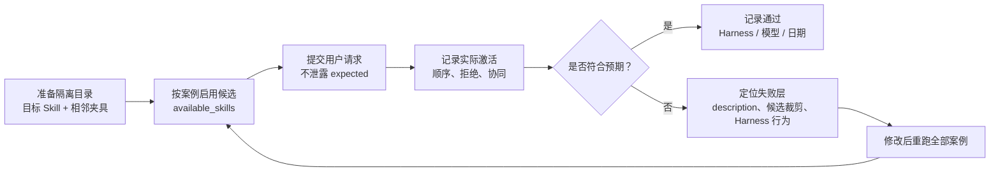

# 19. 示例：Skill 路由评测案例

> 路由案例和相邻 Skill 夹具放在同一份文档里，用于教学和团队复核。

## 评测夹具说明

下面这些 Skill 只提供相邻候选元数据，用于验证 `release-risk-review-skill` 的误触发、优先级和协同边界，不是可直接投入生产的完整流程。

运行评测时，把下面四个夹具与[发布风险审查 Skill 示例](16-example-release-risk-review-skill.md)准备在隔离测试区。每条案例开始前，只把该案例 `available_skills` 列出的目录安装或启用到目标 Harness；未列出的 Skill 必须从当次 catalog 移除或禁用。只记录是否激活及激活顺序，不把夹具正文当作目标答案，也不把前一次运行的上下文带入下一次。

夹具的 `description` 是测试输入的一部分。修改任何描述后，必须重跑全部路由案例并记录 Harness、模型、版本和日期。



## 相邻 Skill 夹具

### `database-migration-review`

```markdown
---
name: database-migration-review
description: 审查数据库结构迁移、数据回填、双写、锁、兼容窗口和恢复方案，输出迁移专项风险。用于用户提供迁移脚本或计划并要求检查数据库变更、字段删除、回填、回滚或前后版本兼容时；它不替代包含其他系统变更的整体发布风险审查。
---

# 数据库迁移审查夹具

这是路由评测夹具。被选中时，只确认需要完成数据库迁移专项审查并把结论作为发布证据；不要执行迁移或作最终发布审批。
```

### `incident-response`

```markdown
---
name: incident-response
description: 响应正在发生的生产故障，优先止血、恢复服务、建立指挥与保留证据。用于用户报告当前中断、错误率激增、超时或刚发布版本正在造成影响并要求立即处理时；不要用于事故结束后的复盘或计划发布的常规风险审查。
---

# 实时事故响应夹具

这是路由评测夹具。被选中时，只确认当前任务需要优先处理持续事故；不要把完整复盘或计划发布审查置于恢复服务之前。
```

### `incident-review`

```markdown
---
name: incident-review
description: 复盘已经恢复的生产事故，输出事实时间线、根因、促成因素和可跟踪改进项。用于故障已止血后编写事故复盘、事后分析或无责回顾；不要用于响应仍在持续的事故，也不要用于计划中发布的放行判断。
---

# 事故复盘夹具

这是路由评测夹具。被选中时，只确认当前任务属于已恢复事故的事后复盘，并区分事实、推断与改进项；不要执行实时处置或发布审批。
```

### `security-review`

```markdown
---
name: security-review
description: 审查认证、授权、令牌、密钥、数据暴露和信任边界的安全风险，输出可验证的安全发现与缓解要求。用于用户要求安全评审，或变更涉及 OAuth、权限范围、会话、凭据、加密和敏感数据时；它提供专项结论，不替代整个版本的发布放行审查。
---

# 安全审查夹具

这是路由评测夹具。被选中时，只确认需要先完成安全专项审查并把发现交给上层发布决策；不要自行批准发布。
```

## 路由案例 YAML

```yaml
version: "1.0"
skill: release-risk-review-skill
说明: >-
  这组案例验证发布风险审查 Skill 的发现与路由质量。执行时应在全新会话中提供
  发布风险审查 Skill 示例与相邻候选 Skill，
  记录实际激活结果，不向 Agent 泄露 expected 字段或 reason。

候选目录:
  目标_skill: docs/16-example-release-risk-review-skill.md
  相邻_skill夹具: docs/19-routing-evaluation-cases.md

判定规则:
  - "所有 available_skills 都必须以真实 SKILL.md 的 name 和 description 暴露给 Harness。"
  - "每条案例只启用 available_skills；没有列出的夹具不得出现在该案例的 catalog。"
  - "expected.activate 中的 Skill 必须全部激活。"
  - "expected.do_not_activate 中的 Skill 不得激活。"
  - "若 expected.primary 非空，Agent 应先执行该 Skill，再决定是否调用协同 Skill。"
  - "仅口头提及发布、部署或风险，不足以自动判定为发布风险审查。"

cases:
  - id: 正例-直接请求风险评估
    category: 正例
    prompt: >-
      请审查 release/2026.07 与 main 的差异，结合测试结果、数据库迁移和回滚方案，
      判断今晚的生产发布是否可以放行，并列出阻断项。
    available_skills:
      - release-risk-review-skill
    expected:
      activate:
        - release-risk-review-skill
      do_not_activate: []
      primary: release-risk-review-skill
    reason: 用户明确要求基于发布证据作风险分级和放行判断。

  - id: 正例-上线前检查
    category: 正例
    prompt: >-
      这是本周支付服务的变更清单、灰度计划和监控面板。帮我做一次上线前检查，
      告诉我哪些风险必须在变更窗口前关闭。
    available_skills:
      - release-risk-review-skill
    expected:
      activate:
        - release-risk-review-skill
      do_not_activate: []
      primary: release-risk-review-skill
    reason: 上线前检查、灰度和阻断项属于该 Skill 的核心触发语义。

  - id: 隐晦-询问是否敢发
    category: 隐晦表达
    prompt: >-
      这批改动碰了登录、缓存键和两张核心表，集成测试通过，但恢复演练还是上个月的。
      值班同学问今晚到底敢不敢发，你给一个有证据的结论。
    available_skills:
      - release-risk-review-skill
    expected:
      activate:
        - release-risk-review-skill
      do_not_activate: []
      primary: release-risk-review-skill
    reason: 没有使用“风险审查”字样，但要求基于证据作发布决策。

  - id: 隐晦-证据充分性判断
    category: 隐晦表达
    prompt: >-
      变更单只有单元测试截图和一句“可以回滚”，没有负责人、观测指标或恢复时长。
      这够不够支持明早全量？还缺什么？
    available_skills:
      - release-risk-review-skill
    expected:
      activate:
        - release-risk-review-skill
      do_not_activate: []
      primary: release-risk-review-skill
    reason: 核心任务是判断发布证据是否足以支撑全量放行。

  - id: 显式点名-短名称
    category: 显式点名
    prompt: >-
      请使用 release-risk-review-skill 审查下面的部署计划。不要执行部署，只输出风险登记表和发布建议。
    available_skills:
      - release-risk-review-skill
    expected:
      activate:
        - release-risk-review-skill
      do_not_activate: []
      primary: release-risk-review-skill
    reason: 用户显式指定 Skill 名称。

  - id: 显式点名-带符号
    category: 显式点名
    prompt: >-
      用 /release-risk-review-skill 看一下 v4.8.0 的上线材料，重点检查不可逆迁移和回滚证据。
    available_skills:
      - release-risk-review-skill
    expected:
      activate:
        - release-risk-review-skill
      do_not_activate: []
      primary: release-risk-review-skill
    reason: Harness 若支持斜杠调用应直接激活；不支持时也应从明文名称识别。

  - id: 近邻反例-撰写发布说明
    category: 近邻反例
    prompt: >-
      根据这些提交记录写一份面向客户的 v4.8.0 发布说明，按新增、修复和已知问题分组。
    available_skills:
      - release-risk-review-skill
    expected:
      activate: []
      do_not_activate:
        - release-risk-review-skill
      primary: null
    reason: 任务是内容编写，不要求风险分级、证据审查或放行决策。

  - id: 近邻反例-执行测试环境部署
    category: 近邻反例
    prompt: >-
      把当前分支部署到测试环境，部署完成后把访问地址发给我。
    available_skills:
      - release-risk-review-skill
    expected:
      activate: []
      do_not_activate:
        - release-risk-review-skill
      primary: null
    reason: 任务是执行部署，不是发布风险审查；该 Skill 也不应借机执行环境变更。

  - id: 近邻反例-修复流水线
    category: 近邻反例
    prompt: >-
      发布流水线的 lint 阶段失败了，请定位原因并修复配置。
    available_skills:
      - release-risk-review-skill
    expected:
      activate: []
      do_not_activate:
        - release-risk-review-skill
      primary: null
    reason: “发布”只是流水线语境，用户需要调试而不是放行评估。

  - id: 近邻反例-事后复盘
    category: 近邻反例
    prompt: >-
      昨天的生产事故已经恢复，请整理时间线、根因和改进项，形成复盘文档。
    available_skills:
      - release-risk-review-skill
      - incident-review
    expected:
      activate:
        - incident-review
      do_not_activate:
        - release-risk-review-skill
      primary: incident-review
    reason: 事故已结束，任务目标是复盘，不是尚未发生的发布决策。

  - id: 无关反例-总结会议纪要
    category: 无关反例
    prompt: >-
      请把这份季度产品会议纪要压缩成五条结论，并单列负责人和下次会议日期。
    available_skills:
      - release-risk-review-skill
      - incident-review
      - incident-response
      - security-review
      - database-migration-review
    expected:
      activate: []
      do_not_activate:
        - release-risk-review-skill
        - incident-review
        - incident-response
        - security-review
        - database-migration-review
      primary: null
    reason: 任务与发布、事故、安全和数据库迁移都无关，用完整候选集验证基础误触发率。

  - id: 冲突-安全审查协同
    category: 冲突与协同
    prompt: >-
      这次上线改了 OAuth 权限范围和令牌刷新逻辑。请先检查安全问题，再综合灰度、监控和回滚材料决定是否放行。
    available_skills:
      - release-risk-review-skill
      - security-review
    expected:
      activate:
        - security-review
        - release-risk-review-skill
      do_not_activate: []
      primary: security-review
    reason: 安全 Skill 负责专项发现，发布风险 Skill 汇总证据并作放行判断，二者不应互相替代。

  - id: 冲突-事故止血优先
    category: 冲突与协同
    prompt: >-
      刚发布的版本正在造成订单超时。先帮我止血和恢复服务，暂时不要做完整发布评估。
    available_skills:
      - release-risk-review-skill
      - incident-response
    expected:
      activate:
        - incident-response
      do_not_activate:
        - release-risk-review-skill
      primary: incident-response
    reason: 用户明确要求先处理实时事故并推迟发布评估，不能因出现“发布”而误触发。

  - id: 冲突-数据库专项后汇总
    category: 冲突与协同
    prompt: >-
      请用 database-migration-review 检查迁移脚本，再用 release-risk-review-skill 汇总整个版本的发布风险。
    available_skills:
      - release-risk-review-skill
      - database-migration-review
    expected:
      activate:
        - database-migration-review
        - release-risk-review-skill
      do_not_activate: []
      primary: database-migration-review
    reason: 用户显式指定顺序；专项审查输出应成为发布风险审查的证据输入。

执行记录模板:
  harness: "填写 Harness 与版本"
  model: "填写模型与版本"
  date: "YYYY-MM-DD"
  runs_per_case: 3
  记录字段:
    - case_id
    - actual_activated
    - activation_order
    - false_positive
    - false_negative
    - notes
```

## 使用建议

1. 每条案例使用全新会话，避免前一次激活结果污染下一次。
2. 只启用案例中 `available_skills` 列出的候选。
3. 不向 Agent 暴露 `expected` 和 `reason` 字段。
4. 至少记录 Harness、模型、Skill 版本、候选集、激活顺序和失败说明。
5. 修改任何 `description` 后，重跑正例、隐晦正例、近邻反例和冲突案例。


