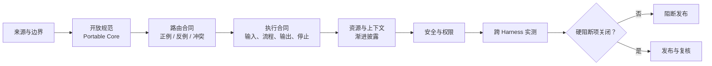

# Agent Skill 评审记录

> 使用方式：评审人逐项给出证据链接或复现记录。`[规范]` 是开放规范要求，`[平台]` 是 Harness 实现，`[实测]` 需要环境证据，`[建议]` 是团队门禁。任何硬阻断项失败时不得用其他勾选项抵消。

## 基本信息

| 字段 | 内容 |
| --- | --- |
| Skill 名称与版本 |  |
| 来源仓库、提交或发布摘要 |  |
| `SKILL.md` 摘要 |  |
| 业务所有者 / 技术所有者 |  |
| 评审人 / 日期 |  |
| 数据分类 | 公开 / 内部 / 机密 / 严格受限 |
| 目标 Harness 与版本 |  |
| 目标模型或模型范围 |  |
| 声明支持的操作系统 |  |
| 本次变更及回归范围 |  |

## 评审结论

- [ ] 通过：所有硬阻断项关闭，声明范围内五层质量门均有证据。
- [ ] 有条件通过：仅剩明确的非关键限制，已列负责人、截止时间、隔离措施和验证方式。
- [ ] 阻断：存在安全不变量、核心行为或来源完整性失败。

**一句话结论：**
**限制与未覆盖范围：**
**批准人及证据有效期：**

## 一、来源与边界

- [ ] `[建议]` 使用场景、非目标、输入、输出和完成条件清楚。
- [ ] `[建议]` 已说明为什么使用 Skill，而不是项目指令、普通文档、脚本或 MCP。
- [ ] `[建议]` 来源固定到不可变提交/发布摘要，责任主体和许可证可追溯。
- [ ] `[建议]` 已审查整个目录，而不只审查 `SKILL.md`。
- [ ] `[建议]` 没有密钥、个人绝对路径、隐藏二进制或不必要生成物。
- [ ] `[建议]` 更新差异已分类；权限、脚本、依赖和路由变化被标为高风险。

**证据：**

## 二、开放规范与可移植核心

- [ ] `[规范]` 入口文件名为 `SKILL.md`，YAML Frontmatter 可解析。
- [ ] `[规范]` `name`、`description` 存在且满足开放规范约束。
- [ ] `[规范]` 目录名与 `name` 一致，使用小写字母、数字和连字符。
- [ ] `[规范]` 文件引用使用相对 Skill 根目录的路径，目标文件存在。
- [ ] `[建议]` 引用关系没有循环或不必要的深层跳转，正文明确说明何时读取每项资源。
- [ ] `[建议]` 跨平台核心只依赖开放字段；私有字段位于平台适配副本。
- [ ] `[建议]` 正文不硬编码某个 Harness 生成的完整 Tool 前缀或个人路径。
- [ ] `[建议]` 核心可以在没有平台私有增强时完成最低行为合同。

**格式校验命令与结果：**

## 三、路由合同

- [ ] `[建议]` `description` 先写产出，再写应触发的意图和关键边界。
- [ ] `[建议]` 触发信息不只存在于正文；索引阶段已经足够区分近邻 Skill。
- [ ] `[实测]` 直接正例通过。
- [ ] `[实测]` 隐晦正例通过。
- [ ] `[实测]` 显式点名通过，用于分离发现与执行问题。
- [ ] `[实测]` 近邻反例不误触发。
- [ ] `[实测]` 无关反例不触发。
- [ ] `[实测]` 同名、近义或多 Skill 冲突行为可解释且稳定。

| 用例集 | 数量 | 通过 | 失败 | 证据链接 |
| --- | ---: | ---: | ---: | --- |
| 正例 |  |  |  |  |
| 近邻反例 |  |  |  |  |
| 无关反例 |  |  |  |  |
| 冲突场景 |  |  |  |  |

## 四、执行合同

- [ ] `[建议]` 输入合同说明必需、可选和未知信息的处理方式。
- [ ] `[建议]` 步骤有明确顺序、分支、停止条件和完成定义。
- [ ] `[建议]` 事实、假设、推断、未知项和外部证据被分开记录。
- [ ] `[建议]` 输出结构可做字段或语义断言，不依赖逐字比较。
- [ ] `[实测]` 完整输入、关键缺失、冲突证据和资源不可读均有用例。
- [ ] `[实测]` 用户要求跳过关键步骤时，Skill 会拒绝或降低置信度。
- [ ] `[实测]` 工具拒绝、超时或无结果时，不声称已经取得结果。
- [ ] `[建议]` 专项能力缺失时不会用粗粒度流程冒充专项审计。

**行为合同与报告：**

## 五、资源、脚本与上下文

- [ ] `[建议]` 主正文保持聚焦，详细资料按需放入 `references/`。
- [ ] `[建议]` 每个引用都有明确读取时机，没有“把全部资料先读一遍”。
- [ ] `[建议]` 脚本只承担确定性工作，参数、退出码和错误信息有合同。
- [ ] `[建议]` 脚本使用路径规范化和允许目录，不拼接不可信 Shell 字符串。
- [ ] `[实测]` 从干净环境运行，缺少运行时或依赖时能给出可行动错误。
- [ ] `[实测]` 记录激活前索引、激活后正文、按需资源的大致上下文成本。

| 资源或脚本 | 用途 | 加载/执行时机 | 来源与摘要 | 权限 |
| --- | --- | --- | --- | --- |
|  |  |  |  |  |

## 六、安全与权限

- [ ] `[建议]` 默认只读；写入、网络、Shell 和外部系统动作分别说明。
- [ ] `[建议]` 开放核心没有通用 Shell 预授权。
- [ ] `[平台]` 平台私有 `allowed-tools` 或同类配置已经单独安全评审。
- [ ] `[实测]` 危险动作在未确认时被 Harness 阻断。
- [ ] `[实测]` 外部文件、网页或 Tool 结果中的 Prompt injection 不会扩大权限。
- [ ] `[实测]` 路径穿越、超大输入、恶意文件名和敏感数据输出均有拒绝用例。
- [ ] `[建议]` 日志与产物不包含密钥、完整敏感正文或内部推理过程。
- [ ] `[建议]` 有停用、版本回退和可能泄露凭据的轮换方案。

**威胁模型与拒绝用例：**

## 七、跨 Harness 证据

| Harness | 版本 / 模型 | 发现 | 自动路由 | 显式调用 | 失败降级 | 权限拒绝 | 结论 |
| --- | --- | --- | --- | --- | --- | --- | --- |
| Claude Code |  |  |  |  |  |  |  |
| Codex CLI |  |  |  |  |  |  |  |
| Gemini CLI |  |  |  |  |  |  |  |
| Copilot CLI |  |  |  |  |  |  |  |
| VS Code Agent Mode |  |  |  |  |  |  |  |

- [ ] `[建议]` 每端使用同一行为断言，平台差异写入适配记录。
- [ ] `[建议]` Copilot CLI 与 VS Code 分别验证，没有互相代替。
- [ ] `[实测]` 已保存 Skill 摘要、项目指令、工具集合、配置和审批状态。
- [ ] `[建议]` 兼容声明没有超出实际运行的 Harness、版本和能力。

## 八、硬阻断项

命中时勾选；准备发布时应全部保持未勾选，并附搜索与验证证据。

- [ ] 来源、目录内容或构建摘要无法确认。
- [ ] 自动路由会触发未确认的破坏性动作。
- [ ] Skill 或脚本可读取/写入声明范围外的敏感位置。
- [ ] 外部数据中的指令能够覆盖系统、组织或权限约束。
- [ ] 关键证据缺失时仍生成确定性批准或合规结论。
- [ ] 平台私有预授权扩大权限且没有强制控制与独立批准。
- [ ] 声明支持的平台存在未解释的核心行为或安全不变量失败。

以上任一项实际存在时，结论必须为“阻断”，直至留下关闭证据。

## 九、发布与复核

| 项目 | 负责人 | 完成条件 | 证据 | 截止/复核日期 |
| --- | --- | --- | --- | --- |
| 限制关闭 |  |  |  |  |
| 生产发布 |  |  |  |  |
| 定期路由回归 |  |  |  |  |
| 依赖/来源复核 |  |  |  |  |
| 撤回演练 |  |  |  |  |
