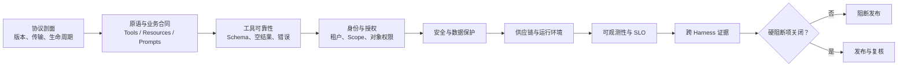

# MCP Server 评审记录

> 使用方式：按协议、业务合同、安全和跨 Harness 五类证据评审。Tool 注解、连接成功和 Inspector 截图都不是授权或生产质量的充分证据。稳定实现基线为 MCP `2025-11-25`；Draft/RC 必须单独标记。

## 基本信息

| 字段 | 内容 |
| --- | --- |
| Server 名称与版本 |  |
| 源码提交 / 构建产物摘要 |  |
| SDK、运行时与锁文件版本 |  |
| 业务所有者 / 技术所有者 / 安全所有者 |  |
| 评审人 / 日期 |  |
| 目标协议版本 | `2025-11-25` / 其他明确版本 |
| 实际 Schema 方言 | 从 `tools/list` 记录 `$schema`，不得只写设计目标 |
| 传输 | stdio / Streamable HTTP / 兼容传输 |
| 暴露原语 | Tools / Resources / Prompts / Client 能力依赖 |
| 数据分类与租户模型 |  |
| 目标 Harness 与版本 |  |
| 本次变更及回归范围 |  |

## 评审结论

- [ ] 通过：硬阻断项全部关闭，协议、业务、安全和跨端合同均有证据。
- [ ] 有条件通过：只剩受隔离的非关键限制，已有负责人、期限和验证方法。
- [ ] 阻断：存在授权、数据、协议、供应链或核心行为失败。

**一句话结论：**
**支持范围与未覆盖能力：**
**批准人及证据有效期：**

## 一、协议剖面与生命周期

- [ ] `[规范]` 明确目标版本，初始化时协商单一共同版本。
- [ ] `[规范]` `initialize`、能力声明、正常运行、取消和关闭顺序有效。
- [ ] `[建议]` 稳定代码不依赖 Draft/RC 字段；前瞻实现位于独立分支。
- [ ] `[规范]` stdio 的 stdout 只承载协议消息，诊断写 stderr。
- [ ] `[规范]` Streamable HTTP 的 Content-Type、版本头、会话和来源校验符合目标版本。
- [ ] `[建议]` 启动、请求、空闲和总时长有上限，断连与取消可回收资源。
- [ ] `[实测]` 不兼容版本、重复初始化、异常关闭和畸形 JSON-RPC 有确定结果。
- [ ] `[实测]` `tools/list` 的实际 `$schema`、输入边界与文档化的兼容剖面一致。

**协议测试/Inspector 证据：**

## 二、原语与业务合同

| 原语/名称 | 用户目标 | 输入边界 | 输出/错误 | 权限 | 风险级别 |
| --- | --- | --- | --- | --- | --- |
|  |  |  |  |  |  |

- [ ] `[建议]` Tool 名称稳定且低歧义，描述同时说明用途、边界和不适用场景。
- [ ] `[建议]` 输入 Schema 类型明确，并按业务风险设置适用的长度、数量、枚举、格式和必需字段。
- [ ] `[规范]` 声明输出 Schema 时，结构化结果与 Schema 一致。
- [ ] `[规范]` 返回 `structuredContent` 时，`TextContent` 同时包含由同一对象生成的序列化 JSON 回退；反序列化后与结构化结果一致。
- [ ] `[建议]` 空结果是明确状态，不生成相似事实，不解释为“对象不存在”。
- [ ] `[建议]` 业务错误、协议错误、依赖失败、取消和部分结果可以区分。
- [ ] `[建议]` 结果带稳定来源标识、时效、分页/裁剪信息和适用限制。
- [ ] `[建议]` Resources 与 Prompts 的选择方式明确，没有假定自动进入模型上下文。
- [ ] `[规范]` Tool 注解只作为提示，没有被当成安全强制机制。

## 三、工具选择与可靠性

- [ ] `[实测]` 单个 Tool 正常、空结果、非法输入、边界和上限用例通过。
- [ ] `[实测]` 与近邻 Tool 同时暴露时，模型选择正确且参数首次通过。
- [ ] `[实测]` Tool 与问题无关时不被无意义调用。
- [ ] `[实测]` 超时、取消、下游限流、部分失败和重试耗尽均有用例；不适用项附架构理由，并在引入外部依赖后自动升级为必测。
- [ ] `[建议]` 重试次数有界，只重试可安全重试的错误；写操作不会重复生效。
- [ ] `[建议]` 写操作使用预览/执行分离、明确对象、幂等键和恢复策略。
- [ ] `[建议]` 并发、分页、单结果、总结果和响应字节数均有限制。

| 指标 | 门槛 | 实际 | 数据窗口 | 证据 |
| --- | ---: | ---: | --- | --- |
| Schema 首次通过率 |  |  |  |  |
| Tool 选择准确率 |  |  |  |  |
| 空结果正确率 |  |  |  |  |
| P95 延迟 |  |  |  |  |
| 超时/取消回收率 |  |  |  |  |

## 四、身份、授权与租户隔离

- [ ] `[规范]` 远程授权遵循目标版本规范，发现和 Token 流程可互操作。
- [ ] `[规范]` Server 按 Token 类型验证访问令牌：JWT 验证签名和声明，不透明 Token 通过授权服务器提供的机制验证；确认令牌有效且专门签发给本 Server。
- [ ] `[规范]` 不接受并透传未签发给本 Server 的上游 Token。
- [ ] `[建议]` 每次调用重新执行主体、租户、对象和动作级授权。
- [ ] `[建议]` 初始化成功、Tool 可见和用户确认没有替代业务授权。
- [ ] `[实测]` 越租户、越对象、Scope 不足、过期 Token 和撤销 Token 均被拒绝。
- [ ] `[建议]` stdio 只继承显式需要的环境变量，远程密钥来自秘密管理系统。
- [ ] `[建议]` 会话 ID 只关联状态，不充当身份或授权凭据。

**身份流图、Scope 与拒绝证据：**

## 五、安全与数据保护

- [ ] `[建议]` 已建模混淆代理、SSRF、会话劫持、Prompt injection 和本地代码执行。
- [ ] `[实测]` URL、重定向、DNS/Host、私网和云元数据访问受到限制。
- [ ] `[实测]` SQL/命令/模板注入、路径穿越、压缩炸弹和超大内容被拒绝。
- [ ] `[建议]` Tool 结果和 Resources 被视为不可信数据，不能提升为控制指令。
- [ ] `[建议]` 返回字段遵守最小化原则，敏感字段脱敏或不返回。
- [ ] `[建议]` 审计记录主体、租户、动作、对象、结果分类和关联 ID。
- [ ] `[建议]` 日志不记录 Token、密钥、完整敏感正文或不必要的个人数据。
- [ ] `[实测]` 用户拒绝 Harness 调用后，没有旁路或伪造成功结果。

**威胁模型与安全测试：**

## 六、供应链与运行环境

- [ ] `[建议]` 源码、依赖锁、构建命令、产物摘要和部署版本可一一对应。
- [ ] `[建议]` 使用严格锁定安装，依赖、许可证、SBOM 和漏洞处置有记录。
- [ ] `[建议]` 不在生产配置中使用移动包版本、移动容器标签或每次远程下载执行。
- [ ] `[建议]` 进程使用非特权身份，文件、网络和系统调用遵守最小权限。
- [ ] `[建议]` 配置、密钥和日志与构建产物分离。
- [ ] `[实测]` 干净环境启动、依赖缺失、配置错误和优雅停机均有验证。
- [ ] `[建议]` 能快速禁用 Server/Tool、吊销凭据并回退到已知构建。

**SBOM、扫描、摘要与撤回演练：**

## 七、可观测性与运行目标

- [ ] `[建议]` Host 与 Server 使用关联 ID，能追踪初始化、调用、审批与下游请求。
- [ ] `[建议]` 指标包含调用量、成功/错误分类、延迟、超时、取消和结果大小。
- [ ] `[建议]` 告警对应可行动的失败方式，并有负责人、值班和升级路径。
- [ ] `[建议]` 日志、指标和 Trace 的保留期与访问权限符合数据分类。
- [ ] `[实测]` 下游不可用、过载和网络分区时进入受控降级，不形成重试风暴。
- [ ] `[建议]` 容量假设、SLO、限流、熔断和恢复时间已有业务批准。

## 八、跨 Harness 证据

| Harness | 版本 / 模型 | 初始化 | 能力/过滤 | 正常调用 | 拒绝 | 超时/空结果 | 结论 |
| --- | --- | --- | --- | --- | --- | --- | --- |
| Claude Code |  |  |  |  |  |  |  |
| Codex CLI |  |  |  |  |  |  |  |
| Gemini CLI |  |  |  |  |  |  |  |
| Copilot CLI |  |  |  |  |  |  |  |
| VS Code Agent Mode |  |  |  |  |  |  |  |

- [ ] `[建议]` 每端记录传输、有效配置、工具过滤、信任状态和审批选择。
- [ ] `[实测]` 同一业务合同和安全不变量在声明范围内通过。
- [ ] `[建议]` 仅验证 Tools 时没有声称 Resources、Prompts 或完整 MCP 支持。
- [ ] `[建议]` Copilot CLI 与 VS Code 分别验证。

## 九、硬阻断项

命中时勾选；准备发布时应全部保持未勾选，并附搜索与验证证据。

- [ ] 构建来源、依赖或部署产物无法追溯。
- [ ] Token 受众不校验、Token 被透传或对象级授权缺失。
- [ ] 越租户、越对象或未经确认的写调用能够成功。
- [ ] 破坏性写操作没有预览、幂等、审计或恢复路径。
- [ ] Tool 结果可使 Agent 泄露秘密或执行结果内指令。
- [ ] Server 可无界返回、重试、占用资源或访问未声明网络/文件范围。
- [ ] 空结果、部分失败或断线被包装成确定性成功。
- [ ] 声明支持的平台存在未解释的核心合同或安全失败。
- [ ] 无法快速停用、吊销凭据或回退构建。

以上任一项实际存在时，结论必须为“阻断”，直至留下关闭证据。

## 十、发布与复核

| 项目 | 负责人 | 完成条件 | 证据 | 截止/复核日期 |
| --- | --- | --- | --- | --- |
| 限制关闭 |  |  |  |  |
| 生产部署 |  |  |  |  |
| 权限与凭据复核 |  |  |  |  |
| 依赖与漏洞复核 |  |  |  |  |
| 跨 Harness 回归 |  |  |  |  |
| 停用与恢复演练 |  |  |  |  |
