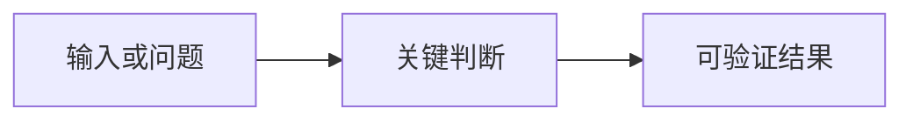

# <页面标题>

> **适用范围：** <本页覆盖与不覆盖的范围>
> **规范基线：** <固定版本或“不适用”>
> **最近验证：** <年-月-日与环境>
> **状态：** 草拟 / 已验证 / 需复核

## 读完能完成什么

用两到四句话说明读者将能做出的决定、实现的产物或完成的验证。不要只写“了解相关概念”。

## 核心结论

先给结论，再展开原因。分别使用 `[规范]`、`[平台]`、`[实测]`、`[建议]` 标明结论性质。

## 原理与边界

说明组件负责什么、不负责什么，以及它与相邻组件的接口。平台实现不得写成通用规范。

| 关注点 | 结论 | 证据类型 | 验证方式 |
|---|---|---|---|
| <关注点> | <明确结论> | `[规范]` | <链接或命令> |

## 实施步骤

1. 给出可执行输入与前置条件。
2. 给出完整命令、配置或代码。
3. 给出预期的可观察结果。
4. 给出失败时的诊断路径与停止条件。

## 质量与安全

列出成功标准、负向用例、权限边界、敏感数据处理和回归范围。高风险动作必须说明审批者与审计证据。

## 常见失败

| 症状 | 根因 | 修复 | 防回归测试 |
|---|---|---|---|
| <可观察症状> | <可验证根因> | <具体修复> | <测试名称或步骤> |

## 来源与复现

只列支撑本页结论的一手来源，并写固定版本。实测结论同时记录产品版本、日期、环境、输入和结果。

