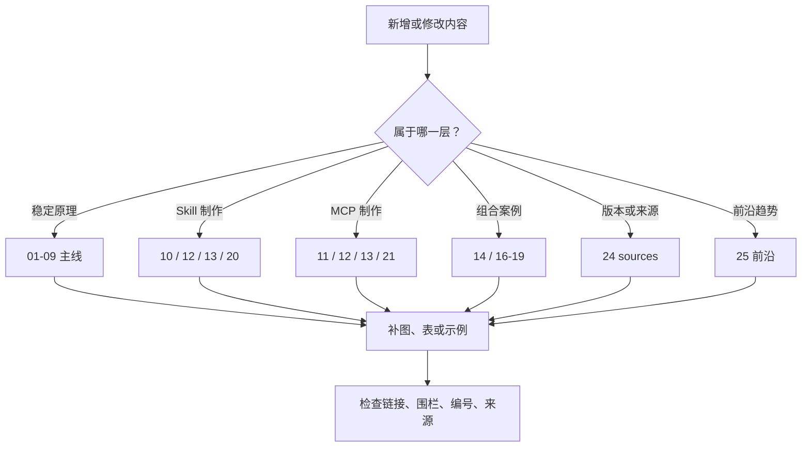

# 内容规范与发布检查

本仓库面向长期内部查阅。新增或修改内容的目标不是“补充更多文字”，而是让某个结论更准确、更可执行或更容易验证。

内容采用固定教学顺序：先用场景解释问题，再给最小例子和可跟做步骤，随后解释原理，最后进入跨 Harness、质量、安全和规范细节。新协议字段、测试日志或平台配置不应插在第一个例子之前。

基础知识按八条正交主线组织，不写成“旧概念依次被新概念替代”的单线故事：模型能力怎样形成、模型怎样提出动作、Harness 怎样运行循环、上下文怎样组装、能力怎样发现与路由、外部能力怎样连接、Agent 之间怎样委派，以及人怎样理解和控制 Agent。新增概念时必须说明它解决哪一层问题，以及它与相邻机制能否组合。

## 修改前先判断归属

| 内容 | 应修改的位置 |
|---|---|
| AI Agent 的全景、关键历史节点与知识地图 | `docs/01-AI-Agent全景与演进史.md` |
| Token、模型训练/后训练、推理时计算、多模态、Embedding 与模型选型 | `docs/02-LLM能力底座与模型选型.md` |
| 不随平台变化的心智模型与选型边界 | `docs/03-Agent-Skill-MCP基础关系.md` |
| Function Calling、Tool Use 与结构化输出 | `docs/04-Function-Calling与Tool-Use.md` |
| Agent Loop、Workflow、Planning 与运行时控制 | `docs/05-Agent循环工作流与规划.md` |
| Context Engineering、RAG 与 Memory | `docs/06-上下文工程RAG与Memory.md` |
| Multi-Agent、委派与 A2A | `docs/07-Multi-Agent委派与A2A.md` |
| Skill、Tool、MCP 与 A2A 的能力发现、候选裁剪和路由 | `docs/08-能力发现候选裁剪与路由.md` |
| 澄清、计划展示、批准、进度、纠正、取消、恢复与人工交接 | `docs/09-人机协作与可控交互.md` |
| Agent Skills 开放规范和通用制作方法 | `docs/10-高质量Agent-Skill制作.md` |
| MCP 稳定规范、服务端设计与实现 | `docs/11-高质量MCP-Server制作.md` |
| 发现路径、配置格式、调用方式、产品限制 | `docs/12-跨Harness适配.md` |
| 评估、安全、数据/用途治理、供应链和发布门禁 | `docs/13-质量工程与安全治理.md` |
| Skill 与 MCP 的职责组合及受控写操作教学案例 | `docs/14-Skill与MCP组合实践.md` |
| 生产 Runtime、持久任务、写操作、模型网关与 SLO | `docs/15-生产级Agent-Runtime架构.md` |
| 官方链接、固定版本和验证日期 | `docs/24-官方来源事实标签与版本基线.md` |
| Agent 前沿趋势、试点判断和暂不进入稳定主线的方向 | `docs/25-Agent前沿趋势.md` |
| 核心术语、章节索引和相邻概念边界 | `docs/26-Agent系统术语表与概念索引.md` |
| 跟做练习、自测和教学路线 | `docs/27-跟做练习从概念到可验证Agent能力.md` |
| 故障排查、事故记录和防回归用例 | `docs/28-Agent故障排查手册.md` |
| 示例行为 | `docs/18-案例只读发布制度MCP-Server.md` 等示例附录，并说明真实落地时需要在独立工程验证 |
| 评审流程 | `docs/20-Skill评审模板.md` 与 `docs/21-MCP评审模板.md` |

平台行为不得反向写成开放规范。无法确定归属时，先问它是在回答“标准是什么”“某产品现在怎么做”，还是“团队建议怎么做”。



## 事实证据分级

正文中的时效性结论使用以下标签：

- `[规范]`：优先使用固定版本的开放规范；只有滚动规范时记录核对日期并固定仓库 commit 或归档快照。
- `[平台]`：厂商官方产品文档或官方源码中的当前行为。
- `[研究]`：原始论文、研究项目或机构工程研究提出的方法与观察。
- `[实测]`：写明日期、版本、环境、步骤和结果的可重复实验。
- `[建议]`：团队基于权衡给出的工程实践。

规范事实的来源优先级为固定版本规范与 Schema；产品事实优先官方文档、官方源码与发布说明；研究结论优先原始论文和项目页；本地行为必须有可重复实测。二手文章可以帮助发现问题，但不能单独支撑兼容性或历史结论。

## 新增页面

从 [文档页面模板](22-文档页面模板.md) 开始，并遵守以下约束：

1. 开头写清适用范围、规范基线、最近验证日期和状态。
2. 第一屏说明页面支持的决定或产物。
3. 每页至少有一张有语义的 Mermaid 图或一个高信息量表格。
4. 配置和代码必须是文本，不用截图代替；截图只记录确实依赖界面的流程。
5. Mermaid 使用 GitHub 稳定支持的 `flowchart` 或 `sequenceDiagram`，单图尽量不超过 12 个节点。
6. 表格不塞大段代码；过宽矩阵按主题拆分。
7. 术语第一次出现时解释，之后保持同一中英文写法。
8. 不复制其他章节正文，使用相对链接指向唯一事实来源。
9. 中文配图必须可读、术语一致，并优先使用 Mermaid 或 SVG 承载精确文字；新增 SVG 必须同步导出同名 PNG，生成图只能用于概念视觉或封面。

## 修改规范或平台信息

更新规范基线时：

1. 阅读固定版本的变更说明，而不是只读取 `latest` 页面。
2. 区分新增、废弃、移除和实验性能力。
3. 先更新 `docs/24-官方来源事实标签与版本基线.md`，再更新相关教程和示例。
4. 若有破坏性变化，稳定版与草案分栏，示例仍使用仓库声明的稳定基线。
5. 重新核对协议行为、示例一致性和跨 Harness 记录。

更新 Harness 信息时：

1. 记录产品版本与验证日期。
2. 分别检查发现、触发、上下文加载、权限、MCP 原语、传输和超时。
3. 不因一个入口支持 MCP 就推断它支持全部 Prompts、Resources、Tools 或客户端能力。
4. 把平台专用字段留在适配章节；通用示例不能依赖它才能正确工作。

## 修改示例

示例必须保持一条贯穿链路：`release-risk-review-skill` 编排只读 `policy-knowledge-mcp`。新增能力前先证明现有案例无法表达该教学目标。

Skill 修改至少验证：

- 格式和相对引用有效；
- 正例、近邻反例、隐晦表达、显式点名和多 Skill 冲突；
- 新会话中完整执行；
- 危险动作不会因指令措辞绕过审批；
- 声明支持的全部 Harness 的差异有记录。

MCP 修改至少复核：

- `initialize`、`tools/list`、`tools/call`；
- 正常、空结果、非法输入；存在异步或外部依赖时还要覆盖超时、取消和部分失败，否则明确记录“不适用”的架构理由；
- 文本回退与结构化输出一致；
- stdout 不含协议外日志，凭据不进入源码和日志。

## 发布前检查

本仓库现在只保留 `README.md` 和 `docs/`，因此发布前检查以文档质量和可复制性为主：

```text
1. 全文搜索旧路径、占位内容、断开的相对链接和未闭合代码围栏。
2. 抽查 README、章节导航、Mermaid、表格和代码块在 GitHub 上能正常渲染。
3. 对 Skill 路由案例，用目标 Harness、模型、候选集和重复次数形成真实行为记录。
4. 对 MCP 示例，说明真实落地时应在独立工程验证协议行为，不把这个仓库当作运行项目。
```

文档中的 YAML、代码和评审表是教学与复核材料，不等于自动质量结论。真正的路由、协议和安全结论必须来自注明 Harness、模型、配置、版本和日期的实际运行。

评审时附上关键观察、运行日期和未覆盖风险。没有执行的验证必须明确写“未执行”，不能用“应该通过”代替证据。


