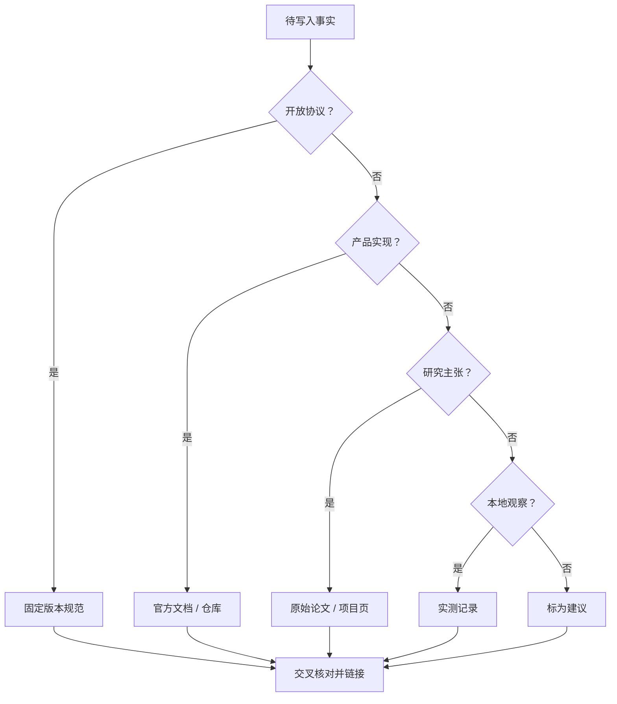

# 24. 官方来源、事实标签与版本基线

> 核对日期：2026-07-10，时区：Asia/Shanghai。本页优先收录规范维护方和产品维护方的一手资料。外部页面会变化；固定版本规范与滚动产品文档采用不同维护方式。

## 事实标签

| 标签 | 定义 | 引用要求 | 例子 |
| --- | --- | --- | --- |
| `[规范]` | 开放规范的强制要求、明确建议或数据模型 | 优先链接固定版本；只有滚动页面时记录核对日期，并固定规范仓库 commit 或归档快照；区分 MUST、SHOULD、MAY 与说明文字 | MCP 初始化顺序、Agent Skills 必填字段 |
| `[平台]` | 某 Harness 当前官方实现、目录、命令或 UI 行为 | 链接产品官方文档并写核对日期；必要时记录最低版本 | Gemini 激活确认、VS Code `mcp.json` |
| `[研究]` | 学术论文、机构研究或公开实验提出的方法与观察 | 链接原始论文或研究页；说明论文展示了什么，不把研究原型冒充产品规范 | RAG、ReAct、Toolformer |
| `[实测]` | 团队在注明环境中重复观察到的行为 | 记录日期、Harness/模型版本、配置、输入、期望和原始结果摘要 | 声明支持的 Harness 是否自动触发同一 Skill |
| `[建议]` | 本教程基于风险与维护成本给出的工程取舍 | 说明适用边界，不使用规范性大写术语冒充标准 | Portable Core Profile、五层质量门 |

标签可以组合。例如“`[平台][实测]` 官方文档说明支持某路径，并在指定版本复现”。没有来源的观察不能标成 `[规范]`、`[平台]` 或 `[研究]`。

## 版本基线

| 对象 | 本教程基线 | 状态解释 | 生产使用规则 |
| --- | --- | --- | --- |
| Agent Skills | 2026-07-10 核对的开放规范当前内容 | 规范网站目前使用滚动页面，不提供与 MCP 相同的日期版本 URI | 核心只依赖 `name`、`description`、`SKILL.md` 和相对资源等开放语义；发布时保存核对日期，并固定规范仓库 commit 或归档快照 |
| MCP | `2025-11-25` | 官方版本页称其为 **Current**；本文“稳定基线”指可用于当前实现，不把它误写为已冻结的 Final | 示例、测试和兼容声明只依赖该版本；协商时仍按规范选择双方共同版本 |
| MCP Draft/RC | Draft（草案）与 `2026-07-28-RC`（Release Candidate，候选发布） | 预发布、可能继续变化 | 只作前瞻分析；独立分支、独立测试，不进入稳定兼容声明 |
| A2A | 固定来源快照 `v1.0.1`（2026-05-28）；线缆协议版本 `1.0` | 官方项目已发布 1.0 系列；补丁版本修正规范/实现，但不进入请求、响应、Agent Card 或版本协商；`latest` 文档仍是滚动入口 | 兼容声明同时记录协议版本 `1.0`、具体规范/SDK 快照、接口绑定和通过的任务生命周期，不只写“支持 A2A” |
| Harness | 2026-07-10 官方文档 | 多为滚动产品文档，行为可能随 CLI/扩展版本变化 | 每次发布记录实际版本并重跑行为合同 |

`[规范]` MCP 版本页使用 `YYYY-MM-DD` 标识最后一次不向后兼容变更，并把修订分为 Draft、Current、Final。协议协商必须选择单一共同版本。参见 [S07](#s07-mcp-版本策略)。

`[建议]` 文档中“支持 MCP”必须展开成协议版本、传输、原语、授权模式和通过的 Harness。只验证一个 Tool 的 stdio 调用时，正确表述是“在指定 Harness 中通过 `2025-11-25` Tools/stdio 行为合同”。

## 来源选择规则



来源按主张类型选择：协议事实优先固定版本规范和 Schema，产品事实优先官方文档、仓库和发布说明，研究结论优先原始论文与作者项目页，本地行为必须有完整复现。第三方文章只用于发现线索，不单独证明时效性产品、历史起点或兼容性结论。

## AI Agent：模型、检索、推理与行动研究

### A00 经典智能体研究范围

- 经典规划代表工作：[STRIPS: A New Approach to the Application of Theorem Proving to Problem Solving](https://doi.org/10.1016/0004-3702(71)90010-5)，1971。
- BDI 代表工作：[BDI Agents: From Theory to Practice](https://cdn.aaai.org/ICMAS/1995/ICMAS95-042.pdf)，1995。
- 智能体与多智能体代表性综述：[Intelligent agents: theory and practice](https://doi.org/10.1017/S0269888900008122)，1995。
- 强化学习代表性教材：[Reinforcement Learning: An Introduction, Second Edition](https://incompleteideas.net/book/the-book-2nd.html)，2018；其研究传统早于 LLM Agent。
- 用于证明：状态、动作、目标、BDI、环境反馈、自主性与多智能体研究远早于现代 LLM；本教程从 2017 年开始的时间线只聚焦 LLM Agent 工程，不是整个领域的起点。这是一组范围锚点，不是完整经典 Agent 史。

### A00A 任务型对话与语义接口前史

- 早期任务型语料：[The ATIS Spoken Language Systems Pilot Corpus](https://aclanthology.org/H90-1021/)，1990。
- 意图与槽位联合建模代表工作：[Slot-Gated Modeling for Joint Slot Filling and Intent Prediction](https://aclanthology.org/N18-2118/)，2018。
- 语义解析代表工作：[Learning Dependency-Based Compositional Semantics](https://aclanthology.org/P11-1060/)，2011。
- 用于证明：在现代 LLM Function Calling API 之前，自然语言研究与任务型系统已经长期处理领域意图、槽位和自然语言到结构化语义的映射。
- 注意：这些工作与某一家 Function Calling API 不构成已证明的直接产品继承链，也没有定义今天的 Tool Call/Result 消息、开放 Tool Schema 或 Agent Runtime。

### A01 Transformer

- 原始论文：[Attention Is All You Need](https://arxiv.org/abs/1706.03762)
- 首次提交：2017-06-12。
- 用于证明：Transformer 架构的公开研究节点；不用于声称该论文已经定义现代 Agent、Tool Use 或 Function Calling。

### A02 Retrieval-Augmented Generation

- 原始论文：[Retrieval-Augmented Generation for Knowledge-Intensive NLP Tasks](https://arxiv.org/abs/2005.11401)
- 首次提交：2020-05-22。
- 用于证明：将参数化生成模型与外部非参数记忆结合的 RAG 研究路径；不代表今天所有 RAG 工程都使用相同索引和训练方法。

### A03 MRKL Systems

- 原始论文：[MRKL Systems: A modular, neuro-symbolic architecture that combines large language models, external knowledge sources and discrete reasoning](https://arxiv.org/abs/2205.00445)
- 首次提交：2022-05-01。
- 用于证明：通过路由把语言模型与外部模块结合的早期公开架构思路；不等于后来的 Function Calling API 或 MCP 规范。

### A04 ReAct

- 原始论文：[ReAct: Synergizing Reasoning and Acting in Language Models](https://arxiv.org/abs/2210.03629)
- 首次提交：2022-10-06。
- 用于证明：交错推理与环境动作、根据观察继续行动的研究模式；生产系统不必也不应暴露模型内部思维过程。

### A05 Toolformer

- 原始论文：[Toolformer: Language Models Can Teach Themselves to Use Tools](https://arxiv.org/abs/2302.04761)
- 首次提交：2023-02-09。
- 用于证明：通过自监督数据让模型学习何时以及怎样调用外部工具的研究方向；它不是开发者侧的工具调用消息协议。

### A06 Generative Agents

- 原始论文：[Generative Agents: Interactive Simulacra of Human Behavior](https://arxiv.org/abs/2304.03442)
- 首次提交：2023-04-07。
- 用于证明：记忆流、反思与规划结合的 Agent 研究案例；不把模拟环境结论直接外推为企业 Memory 规范。

### A07 MemGPT

- 原始论文：[MemGPT: Towards LLMs as Operating Systems](https://arxiv.org/abs/2310.08560)
- 首次提交：2023-10-12。
- 用于证明：分层管理有限上下文与外部记忆的研究思路；不表示某种具体 Memory 产品成为开放标准。

### A08 Building Effective Agents

- 官方研究/工程文章：[Building effective agents](https://www.anthropic.com/engineering/building-effective-agents)
- 发布信息：2024-12-19。
- 用于证明：Workflow 与 Agent 的工程区分，以及 Prompt Chaining、Routing、Parallelization、Orchestrator-Workers、Evaluator-Optimizer 等常见模式。
- 注意：这些是工程模式与建议，不是开放协议的强制要求。

### A08A LangChain 与 LangGraph Agent 范式

- LangChain 官方文档：[LangChain overview](https://python.langchain.com/docs/introduction/)
- LangGraph 官方概念：[Multi-agent systems](https://langchain-ai.github.io/langgraph/concepts/multi_agent/)
- LangGraph 官方教程：[Workflows and agents](https://langchain-ai.github.io/langgraph/tutorials/workflows/)
- 用于证明：LangChain 当前把 `create_agent` 表述为可配置 Agent Harness，并说明 LangChain agents 构建在 LangGraph 之上；LangGraph 用图、状态、条件边、supervisor、handoff 等方式表达确定性 workflow 与 agentic workflow。
- 注意：LangChain/LangGraph 是框架实现与文档范式，不构成通用协议要求；具体 API 会随版本变化。

### A08B AutoGen Team 与群聊式多 Agent

- 官方文档：[AutoGen AgentChat Teams](https://microsoft.github.io/autogen/stable/user-guide/agentchat-user-guide/tutorial/teams.html)
- 用于证明：AutoGen 将多个协作 Agent 组织为 Team，并提供 selector group chat、swarm、GraphFlow 等模式；官方也提示 Team 适合复杂协作但需要更多脚手架来引导。
- 注意：AutoGen 的 Team、Group Chat 和 Swarm 是框架抽象，不等于 A2A 协议，也不等于所有多 Agent 系统都应采用群聊。

### A08C GraphRAG

- 官方项目文档：[Microsoft GraphRAG](https://microsoft.github.io/graphrag/)
- 用于证明：GraphRAG 将 Retrieval-Augmented Generation 扩展为结构化、层级化方法，通过知识图谱、社区层级和摘要支持相对朴素语义片段检索更复杂的问题。
- 注意：GraphRAG 增加了索引、抽取、更新和评测成本；不能把它简单宣传为“替代所有 RAG”。

### A08D Wiki 与知识库作为知识治理层

- Federated Wiki 项目入口：[About Federated Wiki](https://fedwiki.org/view/about-federated-wiki)
- WikiWikiWeb 历史入口：[WikiWikiWeb](https://wiki.c2.com/?WikiWikiWeb)
- 用于证明：Wiki 传统强调由人维护、链接和演进的知识页面；在 Agent 系统中，它更适合作为知识治理和可引用来源层，而不是直接替代运行时检索与上下文注入。
- 注意：本文只采用 Wiki/知识库作为工程类比和知识治理建议，不声称某一种 Wiki 产品本身就是 Agent Runtime 或 RAG 协议。

### A09 LLM-as-a-Judge

- 原始论文：[Judging LLM-as-a-Judge with MT-Bench and Chatbot Arena](https://arxiv.org/abs/2306.05685)
- 用于证明：强模型可以作为开放回答评审信号，同时存在位置、冗长和自增强等系统性偏差，需要用人工标注、顺序扰动和适用范围校准。
- 注意：论文中的一致率不证明任意 Judge、任意语言或任意企业任务都可靠，也不能替代确定性安全断言。

### A10 大规模语言模型与上下文学习

- 原始论文：[Language Models are Few-Shot Learners](https://arxiv.org/abs/2005.14165)
- 首次提交：2020-05-28。
- 用于证明：大规模自回归语言模型通过自然语言任务描述和上下文示例进行 zero/one/few-shot 任务处理的公开研究节点。
- 注意：论文中的上下文学习结果不等于稳定指令遵循、事实保证、Tool 执行或企业权限。

### A11 指令微调

- 原始论文：[Finetuned Language Models Are Zero-Shot Learners](https://arxiv.org/abs/2109.01652)
- 首次提交：2021-09-03。
- 用于证明：在多任务指令数据上微调可以改善未见任务的 zero-shot 泛化这一研究路线。
- 注意：指令微调改变模型行为倾向，不把实时知识、身份或业务授权写进模型。

### A12 指令微调与人类反馈

- 原始论文：[Training language models to follow instructions with human feedback](https://arxiv.org/abs/2203.02155)
- 首次提交：2022-03-04。
- 用于证明：监督微调、偏好数据、奖励模型与强化学习组合改善指令遵循的一条公开路线。
- 注意：特定实验结果不能外推为所有 RLHF 系统、语言、领域和安全风险均已解决。

### A13 思维链提示

- 原始论文：[Chain-of-Thought Prompting Elicits Reasoning in Large Language Models](https://arxiv.org/abs/2201.11903)
- 首次提交：2022-01-28。
- 用于证明：在特定模型与算术、常识、符号推理任务中，用中间推理示例改善表现的研究节点。
- 注意：内部推理文本不等于真实执行轨迹、事实证据或必须向用户公开的审计日志。

### A14 长上下文的位置效应

- 原始论文：[Lost in the Middle: How Language Models Use Long Contexts](https://arxiv.org/abs/2307.03172)
- 首次提交：2023-07-06。
- 用于证明：论文评测中的模型使用长输入信息时，性能与相关信息位置有关；上下文可容纳不等于信息被同等有效利用。
- 注意：具体曲线不应直接外推到所有后续模型、语言、上下文长度和任务。

### A15 Embedding 与语义检索

- 原始论文：[Sentence-BERT: Sentence Embeddings using Siamese BERT-Networks](https://arxiv.org/abs/1908.10084)
- 首次提交：2019-08-27。
- 用于证明：使用句向量和相似度支持高效语义相似检索的一条代表性研究路线。
- 注意：向量接近不证明事实、权威性、时效、授权或最终任务正确；生产索引仍要保留 ACL、来源和版本。

### A16 直接偏好优化

- 原始论文：[Direct Preference Optimization: Your Language Model is Secretly a Reward Model](https://arxiv.org/abs/2305.18290)
- 首次提交：2023-05-29。
- 用于证明：不显式拟合奖励模型并运行强化学习，也可直接用偏好数据优化语言模型的一类方法。
- 注意：DPO 不等同于全部“对齐”，也不提供应用侧授权、用途治理或事实验证。

### A17 知识蒸馏

- 原始论文：[Distilling the Knowledge in a Neural Network](https://arxiv.org/abs/1503.02531)
- 首次提交：2015-03-09。
- 用于证明：让较小模型学习模型集成或教师软目标的代表性蒸馏方法；该研究路线早于现代 LLM Agent。
- 注意：蒸馏不保证学生模型完整继承教师的能力、安全性质或长尾行为。

### A18 人机交互设计

- 原始论文：[Guidelines for Human-AI Interaction](https://doi.org/10.1145/3290605.3300233)
- Microsoft Research 页面：[Guidelines for Human-AI Interaction](https://www.microsoft.com/en-us/research/publication/guidelines-for-human-ai-interaction/)
- 发布信息：CHI 2019。
- 用于证明：围绕初始交互、持续交互、错误与纠正提出的人机 AI 设计指南与验证研究。
- 注意：这些指南不是 Agent 协议或合规清单，具体产品仍需结合风险、用户研究和可访问性验证。

### A19 推理时计算缩放

- 原始论文：[Scaling LLM Test-Time Compute Optimally can be More Effective than Scaling Model Parameters](https://arxiv.org/abs/2408.03314)
- 首次提交：2024-08-06。
- 用于证明：在论文设置中，测试时计算可以通过不同策略分配，收益依赖问题难度、验证器与计算预算；它是现代 LLM 推理时扩展的一项代表工作。
- 注意：搜索、采样和测试时计算思想早于 2024；论文不证明所有模型延长回答都会改善，也不替代外部证据、Tool 执行和 Runtime 控制。

### A20 多模态模型能力边界

- 技术报告：[Gemini: A Family of Highly Capable Multimodal Models](https://arxiv.org/abs/2312.11805)
- 首次提交：2023-12-19。
- 用于证明：联合处理文本、图像、音频与视频等模态的一条现代模型研究与工程路线。
- 注意：这是特定模型家族的技术报告，不能证明任意“多模态模型”支持全部输入/输出模态、相同上下文长度或相同安全性质；产品能力仍查当前 API 矩阵。

### A21 非对称双编码检索

- 原始论文：[Dense Passage Retrieval for Open-Domain Question Answering](https://aclanthology.org/2020.emnlp-main.550/)
- 官方研究仓库：[facebookresearch/DPR](https://github.com/facebookresearch/DPR)
- 用于证明：问题编码器与段落编码器可以分别编码查询和文档，再在兼容表示空间中完成稠密检索。
- 注意：双编码器相似度不提供权限、时效、事实或最终答案忠实度保证；编码器对与索引必须一起版本化。

### A22 跨模态向量表示

- 原始论文：[Learning Transferable Visual Models From Natural Language Supervision](https://arxiv.org/abs/2103.00020)
- 首次提交：2021-02-26（arXiv 标识在 2021-03）。
- 用于证明：图像编码器与文本编码器可以在联合表示空间中进行图文匹配的一条代表性路线。
- 注意：CLIP 不代表所有图像 Embedding、OCR、视觉问答或多模态 Agent；相似度也不证明对象身份、业务状态或授权。

## Function Calling、Tool Use 与 Agent Runtime

### T01 ChatGPT Plugins

- 官方历史页面：[ChatGPT plugins](https://openai.com/index/chatgpt-plugins/)
- 发布信息：2023-03-23。
- 用于证明：通过描述文件和外部 API 扩展模型能力的公开产品节点；历史插件形态不等于今天的 Function Calling、MCP 或当前产品可用性。

### T02 OpenAI Function Calling 发布

- 官方历史页面：[Function calling and other API updates](https://openai.com/index/function-calling-and-other-api-updates/)
- 发布信息：2023-06-13。
- 用于证明：OpenAI API 正式提供 Function Calling 的时间点，以及模型生成函数名和 JSON 参数、应用负责执行的基本边界。
- 注意：这不是“语言模型第一次使用工具”的起点，也不能证明其他提供商由此直接派生。

### T03 OpenAI Function Calling 当前指南

- 官方文档：[Function calling](https://developers.openai.com/api/docs/guides/function-calling)
- 官方类型定义：[openai-node Responses types](https://github.com/openai/openai-node/blob/master/src/resources/responses/responses.ts)
- 用于证明：当前 `tools`、`function_call`、`call_id`、`function_call_output`、严格参数和并行调用等 API 语义。
- 注意：Responses 与 Chat Completions 的消息外形不同，教程只抽取共同调用循环。

### T04 OpenAI Structured Outputs

- 官方发布页：[Introducing Structured Outputs in the API](https://openai.com/index/introducing-structured-outputs-in-the-api/)
- 发布信息：2024-08-06。
- 官方文档：[Structured Outputs](https://developers.openai.com/api/docs/guides/structured-outputs)
- 用于证明：以 JSON Schema 约束模型输出以及 `strict` 语义；Schema 一致不等于事实正确、获得授权或副作用安全。

### T04A OpenAI JSON mode 历史节点

- 官方历史页面：[New models and developer products announced at DevDay](https://openai.com/index/new-models-and-developer-products-announced-at-devday/)
- 发布信息：2023-11-06。
- 用于证明：OpenAI 在该产品节点公布 JSON mode，保证模型响应为有效 JSON 的历史语境。
- 注意：JSON mode 不保证符合任意业务 Schema，也不提供 Tool Call 身份、结果关联或执行语义。

### T05 Anthropic Tool Use

- 官方文档：[Implement tool use](https://platform.claude.com/docs/en/agents-and-tools/tool-use/implement-tool-use)
- 官方 SDK 示例：[anthropic-sdk-typescript tools example](https://github.com/anthropics/anthropic-sdk-typescript/blob/main/examples/tools.ts)
- 用于证明：`tools`、`input_schema`、`tool_use`、`tool_result`、调用 ID、错误结果与并行 Tool Use 的当前消息语义。

### T06 Gemini Function Calling

- 官方文档：[Function calling with the Gemini API](https://ai.google.dev/gemini-api/docs/function-calling)
- 官方 SDK 示例：[js-genai function calling sample](https://github.com/googleapis/js-genai/blob/main/sdk-samples/generate_content_with_function_calling.ts)
- 用于证明：`functionDeclarations`、`functionCall`、`functionResponse`、调用模式和自动 Function Calling 的当前产品语义。
- 注意：SDK 自动循环属于客户端封装；Google Search、Code Execution 等服务端工具的执行位置不同。

### T07 OpenAI Agent 构建工具

- 官方发布页：[New tools for building agents](https://openai.com/index/new-tools-for-building-agents/)
- 发布信息：2025-03-11。
- 用于证明：Responses API、内置工具、Agents SDK 和 Tracing 作为 Agent Runtime 工程表面的公开节点；不把某一家 SDK 当成通用 Agent 定义。

### T08 流式模型与 Tool Call 事件

- OpenAI 官方类型定义：[Responses streaming event types](https://github.com/openai/openai-node/blob/master/src/resources/responses/responses.ts)，其中包含 `response.function_call_arguments.delta` 与 `response.function_call_arguments.done` 对应类型。
- Anthropic 官方文档：[Streaming Messages](https://platform.claude.com/docs/en/build-with-claude/streaming)
- Gemini 官方文档：[Streaming responses](https://ai.google.dev/gemini-api/docs/text-generation#streaming-responses)
- 用于证明：各平台流式响应由平台定义的事件、内容块或分片组成；平台如果提供 Tool Call 参数增量和完成事件，必须按对应 API/SDK 规则组装。OpenAI 类型定义直接证明 Responses 的 Function Call 参数 delta/done 事件；Anthropic 文档证明其内容块增量语义；Gemini 链接只作为普通流式响应入口，不据此推断所有 Gemini 接口都逐片返回 Tool 参数。
- 注意：这些是滚动产品文档，不构成统一跨厂商流式协议，也不保证三家具有相同分片粒度。上线时固定 SDK/API 版本，分别测试并行调用、残缺流、取消、大小上限和最终 Tool Result 绑定。

## Agent 间协作与互操作

### P01 A2A 发布与治理

- 官方发布页：[Announcing the Agent2Agent Protocol (A2A)](https://developers.googleblog.com/en/a2a-a-new-era-of-agent-interoperability/)
- 发布信息：2025-04-09。
- Linux Foundation 公告：[Linux Foundation launches the Agent2Agent Protocol project](https://www.linuxfoundation.org/press/linux-foundation-launches-the-agent2agent-protocol-project-to-enable-secure-intelligent-communication-between-ai-agents)
- 治理信息：2025-06-23 转入 Linux Foundation 项目。
- 用于证明：A2A 的公开发布与中立治理节点；不据此推断所有 Agent 产品已经兼容。

### P02 A2A 规范

- 官方规范：[A2A Protocol Specification](https://a2a-protocol.org/latest/specification/)
- 官方边界说明：[A2A and MCP](https://a2a-protocol.org/latest/topics/a2a-and-mcp/)
- 固定发布：[A2A `v1.0.0`](https://github.com/a2aproject/A2A/releases/tag/v1.0.0)、[`v1.0.1`](https://github.com/a2aproject/A2A/releases/tag/v1.0.1)
- 固定规范正文：[`v1.0.1` specification.md](https://github.com/a2aproject/A2A/blob/v1.0.1/docs/specification.md)、[`v1.0.1` a2a.proto](https://github.com/a2aproject/A2A/blob/v1.0.1/specification/a2a.proto)
- 用于证明：Agent Card、Message、Task、Artifact、流式更新、取消等 Agent 间协作语义，以及 A2A 与 MCP 的互补边界。
- 注意：`v1.0.1` 是固定仓库补丁快照，线缆协议版本仍是 `1.0`；固定 `specification.md` 页首版本文字没有同步反映补丁 tag，因此协议枚举与绑定细节同时以该 tag 的 Proto 核对。
- 注意：`latest` 是滚动入口；发布兼容声明时必须记录具体版本和访问日期。

### P03 OpenTelemetry GenAI 语义约定

- 官方规范：[Semantic conventions for generative AI systems](https://opentelemetry.io/docs/specs/semconv/gen-ai/)
- 用于证明：模型调用、Agent、Tool 和检索等可观测事件的通用命名工作；具体条目可能仍处于 Development 状态，生产采用时需固定版本。

## Agent Skills：历史与开放规范

### S01 Agent Skills 开放规范

- 官方链接：[Agent Skills Specification](https://agentskills.io/specification)
- 用于证明：目录入口、Frontmatter 字段、命名约束、渐进披露、引用与校验建议。
- 注意：这是滚动页面；平台安装目录和私有字段不属于该开放规范。

### S02 Agent Skills 概念

- 官方链接：[What are Agent Skills?](https://agentskills.io/home)
- 用于证明：Skill 由说明、脚本与资源构成，以及按需加载的设计目标。
- 注意：概念解释不能替代规范中的字段约束。

### S03 Agent Skills 工程文章

- 官方链接：[Equipping agents for the real world with Agent Skills](https://www.anthropic.com/engineering/equipping-agents-for-the-real-world-with-agent-skills)
- 发布信息：2025-10-16；页面在 2025-12-18 更新开放标准信息。
- 用于证明：历史背景、渐进披露的工程动机和早期产品设计。

### S04 Agent Skills 官方仓库

- 官方链接：[agentskills/agentskills](https://github.com/agentskills/agentskills)
- 用于证明：规范源码、参考库 `skills-ref`、变更历史和实现工具。
- 建议：格式校验器固定版本或提交，团队共享时不要跟随移动分支。

## MCP：历史、稳定规范与安全

### S05 MCP 发布公告

- 官方链接：[Introducing the Model Context Protocol](https://www.anthropic.com/news/model-context-protocol)
- 发布信息：2024-11-25。
- 用于证明：公开发布历史、开放协议目标和最初生态背景；不用于证明当前协议细节。

### S06 MCP 2025-11-25 稳定规范

- 官方链接：[MCP `2025-11-25` Specification](https://modelcontextprotocol.io/specification/2025-11-25)
- 权威 Schema：[固定版本 schema.ts](https://github.com/modelcontextprotocol/modelcontextprotocol/blob/2025-11-25/schema/2025-11-25/schema.ts)
- 用于证明：Host/Client/Server、JSON-RPC、能力、协议原语和规范性要求。

### S07 MCP 版本策略

- 官方链接：[Versioning](https://modelcontextprotocol.io/docs/learn/versioning)
- 用于证明：Current 为 `2025-11-25`、日期版本含义、Draft/Current/Final 状态和初始化协商要求。
- 注意：Current 可接收向后兼容修订，因此仍需记录访问日期。

### S08 MCP 传输

- 官方链接：[Transports `2025-11-25`](https://modelcontextprotocol.io/specification/2025-11-25/basic/transports)
- 用于证明：stdio 与 Streamable HTTP 的消息承载、HTTP 安全要求和连接行为。
- 注意：产品继续支持旧 SSE，不等于新 Server 应把 SSE 作为稳定首选。

### S09 MCP 授权

- 官方链接：[Authorization `2025-11-25`](https://modelcontextprotocol.io/specification/2025-11-25/basic/authorization)
- 用于证明：HTTP 授权框架、受保护资源元数据、Token 受众与 Scope 相关要求。
- 注意：业务对象级授权仍由 Server 和下游系统实现。

### S10 MCP 安全最佳实践

- 官方链接：[Security Best Practices `2025-11-25`](https://modelcontextprotocol.io/specification/2025-11-25/basic/security_best_practices)
- 用于证明：混淆代理、Token 透传、SSRF、会话、本地 Server 等威胁与缓解措施。
- 注意：最佳实践需结合组织身份系统、网络和数据分类落地。

### S10A MCP 生命周期

- 官方链接：[Lifecycle `2025-11-25`](https://modelcontextprotocol.io/specification/2025-11-25/basic/lifecycle)
- 用于证明：初始化、版本与能力协商、正常运行和关闭顺序。

### S10B MCP 协议能力

- Server 原语：[Tools](https://modelcontextprotocol.io/specification/2025-11-25/server/tools)、[Resources](https://modelcontextprotocol.io/specification/2025-11-25/server/resources)、[Prompts](https://modelcontextprotocol.io/specification/2025-11-25/server/prompts)
- Client 能力：[Roots](https://modelcontextprotocol.io/specification/2025-11-25/client/roots)、[Sampling](https://modelcontextprotocol.io/specification/2025-11-25/client/sampling)、[Elicitation](https://modelcontextprotocol.io/specification/2025-11-25/client/elicitation)
- 基础与工具性能力：[Lifecycle](https://modelcontextprotocol.io/specification/2025-11-25/basic/lifecycle)、[Completion](https://modelcontextprotocol.io/specification/2025-11-25/server/utilities/completion)、[Logging](https://modelcontextprotocol.io/specification/2025-11-25/server/utilities/logging)、[Pagination](https://modelcontextprotocol.io/specification/2025-11-25/server/utilities/pagination)、[Progress](https://modelcontextprotocol.io/specification/2025-11-25/basic/utilities/progress)、[Cancellation](https://modelcontextprotocol.io/specification/2025-11-25/basic/utilities/cancellation)、[Ping](https://modelcontextprotocol.io/specification/2025-11-25/basic/utilities/ping)
- 实验性能力：[Tasks](https://modelcontextprotocol.io/specification/2025-11-25/basic/utilities/tasks)
- 用于证明：Server 原语、Client 能力、初始化协商、进度、取消、日志、分页和实验性 Tasks 等协议表面及其控制方向。具体产品支持面仍需单独验证。

### S10C MCP 变更记录

- 官方链接：[Changelog `2025-11-25`](https://modelcontextprotocol.io/specification/2025-11-25/changelog)
- 用于证明：相对前一修订新增和改变的能力；具体实现仍以规范正文和 Schema 为准。

## 各 Harness 的 Skills

### S11 Claude Code Skills

- 官方链接：[Extend Claude with skills](https://code.claude.com/docs/en/skills)
- 用于证明：`.claude/skills` 作用域、自动/显式调用、嵌套发现、私有 Frontmatter、动态上下文和变更检测。
- 注意：`allowed-tools`、`context: fork` 等是 Claude Code 扩展，不属于 Portable Core。

### S14 OpenAI Codex Skills

- 官方链接：[Agent Skills in Codex](https://developers.openai.com/codex/skills/)
- 官方仓库入口：[openai/codex skills 文档](https://github.com/openai/codex/blob/main/docs/skills.md)
- 用于证明：Codex 的 Skill 发现、作用域、安装与平台扩展元数据。
- 注意：产品文档为滚动页面，发布兼容声明需附 Codex 版本。

### S17 Gemini CLI Skills

- 官方链接：[Agent Skills](https://geminicli.com/docs/cli/skills/)
- 官方源码文档：[google-gemini/gemini-cli skills.md](https://github.com/google-gemini/gemini-cli/blob/main/docs/cli/skills.md)
- 用于证明：`.agents/skills`/`.gemini/skills`、优先级、`activate_skill`、激活同意和 `/skills` 管理命令。

### S19 GitHub Copilot Agent Skills

- 官方链接：[About agent skills](https://docs.github.com/en/copilot/concepts/agents/about-agent-skills)
- 用于证明：Copilot 各产品支持 Agent Skills 以及项目/个人路径。

### S21 GitHub Copilot CLI Skills

- 官方链接：[Adding agent skills for GitHub Copilot CLI](https://docs.github.com/en/copilot/how-tos/copilot-cli/customize-copilot/add-skills)
- 用于证明：创建、安装、刷新、显式调用、上下文注入和 `allowed-tools` 风险警告。

### S23 VS Code Agent Skills

- 官方链接：[Use Agent Skills in VS Code](https://code.visualstudio.com/docs/agent-customization/agent-skills)
- 用于证明：项目/个人目录、额外位置设置、扩展 `chatSkills` 和终端执行安全提示。

## 各 Harness 的 MCP

### S12 Claude Code MCP

- 官方链接：[Connect Claude Code to tools via MCP](https://code.claude.com/docs/en/mcp)
- 用于证明：MCP 传输、作用域、`.mcp.json`、`claude mcp`、项目 Server 审批、环境变量展开与 `${CLAUDE_PROJECT_DIR:-.}` 带默认值语法。
- 注意：WebSocket 等产品扩展不进入本教程稳定传输交集。

### S15 OpenAI Codex MCP

- 官方链接：[Model Context Protocol in Codex](https://developers.openai.com/codex/mcp/)
- 配置参考：[Codex configuration reference](https://developers.openai.com/codex/config-reference/)
- 用于证明：`config.toml` 的 `mcp_servers`、stdio/Streamable HTTP、超时、工具允许/禁用和 `codex mcp`。

### S18 Gemini CLI MCP

- 官方链接：[MCP servers with Gemini CLI](https://geminicli.com/docs/tools/mcp-server/)
- 官方源码文档：[mcp-server.md](https://github.com/google-gemini/gemini-cli/blob/main/docs/tools/mcp-server.md)
- 用于证明：`mcpServers`、三种产品传输键、`trust`、工具过滤、Resources/Prompts 和 OAuth 管理。

### S20 GitHub Copilot CLI MCP

- 官方链接：[Adding MCP servers for GitHub Copilot CLI](https://docs.github.com/en/copilot/how-tos/copilot-cli/customize-copilot/add-mcp-servers)
- 用于证明：`copilot mcp`、`~/.copilot/mcp-config.json`、传输、工具过滤和组织注册表策略。

### S22 VS Code MCP

- 官方链接：[Use MCP servers in VS Code](https://code.visualstudio.com/docs/agent-customization/mcp-servers)
- GitHub 产品入口：[Extending Copilot Chat with MCP](https://docs.github.com/en/copilot/how-tos/provide-context/use-mcp-in-your-ide/extend-copilot-chat-with-mcp)
- 用于证明：`.vscode/mcp.json`、Server Trust、Tools/Resources/Prompts、组织策略和配置安全。

## 项目指令与扩展包

### S13 Claude Code Plugin

- 官方链接：[Create plugins](https://code.claude.com/docs/en/plugins)
- 用于证明：Plugin 可组合 Skills、Agents、Hooks、MCP Server，具有平台命名空间与安装生命周期。

### S24 Codex AGENTS.md

- 官方链接：[Custom instructions with AGENTS.md](https://developers.openai.com/codex/guides/agents-md/)
- 用于证明：Codex 对 `AGENTS.md` 的发现、范围和优先级；不证明其他 Harness 行为相同。

### S25 Gemini CLI GEMINI.md

- 官方链接：[Provide context with GEMINI.md files](https://geminicli.com/docs/cli/gemini-md/)
- 用于证明：Gemini CLI 的分层上下文文件、导入与管理行为。

### S26 Claude Code CLAUDE.md

- 官方链接：[Manage Claude's memory](https://code.claude.com/docs/en/memory)
- 用于证明：`CLAUDE.md` 的作用域、导入与加载；不应与按需 Skill 混为一谈。

### S27 GitHub Copilot 仓库指令

- 官方链接：[Adding repository custom instructions](https://docs.github.com/en/copilot/how-tos/copilot-on-github/customize-copilot/add-custom-instructions/add-repository-instructions)
- 用于证明：`.github/copilot-instructions.md` 等 Copilot 仓库指令机制。

## 治理与人本交互

### G01 NIST AI Risk Management Framework

- 官方入口：[NIST AI Risk Management Framework](https://www.nist.gov/itl/ai-risk-management-framework)
- 发布信息：AI RMF 1.0 于 2023-01 发布，框架为自愿使用。
- 用于证明：以 Govern、Map、Measure、Manage 组织 AI 风险治理、情境映射、测量和持续管理的一套官方框架。
- 注意：采用框架不自动形成法律合规、产品认证或某一具体模型的安全保证。

### G02 OECD AI Principles

- 官方法律文书：[Recommendation of the Council on Artificial Intelligence](https://legalinstruments.oecd.org/en/instruments/OECD-LEGAL-0449)
- 用于证明：以人权与民主价值、公平、透明与可解释、稳健安全和问责等为核心的跨政府原则。
- 注意：原则提供治理方向，不替代具体司法辖区、行业和劳动关系要求；本文不据此给出法律意见。

### G03 Human-AI Interaction Guidelines

- 论文与维护方页面见 [A18](#a18-人机交互设计)。
- 用于证明：让系统在交互开始、运行中、错误发生和用户纠正时分别支持适当理解与控制的设计框架。
- 注意：交互设计还需结合本地用户研究、无障碍要求、任务风险与 Runtime 真实状态，不能由模型自由生成进度代替。

## 实现、测试与协议治理

### S28 MCP TypeScript SDK

- 官方链接：[modelcontextprotocol/typescript-sdk](https://github.com/modelcontextprotocol/typescript-sdk)
- 用于证明：官方 SDK API、版本兼容范围和示例；项目仍需固定依赖并阅读对应版本发布说明。

### S29 MCP Inspector

- 官方链接：[modelcontextprotocol/inspector](https://github.com/modelcontextprotocol/inspector)
- 用于证明：交互检查 Server 能力和调用的官方开发工具；Inspector 通过不等于业务、安全和跨 Harness 测试通过。

### S30 MCP 中立治理

- 官方链接：[Linux Foundation announces the Agentic AI Foundation](https://www.linuxfoundation.org/press/linux-foundation-announces-the-formation-of-the-agentic-ai-foundation)
- 用于证明：MCP 进入 AAIF 的治理背景；不用于推断所有产品实现一致。

## 前瞻来源：不得混入稳定要求

### F01 MCP Draft

- 官方链接：[Draft Specification](https://modelcontextprotocol.io/specification/draft)
- 用途：观察下一版可能的架构变化，预先识别迁移风险。
- 禁止：从 Draft 复制字段进入稳定示例后仍声称兼容 `2025-11-25`。

### F02 MCP 2026-07-28-RC

- 官方链接：[GitHub prerelease `2026-07-28-RC`](https://github.com/modelcontextprotocol/modelcontextprotocol/releases/tag/2026-07-28-RC)
- 状态：截至 2026-07-10 为预发布前瞻。
- 用途：建立独立兼容分支、评估破坏性变化和反馈规范；最终稳定版发布后必须重新核对。

### F03 OpenAI Agents SDK Runtime 演进

- 官方链接：[The next evolution of the Agents SDK](https://openai.com/index/the-next-evolution-of-the-agents-sdk/)
- 发布信息：2026-04-15。
- 用途：观察 Agent Runtime 从应用胶水代码走向受控工作区、工具、文件、记忆、沙箱和追踪的一体化方向。
- 禁止：不能据此推断所有 Agent 平台都已具备同等沙箱、文件或长任务能力。

### F04 Anthropic Building Effective Agents

- 官方链接：[Building effective agents](https://www.anthropic.com/engineering/building-effective-agents)
- 衍生材料：[Building Effective AI Agents: Architecture Patterns and Implementation Frameworks](https://resources.anthropic.com/building-effective-ai-agents)
- 用途：观察 Workflow、Agent、Orchestrator-Worker、Evaluator-Optimizer 等架构模式的实践总结，以及“先保持简单”的工程取向。
- 禁止：不能把一家厂商的架构分类直接写成开放规范或跨 Harness 必然行为。

### F05 A2A latest 与生态入口

- 官方入口：[A2A Protocol](https://a2a-protocol.org/latest/)
- 用途：观察 Agent 间协议化、Agent Card、任务状态、消息、产物和 SDK 生态的变化。
- 禁止：`latest` 是滚动入口；稳定兼容声明仍要引用固定版本 Release 和规范正文。

### F06 OpenTelemetry GenAI 语义约定

- 官方链接：[Semantic conventions for generative AI systems](https://opentelemetry.io/docs/specs/semconv/gen-ai/)
- 用途：观察模型调用、Agent、Tool、检索和生成式 AI 事件的跨系统观测命名趋势。
- 禁止：Development 状态字段不能直接当作长期稳定日志合同；采用时必须固定版本并说明字段映射。

## 如何维护本页

每次季度复核或重大版本发布时执行：

1. 读取 MCP [Versioning](https://modelcontextprotocol.io/docs/learn/versioning) 与固定版本 Changelog，比较权威 Schema；
2. 检查 Agent Skills 规范仓库的提交与发布，记录滚动规范核对日期并固定 commit 或快照；
3. 复核 Function Calling、Structured Outputs 和 Tool Use 厂商文档，区分历史发布页与当前 API；
4. 复核 A2A 固定 Release、滚动规范和治理公告，记录实际采用的接口绑定与生命周期；
5. 对研究历史回到论文首版或机构原页，核对日期与“最窄可证明结论”，不从相似概念推断直接继承；
6. 逐一打开声明支持的全部 Harness 的 Skills、MCP 和项目指令官方页面；
7. 在隔离环境记录 CLI/扩展完整版本，重跑发现、路由、调用、拒绝和失败用例；
8. 更新矩阵时保留旧结论的适用版本，不用新行为改写历史实测；
9. 检查所有外链、相对链接、代码围栏和 Mermaid 渲染；
10. 如果稳定规范未改变，只更新平台行为时，不扩大协议兼容声明。

新增来源必须说明“它证明什么”和“它不证明什么”。删除失效来源前，先找到同一维护方的替代页；若没有替代页，将对应事实降级为 `[实测]` 或移除，不用第三方转载冒充官方依据。

## 引用模板

```markdown
`[平台]` Gemini CLI 在激活 Skill 时要求用户同意，并在同意后注入正文和目录结构。
来源：[Gemini CLI Agent Skills（S17）](24-sources.md#s17-gemini-cli-skills)，
核对日期：2026-07-10；实测时另记录 CLI 与模型版本。
```

`[建议]` 对安全或授权结论至少同时引用规范要求与具体 Harness 的实施文档。规范说明协议允许什么，Harness 文档说明当前产品怎样暴露它；二者都不能代替业务系统的授权测试。

