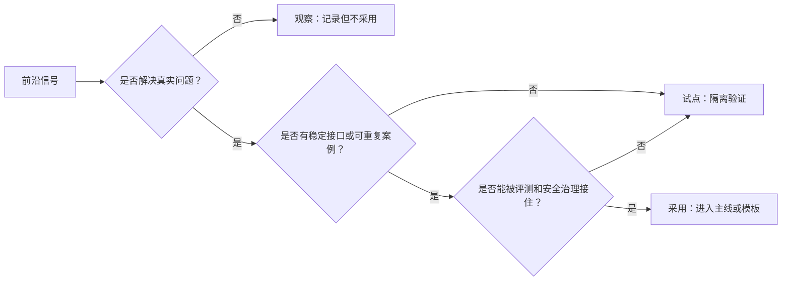
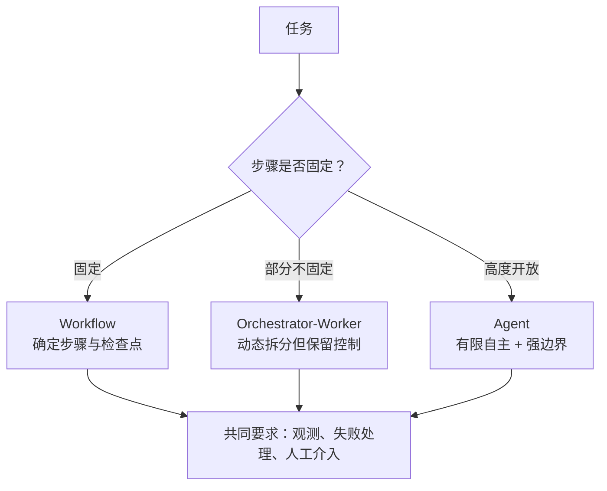
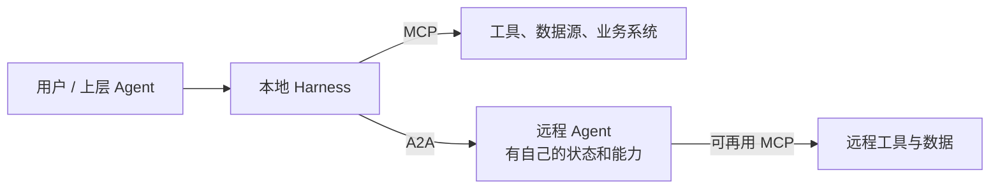
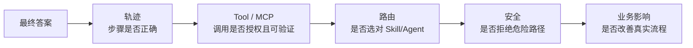
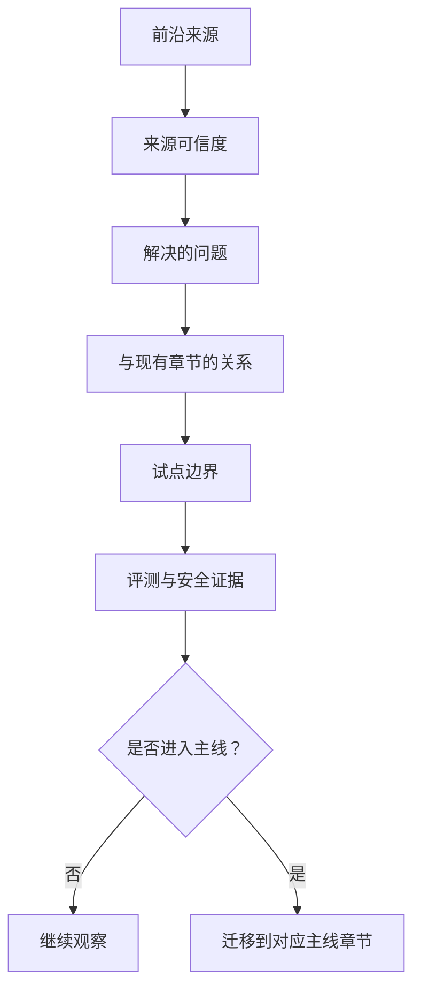

# 25. Agent 前沿趋势：哪些值得关注，哪些暂不进稳定主线

> 选读内容。它不是“追热点清单”，而是用于判断 Agent 前沿方向是否值得学习、试点，或者进入内部规范。结论默认带有时效性：能进主线的东西，最终必须回到前面章节的责任边界、数据流、评测和安全门。

## 目标

前沿内容至少要分成三类：

| 层级 | 含义 | 团队动作 |
| --- | --- | --- |
| 观察 | 方向重要，但规范、产品或实践还在快速变化 | 记录来源、跟踪变化，不写入稳定要求 |
| 试点 | 有清晰价值和可控风险，但仍需隔离验证 | 选小场景，记录版本、失败和边界 |
| 采用 | 已能稳定复现，并能被评测、安全和运维接住 | 写入对应主线章节、模板或评审表 |

## 方向一：Agent Runtime 从胶水代码走向受控执行环境

早期 Agent 系统常由开发者把模型、工具、文件、状态和日志手工粘在一起。新的趋势是 Runtime 开始内置更多能力：文件与工作区、受控工具、沙箱、记忆、追踪、用量、失败恢复和长任务状态。

这不是说“框架越重越好”。关键变化是：团队不再只问“模型会不会调用工具”，而要问“谁给它工作区、谁限制动作、谁记录 Trace、谁在失败后恢复”。这部分已经进入[生产级 Agent Runtime](15-production-agent-runtime.md)和[质量工程与安全](13-quality-and-security.md)的主线；前沿产品能力只能作为实现选项，不能替代状态机、权限和证据要求。

一个实用判断是：Runtime 越像“操作系统”，越不能只看模型能力演示。演示里一个漂亮的浏览器动作，落地时会变成权限、日志、撤回、隔离和责任人的组合题。

| 关注点 | 稳定问题 | 前沿表现 |
| --- | --- | --- |
| 工作区 | Agent 能看到和修改哪些文件 | 受控文件系统、沙箱、临时环境 |
| 执行边界 | Tool、代码、浏览器或桌面动作如何限制 | 原生沙箱、浏览器/计算机使用、内置工具 |
| 轨迹 | 每一步如何复盘 | LLM 调用、Tool、Handoff、Guardrail 的统一 Trace |
| 长任务 | 任务如何恢复、取消、迁移 | 持久 Run、队列、检查点、异步执行 |

## 方向二：Workflow 与 Agent 的边界更清楚

前沿讨论并没有走向“所有系统都应该全自主”。相反，成熟经验正在收敛到一个判断：**能用确定性 Workflow 表达的，就不要强行做开放 Agent；只有在步骤、分支或信息获取需要运行时判断时，才引入更高自主性。**

这对写 Skill 很重要：Skill 不应鼓励 Agent 为每件事“自主探索”。好的 Skill 应该把确定部分写成流程，把语义判断写成证据标准，把危险动作交给 Harness 和业务系统。自主性在演示中很吸引人，生产系统中更容易暴露预算、权限和撤回问题。

## 方向三：协议化从 Tool 接入扩展到 Agent 协作

MCP 让工具、资源和提示等能力有了更统一的连接方式；A2A 则试图让独立 Agent 系统以任务、消息、状态和产物进行协作。两者关注的边界不同：MCP 更像“连接外部能力”，A2A 更像“委派给另一个有自己运行环境的 Agent”。

需要警惕的是：协议化不等于语义一致、权限正确或业务可用。每个协议只解决一段连接问题；路由、授权、证据、错误、审计和用户体验仍要由系统设计完成。协议解决“怎么接上”，不解决“该不该接、接上后谁负责”。

## 方向四：上下文系统从“检索答案”走向“知识治理”

RAG 的前沿不只是换一个向量库。更重要的方向包括：

| 方向 | 解决什么 | 不自动解决什么 |
| --- | --- | --- |
| Agentic RAG | 根据任务分解查询、补查、交叉核验 | 权限、来源质量和最终判断 |
| GraphRAG / 结构化知识 | 利用实体、关系和社区结构增强召回与解释 | 图谱维护成本和错误传播 |
| 长上下文 + 检索 | 在大材料中减少过早丢失信息 | 注意力稀释、成本和隐私 |
| 知识库 / Wiki 治理 | 让上游知识可维护、可版本化 | 运行时仍需选择相关证据 |
| Memory 治理 | 保存长期偏好、任务状态或历史事实 | 纠错、过期、删除和跨用户隔离 |

关键问题不是“RAG 是否过时”，而是知识从创建、审核、索引、检索、注入、引用、过期到删除的链路是否清楚。RAG 容易被描述得过于抽象，工程问题通常出在证据链：来源不稳、召回不全、注入不克制、引用不可查。

## 方向五：评测从答案对错走向轨迹、能力和影响

Agent 前沿系统很难只用最终答案评分。一次看似正确的回答，可能中间用了错误 Tool、越权读取、伪造执行、忽略失败或泄露敏感材料。因此评测正在向多层扩展：

因此，路由评测、轨迹证据、安全用例和用途治理必须分开处理。前沿的自动评分、Trace Grading 或模型评审都只能降低评测成本，不能替代黄金用例、人工复核和业务指标。评测如果只看最终答案，很容易把“运气好”误判成“系统稳”。

## 方向六：计算机使用、多模态和具身环境扩大了动作面

模型从“读文本、调 API”扩展到看图、看屏幕、操作浏览器、处理文件甚至控制桌面环境，会让 Agent 更接近真实工作流。但它也把错误从“回答错了”升级为“点错、删错、提交错、泄露错”。

| 能力 | 价值 | 新风险 |
| --- | --- | --- |
| 多模态理解 | 读取截图、表格、图表和文档布局 | OCR、视觉误读、布局错序 |
| Computer Use | 操作没有 API 的遗留系统 | 坐标漂移、误点击、确认疲劳 |
| 文件工作区 | 做跨文件分析和修改 | 误写、污染仓库、泄露敏感文件 |
| 浏览器使用 | 检索、表单和后台系统操作 | 钓鱼、跨站数据、不可复现 UI |
| 沙箱执行 | 隔离代码和工具动作 | 沙箱逃逸、依赖供应链、结果外泄 |

采用这类能力时，默认不要把它当成“更聪明的模型”，而要当成“更大的动作面”。隔离环境、只读预览、对象确认、回滚、日志和人工批准必须先设计好。能看屏幕、能点按钮之后，Agent 不再只是“说错”，而是可能“做错”。

## 方向七：Agent 间市场、自治组织和自改进仍应谨慎

有些前沿方向值得观察，但不应轻易写进稳定规范：

| 方向 | 为什么吸引人 | 为什么暂不稳定采用 |
| --- | --- | --- |
| Agent 市场 / 自动发现陌生 Agent | 能按需调用外部专长 | 身份、信誉、权限、数据外发和责任边界复杂 |
| 自主长期代理 | 能持续监控和推进目标 | 目标漂移、预算失控、取消和问责困难 |
| 自我改写 Skill / Prompt | 能从经验中自动改进 | 供应链、审计、回归和越权风险高 |
| 多 Agent 群聊决策 | 形式上接近团队讨论 | 容易互相强化错误，责任和终止条件不清 |
| 去中心化 Agent 网络 | 可跨组织协作 | 治理、信任、隐私和法律责任尚不成熟 |

建议将这些方向作为研究和小范围原型，但不进入内部稳定主线，除非能回答身份、授权、证据、预算、撤回和责任六个问题。自治 Agent 吸引力很强，但也最容易放大责任、预算和撤回风险。

## 团队如何跟踪前沿

不要用社交媒体热度决定路线。前沿跟踪可以分四类来源：

| 来源 | 用途 | 风险 |
| --- | --- | --- |
| 固定规范与发布说明 | 判断接口和协议边界 | `latest` 页面会变 |
| 官方工程文章 | 理解设计动机和产品方向 | 不能当跨厂商通用规律 |
| 原始论文和系统报告 | 发现新方法和失败模式 | 实验设置可能离生产很远 |
| 团队实测记录 | 判断能否在目标环境工作 | 只对记录的版本和配置有效 |

## 关键结论

- Agent 前沿不是“更多自主性”，而是更清楚的 Runtime、协议、上下文、评测和治理边界。
- 值得采用的前沿能力，最终都必须回到稳定问题：谁执行、谁授权、谁记录、谁验证、谁负责。
- 写 Skill 时不要追热点；先把路由、输入、流程、证据、输出和失败边界写清楚。
- 能力越接近真实电脑、真实业务系统或真实用户影响，越不能只靠 Prompt 控制。
- 没有版本、来源、评测和撤回路径的前沿能力，只能观察或试点，不应进入团队基线。

## 继续阅读

- [05. Agent Loop、Workflow 与 Planning](05-agent-loop-workflows.md)
- [08. 能力发现、候选裁剪与路由](08-capability-discovery-routing.md)
- [10. 从零制作一个高质量 Agent Skill](10-skills.md)
- [13. 质量工程与安全](13-quality-and-security.md)
- [15. 生产级 Agent Runtime 参考架构](15-production-agent-runtime.md)
- [24. 官方来源、事实标签与版本基线](24-sources.md)
