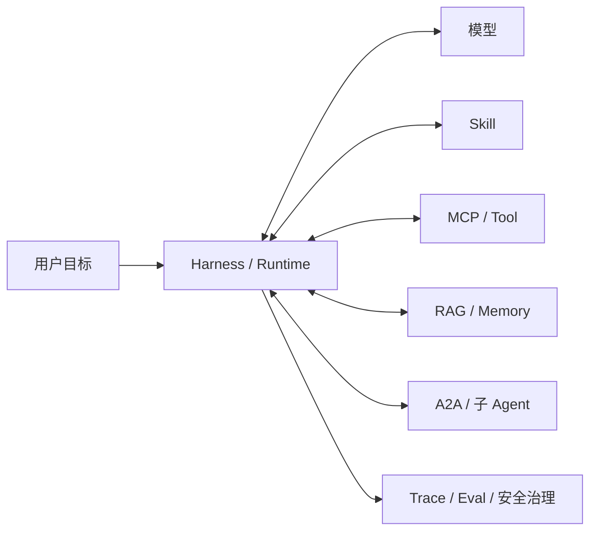

# 26. Agent 系统术语表与概念索引

> **适用范围：** 快速查阅本系列反复出现的核心术语和责任边界。
> **规范基线：** 不适用；具体协议和平台事实以[来源索引](24-sources.md)为准。
> **最近验证：** 2026-07-11，本仓库文档结构。
> **状态：** 草拟

## 用途

快速判断一个词属于模型能力、运行时控制、上下文、外部连接、协作协议、质量安全还是交互治理。术语表不是规范正文；遇到版本、字段或厂商差异时，回到对应章节和来源页核对。

## 核心结论

`[建议]` 先按责任主体理解术语，不要按流行名词记忆。模型负责理解与生成，Harness 负责运行控制，Skill 负责方法复用，MCP 负责外部能力连接，A2A 负责独立 Agent 之间的任务协作。

## 核心术语速查

| 术语 | 含义 | 不要误解为 | 首选阅读 |
|---|---|---|---|
| 模型 | 根据上下文生成文本、结构化产物或动作提议的计算核心 | 直接拥有文件、数据库和外部系统权限的执行者 | [02](02-model-capabilities.md) |
| 模型请求 | 某一轮真正发送给模型的指令、消息、上下文、工具定义和配置 | 模型天然知道的全部历史与环境 | [02](02-model-capabilities.md)、[03](03-foundations.md) |
| Harness | 承载模型并组织上下文、权限、工具和循环的运行环境 | 一个普通聊天窗口或一个模型 API 名称 | [03](03-foundations.md)、[05](05-agent-loop-workflows.md) |
| Agent | 模型加上 Harness 提供的状态、工具、观察和执行循环后形成的系统 | 单次文本生成或某个独立模型能力 | [01](01-agent-evolution.md)、[03](03-foundations.md) |
| Agent Loop | 模型提出下一步，Harness 校验执行，结果回填，再继续判断的闭环 | 模型自己在后台任意执行动作 | [05](05-agent-loop-workflows.md) |
| Workflow | 步骤、分支、并行、人工介入和终态更明确的工作流 | 一定比 Agent 低级或不能使用模型 | [05](05-agent-loop-workflows.md) |
| Planning | 任务分解、执行顺序和修订计划的机制 | 暴露模型内部全部思维过程 | [05](05-agent-loop-workflows.md) |
| Context | 当前模型调用实际收到的材料和工具定义 | 硬盘、数据库或历史会话的全集 | [06](06-context-rag-memory.md) |
| Context Engineering | 选择、过滤、排序、压缩、标注和追踪上下文的工程过程 | 单纯扩大上下文窗口 | [06](06-context-rag-memory.md) |
| RAG | 按任务从外部知识源检索证据并注入上下文 | 一个向量数据库产品 | [06](06-context-rag-memory.md) |
| Memory | 跨步骤或跨会话保存、召回和纠错状态的机制 | 隐藏系统提示或永久可信事实 | [06](06-context-rag-memory.md) |
| Skill | 可发现、可按需加载的一类任务方法包 | 更长的 Prompt 或外部权限来源 | [10](10-skills.md) |
| MCP | Host/Client 与 Server 之间发现和调用外部能力的协议 | Agent 本身、RAG 本身或权限系统本身 | [11](11-mcp.md) |
| Tool | 模型可提议、Harness 或服务可执行的离散能力 | 模型已经执行过的结果 | [04](04-function-calling.md) |
| Function Calling | 模型提出结构化动作，应用执行并回填结果的机制 | 自定义函数被模型直接调用 | [04](04-function-calling.md) |
| Structured Outputs | 约束模型输出或 Tool 参数满足 Schema 的机制 | 动作执行、授权或事实正确的保证 | [04](04-function-calling.md) |
| A2A | 独立 Agent 系统之间交换能力、任务、消息、状态和产物的协议方向 | 包装简单函数调用的替代品 | [07](07-multi-agent-a2a.md) |
| Runtime | 支撑 Agent 长任务、状态、队列、网关、Trace 和恢复的运行层 | 一段临时脚本或一次 API 调用 | [15](15-production-agent-runtime.md) |
| Trace | 记录模型请求、工具调用、状态变化、证据和决策的运行轨迹 | 可随意暴露给用户的内部思维全文 | [13](13-quality-and-security.md)、[15](15-production-agent-runtime.md) |
| Eval | 对组件、轨迹、产物和业务结果的评测闭环 | 只看最终回答是否好看 | [13](13-quality-and-security.md) |
| Approval | 用户或责任人对特定动作、对象和参数的批准记录 | 绕过业务授权的万能继续按钮 | [09](09-human-agent-interaction.md) |

## 常见相邻词边界

| 容易混淆 | 区分方式 |
|---|---|
| 模型 vs Agent | 模型处理上下文并生成输出；Agent 是模型加上状态、工具、权限和循环后的系统。 |
| Agent vs Harness | Agent 是对行动系统的整体称呼；Harness 是组织模型调用、工具、上下文和执行循环的运行环境。 |
| Function Calling vs MCP | Function Calling 是模型和 Harness 之间的动作提议信封；MCP 是 Harness/Client 和外部 Server 之间的能力协议。 |
| Skill vs MCP | Skill 说明一类任务怎样做；MCP 提供实时数据或受控动作。两者常常组合。 |
| RAG vs Memory | RAG 在当前任务中从外部知识源检索证据；Memory 保存并召回跨步骤或跨会话状态。 |
| Structured Outputs vs Tool Call | Structured Outputs 约束结构；Tool Call 建立动作提议和结果回填闭环。 |
| Tool vs A2A | Tool 是离散能力调用；A2A 面向可保有状态、可多轮协作的独立 Agent。 |
| Trace vs Chain of Thought | Trace 是可审计运行记录；Chain of Thought 是模型内部推理文本，不应当作默认透明度方案。 |

## 按问题找章节

| 我想回答的问题 | 应读章节 |
|---|---|
| Agent 是怎么演进到今天这套系统的 | [01. AI Agent 全景与演进史](01-agent-evolution.md) |
| 模型为什么会生成 Tool Call，也为什么会流畅犯错 | [02. LLM 能力底座](02-model-capabilities.md) |
| Skill、MCP、Prompt、项目指令和 Plugin 怎么选 | [03. 先认识 Agent、Skill 与 MCP](03-foundations.md) |
| 一个 Tool Call 从提议到执行怎样闭环 | [04. Function Calling 与 Tool Use](04-function-calling.md) |
| 什么时候用 Workflow、Agent Loop 或图状态机 | [05. Agent Loop、Workflow 与 Planning](05-agent-loop-workflows.md) |
| RAG、Memory 和上下文工程怎样分工 | [06. Context Engineering、RAG 与 Memory](06-context-rag-memory.md) |
| 什么时候需要 Multi-Agent 或 A2A | [07. Multi-Agent、委派与 A2A](07-multi-agent-a2a.md) |
| 大量 Skill、Tool、Agent 怎样被发现和路由 | [08. 能力发现、候选裁剪与路由](08-capability-discovery-routing.md) |
| 用户怎样确认、批准、纠正、取消和恢复 | [09. 人机协作与可控交互](09-human-agent-interaction.md) |
| 怎样做一个高质量 Skill | [10. 从零制作一个高质量 Agent Skill](10-skills.md) |
| 怎样做一个高质量 MCP Server | [11. 从零制作一个高质量 MCP Server](11-mcp.md) |
| 怎样跨 Claude Code、Codex、Gemini、Copilot/VS Code 适配 | [12. 跨 Harness 适配](12-cross-harness.md) |
| 怎样评测、安全治理和发布门禁 | [13. 质量工程与安全](13-quality-and-security.md) |
| Skill 与 MCP 怎样组合 | [14. Skill 与 MCP 组合实践](14-skill-mcp-together.md) |
| 生产 Runtime 应该有哪些组件 | [15. 生产级 Agent Runtime 参考架构](15-production-agent-runtime.md) |

## 命名与写作约定

| 类型 | 建议写法 | 说明 |
|---|---|---|
| Agent | `Agent` 或 `AI Agent` | 中文可写“智能体”，但本系列保留 Agent 以便和规范/产品文档对齐。 |
| Harness | `Harness` | 可解释为运行环境或控制层，不建议翻译成单一产品名。 |
| Skill | `Skill` 或 `Agent Skill` | 第一次出现时说明“技能包/过程知识载体”。 |
| MCP | `MCP` 或 `Model Context Protocol` | 不写成“模型上下文就是 MCP”。 |
| A2A | `A2A` | 第一次出现时说明“Agent 间协作协议方向”。 |
| Tool Call | `Tool Call` 或“工具调用提议” | 强调提议和执行分离。 |
| Tool Result | `Tool Result` 或“工具结果回填” | 强调结果必须有来源和调用绑定。 |
| Trace | `Trace` 或“运行轨迹” | 不等同于内部推理全文。 |

## 更新规则

新增术语只写最窄定义和唯一事实来源，不复制大段章节内容。若术语涉及平台字段、规范版本或产品行为，先更新[来源索引](24-sources.md)，再加入指向对应章节的短定义。
