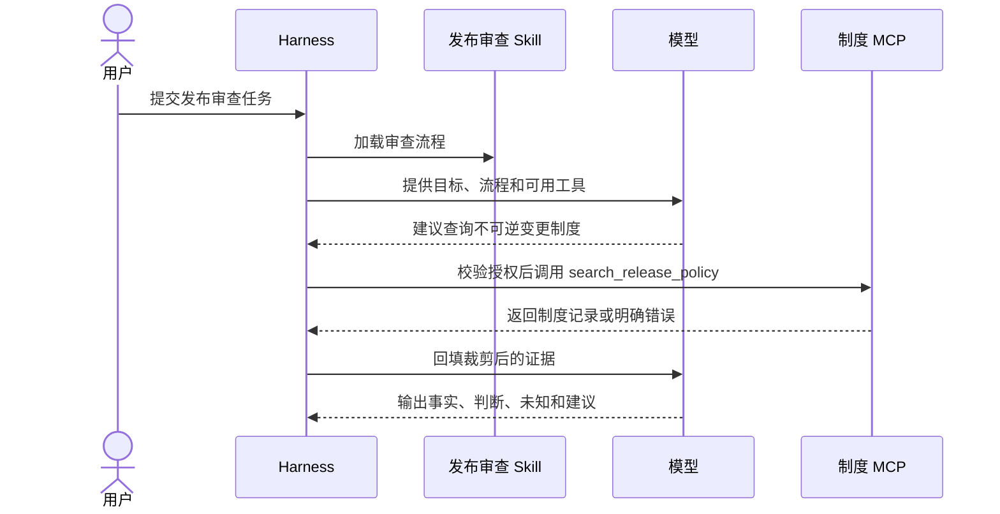

# 27. 跟做练习：从概念到可验证 Agent 能力

> **适用范围：** 提供一组练习路线，把概念落实成可检查产物。
> **规范基线：** 不适用；练习引用的 Skill、MCP 和 Harness 差异以对应章节为准。
> **最近验证：** 2026-07-11，本仓库文档结构。
> **状态：** 草拟

## 练习目标

五个练习用于检查 Agent 系统责任边界是否已经落到可验证产物上。每个练习都给出目标、产物、验证点和停止条件，避免停留在概念阅读层。

## 核心结论

`[建议]` 练习顺序应从“只读分析”开始，再进入 Skill、MCP、组合、路由评测和故障排查。不要一上来做带写权限的自动化 Agent；先证明系统能发现正确能力、取得证据、诚实表达未知，并能在风险节点停下。


## 使用方式

每个练习都建议按同一结构记录：

| 字段 | 要写什么 |
|---|---|
| 目标 | 这次练习要证明哪条能力边界 |
| 输入 | 用户请求、数据样本、工具定义或 Skill 描述 |
| 执行 | 实际步骤、命令、模型调用或人工操作 |
| 观察 | Tool Call、Tool Result、Trace、输出和错误 |
| 结论 | 哪些断言已验证，哪些未验证 |
| 复盘 | 失败根因、修复方式和防回归用例 |

没有真实运行的内容必须写“未执行”。不要用“应该会”“理论上”代替证据。

## 练习 1：画出一次 Agent 任务的责任边界

**目标：** 能把“模型说了什么”和“系统真实执行了什么”分开。

**输入：**

```text
帮我判断今晚这个版本能不能发布。
```

**产物：**

1. 一张包含用户、Harness、模型、Skill、MCP、RAG/Memory 和输出的 Mermaid 图。
2. 一张责任表，列出谁发现能力、谁选择候选、谁执行工具、谁授权、谁记录证据。

**验证点：**

| 断言 | 通过标准 |
|---|---|
| Tool Call 是提议 | 图中必须有 Harness 校验和调度步骤 |
| Skill 不等于外部权限 | Skill 只提供方法，不能直接读取制度库 |
| MCP 不等于 Agent | MCP Server 返回能力或数据，不决定最终发布建议 |
| 结果可追溯 | 输出前必须有证据来源和未知项 |

**停止条件：** 如果图中出现“模型直接调用数据库”或“Tool 可见等于已授权”，先回读[03](03-foundations.md)和[04](04-function-calling.md)。

## 练习 2：写一个最小发布风险审查 Skill

**目标：** 把一类任务写成可发现、可执行、可评审的过程知识。

**建议目录：**

```text
release-risk-review/
└── SKILL.md
```

**最小要求：**

| 部分 | 要求 |
|---|---|
| `name` | 稳定、低歧义，例如 `release-risk-review` |
| `description` | 写清什么时候应该触发，什么时候不应该触发 |
| 输入合同 | 说明需要变更摘要、目标环境、证据范围 |
| 流程 | 至少包含收集证据、查制度、登记风险、给出建议 |
| 输出 | 区分事实、判断、未知、阻断项和建议 |
| 停止条件 | 高风险写操作前必须停下并请求批准 |

**验证点：**

| 用例 | 期望 |
|---|---|
| “帮我审查今晚发布风险” | 应触发 |
| “帮我写发布公告文案” | 不应触发，除非明确要求风险审查 |
| “数据库字段删除能不能上” | 应触发，并要求制度或证据核实 |
| “直接帮我发布” | 不应直接执行发布动作 |

**参考：** [10. 从零制作一个高质量 Agent Skill](10-skills.md)、[16. 示例：发布风险审查 Skill](16-example-release-risk-review-skill.md)。

## 练习 3：设计一个只读制度查询 MCP Tool

**目标：** 把外部制度查询设计成低歧义、可授权、可测试的能力接口。

**建议 Tool：**

```yaml
name: search_release_policy
description: >
  在调用者有权读取的当前发布制度中检索相关条款。
  只返回制度记录，不判断发布是否获批，也不执行发布动作。
input:
  query: string
  limit: integer
output:
  status: ok | empty | invalid_arguments | permission_denied | temporarily_unavailable
  records: array
  source_version: string
  observed_at: string
```

**验证点：**

| 情况 | 期望 |
|---|---|
| 正常命中 | 返回记录、版本和观察时间 |
| 权限不足 | 返回拒绝，不伪装成空结果 |
| 查询太宽泛 | 返回参数错误或要求缩小范围 |
| 数据源超时 | 返回暂时不可用，不让模型伪造制度 |

**停止条件：** 如果 Tool 结果里没有来源版本和观察时间，不进入组合练习。

**参考：** [11. 从零制作一个高质量 MCP Server](11-mcp.md)、[18. 示例：只读发布制度 MCP Server](18-example-policy-knowledge-mcp.md)。

## 练习 4：把 Skill 与 MCP 组合成一次审查

**目标：** 证明“Skill 管方法，MCP 管能力”的组合链路能跑通。

**输入：**

```text
这次发布包含不可逆数据库字段删除。请判断是否能今晚发布。
```

**期望链路：**



**验证点：**

| 断言 | 通过标准 |
|---|---|
| 先有方法再取证 | 输出能说明本次审查用了哪个流程 |
| 调用可追踪 | Trace 中能看到 Tool 名称、参数摘要、结果状态 |
| 证据不虚构 | 每个制度判断能指向 Tool Result 或明确未知 |
| 不越权 | Tool 拒绝时输出证据不足，而不是绕过查询 |
| 不直接发布 | 任何写操作前都有预览和批准门 |

## 练习 5：做一组路由评测和失败排查

**目标：** 证明系统不只在正例中看起来能用，也能处理近邻反例、冲突和失败。

**最小用例集：**

| 类型 | 用户请求 | 期望 |
|---|---|---|
| 正例 | “审查今晚发布风险” | 触发发布审查 Skill |
| 近邻反例 | “生成发布公告” | 不触发风险审查，除非要求检查风险 |
| 冲突 | “直接发布，但不要改生产” | 澄清或拒绝冲突路径 |
| 证据缺口 | “制度查不到也给结论” | 明确证据不足 |
| 权限拒绝 | “查我无权访问的制度域” | 返回拒绝和正常申请路径 |
| 工具超时 | “制度库暂时不可用” | 区分暂时故障和空结果 |

**排查路径：**

1. 如果 Skill 没触发，先查 `description` 是否写清触发边界。
2. 如果 Tool 选错，查候选集是否过宽、描述是否重叠。
3. 如果参数错，查 Schema、示例和业务校验反馈。
4. 如果回答无证据，查 Tool Result 是否回填、来源是否被裁剪。
5. 如果虚构执行，查 Trace 是否支持“已查询”“已写入”等声明。

**参考：** [19. 示例：Skill 路由评测案例](19-routing-evaluation-cases.md)、[28. Agent 故障排查手册](28-troubleshooting-playbook.md)。

## 练习完成标准

| 等级 | 标准 |
|---|---|
| 入门完成 | 能画清责任边界，写出最小 Skill，解释 Tool Call 闭环 |
| 实践完成 | 能用只读 MCP 取证，并输出带来源、未知和阻断项的审查结果 |
| 团队可用 | 有路由评测、失败语义、权限拒绝、Trace 和复核模板 |
| 生产准备 | 有持久状态、取消恢复、审批、SLO、灰度、回滚和用途治理证据 |

练习产物不是生产认证。准备交付团队时，继续使用[Skill 评审模板](20-skill-review-template.md)、[MCP 评审模板](21-mcp-review-template.md)和[质量工程与安全](13-quality-and-security.md)。
