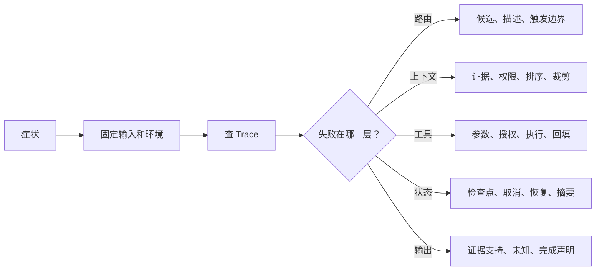

# 28. Agent 故障排查手册

> **适用范围：** 定位 Agent 运行中常见的路由、上下文、工具、权限、状态和交互问题。
> **规范基线：** 不适用；具体协议错误和平台字段以对应官方来源为准。
> **最近验证：** 2026-07-11，本仓库文档结构。
> **状态：** 草拟

## 排查目标

把一句“Agent 答错了”拆成可验证的系统故障：路由是否选错、证据是否漏召回、工具是否执行、权限是否拒绝、状态是否漂移、结果是否虚构。排查目标不是替模型找借口，而是找到最小可复现链路。

## 核心结论

`[建议]` 先按证据链排查，不要先换模型。一次 Agent 失败通常发生在“发现能力 -> 组装上下文 -> 模型提议 -> 校验执行 -> 结果回填 -> 状态更新 -> 最终声明”的某个环节。



## 快速分诊表

| 症状 | 第一怀疑层 | 先查什么 |
|---|---|---|
| 明明有 Skill 却没有用 | 能力发现与路由 | Skill 名称、描述、候选集、触发日志 |
| 选了相邻但错误的 Skill | 路由边界 | 近邻反例、相邻 Skill 描述、优先级 |
| 查不到明明存在的资料 | RAG / 上下文 | 权限过滤、索引版本、查询改写、Recall@k |
| 引用了过期制度 | 来源与时效 | `source_version`、`observed_at`、生效日期 |
| Tool 参数格式正确但业务错 | Tool 语义校验 | 参数摘要、业务规则、用户目标结构化状态 |
| 说“已查询”但没有调用记录 | 虚构执行 | Trace 中是否有 Tool Call、Tool Result 和外部状态 |
| 权限拒绝被写成无结果 | 错误语义 | Tool Result 状态是否区分 `empty` 与 `permission_denied` |
| 用户取消后仍继续写入 | Runtime 状态 | 取消传播、在途 Tool、外部对账和终态 |
| 恢复后沿用旧批准 | 状态与审批 | 批准绑定的对象、参数、有效期和策略版本 |
| 输出看似完整但缺关键未知 | 结果表达 | 证据缺口是否被保留，模型是否把假设写成事实 |

## 标准排查流程

### 1. 固定复现条件

记录用户请求、候选 Skill/Tool、Harness、模型、时间、主体权限、数据版本和运行配置。若同一输入偶发失败，至少重复运行多次，记录失败分布。

```text
request:
harness:
model:
principal:
candidate_skills:
candidate_tools:
data_snapshot:
run_id:
observed_failure:
```

### 2. 先看 Trace 是否支持最终声明

最终回答中的每个强声明都应能回到证据：

| 声明类型 | 需要的证据 |
|---|---|
| “已查询制度” | Tool Call、Tool Result、来源版本、观察时间 |
| “没有相关制度” | 查询成功且状态为 `empty`，不是权限拒绝或超时 |
| “已经创建工单” | 外部操作 ID 和权威状态查询 |
| “可以发布” | 风险模型、阻断项检查、证据缺口处理 |
| “用户批准了” | 批准主体、对象、参数、摘要、有效期和策略版本 |

如果 Trace 不支持声明，优先修复完成验证和输出约束，而不是调 Prompt 让模型“更谨慎”。

### 3. 定位失败层

| 层 | 常见根因 | 修复方向 |
|---|---|---|
| 能力发现 | 文件位置不对、描述太泛、候选太多 | 修正安装路径、描述和候选裁剪 |
| 路由选择 | 正例太少、近邻反例缺失、语义别名缺失 | 补路由评测和能力别名 |
| 上下文组装 | 关键证据被裁掉、旧摘要污染、工具定义过多 | 调整预算、排序、来源追踪和摘要校验 |
| RAG 检索 | 切块差、索引旧、权限过滤过早或过晚 | 重建索引、补元数据、分层评测 |
| Tool 调用 | Schema 过松、业务校验弱、错误语义混乱 | 收紧输入输出合同，区分错误状态 |
| 权限授权 | 只信 Tool 描述或用户批准 | 执行时重新做对象级授权 |
| Runtime 状态 | 检查点缺字段、取消未传播、恢复未重验 | 明确 Run/Step/Call 状态机 |
| 输出生成 | 事实、判断、假设和未知混写 | 输出模板中强制分栏和证据引用 |

## 典型故障处理

### Skill 没触发

检查顺序：

1. Skill 是否在当前 Harness 的发现路径中。
2. `name` 是否稳定且无拼写歧义。
3. `description` 是否写了触发条件和不触发条件。
4. 候选集是否因为权限、项目范围或预算被过滤。
5. 是否有近邻反例导致模型选择其他 Skill。

修复后至少补三个用例：正例、近邻反例、显式点名。

### Tool 选对但参数错

检查顺序：

1. Schema 是否约束长度、枚举、范围和额外字段。
2. Tool 描述是否说明“它不负责什么”。
3. 业务校验错误是否可行动，而不是只返回失败。
4. 模型是否拿到了当前对象、环境和时间范围。
5. 参数是否来自旧摘要或过期 Memory。

修复重点通常是输入合同和当前状态，不是让模型自由猜更多。

### RAG 漏召回

检查顺序：

1. 当前主体是否有权看到目标资料。
2. 索引是否包含最新版本，切块是否保留标题和章节。
3. 查询改写是否丢掉精确词、编号或否定条件。
4. 关键词、向量、结构化过滤和重排是否各自返回候选。
5. 关键证据是否召回但在上下文预算中被裁掉。

修复后重跑 Recall@k、排序和最终任务断言，不能只看一次人工感觉。

### 虚构执行

表现包括“我已经查过”“工单已创建”“测试已通过”，但没有对应调用或外部状态。

修复方向：

1. 输出前验证完成声明。
2. 把“计划动作”和“已执行动作”分成不同字段。
3. 要求已执行动作必须带外部 ID 或 Tool Result。
4. Tool 失败时保留错误语义，不回退到模型常识。

### 状态漂移

表现包括用户纠正后仍使用旧环境、恢复后沿用旧批准、摘要逐轮改变事实。

修复方向：

1. 把目标对象、环境、批准、证据版本写入结构化状态。
2. 用户纠正后标记哪些证据和批准失效。
3. 恢复检查点时重新验证权限、时效和计划摘要。
4. 对滚动摘要做来源回读和断言校验。

## 修复后的防回归用例

| 故障 | 必补用例 |
|---|---|
| 路由误选 | 正例、近邻反例、冲突请求、显式点名 |
| 检索漏召回 | 精确编号、同义表达、旧版本、新版本、无权限 |
| Tool 参数错 | 合法最小值、非法枚举、超长输入、业务禁区 |
| 权限问题 | 有权限、无权限、跨租户、过期凭据 |
| 虚构执行 | Tool 拒绝、Tool 超时、空结果、部分失败 |
| 取消恢复 | 运行中取消、写操作超时、恢复后旧批准过期 |

## 事故记录模板

```yaml
incident:
  title:
  date:
  run_id:
  user_request:
  expected_behavior:
  actual_behavior:
  failure_layer:
  evidence:
    - trace:
    - tool_call:
    - tool_result:
    - artifact:
  root_cause:
  fix:
  regression_cases:
  remaining_risk:
```

## 继续阅读

- [08. 能力发现、候选裁剪与路由](08-能力发现候选裁剪与路由.md)
- [13. 质量工程与安全](13-质量工程与安全治理.md)
- [15. 生产级 Agent Runtime 参考架构](15-生产级Agent-Runtime架构.md)
- [19. 示例：Skill 路由评测案例](19-案例Skill路由评测.md)
- [20. Skill 评审模板](20-Skill评审模板.md)
- [21. MCP 评审模板](21-MCP评审模板.md)
